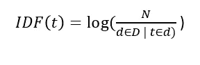
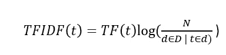
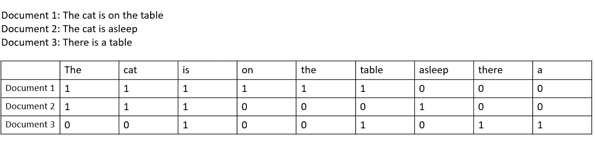
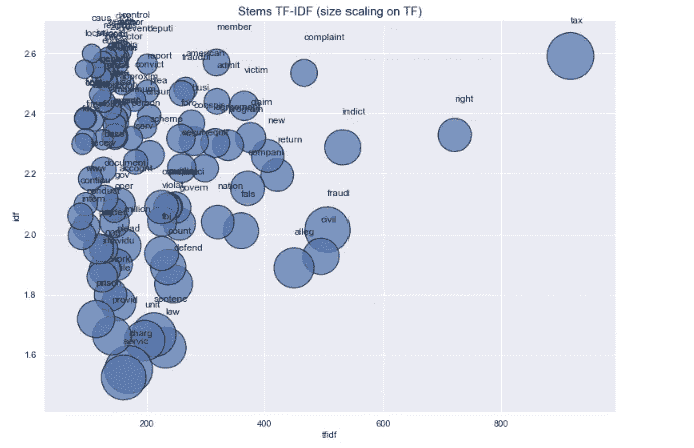
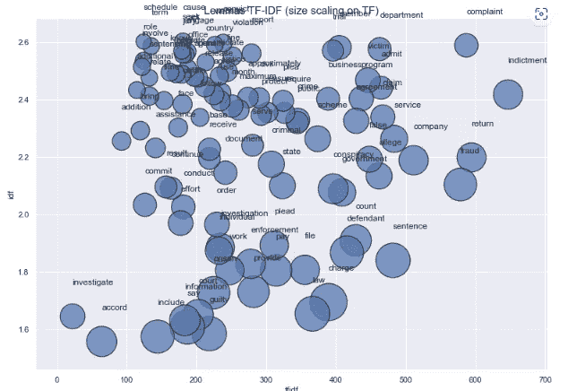
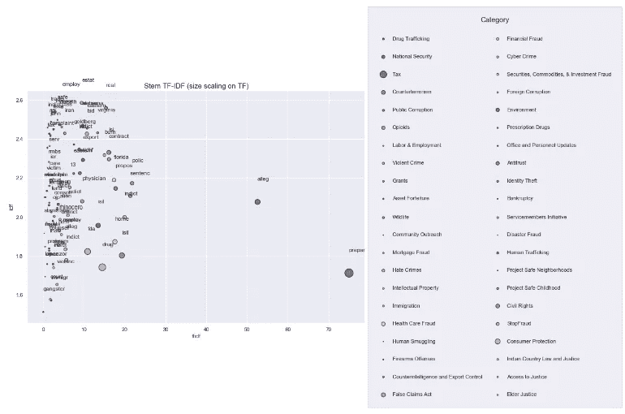
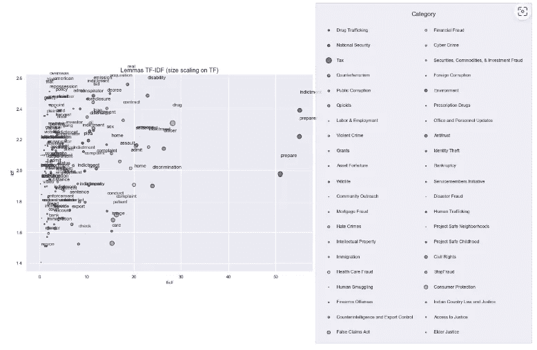

# 用 Python 实现司法判决的自然语言处理

> 原文：<https://towardsdatascience.com/natural-language-process-for-judicial-sentences-with-python-102064f24372>


[https://pixabay.com/](https://pixabay.com/)

## 第 3 部分:TF-IDF 分析

在本系列的[上一篇文章](https://valentinaalto.medium.com/natural-language-process-for-judicial-sentences-with-python-part-2-964b0e12dd4a)中，我们使用简单的描述性统计数据更深入地研究了我们的数据集。在本文中，我们将使用术语频率(TF) —逆密集频率(IDF)技术对术语的重要性进行更深入的分析。这种技术用于度量一个单词对于文档集合中的一个文档的重要性。

## TF-IDF

这种方法背后的思想是找到一种方法来确定一个单词对一个文档的重要性，不仅仅是通过计算它的出现次数，还要考虑集合中其他文档的上下文。

事实上，假设我们有 100 篇关于计算机视觉的科学论文，让我们考虑一个专注于特定卷积神经网络 ResNet 的文档 A。在这个文档中，ResNet 和相关术语的出现频率会很高，这些术语对于这个特定的文档非常重要。然而，也有高频的其他术语，如“图像”、“神经网络”、“像素”，所有术语都与计算机视觉领域相关。然而，这些最后的术语将出现在所有的文档中，所以它们不会出现在我们关注的文档 A 中。

因此，我们说，对于文档 A，术语“ResNet”和“image”将具有高频率。对于文档 A，我们如何告诉模型“ResNet”比“image”更重要？答案在 IDF 分量中，它只不过是一个用来补偿 TF 的权重，计算如下:



所以它是这个词出现的文档数的对数。如果该术语出现在所有文档中(如术语“图像”)，IDF 权重将等于 0，因此该术语将被标记为不重要。每当文档中的术语频繁出现(高 TF)但在集合中的许多文档中不出现(IDF 低)时，TF-IDF 得分增加。

所以最后，TF-IDF 的分数是:



产生加权的术语频率，其能够测量术语对于文档集合中的文档的重要性。

为了继续计算这个度量，我将对我的文档进行矢量化处理，使文档中的每个术语都根据其 TF-IDF 得分得到一个权重。具有较高权重分数的术语被认为更重要。

## 文档矢量化

文档矢量化是自然语言处理任务中文本数据预处理的重要步骤。事实上，通过这种实践，原始文本可以被我们的模型解释为数字表示。出于 TF-IDF 分析的目的，我们将使用术语-文档矩阵的表示。

其想法是创建一个矩阵，其维度分别是文档和单个术语。每个单元格都填充了相应文档中特定术语的频率。

我们来举个例子:



现在让我们进入代码。

## 用 Python 计算 TF-IDF

我将首先尝试对词干进行矢量化，然后尝试一种使用引理的不太激进的方法(在本系列的第 1 部分中计算)。此外，由于标记为的**条目少于 5000 个，我将首先对整个数据集进行分析(以便遵守最少 5000 个单词的限制)。然后，我将对较小的标签文章数据集执行相同的分析，这样我也可以显示每个术语的类别。**

所以让我们从最重要的 100 个术语开始(用词干和词条表示):

```
#first thing first, let's create a df_factor where the labels are one-hot encoded. from sklearn.preprocessing import MultiLabelBinarizermlb = MultiLabelBinarizer()df_factor = df.join(pd.DataFrame(mlb.fit_transform(df['category']),
                          columns=mlb.classes_,
                          index=df.index))#representing Stems: analyzing the most important 100 termssns.set_context("paper")
sns.set()
fig, ax = plt.subplots(figsize = (16, 9))
ax.set_title("Stems TF-IDF (size scaling on TF)", fontsize = 15)
ax.set_ylabel("idf")
ax.set_xlabel("tfidf")
ax.set_xbound(lower = 0, upper = 1000)tfidf_vectorizer = TfidfVectorizer(analyzer = 'word', min_df = 0.2, max_df = 0.6, 
                                       stop_words = 'english', sublinear_tf = True)X = tfidf_vectorizer.fit_transform(df_factor.Stems)count_vectorizer = CountVectorizer(analyzer='word', min_df = 0.2, 
                                       max_df = 0.6, stop_words = 'english')X2 = count_vectorizer.fit_transform(df_factor.Stems)word_counts = X2.toarray()word_tfidf = X.toarray()word_tfidf[word_tfidf < 0.2] = 0df_tfidf = pd.DataFrame(data = {'word': count_vectorizer.get_feature_names(), 
                            'tf': word_counts.sum(axis = 0), 
                            'idf': tfidf_vectorizer.idf_,
                            'tfidf': word_tfidf.sum(axis = 0)})df_tfidf.sort_values(["tfidf", 'tf', 'idf'], ascending = False, inplace = True)
df_tfidf.reset_index(drop = True, inplace = True)

ax.scatter(df_tfidf.tfidf[:100], df_tfidf.idf[:100], s = df_tfidf.tf * 0.14, 
            cmap = "Blues", alpha = 0.7, edgecolors = "black", linewidths = 1.2) #picking the most important 100 termsfor index, text in enumerate(df_tfidf.word[:100].tolist()):
        ax.annotate(text, (df_tfidf.tfidf.tolist()[index], df_tfidf.idf.tolist()[index]), 
                    (df_tfidf.tfidf.tolist()[index] + 0, df_tfidf.idf.tolist()[index] + 0.11))

box = ax.get_position()
ax.set_position([box.x0, box.y0, box.width * 0.8, box.height])
```



```
#representing Lemmas: analyzing the most important 100 termssns.set_context("paper")
sns.set()
fig, ax = plt.subplots(figsize = (16, 9))
ax.set_title("Lemmas TF-IDF (size scaling on TF)", fontsize = 15)
ax.set_ylabel("idf")
ax.set_xlabel("tfidf")
ax.set_xbound(lower = 0, upper = 1000)tfidf_vectorizer = TfidfVectorizer(analyzer = 'word', min_df = 0.2, max_df = 0.6, 
                                       stop_words = 'english', sublinear_tf = True)X = tfidf_vectorizer.fit_transform(df_factor.Lemmas)count_vectorizer = CountVectorizer(analyzer='word', min_df = 0.2, 
                                       max_df = 0.6, stop_words = 'english')X2 = count_vectorizer.fit_transform(df_factor.Lemmas)word_counts = X2.toarray()word_tfidf = X.toarray()word_tfidf[word_tfidf < 0.2] = 0df_tfidf = pd.DataFrame(data = {'word': count_vectorizer.get_feature_names(), 
                            'tf': word_counts.sum(axis = 0), 
                            'idf': tfidf_vectorizer.idf_,
                            'tfidf': word_tfidf.sum(axis = 0)})df_tfidf.sort_values(["tfidf", 'tf', 'idf'], ascending = False, inplace = True)
df_tfidf.reset_index(drop = True, inplace = True)

ax.scatter(df_tfidf.tfidf[:100], df_tfidf.idf[:100], s = df_tfidf.tf * 0.14, 
            cmap = "Blues", alpha = 0.7, edgecolors = "black", linewidths = 1.2)for index, text in enumerate(df_tfidf.word[:100].tolist()):
        ax.annotate(text, (df_tfidf.tfidf.tolist()[index], df_tfidf.idf.tolist()[index]), 
                    (df_tfidf.tfidf.tolist()[index] + 0, df_tfidf.idf.tolist()[index] + 0.11))

box = ax.get_position()
ax.set_position([box.x0, box.y0, box.width * 0.8, box.height])
```



现在让我们只使用带标签的文章，并使用类别作为进一步的变量(颜色=类别)。更具体地说，我们为每个类别选择了前两个最重要的词:

```
sns.set_context("talk")
sns.set()
fig, ax = plt.subplots(figsize = (16, 9))
ax.set_title("Stem TF-IDF (size scaling on TF)", fontsize = 15)
ax.set_ylabel("idf")
ax.set_xlabel("tfidf")
ax.set_xbound(lower = 0, upper = 1000)
z=categories_listcmap = plt.get_cmap('tab20b')
colors = [cmap(i) for i in np.linspace(0, 1, len(z))]
for category, color in zip(z, colors):
    tfidf_vectorizer = TfidfVectorizer(analyzer = 'word', min_df = 0.2, max_df = 0.6, 
                                       stop_words = 'english', sublinear_tf = True)X = tfidf_vectorizer.fit_transform(df_factor[df_factor[category] == 1].Stems)count_vectorizer = CountVectorizer(analyzer='word', min_df = 0.2, 
                                       max_df = 0.6, stop_words = 'english')X2 = count_vectorizer.fit_transform(df_factor[df_factor[category] == 1].Stems)word_counts = X2.toarray()word_tfidf = X.toarray()word_tfidf[word_tfidf < 0.2] = 0df_tfidf = pd.DataFrame(data = {'word': count_vectorizer.get_feature_names(), 
                            'tf': word_counts.sum(axis = 0), 
                            'idf': tfidf_vectorizer.idf_,
                            'tfidf': word_tfidf.sum(axis = 0)})df_tfidf.sort_values(["tfidf", 'tf', 'idf'], ascending = False, inplace = True)
    df_tfidf.reset_index(drop = True, inplace = True)

    ax.scatter(df_tfidf.tfidf[:2], df_tfidf.idf[:2], s = df_tfidf.tf * 0.14, 
            cmap = "Blues", alpha = 0.7, edgecolors = "black", linewidths = 1.2, color = color, label = category)for index, text in enumerate(df_tfidf.word[:2].tolist()):
        ax.annotate(text, (df_tfidf.tfidf.tolist()[index], df_tfidf.idf.tolist()[index]), 
                    (df_tfidf.tfidf.tolist()[index] + 0, df_tfidf.idf.tolist()[index] + 0.11))

box = ax.get_position()
ax.set_position([box.x0, box.y0, box.width * 0.8, box.height])
ax.legend(title = "Category", frameon = True, ncol = 2, fancybox = True, title_fontsize = 15,
          loc = 'center left', bbox_to_anchor = (1, 0.5), labelspacing = 2.5, borderpad = 2);
```



```
#let's do the same also for Lemmassns.set_context("talk")
sns.set()
fig, ax = plt.subplots(figsize = (16, 9))
ax.set_title("Lemmas TF-IDF (size scaling on TF)", fontsize = 15)
ax.set_ylabel("idf")
ax.set_xlabel("tfidf")
ax.set_xbound(lower = 0, upper = 1000)
z=categories_listcmap = plt.get_cmap('tab20b')
colors = [cmap(i) for i in np.linspace(0, 1, len(z))]for category, color in zip(z, colors):
    tfidf_vectorizer = TfidfVectorizer(analyzer = 'word', min_df = 0.2, max_df = 0.6, 
                                       stop_words = 'english', sublinear_tf = True)X = tfidf_vectorizer.fit_transform(df_factor[df_factor[category] == 1].Lemmas)count_vectorizer = CountVectorizer(analyzer='word', min_df = 0.2, 
                                       max_df = 0.6, stop_words = 'english')X2 = count_vectorizer.fit_transform(df_factor[df_factor[category] == 1].Lemmas)word_counts = X2.toarray()word_tfidf = X.toarray()word_tfidf[word_tfidf < 0.2] = 0df_tfidf = pd.DataFrame(data = {'word': count_vectorizer.get_feature_names(), 
                            'tf': word_counts.sum(axis = 0), 
                            'idf': tfidf_vectorizer.idf_,
                            'tfidf': word_tfidf.sum(axis = 0)})df_tfidf.sort_values(["tfidf", 'tf', 'idf'], ascending = False, inplace = True)
    df_tfidf.reset_index(drop = True, inplace = True)

    ax.scatter(df_tfidf.tfidf[:3], df_tfidf.idf[:3], s = df_tfidf.tf * 0.14, 
            cmap = "Blues", alpha = 0.7, edgecolors = "black", linewidths = 1.2, color = color, label = category)for index, text in enumerate(df_tfidf.word[:3].tolist()):
        ax.annotate(text, (df_tfidf.tfidf.tolist()[index], df_tfidf.idf.tolist()[index]), 
                    (df_tfidf.tfidf.tolist()[index] + 0, df_tfidf.idf.tolist()[index] + 0.11))

box = ax.get_position()
ax.set_position([box.x0, box.y0, box.width * 0.8, box.height])
ax.legend(title = "Category", frameon = True, ncol = 2, fancybox = True, title_fontsize = 15,
          loc = 'center left', bbox_to_anchor = (1, 0.5), labelspacing = 2.5, borderpad = 2);
```



TF-IDF 分析是 NLP 分析中的一个强大工具，并且在我们的场景中是有用的，例如，对于司法判决中的文本挖掘和搜索引擎，它是给定用户查询对文档的相关性进行评分和排序的中心工具

在下一篇文章中，我们将继续进行文本分析和潜在主题分析，敬请关注！:)

# 参考

*   [NLTK::自然语言工具包](https://www.nltk.org/)
*   Python 中的 spaCy 工业级自然语言处理
*   [司法新闻| DOJ |司法部](https://www.justice.gov/news)
*   [司法部 2009-2018 年新闻发布| Kaggle](https://www.kaggle.com/datasets/jbencina/department-of-justice-20092018-press-releases)