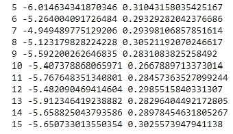
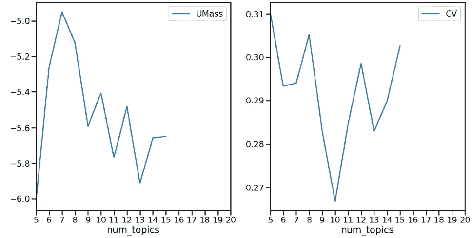
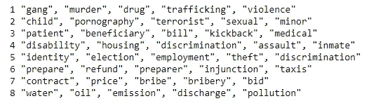
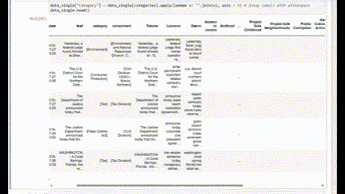
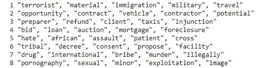
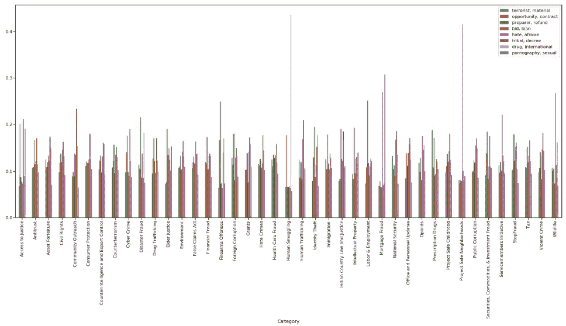

# 用 Python 实现司法判决的自然语言处理

> 原文：<https://towardsdatascience.com/natural-language-process-for-judicial-sentences-with-python-73525bfc6b1e>


[https://pixabay.com/](https://pixabay.com/)

## 第 5 部分:用 LDA 进行主题建模

主题建模是一种无监督的机器学习方法，其目的是识别一组文档中的趋势并对识别这些趋势的单词进行分组。

最终的目标是每个主题都有一个单词分布。事实上，由于它是一种无监督的技术，我们得出了一般的聚类(如“主题 1”、“主题 2”、“主题 N”)而不是标签，因此我们需要某种“意义”来定义标签(并在进一步的监督任务中使用它们)。也就是说，如果与主题 1 最相关的 3 个词是“医疗”、“保健”和“保险”，则属于该群集的可能标签可能是“卫生系统”。

为此，我将使用潜在的狄利克雷分配(LDA)，这是一种主题建模技术，它依赖于这样的假设，即每个文档中的每个单词都来自一个主题，并且该主题是从主题的每个文档分布中选择的。更具体地说，我们所讨论的文档中主题的分布和主题中单词的分布就是[狄利克雷分布。](https://builtin.com/data-science/dirichlet-distribution)

让我们用 Python 初始化模型:

```
df_factor = pd.read_pickle('data/df_factor.pkl')

#this time I will use Lemmas as input

df_factor["Lemmas_string"] = df_factor.Lemmas.apply(str)
instances = df_factor.Lemmas.apply(str.split) 

dictionary = Dictionary(instances) 

dictionary.filter_extremes(no_below=100, no_above=0.1) #this filter_extreme is keeping the dictionaries either happening
                                                        #less than 100 times or more than 10% of the data

#initializing the lda corpus

ldacorpus = [dictionary.doc2bow(text) for text in instances]
tfidfmodel = TfidfModel(ldacorpus)

model_corpus = tfidfmodel[ldacorpus]

len(model_corpus)

Output: 13087
```

现在出现了一个问题:我如何决定需要多少主题来聚类我的文档集？

这个想法是，我们希望一个主题中的单词彼此连贯，所以我们评估主题最佳数量的方法是给每个分段分配一个所谓的[连贯分数](https://datascienceplus.com/evaluation-of-topic-modeling-topic-coherence/)。

有几种方法可以计算一致性分数，在本文中，有两个指标我可以决定:

*   CV Coherence score →它基于标准化的点态互信息(你可以在这里阅读更多关于 PMI [的信息](https://medium.com/dataseries/understanding-pointwise-mutual-information-in-nlp-e4ef75ecb57a)
*   UMass Coherence score →它衡量两个单词在文档中同时出现的频率。

```
#these scores are needed to identify the number of topic which is the most consistent.

coherence_values = []

dev_size = 10000
eval_size = len(model_corpus) - dev_size

for num_topics in range(5, 16):
    model = LdaMulticore(corpus=model_corpus[:dev_size], 
                         id2word=dictionary, 
                         num_topics=num_topics)

    coherencemodel_umass = CoherenceModel(model=model, 
                                          texts=instances[dev_size:dev_size+eval_size], 
                                          dictionary=dictionary, 
                                          coherence='u_mass')

    coherencemodel_cv = CoherenceModel(model=model, 
                                       texts=instances[dev_size:dev_size+eval_size], 
                                       dictionary=dictionary, 
                                       coherence='c_v')

    umass_score = coherencemodel_umass.get_coherence()
    cv_score = coherencemodel_cv.get_coherence()

    print(num_topics, umass_score, cv_score)
    coherence_values.append((num_topics, umass_score, cv_score))

#pickling results
with open('data/coherence_values.pkl', 'wb') as f:
       pickle.dump(coherence_values, f)
```



让我们想象一下:

```
%matplotlib inline
import matplotlib.pyplot as plt
import seaborn as sns
sns.set_context('poster') # use large font

scores = pd.DataFrame(coherence_values, columns=['num_topics', 'UMass', 'CV'])
fig, ax = plt.subplots(nrows=1, ncols=2, figsize=(20, 10))
scores.plot.line(x='num_topics', y='UMass', ax=ax[0], xticks=range(5,21))
scores.plot.line(x='num_topics', y='CV', ax=ax[1], xticks=range(5,21))
```



```
coherence_values[3]
(8, -5.123179828224228, 0.30521192070246617)
```

对于两种测量方法——UMass 和 CV——我们都想要最高值。因此，我选择 num_topics = 8，因为它在 cv 和 UMass 上都有很高的分数(后者不是最高的，但排名第二)。

```
 num_topics = 8 # number of topics

# find chunksize to make about 200 updates
num_passes = 10
chunk_size = len(model_corpus) * num_passes/200

model = LdaMulticore(num_topics = num_topics, 
                     corpus = model_corpus,  
                     id2word = dictionary, 
                     workers = min(10, multiprocessing.cpu_count()-1), 
                     passes = num_passes, 
                     chunksize = chunk_size, 
                     alpha = 0.1
                    ) 
```

一位训练了模型，让我们看看与每个主题相关的前 5 个词:

```
import re
num_topics = 8
# transform the data into topic distros
topic_corpus = model[model_corpus]

# get the topic descriptors
topic_sep = re.compile(r"0\.[0-9]{3}\*") 
model_topics = [(topic_no, re.sub(topic_sep, '', model_topic).split(' + ')) for topic_no, model_topic in
                model.print_topics(num_topics=num_topics, num_words=5)]

descriptors = []
for i, m in model_topics:
    print(i+1, ", ".join(m[:5]))
    descriptors.append(", ".join(m[:2]).replace('"', ''))
```



通读这些主题，已经可以看到单词正在引导一个标签。也就是说，主题 8 可以是“气候变化”或“环境污染”。

## 基于标记数据的 LDA 主题建模

现在，我将在 single_data 数据集上执行 LDA，以便我们也可以可视化跨主题的类别分布。

```
df = pd.read_pickle('data/df.pkl')
df=df.rename(columns={'topic':'category'})

df_factor = pd.read_pickle('data/df_factor.pkl')

# This dataset will have a column "category" that will report this category.
categories = list(set([i for  l in df['category'].to_list() for i in l]))

data_single = df_factor.copy()[df_factor[categories].sum(axis = 1) == 1]

#len(categories)
# replacing 1 with correspondent category
for column in categories:
    data_single[column] = data_single[column].apply(lambda x: column if x == 1 else "")

data_single["Category"] = data_single[categories].apply(lambda x: "".join(x), axis = 1) # joing labels with whitespace
data_single.head()
```



```
#repeating the same steps as before, but this time using a shrunken version of the 
#dataset (only those records with 1 label)

data_single["Lemmas_string"] = data_single.Lemmas.apply(str)
instances = data_single.Lemmas.apply(str.split) 

dictionary = Dictionary(instances) 

dictionary.filter_extremes(no_below=100, no_above=0.1) #this filter_extreme is keeping the dictionaries either happening
                                                        #less than 100 times or more than 10% of the data

ldacorpus = [dictionary.doc2bow(text) for text in instances] #transforms the corpus in IDs
tfidfmodel = TfidfModel(ldacorpus) #computing the tdidf of the corpus based on the document 
model_corpus = tfidfmodel[ldacorpus]
```

现在让我们训练模型:

```
num_topics = 8 #derived from the coherence scores

num_passes = 10
chunk_size = len(model_corpus) * num_passes/200

start = time.time() 

model = LdaMulticore(num_topics=num_topics, 
                     corpus = model_corpus, 
                     id2word=dictionary, 
                     workers=min(10, multiprocessing.cpu_count()-1), 
                     passes=num_passes, 
                     chunksize=chunk_size, 
                     alpha = 0.5 
                    ) 
```

让我们再看一遍与主题相关的单词:

```
topic_corpus = model[model_corpus]
#get the topic descriptors
topic_sep = re.compile(r"0\.[0-9]{3}\*") 
model_topics = [(topic_no, re.sub(topic_sep, '', model_topic).split(' + ')) for topic_no, model_topic in
                model.print_topics(num_topics=num_topics, num_words=5)]

descriptors = []
for i, m in model_topics:
    print(i+1, ", ".join(m[:5]))
    descriptors.append(", ".join(m[:2]).replace('"', ''))
```



```
# get a list of all the topic scores for each document
scores = [[t[1] for t in topic_corpus[entry]] for entry in range(len(topic_corpus))]
topic_distros = pd.DataFrame(data=scores, columns=descriptors)
topic_distros["Category"] = data_single.Category
```

最后，让我们看一下主题在不同类别中的分布情况:

```
import matplotlib.pyplot as plt # make graphs
import seaborn as sns # make prettier graphs

sns.set_context('poster') # use large font

fig, ax = plt.subplots(figsize=(50, 20)) #set graph size
#aggregate topics by categories
aggregate_by_category = topic_distros.groupby(topic_distros.Category).mean()
#plot the graph
aggregate_by_category[descriptors].plot.bar(ax=ax)
#to move the legend out
#plt.legend(loc='bottom left', bbox_to_anchor=(1.0, 0.5))
```



## 结论

对我们的司法判决运行 LDA 可以降低搜索和检查趋势的复杂性。事实上，我们有 42 个类别(参见[第 2 部分](https://medium.com/towards-data-science/natural-language-process-for-judicial-sentences-with-python-part-2-964b0e12dd4a)了解数据集的描述性统计数据)和仅仅 8 个主题。我们还可以看到，有一些主题(如主题 3 和 5)在所有类别中不断出现，这意味着，无论司法判决的类别如何，这些判决的内容都可能涵盖这些主题。

在下一篇文章中，我们将使用我们的文档集来执行文档嵌入，这是一种矢量化技术，允许我们的语料库成为 ML 模型的输入。所以敬请期待下一部分！

# 参考

*   [NLTK::自然语言工具包](https://www.nltk.org/)
*   [Python 中的 spaCy 工业级自然语言处理](https://spacy.io/)
*   [司法新闻| DOJ |司法部](https://www.justice.gov/news)
*   [司法部 2009–2018 年新闻发布| Kaggle](https://www.kaggle.com/datasets/jbencina/department-of-justice-20092018-press-releases)
*   [https://en.wikipedia.org/wiki/Distributional_semantics](https://en.wikipedia.org/wiki/Distributional_semantics)
*   [https://aurelieherbelot . net/research/distributional-semantics-intro/](https://aurelieherbelot.net/research/distributional-semantics-intro/)
*   [https://builtin.com/data-science/dirichlet-distribution](https://builtin.com/data-science/dirichlet-distribution)
*   [http://SVN . aksw . org/papers/2015/WSDM _ Topic _ Evaluation/public . pdf](http://svn.aksw.org/papers/2015/WSDM_Topic_Evaluation/public.pdf)