# 用 Python 实现司法判决的自然语言处理

> 原文：<https://towardsdatascience.com/natural-language-process-for-judicial-sentences-with-python-9462c15c2a64>


[https://pixabay.com/](https://pixabay.com/)

## 第 10 部分:预测

我们到了这一系列文章的最后一部分，在这里我将使用 ML 模型对司法判决进行分类。为此，我将使用已经标记的记录作为训练集来执行监督学习任务，以便将模型应用于那些没有标记的记录。理想情况下，这种模型可以极大地帮助在记录到达官员手中时自动对记录进行分类。

我将深入探究技术:

*   最频繁基线
*   逻辑回归
*   支持向量分类器
*   带有 Keras 的深度神经网络

让我们首先导入所需的库:

```
# Libraries we will use in this section
from sklearn.metrics import precision_score, classification_report, f1_score
from sklearn.model_selection import cross_val_score
from sklearn.feature_selection import SelectKBest, chi2

from sklearn.multiclass import OneVsRestClassifier
from sklearn.linear_model import LogisticRegression
from sklearn.svm import LinearSVC

from scipy.sparse import random

import sklearn as skl
skl.warnings.filterwarnings("ignore")
```

为了有一个基准来比较我们的模型结果，我将首先使用最频繁的基线作为所有文档的预测，这样我们就有了与之相关的性能指标。这个想法是，如果一个模型的性能比最频繁的基线差，它就不值得。

## 最频繁标签基线

在将 *df_factor* 分成训练集和测试集之前，我将删除没有主题的行。为此，我将创建一个遮罩并将其应用于 df。

```
#I will split first the dataset into a test set (20%) and a temporary set (80%). 
#Then, I will split the latter into train set (80% of temporary set) 
#and development set (20% of temporary set)

from sklearn.model_selection import train_test_split

tmp, test = train_test_split(df_factor_label, test_size=0.2, random_state=123) #for replicability
train, dev = train_test_split(tmp, test_size=0.2, random_state=123) #for replicability

vectorizer_logit = TfidfVectorizer(ngram_range = (2,6), min_df = 0.001, max_df = 0.75, stop_words = 'english')

X_train = vectorizer_logit.fit_transform(train.Lemmas)

#we cannot refit the vectorizer
X_dev = vectorizer_logit.transform(dev.Lemmas)
X_test = vectorizer_logit.transform(test.Lemmas)

y_train = train.drop(["titles", "date", "text", "category", "component", "Tokens", "Lemmas", "Stems"], axis = 1)
y_dev = dev.drop(["titles", "date", "text", "category", "component", "Tokens", "Lemmas", "Stems"], axis = 1)
y_test = test.drop(["titles", "date", "text", "category", "component", "Tokens", "Lemmas", "Stems"], axis = 1)
```

从描述性统计部分，我们知道最常见的类别是“税”。因此，我们将只预测所有观测值的税收作为基线模型。让我们检索该类别的索引。作为一个参考指标，我将主要依靠微观平均 f1 分数，其中微观停留在“计算总的真阳性、假阴性和假阳性。”事实上，如果我们考虑宏观平均指标，我们不会考虑数据不平衡的事实。

```
ind = y_train.columns.get_loc("Tax")
#print(ind)

most_frequent = np.zeros(42)
most_frequent[ind] = 1
#print(most_frequent)

most_frequent_prediction = [most_frequent for i in range(y_dev.shape[0])]
most_frequent_prediction = pd.DataFrame(most_frequent_prediction, columns = y_dev.columns)

print(classification_report(y_dev, most_frequent_prediction, target_names =  y_dev.columns))
```

## 逻辑回归基线

```
logit = OneVsRestClassifier(LogisticRegression())
logit.fit(X_train, y_train)
```

让我们将交叉验证应用到培训中(如果你想了解更多关于交叉验证的知识，你可以在这里阅读我以前的文章):

```
# estimating the (test) F1 score via cross validation
for k in [2, 5, 10]:
    cv = cross_val_score(OneVsRestClassifier(LogisticRegression()), X_train, y = y_train, cv = k, n_jobs = -1, scoring = "f1_micro")
    fold_size = X_train.shape[0]/k

    print("F1 with {} folds for bag-of-words is {}".format(k, cv.mean()))
    print("Training on {} instances/fold, testing on {}".format(round(fold_size*(k-1)), round(fold_size)))
    print()
```

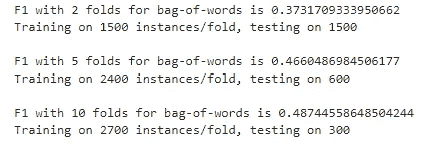

```
y_pred_logit_baseline = logit.predict(X_dev)
print(classification_report(y_dev, y_pred_logit_baseline, target_names = y_dev.columns))
```

尽管“幼稚”,这个模型在最频繁基线的开发集中表现得更好。我们的微观 F1 得分为 54%,低于 16%。

现在，假设我们决定使用这个模型。它在测试数据上的表现如何？

```
y_pred_logit_baseline_test = logit.predict(X_test)
print(classification_report(y_test, y_pred_logit_baseline_test, target_names = y_test.columns))
```

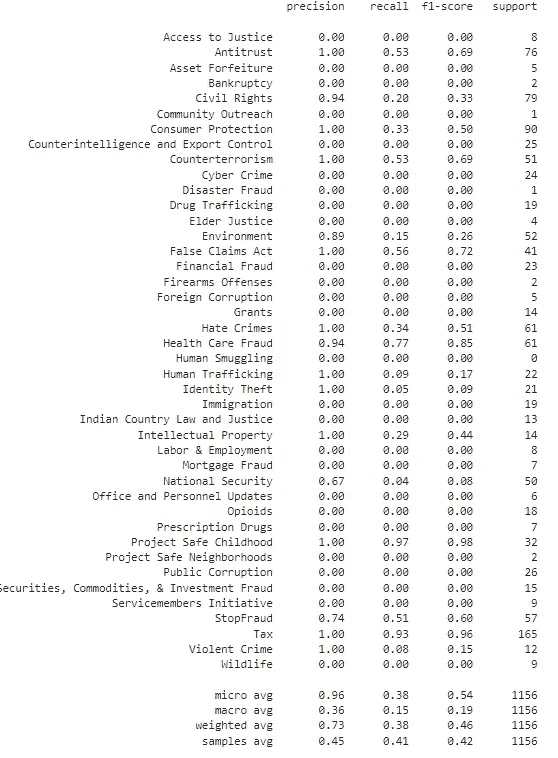

***正规化强度***

现在我将改进我的逻辑模型。

每当我们训练一个模型时，我们都必须考虑方差偏差的权衡和过度拟合的风险:事实上，增加参数的数量总是会导致训练误差的减少，但不会导致测试误差的减少，因为(平方)偏差会减少，但方差会增加。因此，在训练模型时，我们需要考虑当我们增加参数数量时增加损失函数的惩罚项。在逻辑回归中，我们使用参数 c。这个想法是，降低 c 将加强𝜆调节器。的确，c 对 1/𝜆.来说是奇怪的因此，𝜆越高，惩罚项越高，模型的参数就越少。

注:想了解更多关于正规化的内容，可以在这里阅读我之前的文章[。](https://medium.com/dataseries/preventing-overfitting-regularization-5eda7d5753bc)

```
from sklearn.metrics import f1_score
best_c = None
best_performance = 0.0

for c in [20, 10, 5, 2, 0.5, 0.1, 0.05, 0.01]:
    print(c)
    classifier_c = OneVsRestClassifier(LogisticRegression(n_jobs=-1, multi_class='auto', solver='lbfgs', 
                                             class_weight='balanced',
                                             C=c
                                     ))
    classifier_c.fit(X_train, y_train)
    predictions_c = classifier_c.predict(X_dev)
    score = f1_score(y_dev, predictions_c, average='micro')
    if score > best_performance:
        best_performance = score
        best_c = c
        print("New best performance: {}".format(score))

    #print(classification_report(y_dev, predictions_c, target_names = y_dev.columns)) 
```

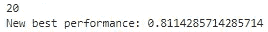

从上面的结果，我们可以说，最好的模型输出等于 81%的微 f1 分数。让我们看看它在测试集上的表现:

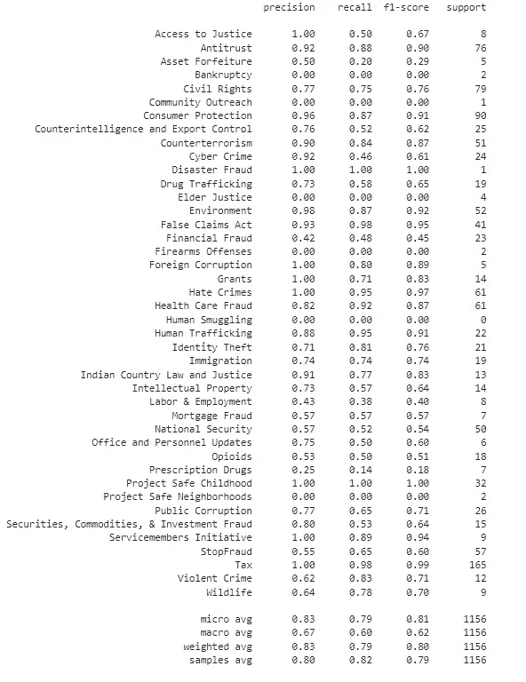

***功能选择***

让我们把特征的数量减少到 4500 个。我会把这个模型和之前 c 的最佳值的结果结合起来。

```
from sklearn.feature_selection import SelectKBest, chi2

selector = SelectKBest(chi2, k=4500).fit(X_train, y_train)

X_train_sel = selector.transform(X_train)
X_dev_sel = selector.transform(X_dev)
X_test_sel = selector.transform(X_test)

classifier_sel = OneVsRestClassifier(LogisticRegression(n_jobs=-1, multi_class='auto', solver='lbfgs', 
                                    class_weight='balanced', C = best_c))
classifier_sel.fit(X_train_sel, y_train)

predictions_sel = classifier_sel.predict(X_dev_sel)
print(classification_report(y_dev, predictions_sel, target_names = y_dev.columns))
```

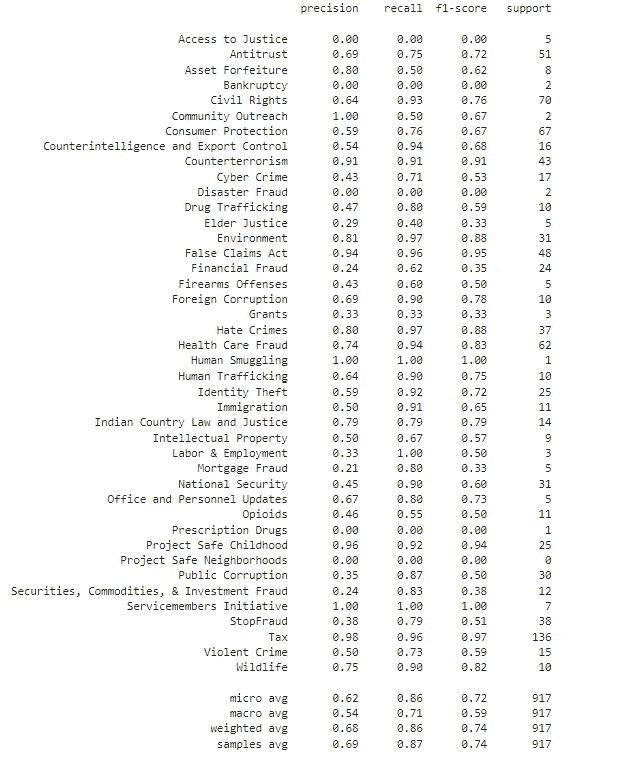

看来特征选择并没有带来提升(现在微 f1 评分更低，72%)。

```
#let's also evaluate the model in the test set
predictions_sel_test = classifier_sel.predict(X_test_sel)
print(classification_report(y_test, predictions_sel_test, target_names = y_test.columns))
```


***降维***

在这种情况下，我们不在特征中进行选择，而是创建新的低维特征，作为原始特征的线性组合。

```
from sklearn.decomposition import TruncatedSVD

best_performance=0.0
best_k = None

for k in [300, 500, 1000, 1500,2000, 2500]:
    print(k)
    svd = TruncatedSVD(n_components=k)

    X_train_dim = svd.fit_transform(X_train_sel)
    X_dev_dim = svd.transform(X_dev_sel)
    X_test_dim = svd.transform(X_test_sel)

    classifier_dim = OneVsRestClassifier(LogisticRegression(n_jobs=-1, multi_class='auto', solver='lbfgs', 
                                        class_weight='balanced', C = best_c)) #still including the parameter c
    classifier_dim.fit(X_train_dim, y_train)
    predictions_dim = classifier_dim.predict(X_dev_dim)
    score = f1_score(y_dev, predictions_dim, average='micro')
    if score > best_performance:
        best_performance = score
        best_k = k
        print("New best performance: {}".format(score))

    #print(classification_report(y_dev, predictions_dim, target_names = y_dev.columns))
    print()
```

它导致模型的最佳性能等于 72%。

## 支持向量分类器

对于我的第二个分类模型，我决定使用一个支持向量分类器(一对一对全部)，像以前一样使用调优参数 C。

```
svc_vectorizer = TfidfVectorizer(ngram_range=(1, 2), max_df = 0.25, stop_words = 'english')

tmp, test = train_test_split(df_factor_label, test_size=0.2, random_state=123) #for replicability
train, dev = train_test_split(tmp, test_size=0.2, random_state=123) #for replicability

X_train_svc = svc_vectorizer.fit_transform(train.text)
X_dev_svc = svc_vectorizer.transform(dev.text)
X_test_svc = svc_vectorizer.transform(test.text)

y_train = train.drop(["titles", "date", "text", "category", "component", "Tokens", "Lemmas", "Stems"], axis = 1)
y_dev = dev.drop(["titles", "date", "text", "category", "component", "Tokens", "Lemmas", "Stems"], axis = 1)
y_test = test.drop(["titles", "date", "text", "category", "component", "Tokens", "Lemmas", "Stems"], axis = 1)

best_c = None #same ratio as above
best_f1_score = 0.0
for c in [5, 1.0, 0.5]:
    print(c)
    svc_clf = OneVsRestClassifier(LinearSVC(C = c, class_weight = 'balanced')).fit(X_train_svc, y_train)
    cv_reg = cross_val_score(svc_clf, X_train_svc, y = y_train, cv = 5, n_jobs = -1, scoring = "f1_micro")

    new_predictions_regularized = svc_clf.predict(X_dev_svc)
    f1 = f1_score(y_dev, new_predictions_regularized, average='micro')
    print("5-CV on train at C={}: {}".format(c, cv_reg.mean()))
    print(classification_report(y_dev, new_predictions_regularized, target_names = y_dev.columns))
    print()    
    if f1 > best_f1_score:
        best_f1_score = f1
        best_c = c
        #print("New best performance: {}".format(f1))
```

在这种情况下，最佳性能是 C=1 的那个，微 f1=0.84。

因此，让我们回顾一下所有上述模型的指标(在开发集中):

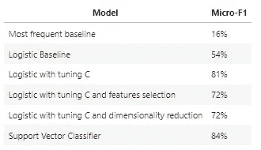

因此，在所有模型中，我假设最好的是 SVC:这是我要与两个基线进行比较的模型。但是在进入引导部分之前，让我们看看它在测试集上的性能。

```
lsvc = OneVsRestClassifier(LinearSVC(C = best_c, class_weight = "balanced"))
lsvc.fit(X_train_svc, y_train)

y_pred_svc = lsvc.predict(X_test_svc)
print(classification_report(y_test, y_pred_svc, target_names = y_test.columns))

#finally, let's store the dev predictions to be used in the next section.
best_preds = lsvc.predict(X_dev_svc)
```

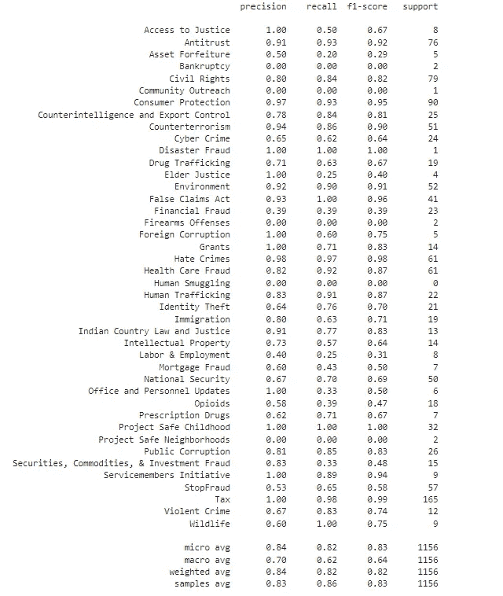

## Keras 神经网络

Keras 是一个开源软件库，为 ann(人工神经网络)提供了 Python 接口。它可以运行在 TensorFlow、微软认知工具包、Theano 或 PlaidML 之上。

Keras 的开发是为了让研究人员和开发人员更容易原型化、构建和实验深度学习模型。它具有用户友好的界面，允许您轻松创建和训练各种类型的深度学习模型，包括卷积神经网络(CNN)、递归神经网络(RNNs)和长短期记忆(LSTM)网络。

Keras 的设计是灵活和模块化的，因此您可以轻松地配置、组合和微调您创建的模型。它还具有各种预训练的模型，可以用于一系列任务，如图像分类、自然语言处理和时间序列预测。

为此，我将使用 Keras 构建一个深度神经网络来预测与司法判决相关的标签。

为了简单起见，我将只考虑那些具有单个标签的记录，这样任务将归结为一个多类任务，而不是多类、多标签任务。

```
import tensorflow as tf
from keras.models import Sequential
from keras.layers import InputLayer, Input
from keras.layers import Reshape, MaxPooling2D
from keras.layers import Conv2D, Dense, Flatten, Activation, Dropout
from keras.optimizers import SGD, RMSprop, Adagrad #want to try different optimizers

#downloading df
df_factor = pd.read_pickle('data/df_factor.pkl')

#creating a df containing only records with one label
m=[len(df_factor.category[i])==1 for i in range(len(df_factor))]
df_factor_single_label=df_factor[m]

import pandas as pd
from sklearn.model_selection import train_test_split

train, test = train_test_split(df_factor_single_label, test_size=0.2, random_state = 123) #here, we don't need a dev set
                                                                                        #since it can be specified direclty
                                                                                        #during training
#for this purpose, I will use the TfIdf vecotrizer.

vectorizer_nn = TfidfVectorizer(ngram_range = (1, 2), min_df = 0.001, max_df = 0.25, stop_words = 'english')

#let's also store the full dataset into a X_nn variable, so that we will be able to plot the training history.

X_nn = vectorizer_nn.fit_transform(df_factor_single_label.text)
X_train_nn = vectorizer_nn.fit_transform(train.text)
X_test_nn = vectorizer_nn.transform(test.text)

y_train = train.drop(["titles", "date", "text", "category", "component", "Tokens", "Lemmas", "Stems"], axis = 1)
y_test = test.drop(["titles", "date", "text", "category", "component", "Tokens", "Lemmas", "Stems"], axis = 1)
y = df_factor_single_label.drop(["titles", "date", "text", "category", "component", "Tokens", "Lemmas", "Stems"], axis = 1)
```

现在让我们初始化模型:

```
model = Sequential()
model.add(Dense(3000, activation='relu', input_dim = X_train_nn.shape[1]))
model.add(Dropout(0.1))
model.add(Dense(600, activation='relu'))
model.add(Dropout(0.1))
model.add(Dense(200, activation='relu'))
model.add(Dense(y_train.shape[1], activation='softmax'))

sgd = SGD(lr=0.01, decay=1e-6, momentum=0.9, nesterov=True)
#rms = RMSprop(learning_rate=0.001, rho=0.9)
#adam = Adagrad(learning_rate=0.01)
model.compile(loss='categorical_crossentropy',
              optimizer='adam',
              metrics=['accuracy'])

history = model.fit(X_train_nn, y_train, epochs = 5, batch_size = 100, verbose = 1, validation_split=0.2)

#score = model.evaluate(X_test_nn, y_test, batch_size = 100)
#score
```

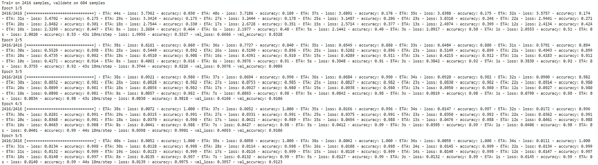

我们最终得到了一个验证/开发准确率为 91.23%的模型，还不错！

```
from keras.models import load_model

model.save('Keras Models/NN_labels.h5')  # creates a HDF5 file 'NN_labels.h5'

%matplotlib inline
import pandas as pd
import seaborn

df = pd.DataFrame(history.history)
df[['val_accuracy', 'accuracy']].plot.line()
df[['val_loss', 'loss']].plot.line()
```

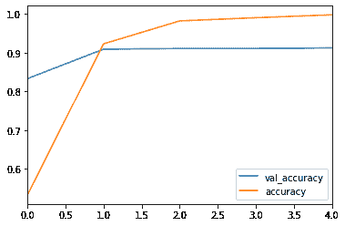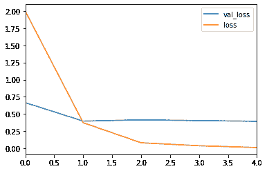

```
#downloading model
from keras.models import load_model

model = load_model('Keras Models/NN_labels.h5')

#using it to predict on new, never-seen-before data.

loss, accuracy = model.evaluate(X_test_nn, y_test, batch_size = 100)

print("test loss: ", loss)
print("test accuracy: ", accuracy)
```

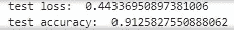

测试精度相当令人满意(91.3%)，因此我相信这个模型能够正确地标记新文章。

有了这个模型，我有信心在新文章被插入到数据库中时自动标记它们。这可能是实现能够解决原始任务(即多类、多标签分类问题)的解决方案的起点。这个模型的一个可能的改进是:训练一组不同的分类器(可以是具有不同结构的神经网络，或者不同的模型，如逻辑回归、SVC 等等)。).然后使用它们来预测文章的测试序列，并且每当模型输出不同的标签时，将它们都归因于该观察/文本。也就是说，可以使用逻辑回归、SVC 和 NN 来预测新文章标签，如果它们都返回不同的结果，则将所有三个标签归属于该文章。

## 结论

我们到了关于司法判决的 NLP 系列文章的最后一部分。如果尽管我写的东西很无聊，你还是设法来了😃谢谢大家！这对我太重要了。

我总是感谢任何建设性的反馈，所以请随时通过 Medium 或 Linkedin 联系我。

下一篇文章再见！

## 参考

*   [NLTK::自然语言工具包](https://www.nltk.org/)
*   [Python 中的 spaCy 工业级自然语言处理](https://spacy.io/)
*   [司法新闻| DOJ |司法部](https://www.justice.gov/news)
*   [司法部 2009–2018 年新闻发布| Kaggle](https://www.kaggle.com/datasets/jbencina/department-of-justice-20092018-press-releases)
*   [https://spacy.io/usage/linguistic-features#named-entities](https://spacy.io/usage/linguistic-features#named-entities)
*   [https://medium.com/p/d81bdfa14d97/edit](https://medium.com/p/d81bdfa14d97/edit)
*   https://www.nltk.org/api/nltk.sentiment.vader.html