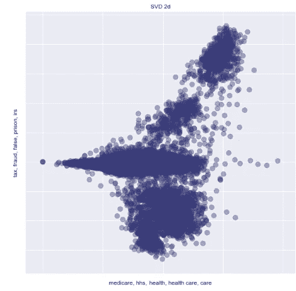
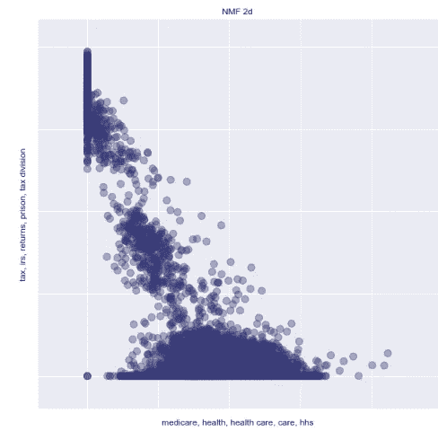
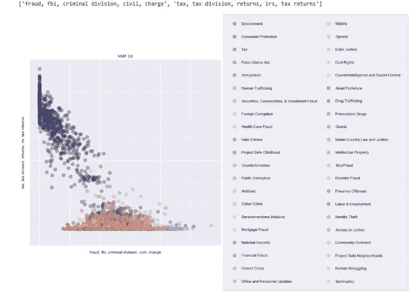
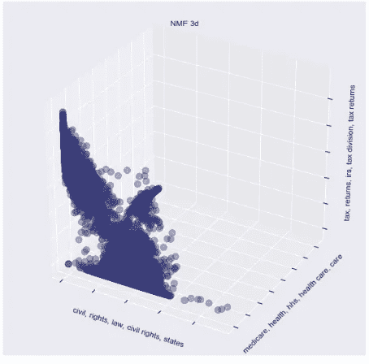
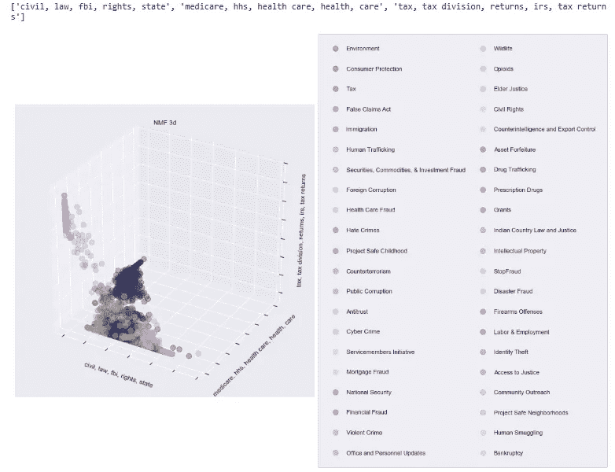

# 用 Python 实现司法判决的自然语言处理

> 原文：<https://towardsdatascience.com/natural-language-process-for-judicial-sentences-with-python-a0ec2792b70>


[https://pixabay.com/](https://pixabay.com/)

## 第四部分:矩阵分解的潜在语义

在本文中，我将执行潜在语义(或主题)分析，这是一种通过产生与文档和术语相关的新“概念”(也称为语义或主题)来分析文档和相关术语之间关系的技术。这种方法建立在*分布假设*的基础上，根据该假设“具有相似分布的语言术语具有相似的含义”。因此，意义相近的术语很可能出现在相似的文本中。

潜在语义分析包括两个主要步骤:

1.  创建一个 Word 文档矩阵(你可以在这里阅读更多关于文档矢量化的内容
2.  降低矩阵的维度，以产生新的变量(这将是我们的语义或主题)。

我会进行两种矩阵分解技术:**奇异值分解**和**非负矩阵分解**。他们都依赖于一个假设，即在高维特征空间中，实际上可能需要更少的维度来解释数据中的变化(你可以在这里阅读更多关于维度减少的概念→[https://towardsdatascience . com/PCA-intrinsic vectors-and-enforcern-1 f 968 BC 6777 a](/pca-eigenvectors-and-eigenvalues-1f968bc6777a))。

这两种方法的主要区别在于，SVD 将文档 X 的矢量化矩阵分解成 3 个低维矩阵，而 NMF 只用 2 个矩阵就完成了分解。

让我们用 Python 来实现它们。

## 二维分析

```
#create the original matrix X (term-document matrix), vectorized with tf-idf weights.

documents = df_factor.Tokens.apply(str).tolist()
tfidf_vectorizer = TfidfVectorizer(ngram_range=(1,2), stop_words='english', analyzer='word', 
                                   min_df=0.001, max_df=0.5, sublinear_tf=True, use_idf=True)
X = tfidf_vectorizer.fit_transform(documents)

from sklearn.decomposition import TruncatedSVD #svd

# set number of latent components
k = 10

svd = TruncatedSVD(n_components=k)
%time U = svd.fit_transform(X)
S = svd.singular_values_
V = svd.components_

from sklearn.decomposition import NMF #nmf

nmf = NMF(n_components=k, init='nndsvd', random_state=0)

%time W = nmf.fit_transform(X)
H = nmf.components_

print("SVD matrices shapes: ", U.shape, S.shape, V.shape)
print("NMF matrices shapes: ",W.shape, H.shape)

Wall time: 2.5 s
Wall time: 11.4 s
SVD matrices shapes:  (13087, 10) (10,) (10, 40808)
NMF matrices shapes:  (13087, 10) (10, 40808)

import numpy as np
def show_topics(A, vocabulary, topn=5):
    """
    find the top N words for each of the latent dimensions (=rows) in a
    """
    topic_words = ([[vocabulary[i] for i in np.argsort(t)[:-topn-1:-1]]
                    for t in A])
    return [', '.join(t) for t in topic_words] 
```

现在，让我们打印矢量化文档矩阵中的顶级术语，用 TF-IDF 分数进行加权(您可以在前面的部分[这里](/natural-language-process-for-judicial-sentences-with-python-102064f24372)中阅读关于该分数的更多信息)。

```
#SVD
terms = tfidf_vectorizer.get_feature_names()

sorted(show_topics(V, terms))
```

```
['antitrust, antitrust division, bid, rigging, bid rigging',
 'child, criminal division, safe childhood, project safe, childhood',
 'child, safe childhood, project safe, childhood, exploitation',
 'epa, environmental, clean, environment, natural',
 'injunction, customers, complaint, preparing, preparers',
 'medicare, hhs, health, health care, care',
 'osc, ina, immigration, citizenship, discrimination provision',
 'rights, civil rights, rights division, discrimination, employment',
 'tax, fraud, false, prison, irs',
 'tax, returns, irs, tax returns, tax division']
```

```
#NMF
sorted(show_topics(H, terms))
```

```
['antitrust, antitrust division, bid, rigging, bid rigging',
 'child, safe childhood, project safe, childhood, exploitation',
 'epa, environmental, clean, environment, natural',
 'false claims, claims act, claims, civil division, health',
 'fbi, indictment, police, security, law',
 'medicare, hhs, health, health care, care',
 'osc, ina, employment, citizenship, anti discrimination',
 'rights, civil rights, rights division, civil, discrimination',
 'tax, irs, tax division, returns, tax returns',
 'tax, returns, customers, injunction, tax returns']
```

现在让我们画出低维项矩阵。

```
#Initializing a plotting function

import matplotlib.pyplot as plt
from mpl_toolkits.mplot3d import Axes3D
from matplotlib import colors
import seaborn as sns

sns.set_context('notebook')

def plot_vectors(vectors, V, title='VIZ', labels=None, dimensions=3):
    """
    plot the vectors in 2 or 3 dimensions. 
    If labels are supplied, use them to color the data accordingly
    """
    # set up graph
    fig = plt.figure(figsize=(10,10))

    # create data frame
    df = pd.DataFrame(data={'x':vectors[:,0], 'y': vectors[:,1]})
    # add labels, if supplied
    if labels is not None:
        df['label'] = labels
    else:
        df['label'] = [''] * len(df)

    # assign colors to labels
    cm = plt.get_cmap('tab20b') # choose the color palette
    n_labels = len(df.label.unique())
    label_colors = [cm(1\. * i/n_labels) for i in range(n_labels)]
    cMap = colors.ListedColormap(label_colors)

    # plot in 3 dimensions
    if dimensions == 3:
        # add z-axis information
        df['z'] = vectors[:,2]
        # define plot
        ax = fig.add_subplot(111, projection='3d')
        frame1 = plt.gca() 
        # remove axis ticks
        frame1.axes.xaxis.set_ticklabels([])
        frame1.axes.yaxis.set_ticklabels([])
        frame1.axes.zaxis.set_ticklabels([])

        # plot each label as scatter plot in its own color
        for l, label in enumerate(df.label.unique()):
            df2 = df[df.label == label]
            color_values = [label_colors[l]] * len(df2)
            ax.scatter(df2['x'], df2['y'], df2['z'], 
                       c=color_values, 
                       cmap=cMap, 
                       edgecolor=None, 
                       label=label, 
                       alpha=0.4, 
                       s=100)

        topics = sorted(show_topics(V.components_, tfidf_vectorizer.get_feature_names()))
        print(topics)
        frame1.axes.set_xlabel(topics[0])
        frame1.axes.set_ylabel(topics[1])
        frame1.axes.set_zlabel(topics[2])

    # plot in 2 dimensions
    elif dimensions == 2:
        ax = fig.add_subplot(111)
        frame1 = plt.gca() 
        frame1.axes.xaxis.set_ticklabels([])
        frame1.axes.yaxis.set_ticklabels([])

        for l, label in enumerate(df.label.unique()):
            df2 = df[df.label == label]
            color_values = [label_colors[l]] * len(df2)
            ax.scatter(df2['x'], df2['y'], 
                       c=color_values, 
                       cmap=cMap, 
                       edgecolor=None, 
                       label=label, 
                       alpha=0.4, 
                       s=100)
        topics = sorted(show_topics(V.components_, tfidf_vectorizer.get_feature_names()))
        print(topics)
        frame1.axes.set_xlabel(topics[0])
        frame1.axes.set_ylabel(topics[1])

    else:
        raise NotImplementedError()
    plt.legend(ncol = 5, loc = "upper left", frameon = True, fancybox = True)
    ax.legend(frameon = True, ncol = 2, fancybox = True, title_fontsize = 15,
              loc = 'center left', bbox_to_anchor = (1, 0.5), labelspacing = 2.5, borderpad = 2)
    plt.title(title)
#     plt.legend()
    plt.show() 
```

```
# now let's perform the same computations with 2 and 3 dimensions, so that we can visualize them. Let's start with 2 dims.

low_dim_svd = TruncatedSVD(n_components = 2)
low_dim_U = low_dim_svd.fit_transform(X)
sorted(show_topics(low_dim_svd.components_, tfidf_vectorizer.get_feature_names()))
```

```
['medicare, hhs, health, health care, care', 'tax, fraud, false, prison, irs']
```

```
low_dim_nmf = NMF(n_components=2, init='nndsvd')
low_dim_W = low_dim_nmf.fit_transform(X)
sorted(show_topics(low_dim_nmf.components_, tfidf_vectorizer.get_feature_names()))
```

```
['medicare, health, health care, care, hhs',
 'tax, irs, returns, prison, tax division']
```

这两种方法的结果似乎是一致的。让我们来看看策划:

```
plot_vectors(low_dim_U, low_dim_svd, title = 'SVD 2d', dimensions=2)
```



```
plot_vectors(low_dim_W, low_dim_nmf, title = 'NMF 2d', dimensions=2)
```



现在我想进行同样的分析，但是也要考虑我的文章的标签(或类别)。

```
#creating a df with records with only one label
data_single = df_factor.copy()[df_factor[categories].sum(axis = 1) == 1]

documents = data_single.text.apply(str).tolist()
tfidf_vectorizer = TfidfVectorizer(ngram_range=(1,2), stop_words='english', analyzer='word', 
                                   min_df=0.001, max_df=0.5, sublinear_tf=True, use_idf=True)
X = tfidf_vectorizer.fit_transform(documents)

from sklearn.decomposition import TruncatedSVD # this also works with sparse matrices
labels = [i[0] for i in data_single.category] #each component is a list, I want a list of elements not a list of lists
# set number of latent components
k = 10

svd = TruncatedSVD(n_components=k)
%time U = svd.fit_transform(X)
S = svd.singular_values_
V = svd.components_

from sklearn.decomposition import NMF

nmf = NMF(n_components=k, init='nndsvd', random_state=0)

%time W = nmf.fit_transform(X)
H = nmf.components_
```

对于这种分析，我将只依靠 NMF 方法。事实上，我注意到用 SVD 提取的主题非常相似:

```
low_dim_svd = TruncatedSVD(n_components = 2)
low_dim_U = low_dim_svd.fit_transform(X)
sorted(show_topics(low_dim_svd.components_, tfidf_vectorizer.get_feature_names()))

['tax, irs, tax division, fraud, returns',
 'tax, returns, tax division, irs, tax returns']
```

为了让潜在的主题覆盖尽可能多的信息，我不希望两个或更多的组件带来相同的信息，因此是多余的。

```
low_dim_nmf = NMF(n_components=2, init='nndsvd')
low_dim_W = low_dim_nmf.fit_transform(X)
plot_vectors(low_dim_W, low_dim_nmf, labels = labels, title = 'NMF 2d', dimensions=2)
```



## 三维分析

现在让我们做同样的三维。同样，在这种情况下，我将只依靠 NMF 方法。事实上，在查看 SVD 方法的第二个和第三个潜在主题(或组件)时，我注意到它们非常相似:

```
['medicare, hhs, health, health care, care',
 'tax, fraud, false, prison, irs',
 'tax, returns, irs, tax returns, tax division']
```

因此，由于上面解释的同样的原因，我将不再继续 SVD 方法。

因此，让我们继续创建 3D 矩阵并绘制结果:

```
low_dim_nmf = NMF(n_components=3, init='nndsvd')
low_dim_W = low_dim_nmf.fit_transform(X)

plot_vectors(low_dim_W, low_dim_nmf, title = 'NMF 3d', dimensions=3)
```



同样通过 3d 分析，我想通过考虑我的文章的标签(或类别)来为我的图添加信息。

```
 low_dim_nmf = NMF(n_components=3, init='nndsvd')
low_dim_W = low_dim_nmf.fit_transform(X)
sorted(show_topics(low_dim_nmf.components_, tfidf_vectorizer.get_feature_names()))
plot_vectors(low_dim_W, low_dim_nmf, labels = labels, title = 'NMF 3d', dimensions=3)
```



## 结论

从上面的分析来看，我们的方法似乎能够将属于具有相同标签的文档的单词聚类到相同的潜在主题中。这可能有助于搜索引擎或自动司法判决分类，并且通常有助于在司法知识库中导航。

在下一篇文章中，将继续处理主题和语义，所以请继续关注第 5 部分！

## 参考

*   自然语言工具包
*   [Python 中的 spaCy 工业级自然语言处理](https://spacy.io/)
*   [司法新闻| DOJ |司法部](https://www.justice.gov/news)
*   [司法部 2009-2018 年新闻发布| Kaggle](https://www.kaggle.com/datasets/jbencina/department-of-justice-20092018-press-releases)
*   [https://en.wikipedia.org/wiki/Distributional_semantics](https://en.wikipedia.org/wiki/Distributional_semantics)
*   [https://aurelieherbelot . net/research/distributional-semantics-intro/](https://aurelieherbelot.net/research/distributional-semantics-intro/)