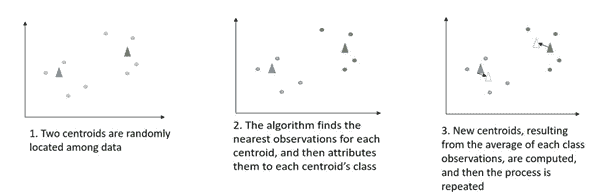
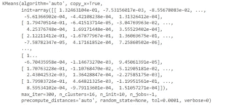
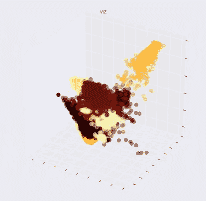
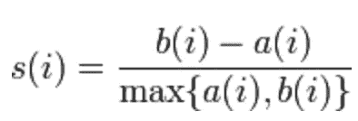
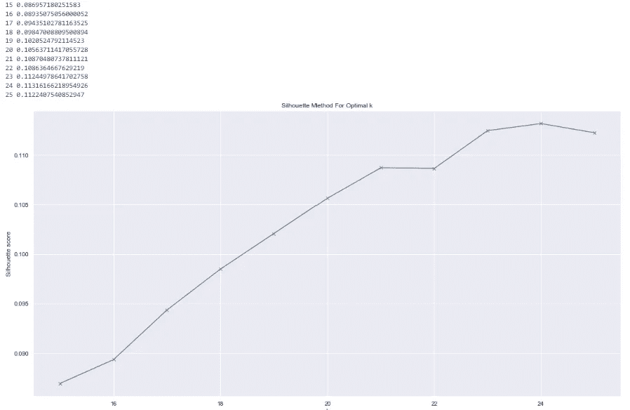
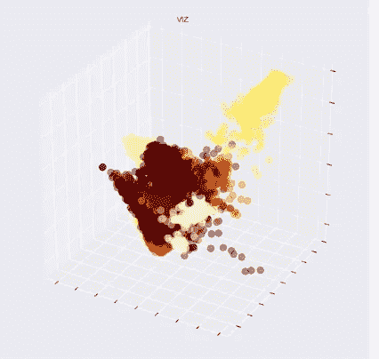

# 用 Python 实现司法判决的自然语言处理

> 原文：<https://towardsdatascience.com/natural-language-process-for-judicial-sentences-with-python-ae5ea52b540d>


[https://pixabay.com/](https://pixabay.com/)

## 第 7 部分:聚类分析

在这篇文章中，我将对我们的司法判决进行一些进一步的分析和视觉呈现。我将重点介绍聚类分析，这是一种无监督的学习技术，即使我们对它了解不多，它也非常有助于发现数据中的模式。在 NLP 中，它可以有多种应用:

*   识别推文中对话的共同趋势
*   对来自一个国家不同地区的文本进行分组(每个地区有不同的方言)
*   根据电影涉及的类型对电影评论进行分组

诸如此类。无监督学习的好处是并不总是清楚聚类的含义:这取决于用户根据分析的结果来推导。例如，在我们的研究中，分组可能反映不同的干预领域，或者可能确定宣布判决的司法区域。

为了进行聚类分析，我将使用 **K-means 算法。**

该算法的第一步是在我们未标记的观测值中，创建随机定位的 *c* 新观测值，称为“质心”。质心的数量将代表簇的数量(我们将在后面看到如何确定这个数量)。现在，将开始一个迭代过程，由两个步骤组成:

*   首先，对于每个质心，该算法找到离该质心最近的点(根据通常计算为欧几里德距离的距离),并将它们分配到其类别中；
*   其次，对于每个类别(由一个质心表示)，该算法计算属于该类别的所有点的平均值。该计算的输出将是该类的新质心。

每次重复该过程时，最初与一个质心分类在一起的一些观察结果可能被重定向到另一个质心。此外，在几次重复之后，质心位置的变化应该越来越不重要，因为初始随机质心与真实质心收敛。当质心位置不再变化时，该过程结束。



作者图片

如果你有兴趣深入研究聚类无监督技术，你可以在这里阅读我以前的文章。

现在让我们用 Python 实现它。

让我们开始定义一个函数，稍后绘制我们的聚类结果。

```
#initializing a plotting function

import matplotlib.pyplot as plt
from mpl_toolkits.mplot3d import Axes3D
from matplotlib import colors
import seaborn as sns

sns.set_context('notebook')

def plot_vectors(vectors, title='VIZ', labels=None, dimensions=3):
    """
    plot the vectors in 2 or 3 dimensions. 
    If labels are supplied, use them to color the data accordingly
    """
    # set up graph
    fig = plt.figure(figsize=(10,10))

    # create data frame
    df = pd.DataFrame(data={'x':vectors[:,0], 'y': vectors[:,1]})
    # add labels, if supplied
    if labels is not None:
        df['label'] = labels
    else:
        df['label'] = [''] * len(df)

    # assign colors to labels
    cm = plt.get_cmap('afmhot') # choose the color palette
    n_labels = len(df.label.unique())
    label_colors = [cm(1\. * i/n_labels) for i in range(n_labels)]
    cMap = colors.ListedColormap(label_colors)

    # plot in 3 dimensions
    if dimensions == 3:
        # add z-axis information
        df['z'] = vectors[:,2]
        # define plot
        ax = fig.add_subplot(111, projection='3d')
        frame1 = plt.gca() 
        # remove axis ticks
        frame1.axes.xaxis.set_ticklabels([])
        frame1.axes.yaxis.set_ticklabels([])
        frame1.axes.zaxis.set_ticklabels([])

        # plot each label as scatter plot in its own color
        for l, label in enumerate(df.label.unique()):
            df2 = df[df.label == label]
            color_values = [label_colors[l]] * len(df2)
            ax.scatter(df2['x'], df2['y'], df2['z'], 
                       c=color_values, 
                       cmap=cMap, 
                       edgecolor=None, 
                       label=label, 
                       alpha=0.4, 
                       s=100)

    # plot in 2 dimensions
    elif dimensions == 2:
        ax = fig.add_subplot(111)
        frame1 = plt.gca() 
        frame1.axes.xaxis.set_ticklabels([])
        frame1.axes.yaxis.set_ticklabels([])

        for l, label in enumerate(df.label.unique()):
            df2 = df[df.label == label]
            color_values = [label_colors[l]] * len(df2)
            ax.scatter(df2['x'], df2['y'], 
                       c=color_values, 
                       cmap=cMap, 
                       edgecolor=None, 
                       label=label, 
                       alpha=0.4, 
                       s=100)

    else:
        raise NotImplementedError()

    plt.title(title)
#     plt.legend()
    plt.show()
```

那我们就准备数据吧。对于我的文档的数字表示，我将使用 TF-IDF 矩阵表示(您可以在[第 3 部分](/natural-language-process-for-judicial-sentences-with-python-102064f24372)中阅读更多关于该技术的内容)。

```
#downloading data
df_factor = pd.read_pickle('data/df_factor.pkl')

documents = df_factor.text.apply(str).tolist()
tfidf_vectorizer = TfidfVectorizer(ngram_range=(1,2), stop_words='english', analyzer='word', 
                                   min_df=0.001, max_df=0.5, sublinear_tf=True, use_idf=True)
X = tfidf_vectorizer.fit_transform(documents)
```

现在让我们进入集群步骤。我将首先用任意数量的质心训练 K-means 模型，然后我将介绍识别它们的适当数量的技术。

```
from sklearn.cluster import KMeans, AgglomerativeClustering

k = 16 #just to try, not the optimal number of clusters

# reduce the dimensionality of the input, to speed up clustering
X2 = TruncatedSVD(n_components=300).fit_transform(X)

agg = AgglomerativeClustering(n_clusters=k)

agg_ids = agg.fit_predict(X2)

centroids = np.array([X2[agg_ids == c].mean(axis=0) for c in range(k)])
#print(centroids.shape)
```

让我们训练模型并使其适合我们的 TF-IDF 截断矩阵:

```
km = KMeans(n_clusters=k, 
            n_jobs=-1, 
            init=centroids)

km.fit(X2)
```



```
plot_vectors(X2, labels=km.labels_)
```



作者图片

现在，为了进行更有意义的分析，我想确定聚类(或质心)的最佳数量。为此，我将使用轮廓得分技术。

对于每个数据点或观察值以及每个固定数量的聚类，该分数由两部分组成:

*   该观测值与同一聚类内所有其他观测值之间的平均距离(表示为 *a*
*   该观测值与下一个最近簇的所有其他观测值之间的平均距离(表示为 *b*



如公式所示，分子越大，用该数量的质心完成的聚类越多。

这个想法是，我们训练一个增量 K-means 模型，其质心数量不断增加，我们为每个质心计算轮廓得分。导致具有最高轮廓分数的模型的质心的数量被假定为最佳数量。

在我的分析中，我训练了 10 个质心在 15 到 25 之间的模型。

```
from sklearn.metrics import silhouette_score

silhouettes = []

K = range(15, 26)

for c in K:
    agg_clustering = AgglomerativeClustering(n_clusters=c)

    agg_cluster_ids = agg_clustering.fit_predict(X2)
    score = silhouette_score(X2, agg_cluster_ids)
    silhouettes.append(score)
    print(c, score)

fig, ax = plt.subplots(figsize=(20,10))
plt.plot(K, silhouettes, 'bx-')
plt.xlabel('k')
plt.ylabel('Silhouette score')
plt.title('Silhouette Method For Optimal k')
plt.show()
```



作者图片

从上面的图中，似乎最一致的聚类数是 k=24，因为它具有最高的分数。如果添加更多的集群，它可能会更高，但是，我不想让我的数据过多，所以我将坚持这个数字。

```
from sklearn.cluster import KMeans, AgglomerativeClustering

k = 24

# reduce the dimensionality of the input, to speed up clustering
X2 = TruncatedSVD(n_components=300).fit_transform(X)

agg = AgglomerativeClustering(n_clusters=k)
agg_ids = agg.fit_predict(X2)

centroids = np.array([X2[agg_ids == c].mean(axis=0) for c in range(k)])
print(centroids.shape)

km = KMeans(n_clusters=k, 
            n_jobs=-1, 
            init=centroids)

# fit it on the full 300-dimensional data set
km.fit(X2)

plot_vectors(X2, labels=km.labels_)
```



作者图片

如上所述，没有预先向用户给出聚类的含义。我们有责任进一步研究模型发现的模式，并将它们与我们拥有的进一步信息联系起来。

希望你喜欢阅读！敬请期待下一部分:)

## 参考

*   [NLTK::自然语言工具包](https://www.nltk.org/)
*   Python 中的 spaCy 工业级自然语言处理
*   [司法新闻| DOJ |司法部](https://www.justice.gov/news)
*   [司法部 2009-2018 年新闻发布| Kaggle](https://www.kaggle.com/datasets/jbencina/department-of-justice-20092018-press-releases)