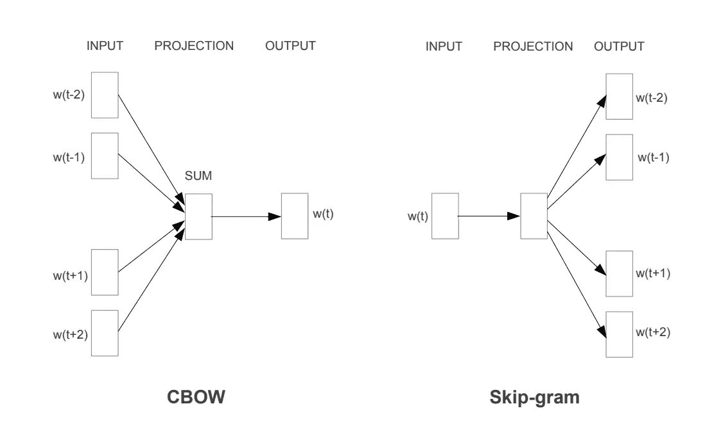
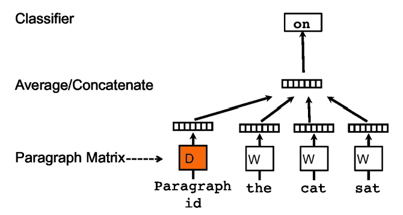
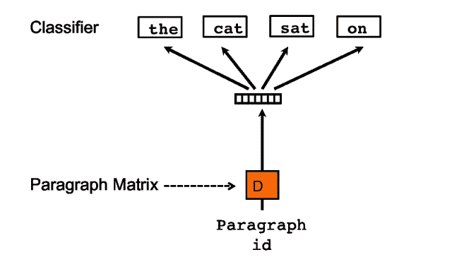
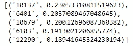
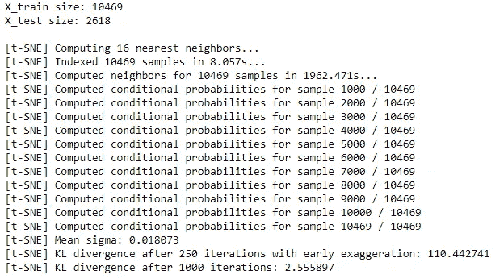
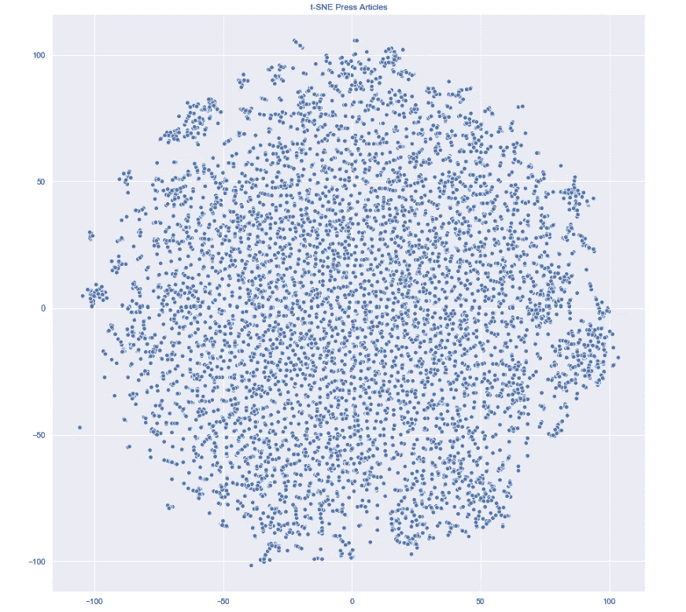

# 用 Python 实现司法判决的自然语言处理

> 原文：<https://towardsdatascience.com/natural-language-process-for-judicial-sentences-with-python-bb60a6d3cc0b>


[https://pixabay.com/](https://pixabay.com/)

## 第 6 部分:文档嵌入

在本系列的最新文章中，我们经常提到，为了用作数学模型的输入(许多 NLP 应用程序的最终目标)，文本数据需要以某种方式转换成数字表示。我们已经看到了其中的一些，如 TF-IDF 矩阵或词袋。然而，在捕捉单词或文档的含义时，这些技术并不“有用”。

这就是文档嵌入进入游戏的时候。文档嵌入的一般思想是以这样一种方式用向量表示文档，即一旦在向量空间中表示，向量之间的数学距离就表示它们所表示的文档之间的相似性。

在深入研究文档嵌入及其在我们分析中的应用之前，我们首先需要介绍它的起源，可以追溯到单词嵌入的更细粒度的概念。

## 单词嵌入

使用单词嵌入技术，我们将向量定义为单词的数字表示，这样，具有相似含义的单词具有相似的向量表示。

这个想法是，我们需要用数字来表示单词的意思，这样我们就可以进行如下活动:

*   ML 模型训练
*   单词所在语料库中潜在模式的可视化
*   预测所分析单词周围的单词

和许多其他人。

一种流行的单词嵌入技术是 Word2Vec，在 2013 年的这篇[论文](https://arxiv.org/pdf/1301.3781.pdf)中介绍。Word2Vec 旨在将单词的含义(包括同义词、类比等)捕获到矢量表示中。这背后的思想是，例如，在向量空间中,“巴黎”的数字表示应该比“伦敦”的数字表示更接近“法国”的数字表示。

Word2Vec 基于两种算法:

*   连续单词包(CBOW)→它使用滑动窗口预测给定上下文的单词，即前一个和下一个单词。
*   Skip-gram →它以相反的方向工作，使用一个单词作为输入来预测它周围的上下文。尽管它比 CBOW 慢，但在处理生僻字时效果更好。



来源:https://arxiv.org/pdf/1301.3781.pdf

单词嵌入对于许多上下文来说肯定是有用的，但是，这可能还不够。事实上，可能有一些与单词相关的含义不仅严格依赖于它们的上一个或下一个单词，而且依赖于它们所引用的整个文档。也就是说，Word2Vec 算法可能很难捕捉到这样一个事实，即两个同音异义词在不同的文档中可能有非常不同的含义(取决于它们的上下文)。

这就是引入文档嵌入的原因。对于文档嵌入，我们有一个单词嵌入的离散近似，它有助于捕捉整个上下文，并旨在给出更有意义的向量表示。最流行的算法之一是 Doc2Vec，由 Quoc Le 和 Tomas Mikolov 于 2014 年在这篇[文章](https://arxiv.org/pdf/1405.4053.pdf)中介绍。

## 文档嵌入

Doc2Vec 模型用于创建一组单词的矢量化表示，这些单词作为一个整体，而不是单个单词。

至于 Word2Vec，Doc2Vec 算法有两种变体:

*   分布式内存模型(DM)→类似于 Word2Vec 算法中的 CBOW 变体，DM 模型在其单词输入中还结合了一个段落矩阵，该矩阵可以被认为是另一个单词。“分布式记忆”这个名称表明了这样一个事实，即段落矩阵充当记忆单个单词不能捕捉的当前上下文中缺少的内容的记忆。



来源:https://arxiv.org/pdf/1405.4053v2.pdf

*   分布式单词包(DBOW)→类似于 Word2Vec 的 skip-gram 变体，但它不是使用单个单词来预测其周围的上下文，而是使用段落矩阵(与上面解释的概念相同)。



来源:[https://arxiv.org/pdf/1405.4053v2.pdf](https://arxiv.org/pdf/1405.4053v2.pdf)

## 用 Python 实现

我将使用`gensim`中可用的`Doc2Vec`模块。更具体地说，我将使用 DBOW 变体。

另外，出于可视化的目的，我将通过 t-SNE 算法来表示嵌入的文档。

因此，让我们开始创建文档矩阵 X，我们将在其上训练 Doc2Vec 算法。

```
df_factor = pd.read_pickle('data/df_factor.pkl')

from sklearn.feature_extraction.text import HashingVectorizer, TfidfVectorizer
documents = df_factor.Tokens.apply(str).tolist()
# hash vectorizer instance
hvec = HashingVectorizer(lowercase=False, analyzer=lambda l:l, n_features=2**12)

# features matrix X
X = hvec.fit_transform(documents)
```

让我们导入所有模块并训练我们的算法:

```
from gensim.models import Doc2Vec
from gensim.models.doc2vec import FAST_VERSION
from gensim.models.doc2vec import TaggedDocument

corpus = []
for docid, document in enumerate(documents):
    corpus.append(TaggedDocument(document.split(), tags=["{0:0>4}".format(docid)]))

d2v_model = Doc2Vec(size=300,window=5,hs=0,sample=0.000001,negative=5, min_count=10, 
                    workers=-1, iter=5000, dm=0, dbow_words=1)

d2v_model.build_vocab(corpus)

d2v_model.train(corpus, total_examples=d2v_model.corpus_count, epochs=d2v_model.epochs)
```

让我们检索与文档“0001”最相似的 5 个文档:

```
target_doc = '0001'
# retrieve the 5 most similar documents
d2v_model.docvecs.most_similar(target_doc, topn=5)
```



每个数组代表(target_doc，相似性得分)。

现在我还想可视化我的矢量化文档。为此，我将使用[T-分布式随机邻居嵌入(t-SNE)](https://www.analyticsvidhya.com/blog/2017/01/t-sne-implementation-r-python/) 算法，这是一种非线性降维技术(在这里阅读关于降维的更多信息[)。](https://medium.com/towards-data-science/understanding-the-link-between-pca-and-eigenvectors-468435649d57)

```
#t-SNE embedding algorithm

from sklearn.model_selection import train_test_split

# test set size of 20% of the data and the random seed 123 for replicability
X_train, X_test = train_test_split(X.toarray(), test_size=0.2, random_state=123)

print("X_train size:", len(X_train))
print("X_test size:", len(X_test), "\n")

from sklearn.manifold import TSNE

tsne = TSNE(verbose=1, perplexity=5)
X_embedded = tsne.fit_transform(X_train)
```



让我们导入可视化软件包来绘制缩减的维度:

```
from matplotlib import pyplot as plt
import seaborn as sns

# sns settings
sns.set(rc={'figure.figsize':(15,15)})

# colors
palette = sns.color_palette("bright", 1)

# plot
sns.scatterplot(X_embedded[:,0], X_embedded[:,1], palette=palette)

plt.title("t-SNE Press Articles")
# plt.savefig("plots/t-sne_covid19.png")
plt.show()
```



在这张图片的边缘有一些有趣的集群，这意味着这些文档之间可能有一些共同的讨论趋势。用潜在主题分析来扩展这种分析也可能是有用的，以查看那些聚类是否实际上代表潜在主题。

在下一篇文章中，我们将进一步研究低维数据，以执行聚类分析。我们还将通过命名实体来查看文章的词汇组成。

所以请继续关注第 7 部分！

# 参考

*   [NLTK::自然语言工具包](https://www.nltk.org/)
*   Python 中的 spaCy 工业级自然语言处理
*   [司法新闻| DOJ |司法部](https://www.justice.gov/news)
*   [司法部 2009-2018 年新闻发布| Kaggle](https://www.kaggle.com/datasets/jbencina/department-of-justice-20092018-press-releases)
*   [https://en.wikipedia.org/wiki/Distributional_semantics](https://en.wikipedia.org/wiki/Distributional_semantics)
*   [https://aurelieherbelot . net/research/distributional-semantics-intro/](https://aurelieherbelot.net/research/distributional-semantics-intro/)
*   [https://arxiv.org/pdf/1405.4053v2.pdf](https://arxiv.org/pdf/1405.4053v2.pdf)
*   [arxiv.org 1707.02377.pdf](https://arxiv.org/pdf/1707.02377.pdf)
*   [https://arxiv.org/pdf/1301.3781.pdf](https://arxiv.org/pdf/1301.3781.pdf)