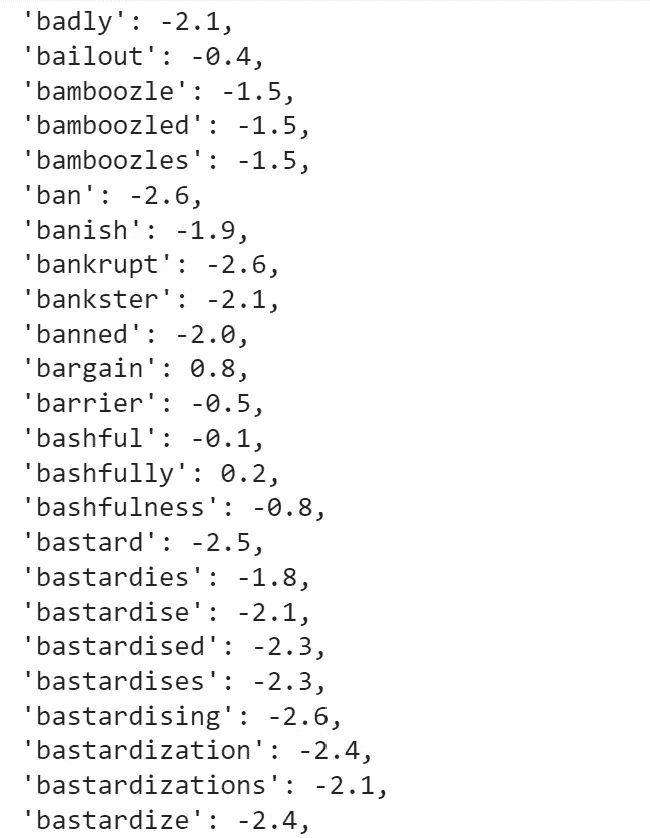
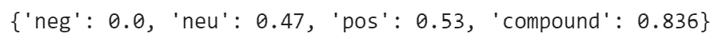
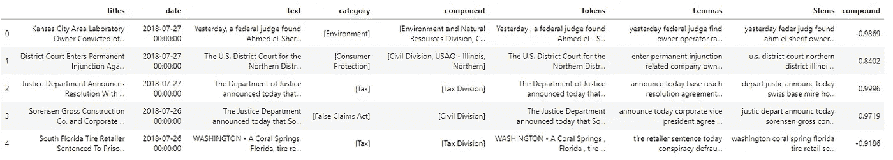
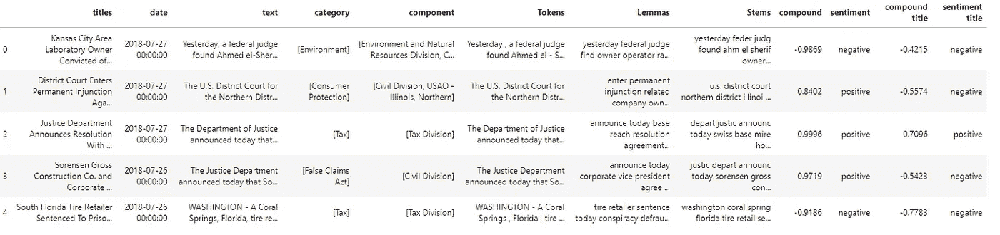
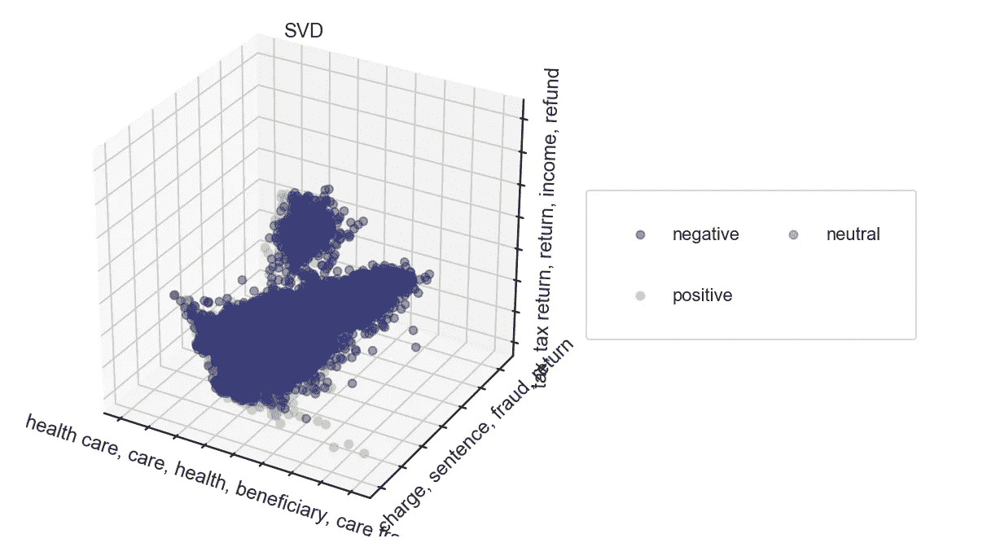
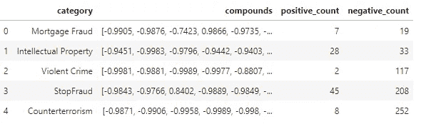
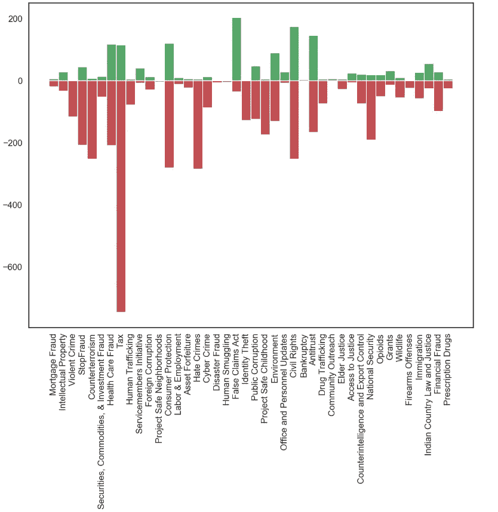
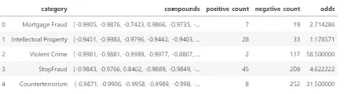
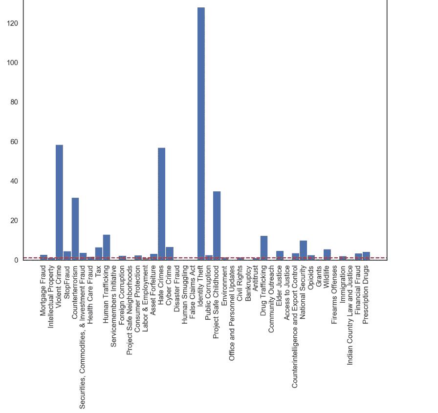

# 用 Python 实现司法判决的自然语言处理

> 原文：<https://towardsdatascience.com/natural-language-process-for-judicial-sentences-with-python-e6a01e30a675>


[https://pixabay.com/](https://pixabay.com/)

## 第 9 部分:无监督情感分析

情感分析是一种自然语言处理技术，涉及使用机器学习算法从文本数据中识别和提取主观信息。它通常用于确定一篇文章的整体情绪，无论是积极的、消极的还是中性的。这对于各种应用程序都很有用，例如分析客户反馈、检测社交媒体帖子的情绪或识别电影评论的情绪。情感分析算法通常使用自然语言处理技术和机器学习算法的组合来处理和分析文本数据，并且可以被训练来识别各种类型的情感。

## 所用模型的介绍

在我们的场景中，我想分析文章的情感是否取决于它们的类别。由于文章没有与其情感对应的标签，我将使用一个名为 VADER 的预训练模型进行无监督分析，该模型可从 [NLTK](https://www.nltk.org/api/nltk.sentiment.vader.html) Python 库中获得。第一个单元格可能需要一段时间，所以您可以直接跳到突出显示的 markdown 开始运行代码并可视化结果。

VADER 属于一种依赖于情感相关词汇的情感分析。因此，该模型是在具有相关分数(取决于它是正/+ve、中性还是负/-ve)的词典语料库上训练的。

```
import nltk
from nltk.sentiment.vader import SentimentIntensityAnalyzer
nltk.download('vader_lexicon')
sia = SentimentIntensityAnalyzer()
```

[….]



[….]

一旦输入一个完整的句子，该模型使用函数“polarity_score”返回 4 个分数:前三个，+ve，neutral 和-ve，表示属于这些分类的内容的范围。第四个是复合分数，在-1 和 1 之间归一化的词汇等级的总量。

```
raw_text = "this cake looks delicious, I would love to eat it"
sia.polarity_scores(raw_text)
```



## 司法判决的情感分析

现在让我们将 VADER 模式用于我们的司法判决:

```
 import nltk
from nltk.sentiment.vader import SentimentIntensityAnalyzer 
df_sentiment=df.copy()

sia = SentimentIntensityAnalyzer()
sentiment=[]
for i in range(len(df)):
     ss = sia.polarity_scores(df.Lemmas[i])
     sentiment.append(ss)

import pickle
pickle.dump(sentiment, open("data/sentiment.pkl", 'wb'))
```

让我们用复合分数向数据集添加一列:

```
#now we can add a column to our dataset to establish whether the release was positive, neutral or negative.
compound=[sentiment[i]['compound'] for i in range(len(sentiment))]
df_sentiment['compound']=compound
df_sentiment.head()
```



现在我在联想:

*   化合物大于 0.05 的任何句子的正标签
*   任何复合值低于-0.05 的句子的否定标记
*   任何含有-0.05 到 0.05 之间的复合词的句子的中性标签

```
#let's attribute a label 
sent=[]
for i in compound:
    if i<-0.05:
        sent.append('negative')
    elif i>0.05:
        sent.append('positive')
    else:
        sent.append('neutral')

df_sentiment['sentiment']=sent

#storing results
df_sentiment.to_pickle('data/df_sentiment.pkl')
df_sentiment.head()
```



## 可视化结果

由于我想在一个低维空间中可视化标记的句子，我将从 [TF-IDF 矩阵](/natural-language-process-for-judicial-sentences-with-python-102064f24372)开始应用[奇异值分解](https://medium.com/towards-data-science/natural-language-process-for-judicial-sentences-with-python-a0ec2792b70)(您可以在本系列的前几部分中了解关于 SVD 和 TF-IDF 的更多信息):

```
#Now let's visualize it via Singular Value Decomposition

documents = df_sentiment.Lemmas.apply(str).tolist()
tfidf_vectorizer = TfidfVectorizer(ngram_range=(1,2), stop_words='english', analyzer='word', min_df=0.001, max_df=0.5, sublinear_tf=True, use_idf=True)
X = tfidf_vectorizer.fit_transform(documents)
print(X.shape)

k = 2
svd = TruncatedSVD(n_components=k)
U = svd.fit_transform(X)
S = svd.singular_values_
V = svd.components_

print(U.shape, S.shape, V.shape)
```

```
(13087, 28314)
(13087, 2) (2,) (2, 28314)
```

现在让我们导入可视化库并初始化一个绘图函数:

```
import seaborn as sns
import matplotlib.pyplot as plt
from matplotlib import colors
def show_topics(A, vocabulary, topn = 5):
    """
    find the top N words for each of the latent dimensions (=rows) in a
    """
    topic_words = ([[vocabulary[i] for i in np.argsort(t)[:-topn-1:-1]]
                    for t in A])
    return [', '.join(t) for t in topic_words]

def plot_vectors(vectors, title = 'VIZ', labels = None, dimensions = 3, low_dim = None):
    sns.set_context('poster')
    """
    plot the vectors in 2 or 3 dimensions. If supplied, color them according to the labels
    """
    # set up graph
    fig = plt.figure(figsize = (12, 12))

    # create data frame
    df = pd.DataFrame(data = {'x': vectors[:, 0], 'y': vectors[:, 1]})
    # add labels, if supplied
    if labels is not None:
        df['label'] = labels
    else:
        df['label'] = [''] * len(df)

    # assign colors to labels
    cm = plt.get_cmap('tab20b') # choose the color palette
    n_labels = len(df.label.unique())
    label_colors = [cm(1\. * i/n_labels) for i in range(n_labels)]
    cMap = colors.ListedColormap(label_colors)

    # plot in 3 dimensions
    if dimensions == 3:
        sns.set_style("white")
        # add z-axis information
        df['z'] = vectors[:,2]
        # define plot
        ax = fig.add_subplot(111, projection='3d')
        frame1 = plt.gca() 
        # remove axis ticks
        frame1.axes.xaxis.set_ticklabels([])
        frame1.axes.yaxis.set_ticklabels([])
        frame1.axes.zaxis.set_ticklabels([])

        if low_dim != None:
            labels = sorted(show_topics(low_dim_svd.components_, tfidf_vectorizer.get_feature_names()))
            frame1.axes.set_xlabel(labels[0])
            frame1.axes.set_ylabel(labels[1])
            frame1.axes.set_zlabel(labels[2])

        # plot each label as scatter plot in its own color
        for l, label in enumerate(df.label.unique()):
            df2 = df[df.label == label]
            ax.scatter(df2['x'], df2['y'], df2['z'], c = label_colors[l], cmap = cMap, edgecolor = None, label = label, alpha = 0.5, s = 100)

    # plot in 2 dimensions
    elif dimensions == 2:
        sns.set()
        ax = fig.add_subplot(111)
        frame1 = plt.gca() 
        frame1.axes.xaxis.set_ticklabels([])
        frame1.axes.yaxis.set_ticklabels([])

        if low_dim != None:
            labels = sorted(show_topics(low_dim_svd.components_, tfidf_vectorizer.get_feature_names()))
            frame1.axes.set_xlabel(labels[0])
            frame1.axes.set_ylabel(labels[1])

        for l, label in enumerate(df.label.unique()):
            df2 = df[df.label == label]
            ax.scatter(df2['x'], df2['y'], c = label_colors[l], cmap = cMap, edgecolor = None, label = label, alpha = 0.5, s = 100)

    else:
        raise NotImplementedError()

    plt.legend(ncol = 5, loc = "upper left", frameon = True, fancybox = True)
    ax.legend(frameon = True, ncol = 2, fancybox = True, title_fontsize = 15,
          loc = 'center left', bbox_to_anchor = (1, 0.5), labelspacing = 2.5, borderpad = 2);
    plt.title(title)
    plt.show()
```

让我们画出结果:

```
low_dim_svd = TruncatedSVD(n_components = 3)
categories = df_sentiment.sentiment

low_dim_U = low_dim_svd.fit_transform(X)

plot_vectors(low_dim_U, title = "SVD", labels = categories, dimensions = 3, low_dim = low_dim_svd)
```



现在让我们想象一下，对于每个类别，它的文章的总体情绪是什么。

```
categories = list(set([i for  l in df_sentiment['category'].to_list() for i in l]))
categories_list=[]
for k in range(len(categories)):
    counter=0
    categories_list.append(categories[k])

l = [[] for i in range(len(categories_list))]

for category in range(len(categories_list)):
    for i in range(len(df_sentiment)):
        if categories_list[category] in df_sentiment.category[i]:
            l[category].append(df_sentiment['compound'][i])

comp_df=pd.DataFrame(list(zip(categories_list, l)), columns=['category', 'compounds'])

pos=[]
neg=[]
for i in range(len(comp_df)):
    pos_c=0
    neg_c=0
    for j in comp_df.compounds[i]:
        if j>=0:
            pos_c+=1
        else:
            neg_c+=1
    pos.append(pos_c)
    neg.append(neg_c)

comp_df['positive_count']=pos
comp_df['negative_count']=neg
comp_df.head()
```



让我们画出结果:

```
fig = plt.figure(figsize=(20,15))
ax = plt.subplot(111)
ax.bar(comp_df.category, [-i for i in neg], width=1, color='r')
ax.bar(comp_df.category, pos, width=1, color='g')
plt.xticks(rotation='vertical')
plt.show()
```



显然，税收似乎是最消极的话题。但是，长的负棒线主要是因为税收是最常见的类别。我们感兴趣的是给定类别的负面程度的相对度量。

带着这个目的，让我们计算并绘制负对正的比值比。

```
odds = []
for i in range(len(comp_df)):
    odds.append(comp_df['negative_count'][i]/comp_df['positive_count'][i])

comp_df['odds'] = odds
comp_df.head()
```



```
colors = []
for i in odds:
    if i>1:
        colors.append('b')
    else:
        colors.append('gray')
fig = plt.figure(figsize=(20,15))
ax = plt.subplot(111)
ax.bar(comp_df.category, odds, width=1, color=colors)
ax.axhline(1, color="red", ls = '--')
plt.xticks(rotation='vertical')
plt.show()
```



## 结论

由于比值比，我们可以看到负面文章是正面文章次数最多的类别是身份盗窃。相反，与上面猜测的不同，税收类别显示出较低的优势比，这意味着这两种情绪没有那么不平衡。

总体而言，司法新闻稿的总体情绪似乎是负面的，只有少数类别的优势比低于 1(由红色虚线表示)，这意味着正面文章多于负面文章。

## 参考

*   自然语言工具包
*   [Python 中的 spaCy 工业级自然语言处理](https://spacy.io/)
*   [司法新闻| DOJ |司法部](https://www.justice.gov/news)
*   [司法部 2009-2018 年新闻发布| Kaggle](https://www.kaggle.com/datasets/jbencina/department-of-justice-20092018-press-releases)
*   [https://spacy.io/usage/linguistic-features#named-entities](https://spacy.io/usage/linguistic-features#named-entities)
*   [https://medium.com/p/d81bdfa14d97/edit](https://medium.com/p/d81bdfa14d97/edit)
*   [https://www.nltk.org/api/nltk.sentiment.vader.html](https://www.nltk.org/api/nltk.sentiment.vader.html)
*   休顿，C.J .和吉尔伯特，E.E. (2014 年)。VADER:基于规则的社交媒体文本情感分析的简约模型。第八届网络日志和社交媒体国际会议。密歇根州安阿伯，2014 年 6 月。