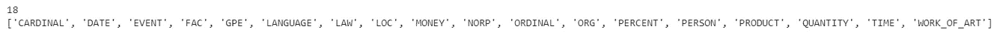
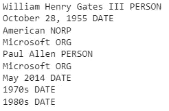
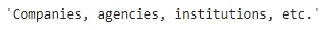
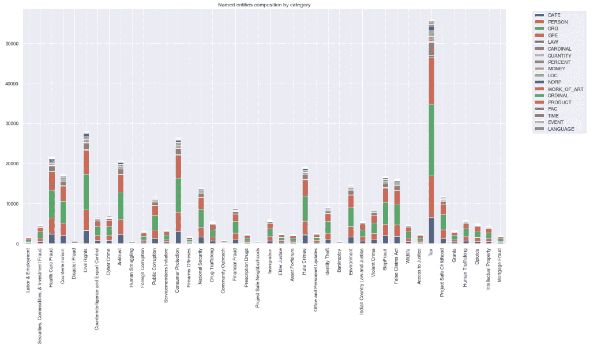
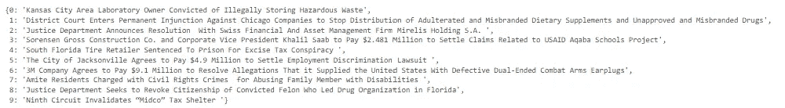
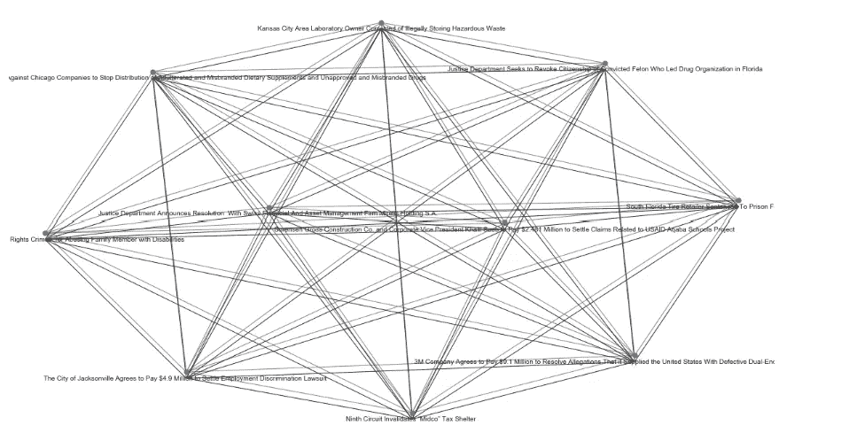

# 用 Python 实现司法判决的自然语言处理

> 原文：<https://towardsdatascience.com/natural-language-process-for-judicial-sentences-with-python-ed21d9be9ca9>


[https://pixabay.com/](https://pixabay.com/)

## 第 8 部分:命名实体和网络表示

正如我们在以前的文章中看到的，NLP 处理包含大量信息的大量文本数据。我们看到了许多降低复杂性和从数据中提取相关信息的技术，从最简单的[标记化/词汇化/词干化](/natural-language-process-for-judicial-sentences-with-python-102064f24372)到 [TF-IDF 分析](/natural-language-process-for-judicial-sentences-with-python-part-1-bdc01a4d7f04)和[单词/文档嵌入](/natural-language-process-for-judicial-sentences-with-python-bb60a6d3cc0b)。

分析这些文本数据的另一个重要方面是识别命名实体。

命名实体可以定义为具有适当标识的对象。例如，一个人是一个命名的实体，还有一个国家、一个组织等等。

为了从原始文本中提取命名实体，需要命名实体识别(NER)算法。NER 算法可以属于不同的类别，从监督学习模型(之前已经标记的实体之间的多类分类)到基于深度学习的方法再到统计模型。后者是我们将要使用的，因为它是 Python 库的 paCy 所使用的。

spaCy 的 NER 提供了 18 个命名实体，我们可以通过导入所需的库并列出这些实体来初步了解它们:

```
!pip install spacy
import spacy
from spacy import displacy

NER = spacy.load("en_core_web_sm")

ner_lst = NER.pipe_labels['ner']

print(len(ner_lst))
print(ner_lst)
```



让我们看一个带有原始文本的 NER 应用程序的例子(我使用了比尔盖茨的[维基百科](https://en.wikipedia.org/wiki/Bill_Gates)页面)。

```
raw_text="William Henry Gates III (born October 28, 1955) is an American business magnate and philanthropist. He is a co-founder of Microsoft, along with his late childhood friend Paul Allen. During his career at Microsoft, Gates held the positions of chairman, chief executive officer (CEO), president and chief software architect, while also being the largest individual shareholder until May 2014\. He was a major entrepreneur of the microcomputer revolution of the 1970s and 1980s."

text1= NER(raw_text)
for word in text1.ents:
    print(word.text,word.label_)
```



对于每个命名实体，我们还可以看到 spaCy 提供的定义。也就是说，让我们看看“组织”的定义。

```
spacy.explain("ORG")
```



最后，我们还可以使用 spaCy 特性中的一个有趣的视觉效果:

```
displacy.render(text1,style="ent",jupyter=True)
```


现在让我们跳到 NER 对我们的司法判决的分析。

## 命名实体

想看文章的词汇构成。由于“tax”类别是最常见的类别(正如我们在本系列的第 2 部分中发现的那样)，我将对该类别进行分析，但是同样的推理可以扩展到所有其余的类别。

```
#It might take a while, so skip this cell and the following one 
m = ['Tax' in df['category'][i] for i in range(len(df))]
df_tax = df[m]
df_tax = df_tax.reset_index(drop=True)
#df_tax.head()

tax_entities=[entity.label_ for i in range(len(df_tax)) for entity in nlp(df['Tokens'][i]).ents]
#saving results
with open('data/tax_entities.pkl', 'wb') as f:
    pickle.dump(tax_entities, f)
```

让我们初始化一个包含与命名实体相关的 NER 标签的字典。

```
#initializing a dictionary
counts = dict()
for i in tax_entities:
    counts[i] = counts.get(i, 0) + 1

d = dict()
for category in categories:
    m = [category in df['category'][i] for i in range(len(df))]
    tmp = df[m]
    tmp = tmp.reset_index(drop=True)
    entities=[entity.label_ for i in range(len(tmp)) for entity in nlp(df['Tokens'][i]).ents]
    counts = dict()
    for i in entities:
        counts[i] = counts.get(i, 0) + 1
    d[category]=counts

#saving results
import pickle
with open('data/named_entities_dict.pkl', 'wb') as f:
    pickle.dump(d, f)
```

最后，让我们将字典转换成熊猫数据框架并绘制结果:

```
#run this cell to download the result
import pickle

with open('data/tax_entities.pkl', 'rb') as f:
    tax_entities = pickle.load(f)
with open('data/named_entities_dict.pkl', 'rb') as f:
    d = pickle.load(f)
#plotting results
import pandas as pd
import matplotlib.pyplot as plt
df_dict = pd.DataFrame(d)
df_dict.T.plot(kind="bar", stacked=True, figsize=(20,10))
plt.title('Named entities composition by category')
plt.legend(bbox_to_anchor=(1.05, 1.0), loc='upper left')
plt.show() 
```



就命名实体而言，似乎所有类别都有类似的组成，最常见的是(每个类别)个人、组织和地缘政治实体。

多亏了 NER，

## 网络表示

我想在这部分做的最后一个视觉分析是用一个网络框架来表现我们的文本。

网络是表示跨单元动态关系的强大数学模型。在这种情况下，单元(或节点)将是文章，我想检查它们之间的相似性。为此，我将根据链接的节点(即文章)之间的相似性来加权每条边。为了有一个可解释的可视化，我将只使用整个数据集的前 10 篇文章。

```
tmp = df.head(10)
tokens = []
lemma = []
pos = []
parsed_doc = [] 
col_to_parse = 'text'
for doc in nlp.pipe(tmp[col_to_parse].astype('unicode').values, batch_size=50,
                        n_threads=3):
    if doc.is_parsed:
        parsed_doc.append(doc)
        tokens.append([n.text for n in doc])
        lemma.append([n.lemma_ for n in doc])
        pos.append([n.pos_ for n in doc])
    else:
        # We want to make sure that the lists of parsed results have the
        # same number of entries of the original Dataframe, so add some blanks in case the parse fails
        tokens.append(None)
        lemma.append(None)
        pos.append(None)

tmp['parsed_doc'] = parsed_doc
tmp['comment_tokens'] = tokens
tmp['comment_lemma'] = lemma
tmp['pos_pos'] = pos
```

现在让我们导入这个分析的主库， [NetworkX](https://networkx.org/) —一个 Python 包，用于创建和分析网络的结构和交互。

使用 NetworkX 提供的工具，我将为每个节点分配一个与其标题对应的标签:

```
import warnings
warnings.filterwarnings("ignore")
import networkx as nx
G = nx.Graph()
for i in range(10):
    G.add_node(i, text = tmp['parsed_doc'][i], title=tmp['titles'][i])
for i in range(len(tmp['parsed_doc'])):        # sure, it's inefficient, but it will do
    for j in range(len(tmp['parsed_doc'])):
        if i != j:
            if not (G.has_edge(i,j)):
                sim = tmp['parsed_doc'][i].similarity(tmp['parsed_doc'][j])
                G.add_edge(i, j, weight = sim)
labels = {}
for i in G.nodes():
    labels[i]=G.node[i]['title']

labels
```



现在让我们来看看结果:

```
plt.rcParams['figure.figsize'] = [16, 9]  # a better aspect ratio for labelled nodes
from math import sqrt
count = G.number_of_nodes()
equilibrium = 10 / sqrt(count)    # default for this is 1/sqrt(n), but this will 'blow out' the layout for better visibility
pos = nx.fruchterman_reingold_layout(G, k=equilibrium, iterations=300)
edgewidth = [d['weight'] for (u,v,d) in G.edges(data=True)] #weighting edges by the similarity of the nodes they link

nx.draw(G, pos, font_size=3, node_size=50, edge_color='gray', with_labels=False)
for p in pos:  # raise positions of the labels, relative to the nodes
    pos[p][1] -= 0.03
nx.draw_networkx_edges(G, pos, width=edgewidth)
nx.draw_networkx_labels(G,pos, font_size=10, font_color='k', labels = labels)

plt.show()
```



如果你想更深入地研究网络科学和背后的数学，我建议阅读我以前的文章[这里](https://medium.com/p/c306fc3860e0/edit)。

通过命名实体和网络分析，我们丰富了可以从原始文本中检索的信息。在下一篇文章中，我们将继续使用无监督学习技术，通过无监督情感分析，不仅检测文本的含义，还检测与每个句子相关的情绪或情感。

所以请继续关注第 9 部分！

## 参考

*   [NLTK::自然语言工具包](https://www.nltk.org/)
*   Python 中的 spaCy 工业级自然语言处理
*   [司法新闻| DOJ |司法部](https://www.justice.gov/news)
*   [司法部 2009-2018 年新闻发布| Kaggle](https://www.kaggle.com/datasets/jbencina/department-of-justice-20092018-press-releases)
*   [https://spacy.io/usage/linguistic-features#named-entities](https://spacy.io/usage/linguistic-features#named-entities)
*   [https://networkx.org/](https://networkx.org/)