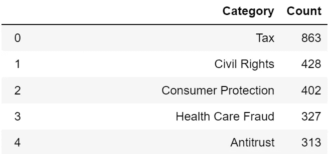
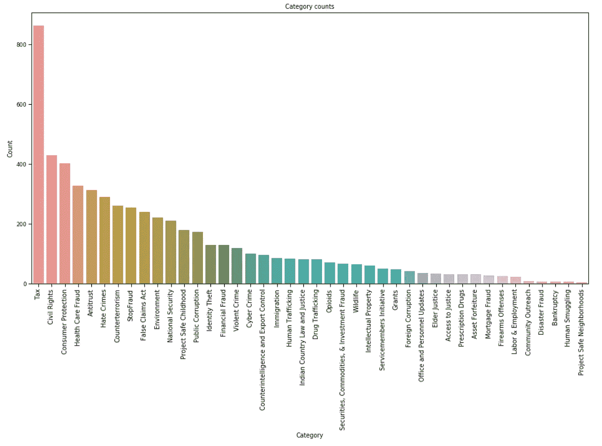
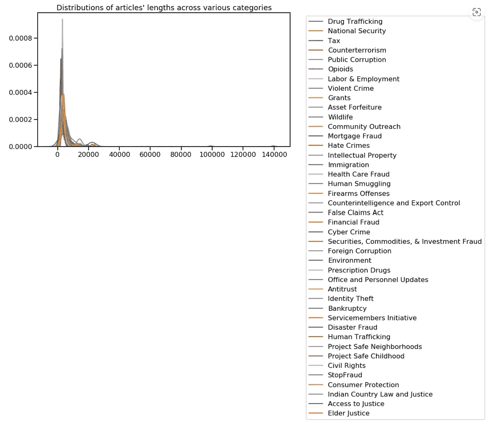
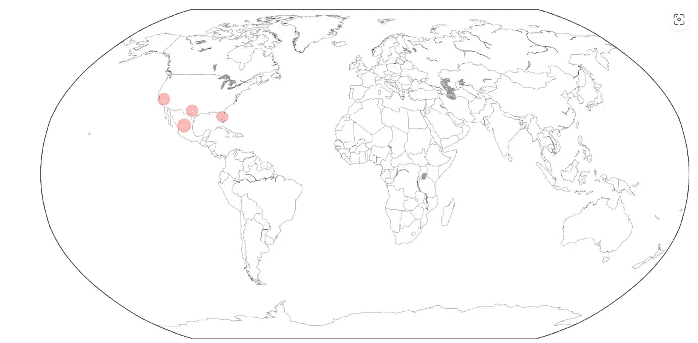
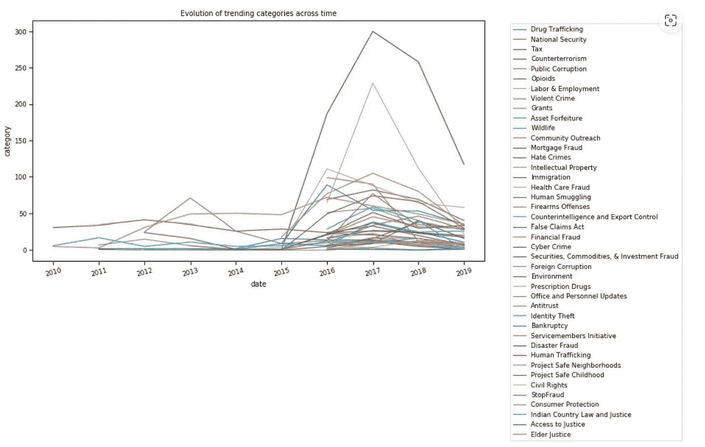

# 用 Python 实现司法判决的自然语言处理

> 原文：<https://towardsdatascience.com/natural-language-process-for-judicial-sentences-with-python-part-2-964b0e12dd4a>


[https://pixabay.com/](https://pixabay.com/)

## 第 2 部分:描述性统计

在这一系列文章中，我将对司法判决进行一系列的 NLP 分析，目的是解决两个研究问题:

*   如果您需要检索详细信息，拥有一个标签良好的知识库是至关重要的。新闻档案每天都在更新，手动标注每篇文章可能会非常耗时。我的问题是:有没有可能实现一个预测算法，自动将新文章分类到现有类别中？
*   能否推断出文章的情绪，并将其与所属的类别联系起来？为此，我将对我的文章进行无监督的情感分析，对于每个类别，显示有多少文章被归类为正面或负面。

在本系列的[第 1 部分](https://valentinaalto.medium.com/natural-language-process-for-judicial-sentences-with-python-part-1-bdc01a4d7f04)中，我们介绍了数据集和一些预处理活动，如标记化、词干化和词汇化。

现在让我们开始从我们的数据中获得一些有意义的见解和可视化表示。

## **类别的频率**

现在我感兴趣的是调查哪个是类别出现的频率。在预测任务中也需要这些信息:事实上，在测试预测模型时，有一个评估基准是很有用的，它可以被设置为最频繁的基线预测，也就是说，将最频繁的类别分配给所有记录作为标签。

让我们用类别频率创建一个熊猫数据框架:

```
#retrieving datadf = pd.read_pickle('data/df.pkl')
df=df.rename(columns={'topic':'category'})#creating a list of categories from the available ones
categories = list(set([i for  l in df['category'].to_list() for i in l]))#creating a df categories_list=[]
count_list=[]
for k in range(len(categories)):
    counter=0
    categories_list.append(categories[k])
    for i in range(len(df)):
        if categories[k] in df['category'][i]:
            counter+=1
    count_list.append(counter) 

counts = pd.DataFrame({"Category": categories_list, "Count": count_list}).sort_values(by = "Count", ascending = False).reset_index(drop=True)
counts.head(5)
```



```
import seaborn as sns
import matplotlib.pyplot as plt
sns.set_context("paper")fig, axis = plt.subplots(figsize = (16, 8))
sns.barplot(counts.Category, counts.Count, ax = axis)
axis.set_title("Category counts")for item in axis.get_xticklabels():
    item.set_rotation(90)
    item.set_fontsize(10)
    itemfig.show()
```



我们可以看到，到目前为止，最常见的类别是税收:它几乎是第二常见类别的两倍。

我最初想放弃那些少于 20 条记录的类别。然而，鉴于我分析的目标，我决定保留它们。事实上，我的最终目标是创建一个自动系统，能够在新文章插入数据库时对其进行标记，这样搜索它们就更容易了(在研究问题部分有更好的解释)。因此，我更喜欢保留所有已经提到的类别，由于数据库的不断输入，过一会儿记录会越来越多。

## 文章长度的分布

在这一节中，我分析了文章长度在类别中的分布。我很想知道是否有些类别会比其他类别导致更长的文章。

```
sns.set_context("talk")
fig, axis = plt.subplots(nrows = 1, ncols = 1, figsize = (11, 6))for category in categories_list:
    mask = [category in df['category'][i] for i in range(len(df))]
    x = [len(df[mask].reset_index(drop=True)['text'][i]) for i in range(len(df[mask]))]
    sns.distplot(x, label = category, hist = False, ax = axis)plt.legend(bbox_to_anchor=(1.05, 1.0), loc='upper left')
plt.title("Distributions of articles' lengths across various categories")
```



似乎所有的分布都趋向于在 3k 和 5k 字长之间达到它们的最大值，加上几乎所有的分布都非常窄。只有少数种类，如类足类动物，相对于其他种类，其分布范围要广得多。

## 地理分析

在这里，我将从文本中提取地缘政治实体，并查看哪些是美国“最热”的地区。我说的“热门”是指他们参与犯罪活动的次数。为了这个分析，我决定检查那些参与贩毒的人，但同样的推理适用于任何其他类别。

```
#let's create a list of geopolitical named entities. This will take a while. Skip to the next cell to directly download the results
import pickle
sites = [entity.text for i in range(len(df)) for entity in nlp(df['text'][i]).ents if (entity.label_=='GPE') & 
     ('Drug Trafficking' in df['category'][i]) & (entity.text!='U.S.')]with open("data/sites.txt", "wb") as fp:   #Pickling
    pickle.dump(sites, fp)#investigate most common locations
from collections import Counter
c = Counter(sites)
c.most_common(6)
```


注意:位置“美国”被解析为一个地理政治实体，但是为了本节的目的，我们应该只考虑单个州。

现在让我们绘制这些数据:

```
#downloading necessary packages
#! pip install --user basemap
import matplotlib.pyplot as plt
import numpy as np
from mpl_toolkits.basemap import Basemapimport os
#os.environ['PROJ_LIB'] = r"C:\Users\valen\Anaconda3\pkgs\proj4-5.2.0-ha925a31_1\Library\share"os.environ['PROJ_LIB'] = r"...\Anaconda3\pkgs\proj4-5.2.0-ha925a31_1\Library\share"plt.figure(figsize=(20,10))
m = Basemap(projection='robin',lon_0=0,resolution='c')
m.fillcontinents(color='white',lake_color='#85A6D9')
m.drawcoastlines(color='#6D5F47', linewidth=.4)
m.drawcountries(color='#6D5F47', linewidth=.4)#the following information have been seached on google, they are not present in the datasetlats = [23.634501,31, 36.778259,  27.994402]
lngs = [-102.552784,-100, -119.417931, -81.760254]
populations = [93,76, 75, 67]
x,y = m(lngs,lats)s_populations = [p*5 for p in populations]m.scatter(
    x,
    y,
    s=s_populations, #size
    c='red', #color
    marker='o', #symbol
    alpha=0.25, #transparency
    zorder = 2, #plotting order
    )
```



## 趋势类别随时间的演变

最后，在这一节中，我想考察一段时间内最常见的类别。为了做到这一点，我按年份汇总了我的数据集，并简单地计算了每个类别出现的次数。

```
sns.set_context("paper")
fig, axis = plt.subplots(nrows = 1, ncols = 1, figsize = (11, 6))for category in categories_list:
    mask = [category in df['category'][i] for i in range(len(df))]
    new_df=df[mask].reset_index(drop=True)
    gap_df=new_df.resample('Y', on='date').count()['category']

    sns.lineplot(x=gap_df.index, y=gap_df, label=category)

plt.xticks(rotation=15)
plt.legend(bbox_to_anchor=(1.05, 1.0), loc='upper left')
plt.title('Evolution of trending categories across time')
```



从上面的图表中我们可以看到一些标签是从某一年开始使用的。即民权或身份盗窃从 2016 年才开始使用。

显然，在 2015 年之前，最常见的标签(税)只有 1 条。

在下一篇文章中，我们将讨论 TF-IDF 分析:术语频率(TF)和逆文档频率(IDF)。

请继续关注第 3 部分！

# 参考

*   自然语言工具包
*   [Python 中的 spaCy 工业级自然语言处理](https://spacy.io/)
*   [司法新闻| DOJ |司法部](https://www.justice.gov/news)
*   [司法部 2009-2018 年新闻发布| Kaggle](https://www.kaggle.com/datasets/jbencina/department-of-justice-20092018-press-releases)
*   [https://creativecommons.org/publicdomain/zero/1.0/](https://creativecommons.org/publicdomain/zero/1.0/)