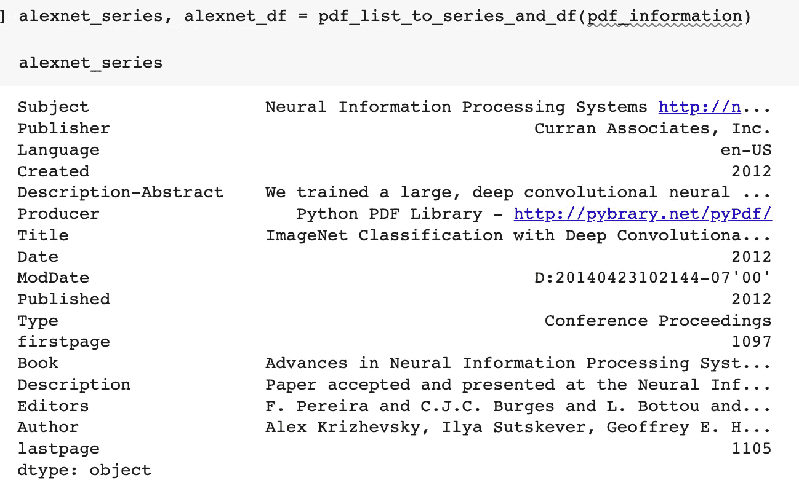
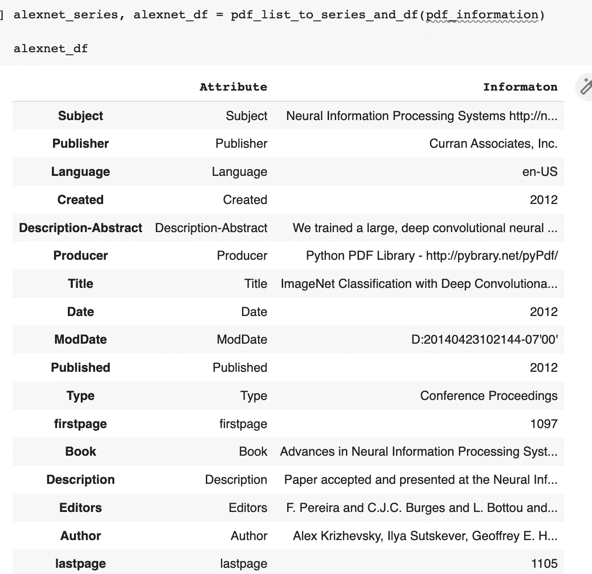
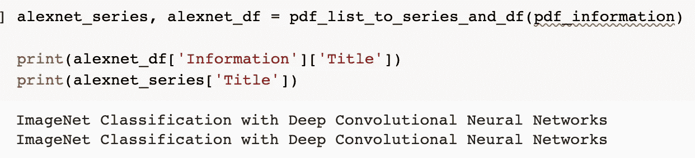

# 自然语言处理:获取概观的 PDF 处理功能

> 原文：<https://towardsdatascience.com/natural-language-processing-pdf-processing-function-for-obtaining-a-general-overview-6fa63e81fbf1>

今天，许多用于自然语言处理(NLP)的文档。pdf 格式。将 pdf 读入 Python，虽然不是极其困难，但也不是键入***PD . read _ pdf(' file _ name . pdf ')****那么简单。今天，我将为您提供代码，它不仅允许您将. pdf 文件读入 Python，还允许您创建一个函数，利用正则表达式来查找文档的元数据。*


照片由 [Dmitry Ratushny](https://unsplash.com/@ratushny?utm_source=medium&utm_medium=referral) 在 [Unsplash](https://unsplash.com?utm_source=medium&utm_medium=referral) 上拍摄

# Python 库: **PyPDF2**

今天将要讨论的主要 Python 库是 PyPDF2。你可以在这里找到 PyPDF2 [的文档。PyPDF2 是一个 Python 库，允许分析和操作。通过 Python 实现 pdf 格式文件。该库不仅可以从 PDF 中提取文本，还可以提取 PDf 的元数据，这是我们今天要探讨的功能。](http://omz-software.com/pythonista/docs/ios/PyPDF2.html)

# 建立

首先，您需要安装 PyPDF2

```
pip install PyPDF2
```

安装 PyPDF2 后，导入库。其他也需要导入的库有 **Pandas** 和 **re** 。

```
import PyPDF2
import pandas as pd
import re
```

接下来，下面的代码将把 PDF 从它的文件路径作为它的输入，并把它转换成 Python 中可读的形式。将所有这些代码放在一个函数中是非常容易的(我已经这样做了)，但是我决定将它打出来，逐行解释代码。对于以下所有代码，我使用了 Alex Krizhevsky、Ilya Sutskever 和 Geoffrey E. Hinton 的论文“使用深度卷积神经网络进行图像分类”(在这里找到论文)。

```
#First, create an opener which accepts a PDF file path
opener = open(pdf_file_path,'rb')
#Second, read the opened file
pdf_file_reader = PyPDF2.PdfReader(opener)
```

上面两行代码将允许你用 Python 打开和读取一个 pdf 文件，接下来让我们创建提取器函数！

**PDF 信息提取器功能**

这个函数的输入将是先前创建的 reader 对象。该函数接受转换后的 PDF，找到元数据，并输出一个字典，其中每个键都链接到某个元数据属性及其值，由**找到。PyPDF2 中的 documentInfo()** 方法。

```
def pdf_info(read_pdf):
    pdf_info_dict = {}
    pdf_info = {}
    for key,value in read_pdf.metadata.items():
      pdf_info_dict[re.sub('/',"",key)] = value
      return pdf_info_dict
```

使用正则表达式来移除与每个元数据属性相关联的“/”(例如“/Author”→“Author”)。接下来，让我们将列表转换为一个系列和一个数据框！**pdf _ to _ list _ series _ and _ df()**函数接受一个字典，并将返回该字典的一个序列和数据帧。

```
def pdf_list_to_series_and_df(pdf_info_dict):
    pdf_series = pd.Series(pdf_info_dict)

    key_list = []
    val_list = []
    for key, val in pdf_info_dict.items():
      key_list.append(key)
      val_list.append(val)
    pdf_df = pd.Series.to_frame(pdf_series)
    pdf_df = pd.DataFrame({"Attribute" : key_list, "Informaton" : val_list}, index=key_list)
    return pdf_series, pdf_df
```

使用 AlexNet pdf 运行上述代码产生了以下系列和数据帧:



图片:PDF 系列(图片来自作者)



图片:PDf 的数据框(图片来自作者)

另外，请注意我们无法完全看到标题。我们只需调用系列和数据框的“标题”属性，就会列出完整的标题。



图片:访问 PDF 的标题(图片来自作者)

就是这样！Today 提供了一种快速获取 PDF 元数据并将其转换为字典、系列和数据框的方法。这在您研究和使用 PDF 文档时非常有用。此外，如果您想为某人提供感兴趣的文档的一些快速背景信息，而不必浪费时间自己搜索细节，此功能将允许您有效地优化该任务。感谢阅读！

**如果你喜欢今天的阅读，请关注我，让我知道你是否还有其他想让我探讨的话题！另外，在**[**LinkedIn**](https://www.linkedin.com/in/benjamin-mccloskey-169975a8/)**上加我，或者随时联系！感谢阅读！**