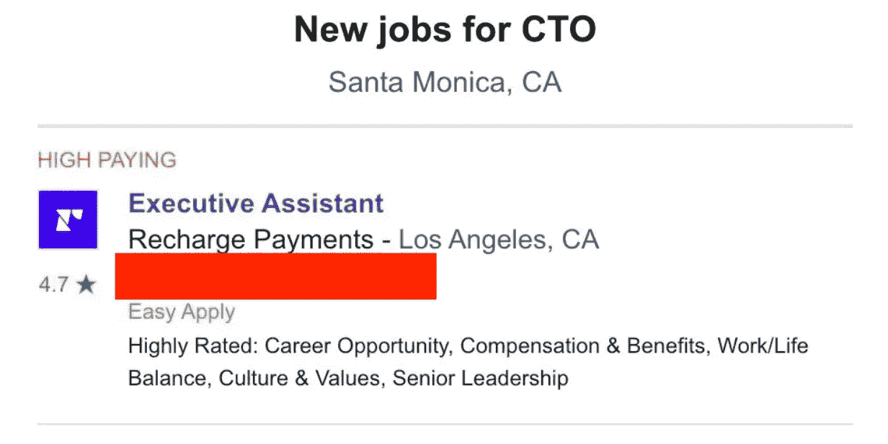
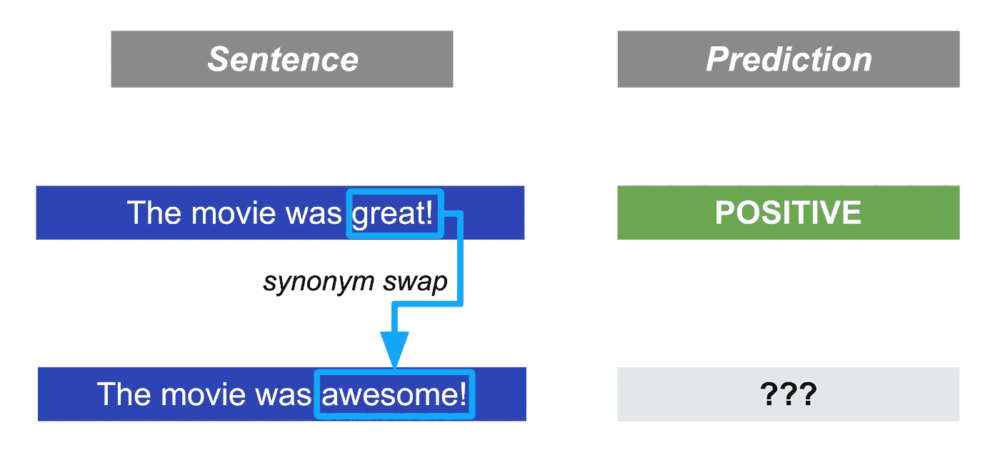
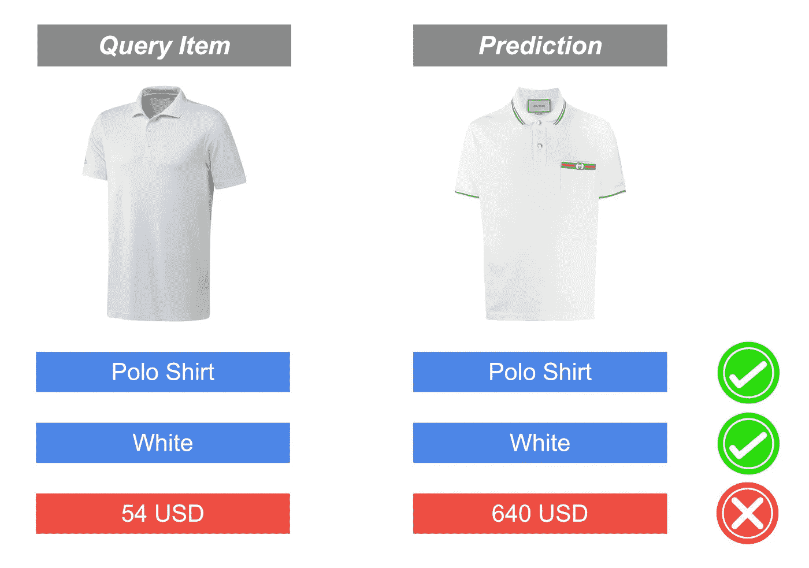
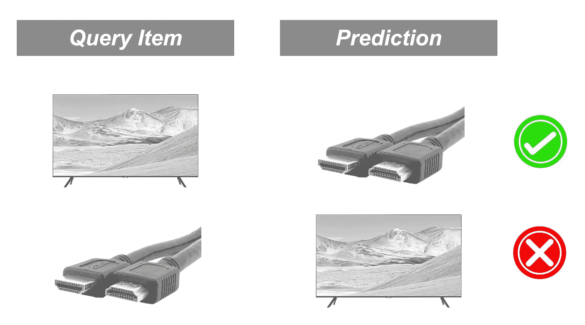
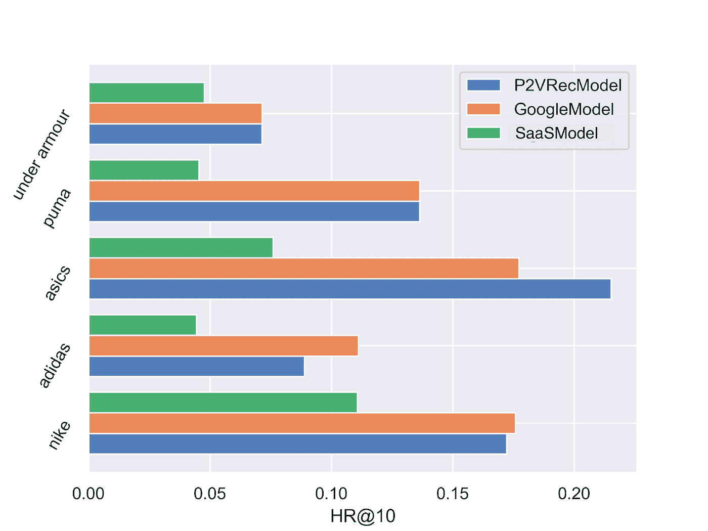
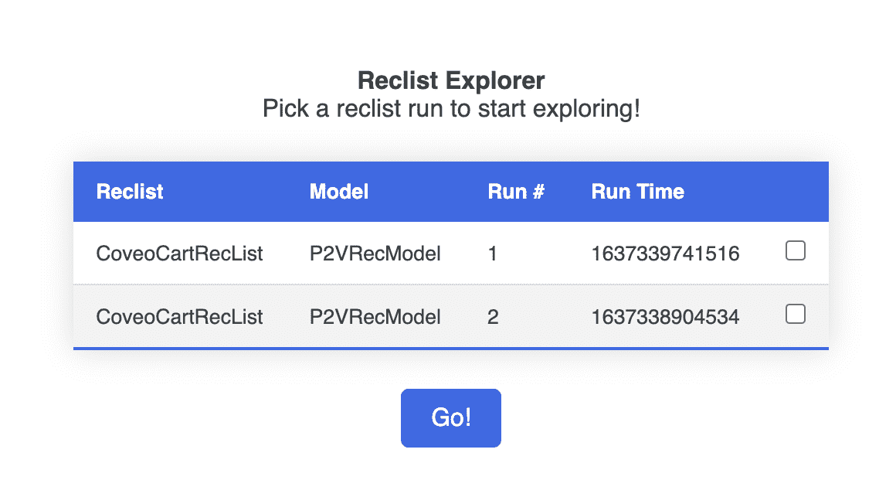

# NDCG 不是你需要的全部

> 原文：<https://towardsdatascience.com/ndcg-is-not-all-you-need-24eb6d2f1227>

## [行业笔记](https://towardsdatascience.com/tagged/notes-from-industry)

# **NDCG 不是你需要的全部**

## recSys 与 RecList 的行为测试

## **简介**

电子商务系统(RSs)就在我们身边，帮助我们在当代生活的选择悖论中导航:我应该听的下一首歌是什么？我应该看的下一部电影是什么？或者更微妙地说，我应该消费的下一条新闻是什么？

RSs 代表了最普遍的机器学习系统类型之一，以及它在使数十亿人的数字生活个性化方面的所有力量，*和*不断提醒我们作为用户、从业者和立法者的责任:通过鼓励你阅读一个关于好莱坞名人与气候变化的故事，我们使你更有可能花时间了解布拉德·皮特的生活，以及它所包含的一切。

> 因为即使是一个糟糕的预测也可能导致巨大的声誉损失或[侵蚀我们的信任](https://www.bbc.com/news/technology-59810383)，构建更健壮的 RSs 是一个重要的话题，如果我们不能更好地测试现有的系统，我们当然不会构建一个更健壮的系统。

不幸的是，RSs 往往会“无声无息地失败”，如下例所示，摘自 LinkedIn 上一篇关于奇点的帖子(虽然还没那么接近):

每个人都有自己的关于离线评估中没有发现的错误的恐怖故事。[截图来自作者的 LinkedIn feed ]

这意味着，在一个典型的周期中，一个 ML 系统用一些数据进行训练，通过一些准确性指标在一个保留的集合上进行基准测试，如果选择的 KPI 是可接受的，则在野外部署。由于这些系统本质上都是随机的——在许多情况下，是非常复杂的非线性对象——ML 和软件开发之间的直接类比就失效了:测试集的高准确性本身并不能防止像上面这样不合理的推论。

在*这篇*博文中，我们介绍了 RecList，这是一个新的开源库，用于在现实世界的推荐系统中扩展行为测试。虽然学术介绍以研究论文的形式提供，但我们希望在这里提供一个更实用的视角，面向现代 RSs 的所有利益相关者:ML 工程、产品经理，当然还有最终用户。

克隆[回购](https://github.com/jacopotagliabue/reclist)，系好安全带，请 Github 上一个明星支持我们！

## 什么是行为测试？

对人工智能进行“行为测试”的想法并不新鲜:正如 NLP 爱好者可能已经注意到的那样， **RecList** 正在向**清单**、[致敬，微软从 2020 年](https://arxiv.org/abs/2005.04118)开始领导建立 NLP 的行为测试。在传统测试中，我们有“逐点”估计(例如， [NDCG](https://en.wikipedia.org/wiki/Discounted_cumulative_gain) ，[平均倒数排名](https://en.wikipedia.org/wiki/Mean_reciprocal_rank))，它量化了一个保留数据集的泛化能力。相反，行为测试是输入-输出对:通过比较模型的输出和期望的结果来评估模型。例如，在[情感分析](https://en.wikipedia.org/wiki/Sentiment_analysis)中，我们希望在交换同义词时预测保持一致:

*如果一个模型预测第一次评论的积极情绪，我们通过检查当把“棒极了”换成“棒极了”时预测是否改变来测试它的稳健性。【图片由作者提供】*

在构建“你可能喜欢的相似事物”传送带时，我们希望产品在所有相关维度上都相似，因为向浏览低价 polos 的购物者推荐贵 10 倍的商品会导致次优体验:

*相似产品的推荐应该尊重用户在各个方面的意图。例如，在这种情况下，基于视觉特征的基于内容的推荐器可能会“无声无息地失败”。[图片由作者提供]*

*清单*的基本观点并不是“行为测试很酷”(咄！)，而是说:

*   行为测试可以以一种*黑盒*的方式运行，将测试从模型的内部工作中分离出来:因此我们可以在没有源代码的情况下比较模型，只要它们公开了一个标准的预测接口；
*   建立一对一的行为测试是昂贵的，但是我们可以通过结合领域知识、ML 技巧和可扩展库来帮助扩展它们。

如果你愿意，RecList 是一个“推荐系统的清单”。

## 隐士背后的原则

我们确定了三个特定于建议的关键原则来启发我们的图书馆:

***不变性质*** *:* 互补和相似项满足不同的逻辑关系。虽然相似的物品可以互换，但互补的物品可能有一个自然的顺序:向购买昂贵电视的购物者推荐 HDMI 电缆是一个好主意，但向购买电缆的人推荐电视是一个糟糕的主意。我们通过将预测与元数据相结合来操作这些见解:例如，我们可以使用价格和分类法来检查不对称约束。

*补充项目通常具有隐含的自然排序，这可能永远不会在标准的保留数据集上进行测试，只会在生产中变得明显。【图片来自作者等人的原论文】*

***不是所有的错误都一样糟糕*** *:* 如果一部电影推荐的地面真相项目是“[当哈利遇见莎莉](https://www.rottentomatoes.com/m/when_harry_met_sally)”，漫无目的的度量将无法区分一个暗示的模型[终结者](https://www.rottentomatoes.com/m/terminator)和一个提议的模型[你已经收到邮件](https://www.rottentomatoes.com/m/youve_got_mail)。换句话说，虽然两者都是“错误的”，但它们在同一方面都不是错误的:一个是合理的错误，另一个是可怕的建议，对用户体验具有相当大的破坏性。

*当根据“* [*【大病号*](https://www.rottentomatoes.com/m/the_big_sick) *”推荐前 3 部电影时，模特 A 和 B 的命中率相同，然而，旋转木马中的“错误”电影并没有提供相同的体验:A 的建议比 B 的建议差得多。[图片由作者提供]*

***并非所有的输入都是相同的*** *:* 如果我们关心的用户子集更快乐，我们可以容忍整体准确度的小幅下降；例如，如果我在营销活动中推广最新的耐克鞋，那么耐克产品页面上的购物体验应该特别有条理。由于商品消费通常是幂律，相对于高频商品的边际改善可能会产生 KPI 改善，为利基市场“隐藏”严重的退化:如果电影推荐者在漫威大片上变得更好，但对意大利用户来说变得很糟糕，我们*应该能够注意到，并进行相关测试，以做出有原则和明确的权衡*。除了一些横向用例(例如冷启动项目)，最有趣的片段通常是上下文相关的，这是我们图书馆的一个重要指导原则。

*即使蓝绿推荐人整体 HR 相当(见我们的* [*论文*](https://arxiv.org/abs/2111.09963) *)，在不同品牌上的表现也大相径庭。【图片来自作者等人的原论文】*

## 足够的话:隐士入门

一个*重新列表*——我们使用*斜体*来表示 Python 抽象，而不是作为一个整体的包——仅仅是测试的集合。任何继承了正确抽象的类都可以包含任意多的测试，通过 Pythonic 风格的 decorators 指定(让人想起 [Metaflow](https://metaflow.org/) 中的流)。例如，下面的类只有一个测试，一个来自我们库的例行程序，运行定量检查(覆盖率，受欢迎程度偏差等)。):

一个简单的 RecList，其中一个测试重用了提供的标准库。

由于行为测试通常会随着用例(补充建议不同于类似项目)和数据集而变化，因此 *RecList* 的一个实例会类似于 [CoveoCartRecList](https://github.com/jacopotagliabue/reclist/blob/7513afa1cdd084469264c852ac9082645e9daa10/reclist/reclist.py) ，即针对电子商务研究的 Coveo 数据集的补充建议的一组测试。

> 由于采用了模块化设计，开始使用新的列表非常快:该库附带了许多预制的测试，您可以将这些测试与任意代码混合使用以进行自定义检查，这使得一致地重用业务逻辑变得非常容易。

了解如何使用*隐士*的最简单方法是[浏览一个现成的例子](https://github.com/jacopotagliabue/reclist/blob/main/examples/coveo_complementary_rec.py)，或者在你的浏览器中运行[提供的 Colab 笔记本](https://colab.research.google.com/drive/1Wn5mm0csEkyWqmBBDxNBkfGR6CNfWeH-?usp=sharing):

运行一个现成的 RecList *为* [*电商推荐*](https://github.com/jacopotagliabue/reclist/blob/main/examples/coveo_complementary_rec.py) *(例子上* [*电影*](https://github.com/jacopotagliabue/reclist/blob/main/examples/movielens_similar_rec.py) *和* [*歌曲*](https://github.com/jacopotagliabue/reclist/blob/main/examples/spotify_session_rec.py) *也可用)*。

让我们来分解一下:

*   **第 1–3 行**包含从库中导入的内容
*   **第 8 行**正在获取 [Coveo 数据集](https://github.com/coveooss/SIGIR-ecom-data-challenge)。提示:您可以在这里用您的数据集交换您的私有数据。
*   **第 12–13 行**从库中实例化一个基线模型，并用训练分割对其进行训练。提示:您可以训练自己的模型(或者带一个预训练的模型)并在此处替换基线。只要你的模型围绕着 *RecModel* [抽象](https://github.com/jacopotagliabue/reclist/blob/main/reclist/abstractions.py)，下游的一切都会正常工作。
*   **第 17–20 行**实例化 *RecList* ，在这种情况下，这是一个为该数据集和用例设计的现成列表。正如所料，该类将目标数据集和要测试的模型作为输入。提示:您可以在这里指定您自己的测试集合。
*   **22 线**运行行为测试。

就是这样！挑选和组合像乐高积木一样的抽象概念——无论是重复使用组件还是自己创造新的积木——都有无限的可能性:

*   挑选一个用例(类似的产品，互补的，等等。);
*   挑选一个数据集；
*   训练一个模型；
*   建造/修改/选择一个*隐士:*

*Reclist 的逻辑流程。在每一步中，你可以选择一个现成的组件，从头开始创建自己的组件，或者修改现有的组件。【图片由作者提供】*

当您运行任何 *RecList* 时，库会将结果转储到一个版本化的本地文件夹中；还提供了一个小型 web 应用程序来可视化和比较运行情况:

*一个小烧瓶应用程序使结果更易于阅读:查看*[*repo*](https://github.com/jacopotagliabue/reclist)*了解详情。[图片由作者提供]*

## **我应该如何使用 RecList？**

虽然我们开发RecList 是出于将 RSs 扩展到许多行业的数百个组织所涉及的非常实际的需要，但我们也相信这种方法可以广泛应用于错误分析和新研究模型的全面评估。特别是，我们鼓励您思考两个主要的使用案例:

1.  作为研究的实验工具:在开发一个新模型时，你可能想将它与定量的和*行为的*基线进行比较，以更好地了解错误模式及其相对优势和劣势。Reclist 允许你轻松地做到这一点，并带有现成的流行研究数据集的连接器；
2.  作为生产的 CI/CD 检查:在训练一个模型之后，您通常在一个测试集上运行一个定量的基准，以确保在部署之前达到一定的准确性水平。使用 RecList，您还可以用行为测试来补充您的管道，并决定当结果与预期不符时，应该发出哪个标志/做什么。

RecList 是一个免费的库，我们希望在今年对其进行扩展和改进:我们的 *alpha* 版本已经支持常见用例的即插即用测试，但我们正在积极寻找反馈、采用和新的贡献者(请参见最后的帮助部分！);这也意味着:在我们迭代的时候，API 仍然很不稳定，但是我们有希望很快发布一个测试版。

> 我们认为，随着我们对推荐系统的理解的提高，行为测试需要不断发展，它们的局限性、能力和范围也会发生变化。

通过开源 RecList，我们希望帮助该领域超越“排行榜追逐”，并为从业者提供更好的分析、调试和决策工具。

## 你能帮上什么忙？

如果你喜欢这个帖子，请考虑帮忙！怎么会？一些想法，按努力的升序排列:

*   *1 分钟:*给 Github 上的[隐士加一颗星支持我们！](https://github.com/jacopotagliabue/reclist)
*   *1 小时:*阅读[论文](https://arxiv.org/abs/2111.09963)，自述，运行教程:你能给我们什么反馈？
*   *1 周:*与您的团队讨论:您将如何在您的公司使用它？您可以用它运行什么 POC？
*   *更多*:积极为项目做贡献:取得联系！

## **奖励:在社区内发展**

虽然我们非常精通[产业与学术界的合作](https://research.coveo.com/)，但《隐士是我们第一部来源于社区的学术作品。阿尔法版本是由五个人带着爱带给你的——T4·帕特里克、[费德里科](https://www.linkedin.com/in/federico-bianchi-3b7998121/)、[克洛伊](https://www.linkedin.com/in/chloe-he//)、[布莱恩](https://www.linkedin.com/in/briankosw/)和[我自己](https://www.linkedin.com/in/jacopotagliabue/)——在五个城市——蒙特利尔、米兰、旧金山、首尔、纽约——跨越四个时区。在作者之间总共 5(5–1)/2 =**10**个可能的面对面匹配中，只有 1 个实际发生过(如果你能猜出是哪一个，你将赢得一个免费版本的 RecList！).

虽然现在说这种模式对我们团队的未来会有多成功还为时过早，但我们的“[扩展思维](https://en.wikipedia.org/wiki/Extended_mind_thesis)”开发到目前为止已经超出了我们的预期。

## **致谢**

我们要感谢 Andrea Polonioli、Ciro Greco 和 Jean-Francis Roy(以及其他许多人)对这个项目的一贯支持。此外，感谢 Matthew Tamsett、Jonathan Davies、Kevin No 对本作品初稿的详细反馈。

最后但同样重要的是，感谢[芯片](https://huyenchip.com/)，因为它创造了惊人的不和谐，启动了隐士社区。