# 最近邻是 KNN、光学、DBSCAN、HDBSCAN 和 SMOTE 的基础

> 原文：<https://towardsdatascience.com/nearest-neighbors-is-the-foundation-for-knn-optics-dbscan-hdbscan-smote-eeb10ea956e9>

## 最近邻之旅及其衍生算法

Frogly Neighbors，(蛙趣屋居民)，Alexas_Fotos， [Pixabay](https://pixabay.com/photos/frogs-fun-house-residents-1382827/) 。

有各种算法是建立在其他算法的基础上的。下面的文章关注最近邻(NN ),其他模型在其概念或代码的基础上利用和创新了它。

## 无监督的最近邻居

让我们从基础模型开始，即在 Scikit 中实现的[无监督最近邻](https://scikit-learn.org/stable/modules/generated/sklearn.neighbors.NearestNeighbors.html)。此算法用于判断训练数据中的实例是否与您要测量的点 k 最近。它是用于计算神经网络的不同算法的接口，如 BallTree、KDTree。如下图所示，它继承了 KNeighborsMixin、RadiusNeighborsMixin、NeighborsBase。

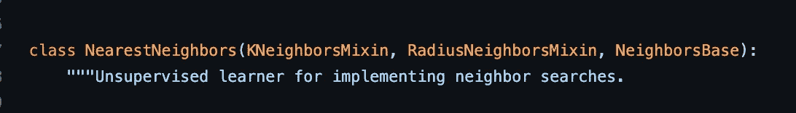

邻居分类器类实现。

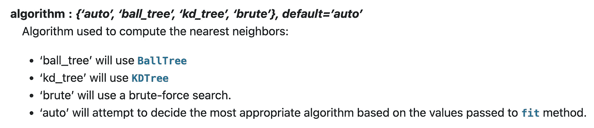

最近邻的“算法”参数。

## k-最近邻

继续使用每个数据科学家都会遇到的用于分类的 [K 个最近邻](https://scikit-learn.org/stable/modules/generated/sklearn.neighbors.KNeighborsClassifier.html)，并使用上述方法，根据其 K 个近邻来确定一个未见过的样本是否属于某个类别。

如下面的[代码](https://github.com/scikit-learn/scikit-learn/blob/baf828ca1/sklearn/neighbors/_classification.py)所示，KNN 继承了相同的基类“KNeighborsMixin，&radiusboresmixin”，但是顺序不同；在文档中，它在内部使用了 fit()的 NeighborsMixin 和 predict()的 neighborsmixin 实现。

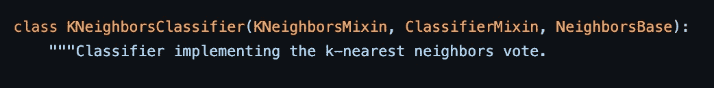

KNeighborsClassifier 类的实现，KNN，Scikit-learn。

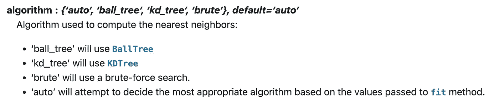

KNN 的“算法”参数。

## 基于密度的噪声应用空间聚类

继续讨论 [DBSCAN](https://scikit-learn.org/stable/modules/generated/sklearn.cluster.DBSCAN.html) ，这是一种基于密度的聚类算法。简单来说，DBSCAN 寻找高密度样本的集群。我们可以在这里找到 DBSCAN 的代码[，在文档中已经可以看到 DBSCAN 的内部算法指向了 NN 模块。](https://github.com/scikit-learn/scikit-learn/blob/baf828ca1/sklearn/cluster/_dbscan.py#L164)

深入挖掘，我们看到 DBSCAN 的[代码](https://github.com/scikit-learn/scikit-learn/blob/baf828ca1/sklearn/cluster/_dbscan.py#L364)在内部使用了‘nearest neighbors’模块，如下面快照中的 DBSCAN 的 fit()函数代码和文档所示。

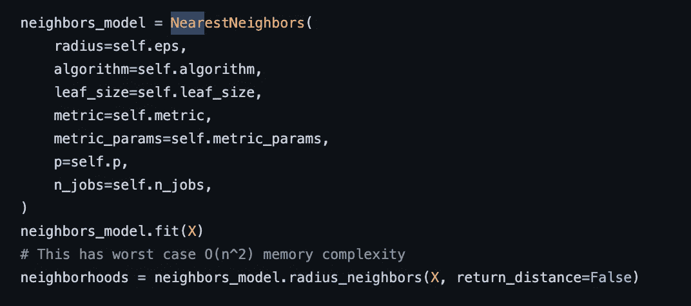

最近邻用法，DBSCAN，Scikit-learn。

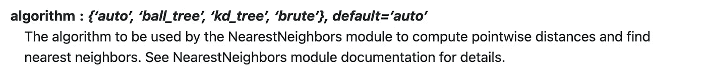

DBSCAN 的“算法”参数。

## 光学

[Optics](https://scikit-learn.org/stable/modules/generated/sklearn.cluster.OPTICS.html) 与 DBSCAN 密切相关，同样，它发现高密度区域并从中扩展集群，但是，它使用基于半径的集群层次结构，Scikit 建议在更大的数据集上使用它。这种光学实现在所有点上使用 k-最近邻搜索

在报告内部，我们看到 Optics 的代码在内部依赖于“最近邻居”模块及其算法，如 Optics compute_optics_graph()函数[代码](https://github.com/scikit-learn/scikit-learn/blob/baf828ca1/sklearn/cluster/_optics.py#L516)和下面的文档快照所示。

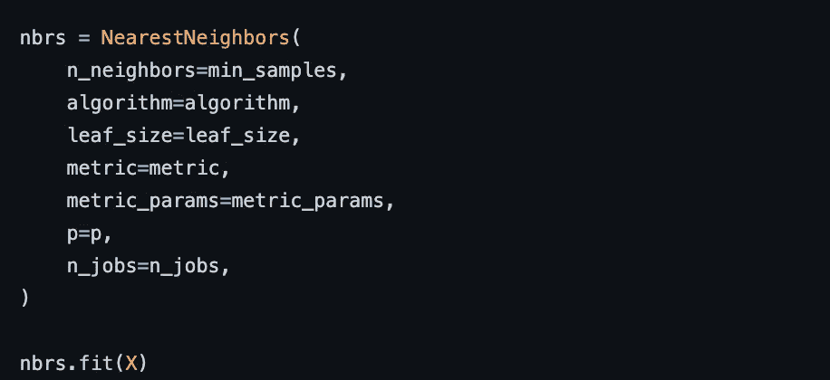

最近邻用法，compute_optics_graph()，optics，Scikit-learn。

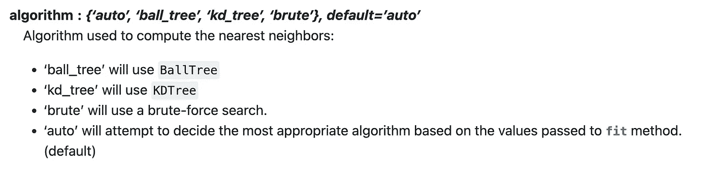

光学“算法”参数。

## HDBSCAN

[HDBSCAN](https://hdbscan.readthedocs.io/en/latest/how_hdbscan_works.html) 通过将 DBSCAN 转换为层次聚类算法来扩展它，然后在其上使用平面聚类提取。

我们可以在 [API 引用](https://hdbscan.readthedocs.io/en/latest/api.html)和[代码](https://github.com/scikit-learn-contrib/hdbscan/blob/18f116995e38aae2ca26b0fef8c27cff5ed66a78/hdbscan/robust_single_linkage_.py#L70)中看到一些指向 KNN 的线索

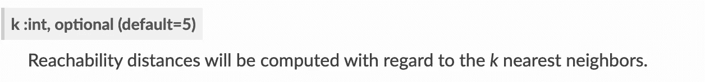

***类中的 K 参数*** `**hdbscan.robust_single_linkage_.RobustSingleLinkage()**`

深入到代码中我们可以看到，在下面的代码中，函数 _rsl_prims_balltree 实际上是基于 balltree 的，而 _rsl_prims_kdtree 是基于 kdtree 的，它们是 Scikit-learn 中用来计算 NN 的算法。

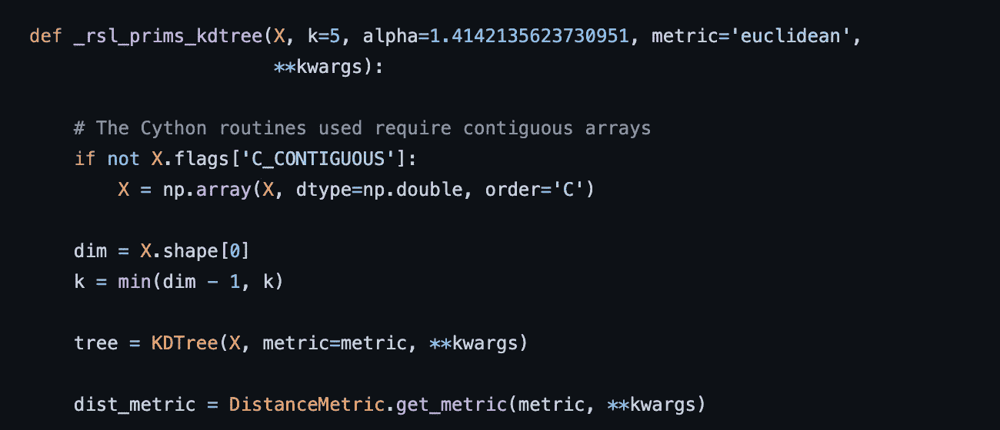

KDTree，prims_balltree，HDBSCAN

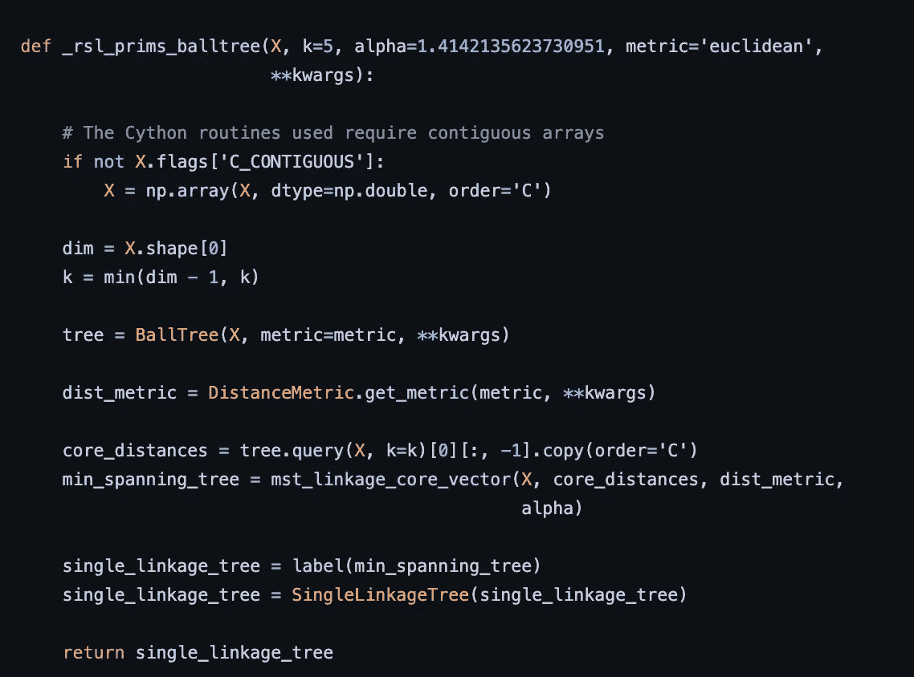

BallTree，prims_balltree，HDBSCAN

## 重击

合成少数过采样算法(SMOTE)的不平衡学习[实现](https://imbalanced-learn.org/stable/references/generated/imblearn.over_sampling.SMOTE.html)，它不直接使用 Scikit-learn NN 类实现，但使用 NN 概念。我们可以浏览一下代码和文档，立即发现 generate_samples() [函数](https://github.com/scikit-learn-contrib/imbalanced-learn/blob/ef4edde/imblearn/over_sampling/_smote/base.py#L56)中的 k_neighbors 参数。

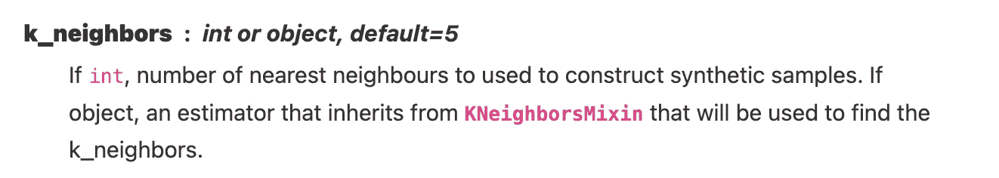

k_neighbors 参数，SMOTE，不平衡-学习。

## 摘要

最近邻算法，由 [Evelyn Fix](https://en.wikipedia.org/wiki/Evelyn_Fix) ， [Joseph Hodges](https://en.wikipedia.org/wiki/Joseph_Lawson_Hodges_Jr.) et 开发。艾尔。在 1951 年，后来由 Thomas Cover 在 1967 年扩展，对上述所有实现都至关重要。我们还可以看到，Scikit-learn 的各种算法实现从头到尾都在重用这些代码，而且其他各种包也使用了 NN 算法，以便为我们带来更高级的模型。

我真诚地希望这篇综述能让你理解所有这些算法之间的联系和关系，希望能帮助你用众多的算法方法解决更多的问题。

[1]修复，伊芙琳；约瑟夫·霍奇斯(1951)。[歧视性分析。非参数判别:一致性性质](https://apps.dtic.mil/dtic/tr/fulltext/u2/a800276.pdf) (PDF)(报告)。德克萨斯州伦道夫机场美国空军航空医学院。

[2] [盖，托马斯·m .](https://en.wikipedia.org/wiki/Thomas_M._Cover)；彼得·哈特(1967)。[“最近邻模式分类”](http://ssg.mit.edu/cal/abs/2000_spring/np_dens/classification/cover67.pdf) (PDF)。 *IEEE 汇刊于*

Ori Cohen 博士拥有计算机科学博士学位，主要研究机器学习。他是 [ML & DL 纲要](https://book.mlcompendium.com/)和[StateOfMLOps.com](http://www.stateofmlops.com)的作者，对 AIOps & MLOps 领域很感兴趣。他是 Justt.ai 的数据科学高级总监。