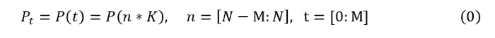
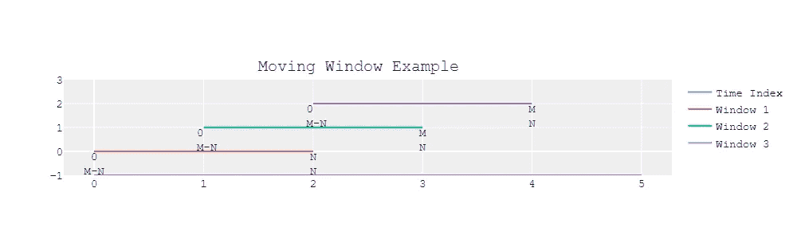
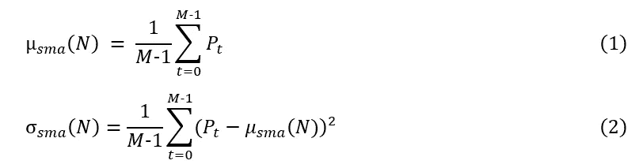
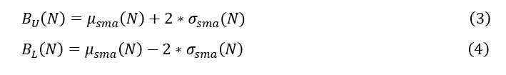
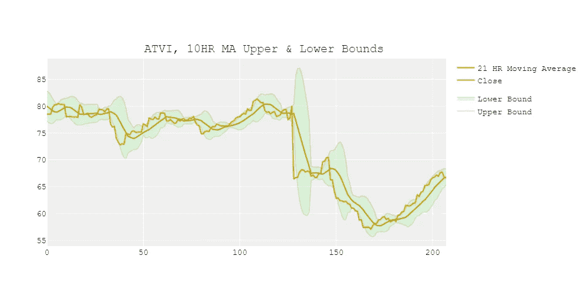
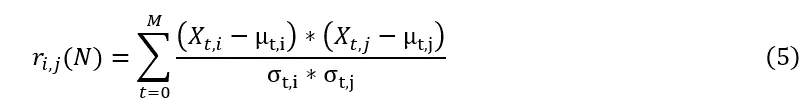
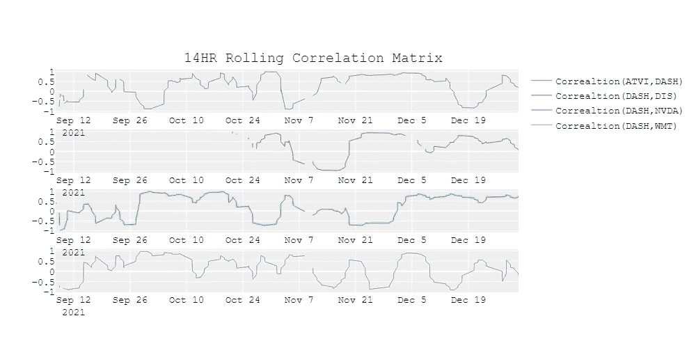
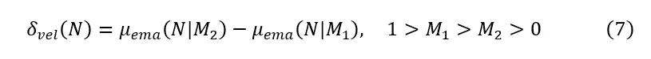
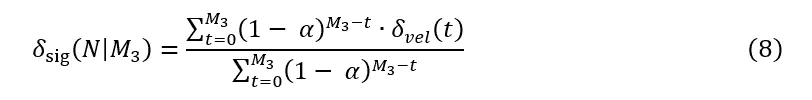
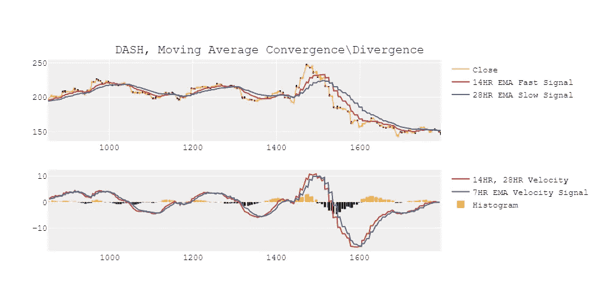

# 具有核心 PySpark 的时序聚合

> 原文：<https://towardsdatascience.com/neat-time-series-aggregations-with-core-pyspark-4a739953076a>

## 使用核心 PySpark 的移动窗口聚合策略和使用 Plotly 的可视化

[https://media . springer nature . com/lw 660/springer-CMS/rest/v1/img/19125576/v3/4 by 3？as=jpg](https://media.springernature.com/lw660/springer-cms/rest/v1/img/19125576/v3/4by3?as=jpg)

有**吨*的时间序列指标，其中许多指标有相同的预处理步骤和用例。为了限制冗余，我将关注三个不同用例的简洁指标:*

*   ***使用滚动 Z 值检测异常值***
*   ***滚动相关矩阵***
*   ***指数移动平均线趋势检测***

*在第一部分中，给出了滚动窗口和采样周期的定义。这些公式为如何开始创建这些移动窗口度量提供了有用的上下文。也可以随意跳到情节和代码:)*

*正如所有与数据有关的事情一样，有不止一种方式来*烘焙您的数据*。这里有一点关于我的背景和编程风格:我来自一个使用大量 SQL 的工作环境，我的聚合策略反映了这一点。因此，我没有使用 PySpark 表达式或内置库，也就是说，如果没有它们我也能完成任务。*

*本文中的代码在本地 PySpark 环境中进行了测试，并连接到 S3 数据源。[这里](https://rohankotwani.medium.com/connecting-local-spark-to-a-s3-parquet-data-source-92bc89a3a505)是一篇关于如何在 Windows 10 上设置这个测试环境的简短教程文章。*

*所有的方程式、图表和图形都是我创造的。所有的绘图代码都可以在这里找到[。我在所有的情节中使用了 Plotly。](https://gist.github.com/freedomtowin/6f1ff6cbf2a76d08d8cb90685ec9075f)*

# *移动窗口和采样周期*

*时间序列指标通常受某个时间窗口的限制。可以有不同的粒度或采样周期来计算度量，即 10 分钟、1 小时、1 天等。我将使用的描述本文剩余部分中的度量的语法显示在等式(0)中。*

**

*P: (1xM)矩阵
K:采样周期(10 分钟、1 小时等)
M:回顾窗口的大小
N:跨时间序列的当前整数索引
n:跨时间序列的整数索引
t:时间段内的整数索引*

*例如，如果采样周期(K)为 10 分钟:*

> **t=0，n=1，1 * K = 10 分钟
> t=1，n=2，2 * K = 20 分钟
> t=2，n=3，3 * K = 30 分钟**

**

*[https://gist . github . com/freedomtowin/6 f1 ff 6 CBF 2 a 76d 08d 8 CB 90685 EC 9075 f](https://gist.github.com/freedomtowin/6f1ff6cbf2a76d08d8cb90685ec9075f)*

*时间块 *t* 代表一个大小为 m 的时间窗口。在聚合每个时间窗口后，时间索引 N 递增 1。度量在 *t* 上聚合，*N 跟踪每个窗口的全局时间索引。**

# *使用滚动 Z 分数的异常值检测*

*滚动 z 分数阈值可用于检测时间序列中的大跳跃或间隙。这有许多潜在的应用，例如，为大的异常值创建警报系统。*

*z 分数或标准分数表示平均值的标准偏差数。如果你是统计学新手，你可以在这里阅读更多关于这个指标的信息[。这个指标可以被认为是移动平均线附近的一个置信区间。](https://en.wikipedia.org/wiki/Standard_score)*

*将需要简单移动平均和简单移动标准差来创建 z 得分，分别如下面的等式(1)和(2)所示。*

**

*上面的公式显示了这两个指标是如何在 M-1 大小的滚动窗口 t 的时间步长 N 上定义的。最后一个时间步长 M 从聚合时间窗口中排除，因为目标是将当前时间序列值与前一个窗口的平均值和标准差进行比较。如果将当前时间步长包括在内，标准偏差可能会大大增加，该指标将无法检测时间序列中的大变化。*

*在我们执行这些滚动窗口计算之后，可以计算 z 得分上限和下限，分别如等式(3)和(4)所示。*

**

*在这些等式中，z 得分上限和下限分别设置为平均值上下的两个标准差。假设正态分布，[经验法则](https://www.investopedia.com/terms/e/empirical-rule.asp#:~:text=The%20Empirical%20Rule%20states%20that,standard%20deviations%20from%20the%20mean.)表明我们期望 99.7%的数据在标准偏差范围内。*

*下图显示了 ATVI 每小时股价的 10 小时移动平均线的 z 值上限和下限。*

**

*[https://gist . github . com/freedomtowin/6 f1 ff 6 CBF 2 a 76d 08d 8 CB 90685 EC 9075 f](https://gist.github.com/freedomtowin/6f1ff6cbf2a76d08d8cb90685ec9075f)*

*阴影绿色区域表示移动平均线周围的置信区间，黄线表示时间序列，绿线表示时间序列的移动平均线。在某一点上，在置信区间之外有一个急剧的下降，这表明有一个大的异常值。标准偏差随后在 N=130 左右大幅增加。在时间序列跨越置信区间的点上，变化不是很显著。对于这个特定的时间序列，可以使用更大的 z 分数阈值。*

> *注意:数据集经过预处理，包含工作日上午 9 点到下午 4 点之间的每小时数据。为了便于绘图，这些值是相对于指数而不是时间绘制的。这消除了图中的一些不连续性。*

## *PySpark 代码:*

*首先，创建一个分级索引来执行自连接，以便为每个时间序列(即股票符号)获得一个按时间排序的历史窗口。然后，对于视图(a)中的每个值，在视图(b)中聚合移动平均值和移动标准偏差。从这些度量中，可以计算出 z 得分阈值的上限和下限。*

# *滚动相关矩阵*

*滚动相关矩阵有助于将相关的时间序列组合在一起，帮助找到不同的、不相关的时间序列，或者检测相关模式的变化。我对你的挑战是在不使用内置 PySpark 函数的情况下创建这个；)*

*归一化协方差，或[皮尔逊相关系数](https://en.wikipedia.org/wiki/Pearson_correlation_coefficient)，描述了两个变量之间的相关性。该指标限制在-1 和 1 之间，这是在时间序列对之间比较该指标时的一个有用属性。我们可以通过滚动时间窗口计算这种相关性。*

*滚动相关性也可以用指数移动平均函数来平滑。平滑滚动相关的另一个术语是“实现的相关”*

**

*其中， *r* 是我们的时间序列数据集中 I 列和 j 列的相关性，μ是简单移动平均值，σ是简单移动标准差。*

*我将使用我可靠的股票数据集来绘制 DoorDash 的小时股价与其他股票(如 ATVI、DIS、NVDA 和 WMT)的滚动相关性。*

**

*[https://gist . github . com/freedomtowin/6 f1 ff 6 CBF 2 a 76d 08d 8 CB 90685 EC 9075 f](https://gist.github.com/freedomtowin/6f1ff6cbf2a76d08d8cb90685ec9075f)*

*与其他时间序列相比，DASH 和 NVDA 之间的相关性在更长的时间段内似乎是一致的。同时持有这两只股票可能会增加投资组合的风险。*

*注意:在上图中，当任一时间序列缺少当前时间步长 n 的数据时，就会出现缺失数据点。例如，DIS 缺少 2021 年 8 月至 2021 年 11 月之间的数据。但是，关联窗口将跳过空值，过去 14 小时没有丢失的值将用于聚合。*

## *PySpark 代码:*

*第一步是计算数据透视表，按时间分区，按时间序列 id、股票代码分组。该数据透视表采用时间序列的平均值， *close* ，但是由于数据集被预处理为每小时一个值，因此最小值、最大值、第一个值或最后一个值也可以作为聚合。*

> *对于每对时间序列，在计算滚动相关性之前，将删除任一时间序列中具有空值的行*

*下一步是创建不重复的时间序列对或组合。从每个组合中删除具有空值的行。最后，我们需要计算每对时间序列之间的相关性。幸运的是，PySpark 中有一个内置函数可以计算两列之间的相关性。滚动相关性然后被左连接回数据透视表。*

# *使用指数移动平均线进行趋势检测*

*差分指数移动平均线可用于检测时间序列的*速度*或趋势。这种方法可以在差分时间序列上第二次应用，以检测*加速度*，或趋势的变化率。*

*指数移动平均线(EMA)可以看作是一个过滤器，它更重视聚合窗口内的最新值。EMA 有两个主要参数，即 *alpha* 衰减率和窗口大小。时间窗口越大或者 alpha 越低，均线移动的越慢。换句话说，移动平均将比实际时间序列落后更多。*

*本节使用的趋势检测方法通常称为 [MACD](https://en.wikipedia.org/wiki/MACD) 。然而，我将用新的，在我看来更容易理解的术语来解释这个算法。*

> *通常，α通常被选择为等于 2/(1+M)，其中 M 是窗口大小。α的这个值对应于平均加权影响，或“质心”，对应于简单移动平均(SMA)的回顾窗口的中心。换句话说，对于高度自相关的信号(比如股票价格)，均线会落后于实际价格大约一半的时间。详情请见[Robert Nau 的预测笔记](https://people.duke.edu/~rnau/Notes_on_forecasting_with_moving_averages--Robert_Nau.pdf)。*

*据我所知和谷歌搜索，如果不使用用户定义的函数或 UDF，在 PySpark 中实现递归方法(如 EMAs)是不可能的。幸运的是，有一个扩展的级数表示，可以用来计算核心 PySpark 中的 EMAs。等式(6)以扩展的符号显示了指数移动平均公式(EMA)。*

**

*通过取快速移动(时间窗较短)和慢速移动(时间窗较长)的均线之差，可以估算出*趋势*。直观上，这可以被认为是最近价格和以前价格之间的斜率或离散导数。这些均线之间的差异可以称为趋势的*速度*。*

**

*趋势变化的速度也可以用 1)T4 速度(T5)和 2)均线(T8)来估计。*

**

**信号*和*速度*之差可以认为是趋势*的*加速度*。*速度和信号之间的收敛代表趋势方向的反转。这种背离代表着一种越来越强的趋势。*

**

*[https://gist . github . com/freedomtowin/6 f1 ff 6 CBF 2 a 76d 08d 8 CB 90685 EC 9075 f](https://gist.github.com/freedomtowin/6f1ff6cbf2a76d08d8cb90685ec9075f)*

*顶部的图显示了时间序列(黄色)、慢速均线(蓝色)和快速均线(红色)。底部曲线显示了*加速度*(直方图)、趋势*速度*(红色)和信号(蓝色)。该图显示了短时间间隔内趋势的一致性。简单地说，可以设置*加速度*的某个*安全*阈值来检测强烈的上升和下降。*

*注意:这个图看起来有点起伏，因为我选择 K=3 作为采样周期。*

## *PySpark 代码:*

*创建了一个单独的函数来计算大小为 m 的特定窗口的 EMA。在该函数中，创建了一个分级指数来执行自连接，以便为每个分区(即股票符号)获得按时间排序的历史窗口。历史窗口的指数和当前指数之间的差异用于为 EMA 公式的扩展序列表示创建 alpha 权重，如等式 8 所示。最后，对于视图(a)中的每个值，汇总视图(b)中的 EMA。*

*我们可以用均线函数来计算快速移动的均线，慢速移动的均线，快慢均线之差(速度)，以及速度的均线(信号)。*

# *结论*

*简而言之，本文展示了我如何在 PySpark 和 SQL 中聚合时间序列。我知道时间序列窗口和方程的正式定义使得这篇文章更难阅读。不过我喜欢彻底:)我也，大概，本来可以把这篇文章分成三篇。不过，希望 PySpark 和 Plotly 代码对一些新的数据科学家/工程师有用。*

*以下是一些您可以尝试的数据挑战:*

1.  *在异常值检测算法中，使用指数移动平均代替简单移动平均。*
2.  *编写自己的相关函数，而不是使用内置的 PySpark 相关函数。探索实施类似的指标，例如，[协整](https://en.wikipedia.org/wiki/Cointegration#:~:text=Cointegration%20is%20a%20statistical%20property,k)%20of%20time%20series%20variables.&text=Formally%2C%20if%20(X%2CY,Y%2C%20and%20Z%20are%20cointegrated.)。*
3.  *使用指数移动平均值创建平滑移动窗口相关矩阵。*
4.  *针对 M1、M2 和 M3 的多个参数，描述趋势检测方法的有效性。*

*这是所有的乡亲。*