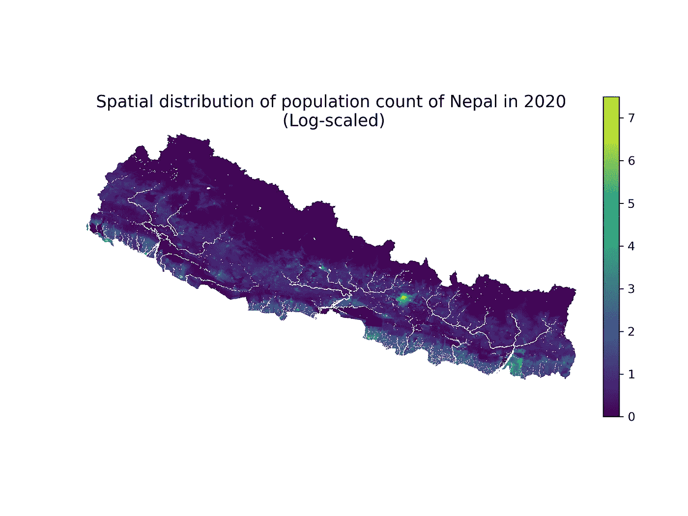
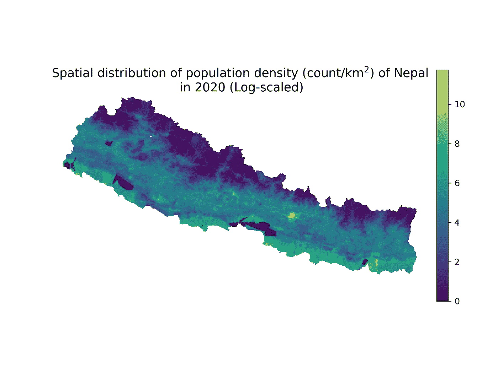
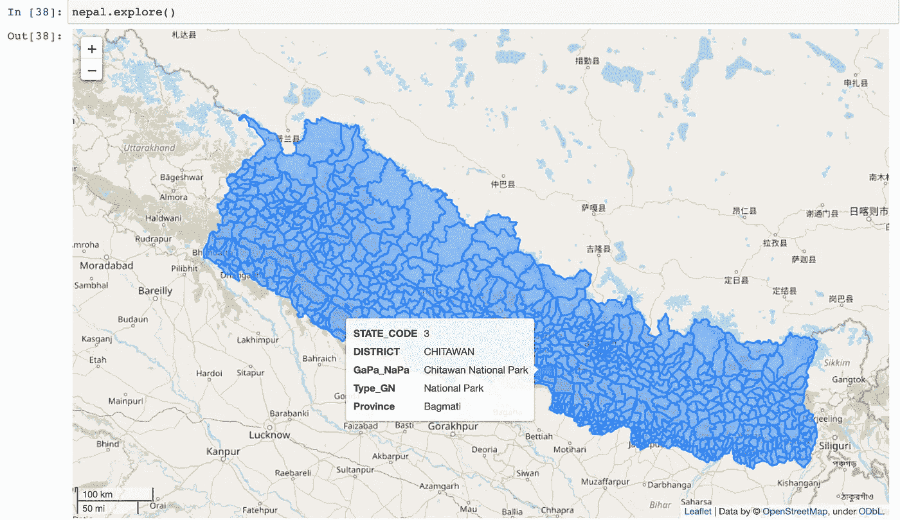
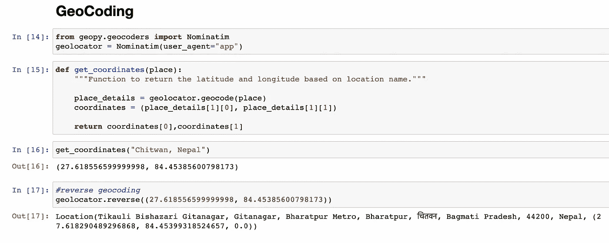
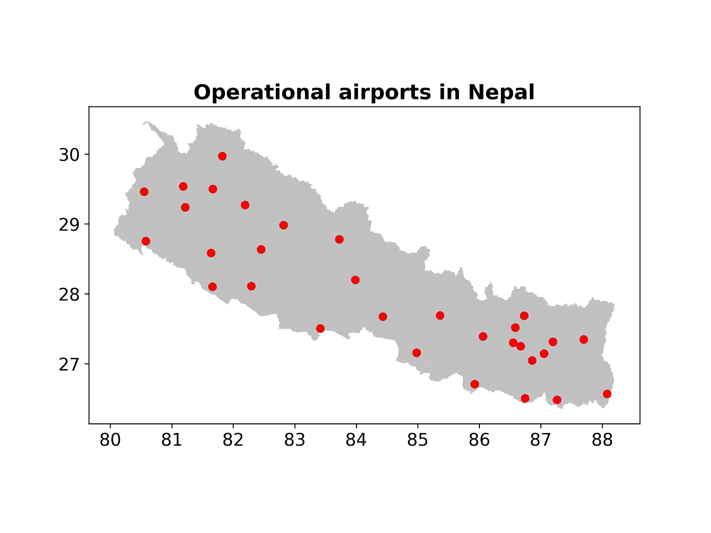
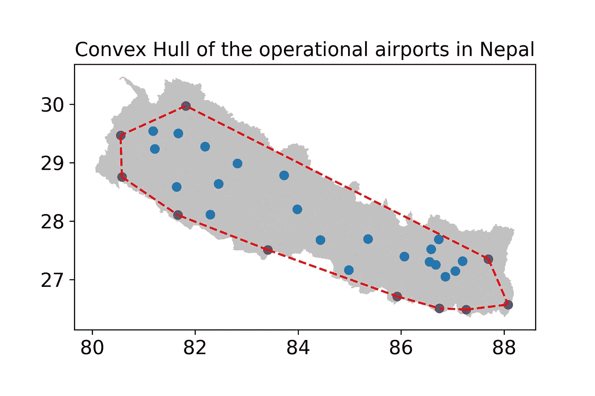
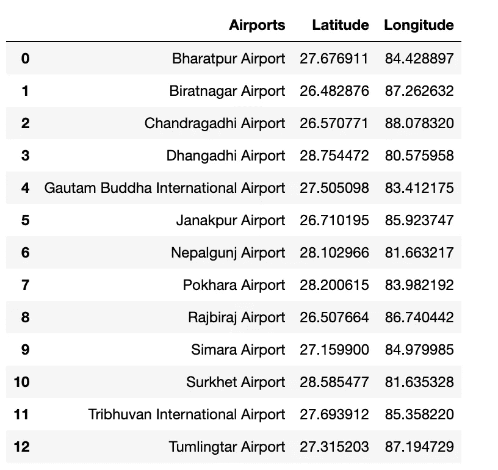
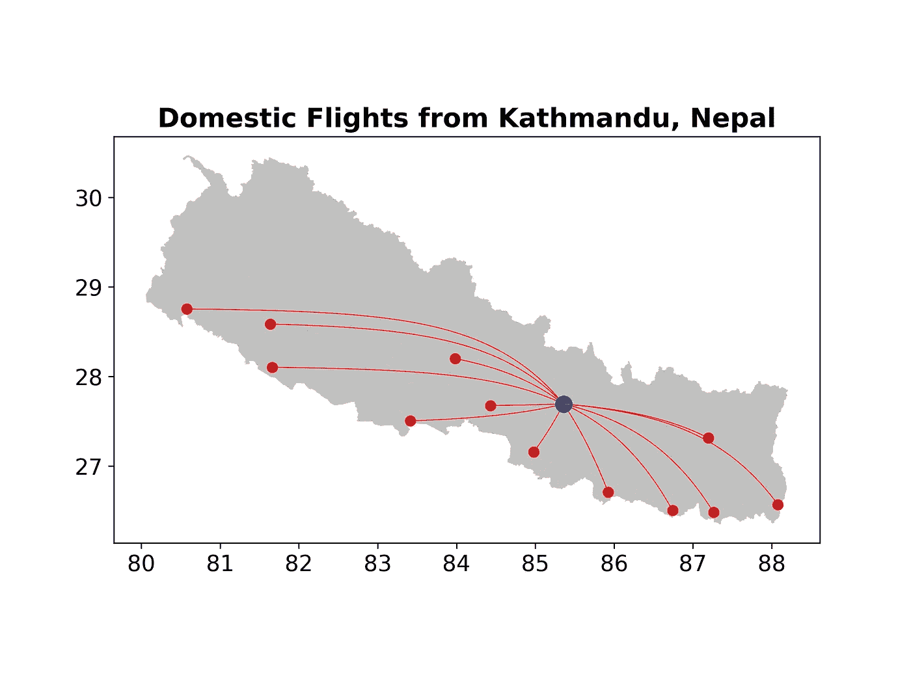

# Python 地图中的网络和互连

> 原文：<https://towardsdatascience.com/network-and-interconnection-in-python-maps-6c797580b3b1>

## 使用 Python 包(包括 geopandas、networkx 和 matplotlib 底图)的实践教程

与人口统计和发展指标有关的数据和统计是制定强有力的发展政策的核心。此外，这些指标的视觉和空间表现提供了重要的见解，有助于提供政策或投资决策的严谨性和透明度。考虑到这一点，我对我的祖国尼泊尔的人口和人口密度的空间分布以及地理区域如何通过国内航空业连接起来很感兴趣。

有几个包不仅可用于数据分析，还可用于在 Python 中构建地图、地理空间分析和地理编码。使用 Python 进行地理空间分析的一些主要优势包括其用户友好的语法、来自大型社区的潜在支持(例如，通过 GitHub、堆栈溢出等。)，以及开放存取——人们不需要为昂贵的许可证付费。

geopandas、networkx 和 matplotlib 底图等 Python 包对于可视化网络和互连(如运输路线、管道和电力系统互连)非常有用。在这篇文章的第一部分，我将向你展示我是如何构建地图来显示尼泊尔人口的空间分布和人口密度的。在第二部分，我将描述我是如何绘制尼泊尔国内机场以及首都和其他地方之间的飞行路线的。为此，我将使用 rasterio、geopy、geopandas 和 matplotlib 等包。让我们开始吧。

# 尼泊尔人口的空间分布和人口密度

我在 [WorldPop](https://www.worldpop.org/) 网站上找到了尼泊尔 2020 年[人口](https://www.worldpop.org/geodata/summary?id=6314)和[人口密度](https://www.worldpop.org/geodata/summary?id=42712)的公开数据。WorldPop 倡议为中南美洲、非洲和亚洲提供空间人口数据集的开放存取档案，以支持发展、灾害应对和卫生应用(WorldPop，2022)。首先，我使用`wget.download(URL, folder)`将所需文件从`URL`链接直接下载到我的本地`folder`。数据以 TIF(标记图像文件)格式提供。TIF 是一种高质量的图形格式，用于存储光栅图形(作为矩形矩阵或正方形矩阵网格的二维图像)，在图形艺术家中很受欢迎(FileInfo，2022)。

我使用`rasterio`包打开两个人口的 TIF 文件，如下所示:

```
#Population file
file1 = “data/npl_ppp_2020.tif”#Open file
raster_file1 = rasterio.open(file1)#Read raster data
pop_data = raster_file1.read(1)
```

TIF 文件中的数据作为 numpy 数组读取。我创建了一个简单的函数，它取栅格数据的自然对数，然后将其显示为图像。

```
def plot_raster(raster_data, title = “”, figsize = (8, 6)):
 “””
 Plot population count in log scale (+1)
 “””
 plt.figure(figsize = figsize)
 im1 = plt.imshow(np.log1p(raster_data), cmap = “viridis”,)
 plt.title(f”{title}”, fontdict = {“fontsize”: 14})
 plt.axis(“off”)
 plt.colorbar(im1, fraction = 0.03)
```

结果，我得到了一个视觉上吸引人的尼泊尔人口分布图，使用自然对数标度，如下所示。以像素的亮度级别来看，很明显尼泊尔人口最高的是位于中部地区的首都加德满都。

从地理上讲，尼泊尔分为三个地区:北部与中国接壤的喜马拉雅山，南部与印度接壤的特莱平原，以及两者之间的丘陵地带。从地图上可以清楚地看到，随着尼泊尔从南到北海拔的升高，人口在减少。在地图中，我们还可以看到三个明显的白色树状结构。这些白线是由 NaN 值决定的，代表尼泊尔的三条主要河流及其支流:东部的 Koshi 河、中部的 Gandaki 河和西部的 Karnali 河。



2020 年尼泊尔人口的对数尺度空间分布。图片作者。

尼泊尔的人口密度地图描绘了一幅稍微不同的画面，如下图所示。虽然与南部特莱地区相比，丘陵地区的人口稀少，但丘陵地区的人口密度仍然适中。在南部有一些人口密度接近于零的地区(用深色斑块表示)，这些地区代表了尼泊尔的国家公园。加德满都的人口密度仍然最高，其次是与印度接壤的南部地区。相反，由于极端的天气和困难的地形，北部喜马拉雅地区的人口密度非常低。



2020 年尼泊尔人口密度的对数尺度空间分布。图片作者。

# 可视化尼泊尔国内航空

作为一个多山的国家有自己的利弊。虽然尼泊尔拥有得天独厚的自然美景和生物多样性，但多山的地形使得丘陵和喜马拉雅地区的一些地方无法通过公路运输到达。因此，拥有国内机场对于连通性、货运和旅游业非常重要，尤其是在尼泊尔的偏远地区。

我从[开放数据尼泊尔](https://opendatanepal.com/dataset/new-political-and-administrative-boundaries-shapefile-of-nepal)得到了尼泊尔的政治和行政边界形状文件。我用 geopandas 读取了 shapefile。我使用最新版本的 geopandas 中的`explore()`功能绘制了尼泊尔的交互式地图，如下所示。



使用 geopandas 探索尼泊尔的政治和行政边界形状文件。图片作者。

## 地理编码

从尼泊尔民航局的[网站](https://caanepal.gov.np/aerodromes/domestic-airports)上，我得到了尼泊尔 34 个运营机场的列表。为了在尼泊尔地图上标出这些机场，我需要得到每个机场的经度和纬度。地理编码是将地址转换为地理坐标(经度和纬度)的过程。Python 中的 [**geopy**](https://geopy.readthedocs.io/en/stable/#module-geopy.geocoders) 库对于地理编码和反向地理编码都很有用，如下面的代码片段所示。通过 geopy，我得到了尼泊尔 31 个机场的坐标。



使用 Python 中的 geopy 库进行地理编码和反向地理编码。图片作者。

## 在尼泊尔地图上绘制可使用的机场

有了作为 geopandas 数据框架的`nepal`和包含机场、纬度和经度列的`df`,我使用以下代码在尼泊尔地图上绘制了机场:

```
fig, ax = plt.subplots(figsize = (8, 6))
plt.rcParams[“font.size”] = 14nepal.plot(color = “silver”, ax = ax)for lat, lon in zip(df[“Latitude”],df[“Longitude”]):
     ax.plot(lon, lat, marker = “o”, color = “red”)

plt.title(“Operational airports in Nepal”, fontweight = “bold”)
```



尼泊尔地图，有 31 个运营机场。图片作者。

上图显示了尼泊尔全国 31 个运营机场的分布情况。

## 凸包

我很好奇，想知道如果我想通过往返旅行覆盖尼泊尔最大的区域，在假设的情况下，我必须选择什么样的飞行路线。为了得到这个问题的答案，我使用了 [**凸包**](https://docs.scipy.org/doc/scipy/reference/generated/scipy.spatial.ConvexHull.html) 方法。在几何学中，凸包或凸包络是包含它的最小凸集。我创建了一个包含尼泊尔每个机场的纬度和经度的`points`数组，并在`scipy.spatial.ConvexHull()`方法中传递它。

在二维情况下，凸包对象的 flattened simplices 属性的唯一元素保存构成凸包线段的点的索引对。通过这种方式，我能够得到完成凸壳的机场的指数。

```
from scipy.spatial import ConvexHull, convex_hull_plot_2d
points = np.array([[lon, lat] for lat, lon in zip(airport_latitudes, airport_longitudes)])
hull = ConvexHull(points)hull_indices = np.unique(hull.simplices.flat)
hull_points = points[hull_indices, :]fig, ax = plt.subplots()
nepal.plot(ax = ax, color = “silver”)ax.plot(points[:,0], points[:,1], ‘o’)
ax.plot(hull_points[:,0], hull_points[:,1], “ro”, alpha = 0.25)for simplex in hull.simplices:
     ax.plot(points[simplex, 0], points[simplex, 1], ‘r — ‘)plt.title("Convex Hull of the operational airports in Nepal")
```



尼泊尔运行机场的凸包。图片作者。

## 从加德满都到其他地方的国内航班

正如本文第一部分所讨论的，尼泊尔首都加德满都是尼泊尔人口和人口密度最高的城市。尼泊尔唯一运营的国际机场(在编写本报告时)位于加德满都。该机场的一个独立单位也作为加德满都的国内机场。从加德满都到尼泊尔其他机场有 12 个可能的国内航班(航班连接，2022)。以下数据框`flights_from_ktm`显示了从加德满都特里布万国际机场起飞的 12 个机场的名称、经度和纬度。



显示与尼泊尔加德满都特里布万国际机场有联系的 12 个机场及其经度和纬度列表的数据框。

我用下面的代码画出了从加德满都到尼泊尔其他 12 个机场的飞行路线。

从加德满都到尼泊尔其他机场的国内航班代码。


连接尼泊尔加德满都的国内航线。图片作者。

上图显示了加德满都机场与尼泊尔其他 12 个机场之间的航班连接。加德满都的机场用蓝色标记表示，其他机场用红色表示。

我最近开始了解到，航班并不像平面地图上通常显示的那样走直线。飞机沿着“大圆”路线飞行，以解释地球的曲率(Wonderopolis，2017 年和福布斯，2020 年)。为了表示飞行路线中的这些曲率，我使用了一个名为`draw_curve()`的简单函数来绘制两点之间的曲线路径，而不是使用直线。

```
#Function to draw a curved line between two points
def draw_curve(p1, p2):
     “””Return curves lines between two points p1 and p2.”””
     #np.cosh(x) is equivalent to 0.5*(np.exp(x) — np.exp(-x))
     a = (p2[1] — p1[1])/ (np.cosh(p2[0]) — np.cosh(p1[0]))
     b = p1[1] — a * np.cosh(p1[0])
     x = np.linspace(p1[0], p2[0], 100)
     y = a * np.cosh(x) + b
     return x, y
```



连接尼泊尔加德满都的国内航线显示为曲线。图片作者。

因此，我得到了加德满都特里布万国际机场和其他 12 个机场之间的曲线，即前者有联系。

# 结论

在本文中，我在第一部分描述了如何在尼泊尔地图中表示人口和人口密度数据的空间分布。在接下来的部分中，我解释了使用 geopy 库获取尼泊尔国内机场坐标的地理编码技术，以及 scipy.spatial 的 ConvexHull()方法。此外，我还演示了一种在尼泊尔地图上绘制运行机场分布的方法，以及使用 geopandas 包绘制加德满都和尼泊尔其他地方之间的飞行路线。

这篇文章的资料和笔记本可以在这个 [GitHub 仓库](https://github.com/hbshrestha/Geospatial-Analysis)中找到。感谢您的阅读！

## 参考

档案信息，2022。[标记图像文件。](https://fileinfo.com/extension/tif)

航班连接，2022。从加德满都直飞。

福布斯，2020。[为什么飞机在地图上不按直线飞行？](https://www.forbes.com/sites/jamesasquith/2020/02/24/why-planes-dont-fly-in-a-straight-line-on-a-map/?sh=66bc4bcf3556)

Wonderopolis，2017。[为什么飞机不直线飞行？](https://wonderopolis.org/wonder/why-dont-planes-fly-in-a-straight-line)

2022 年世界流行音乐。[开放空间人口数据和研究。](https://www.worldpop.org/)