# 神经特征重要性

> 原文：<https://towardsdatascience.com/neural-feature-importance-1c1868a4bf53>

## 基于人工神经网络权重的特征重要性(加上实际代码)


照片由 [J K](https://unsplash.com/@6690img?utm_source=medium&utm_medium=referral) 在 [Unsplash](https://unsplash.com?utm_source=medium&utm_medium=referral) 上拍摄

**你有什么好处？** 在本文中，我们将探索一种基于人工神经网络(ANN)的权重以及实际操作的 python 代码来计算相对特征重要性的方法。我们开始吧

# 安


作者图片

上图显示了一个具有单个隐藏层的人工神经网络，该隐藏层中只有一个神经元。此外，为了更好地理解，我将隐藏的神经元分解成多个部分。如您所见，我们有 3 个功能(I1、I2 和 I3)。神经特征重要性完全是从神经元的权重中推导出特征重要性，所以让我们深入到上述超级简单神经网络的矩阵乘法形式中来看看实际的权重。

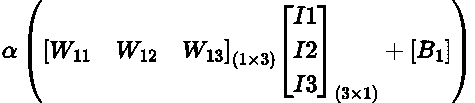

作者图片

我们将对数据集中的每一行计算上述等式。这里 alpha(图中 A1)代表我们的激活函数(可以是 relu、tanh、softplus 等)。
如你所见，W11、W12 和 W13 分别代表神经元 H1 中与特征 I1、I2 和 I3 相关联的权重。将这两个形状矩阵(1×3)和(3×1)相乘，我们将得到一个形状矩阵(1×1 ),我们的偏差(B1)将被添加到该矩阵中。结果将作为输入传递给我们的激活函数，其结果将被转发给后续层。

如果我们在隐藏层中有两个神经元，矩阵乘法将如下所示

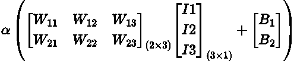

作者图片

如您所见，输入 X 权重的结果将产生一个形状为
(2 x 1)的矩阵，可以向其中添加偏差。应当注意，激活函数的结果也将是形状矩阵(2×1)，即每个神经元一个值

# 特征重要性

相信我，我们越来越重视了，耐心点。让我们评估一下我们的单神经元案例，

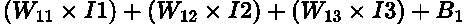

作者图片

> 如果 W11 是 0.6，W12 是 0.3，那么这意味着，I1 的变化将比 I2 的变化产生两倍的影响(因为 0.6 = 0.3 x 2)

权重可以是正的，也可以是负的，但这只会影响输出变化的方向，而不会影响大小。因此我们可以说，如果 abs(W11) > abs(W12)，那么根据神经网络权重，输入 1 (I1)比输入 2 (I2)更重要。有意思？让我们通过编码来尝试一下。

# 把这个编码出来

注意:我将用斜体提到*列名*

## 导入和加载数据

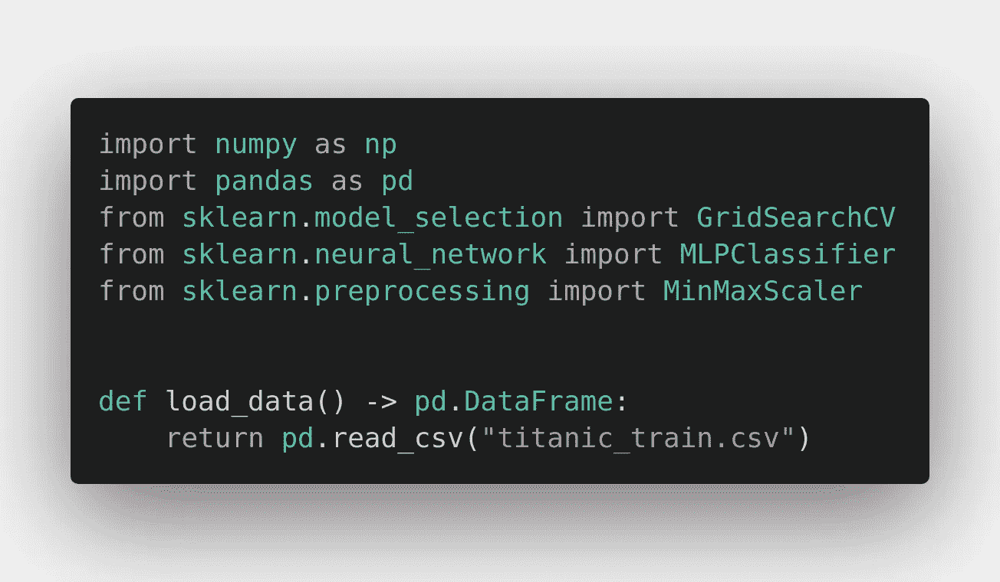

作者图片

我们从导入所需的库开始。除了标准的`[numpy](https://numpy.org/)`和`[pandas](https://pandas.pydata.org/)`，我们还导入了`[GridSearchCV](https://scikit-learn.org/stable/modules/generated/sklearn.model_selection.GridSearchCV.html)`，它将帮助我们找到模型的最佳超参数，`[MLPClassifier](https://scikit-learn.org/stable/modules/generated/sklearn.neural_network.MLPClassifier.html)`(多层感知器分类器)，用于定义我们的 ANN 和`[MinMaxScaler](https://scikit-learn.org/stable/modules/generated/sklearn.preprocessing.MinMaxScaler.html)`，用于将我们的数据缩放到[0，1]范围。`MLP**Classifier**`之所以被导入，是因为这个例子围绕着在分类问题的上下文中寻找特征重要性。

值得注意的是，我们不需要`[tensorflow](https://www.tensorflow.org/)` / `[keras](https://keras.io/)`或`[pytorch](https://pytorch.org/)`，因为`MLPClassifier`已经有了我们所需要的。我们可以指定隐藏层的大小、隐藏层的一个通用激活函数以及优化器和学习速率。对于二进制分类任务，它将使用 [sigmoid](https://en.wikipedia.org/wiki/Sigmoid_function) 激活功能，而对于多分类任务，它将使用 [softmax](https://en.wikipedia.org/wiki/Softmax_function) 。

指定导入后，我们定义一个简单的加载数据函数。正如您将在剩余代码中看到的，我非常喜欢在 python 中使用[类型提示](https://docs.python.org/3/library/typing.html)。

## 定义常数

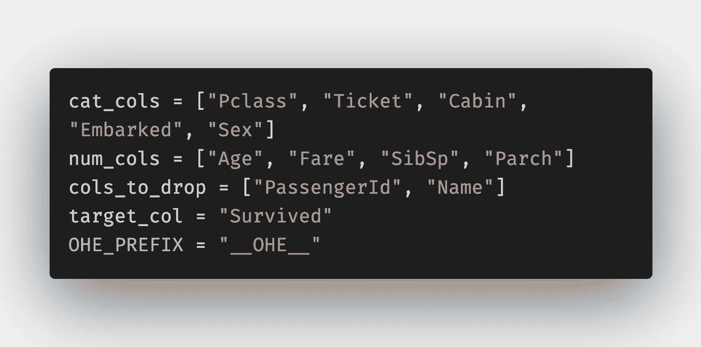

作者图片

现在我们跳到一些数据处理，定义变量和常量以避免重复和给文字命名总是有帮助的。我们指定分类列、数字列、要删除的列( *PassengerId* 因为它是一个 Id，而 *Name* 因为对名称进行编码没有意义)、目标列以及一个常量`OHE_PREFIX`，当我们执行一次性编码时将使用这个常量。

我想在这里澄清两件事，第一件是我没有决定放弃*票*号的原因。做一些简单的分析，就可以发现*票*号首先不是唯一的。此外，如果您找出每张票的频率(出现次数)以及目标列中 1 的相应百分比，您将会看到*票*号确实在目标列的预测中发挥了作用

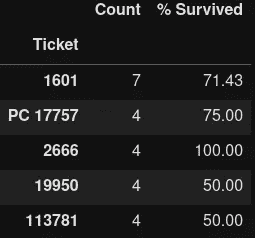

作者图片

需要澄清的第二点是，尽管 *Pclass* 被表示为整数(1，2，3 ),但是因为它表示第一、第二和第三类，所以它实际上是一个[顺序分类](https://en.wikipedia.org/wiki/Ordinal_data)列，因此我将其视为分类列，而不是数字列。

## 输入空值

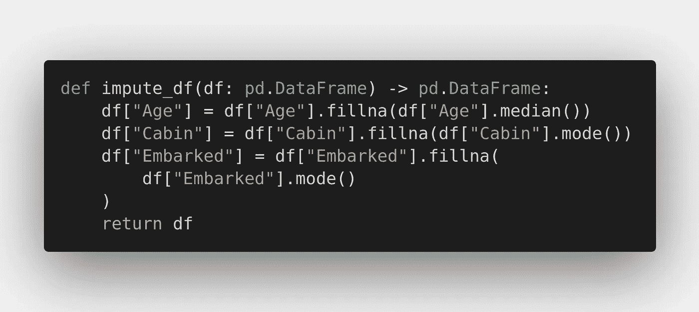

作者图片

接下来，我们定义一个函数来估算缺失值。正如你所看到的，这个函数获取了一个 pandas 数据帧，并返回一个 pandas 数据帧，只需查看函数签名(不需要查看函数体)就可以推断出来，这就是键入提示的妙处。关于它们，我们用中值填充数字列中的空值，对于分类列，我们用最频繁(非空)的值填充它们。

## 缩放数字

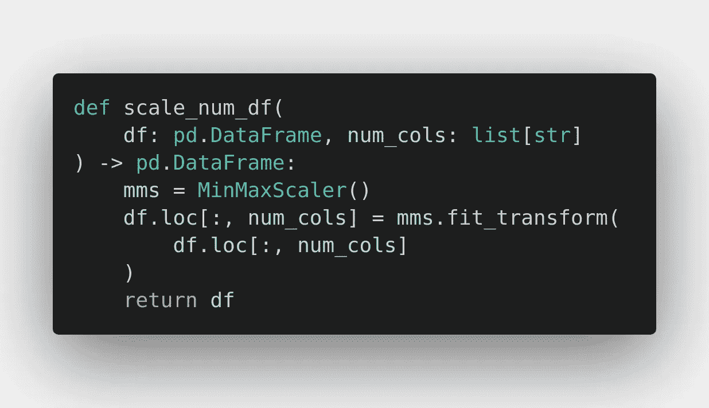

作者图片

为了根据我们的数据训练神经网络，确保所有特征都在相同的尺度上是很重要的。此外，较小的值有助于更快地达到全局最小值。通常，数据被缩放到[0，1]范围或[-1，1]范围。这里我们使用 sklearn 的`MinMaxScaler`,它默认将输入数据缩放到[0，1]范围。因为我们不能缩放类别，所以我们传递数字列并只缩放它们。这里的 num_cols 听起来像“列数”,但是提供的输入提示表明它是一个字符串列表。

## 编码类别

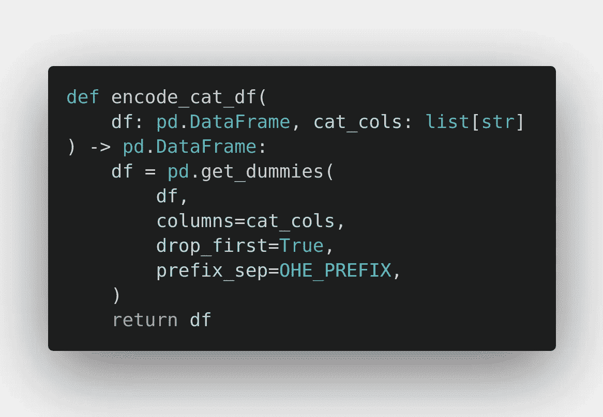

作者图片

现在让我们把注意力转向范畴。我们知道，我们不能直接用它们来训练我们的神经网络，我们必须以某种方式对它们进行编码(将它们转换成数字)。让我们探索几个选项。我们可以顺序编码(标签编码是针对标签(目标列)的)！)通过给列中的每个唯一值分配一个整数来对它们进行赋值。但是由于我们所有的数据都需要在范围[0，1]内，我们必须调整编码值。请想一想。

例如:假设值“Susmit”被编码为 3，然后缩放为 0.21，值“Python”被编码并缩放为 0.22，这没有任何意义，对吗？

我们可以使用`[TargetEncoder](https://contrib.scikit-learn.org/category_encoders/targetencoder.html)`，但是我们需要缩放。同样，在我们必须执行逆变换操作的情况下，我们将必须存储映射，但是由于可能存在编码值对于两个或更多不同类别值是相同的情况，所以不可能执行精确的逆变换。

这里使用 pandas 的`get_dummies`方法执行一个热编码。我们还指定了`drop_first=True`，这将确保没有重复的信息。这就是我们的常量`OHE_PREFIX`也被用来保持控制的地方。

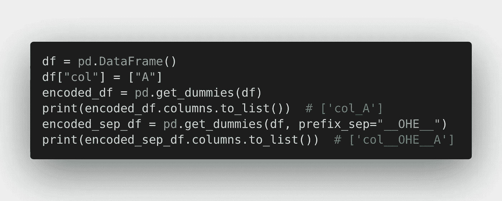

作者图片

如上图所示，它有助于控制编码列的名称和为其生成列的值之间的分隔符。通常分隔符值应该是数据中不会出现的值(在我们的例子中是列名)。当我们想要找到原始列的特性重要性(而不是作为一次性编码的结果生成的列)时，将需要分隔符值。

## 定义模型架构

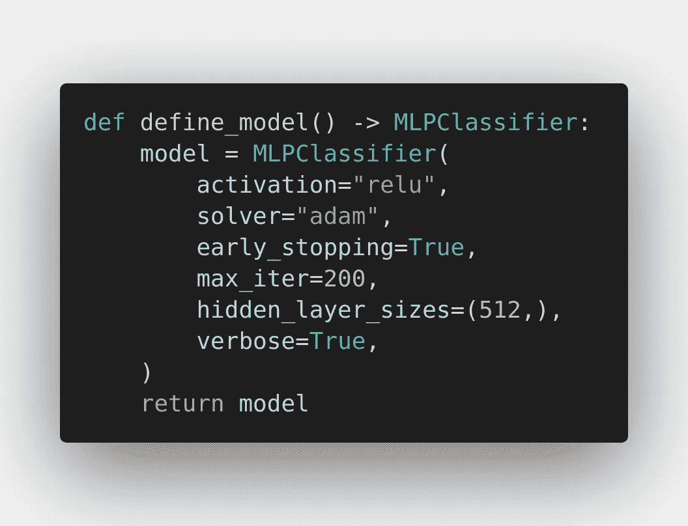

作者图片

现在我们定义一个简单的函数，它定义了我们的模型，没有需要调整的超参数。我们将对我们的隐藏层使用`[Rectified Linear Unit](https://en.wikipedia.org/wiki/Rectifier_(neural_networks))` (ReLU)激活函数，它只不过是输入 x 的`max(0, x)`。连同其他一些超参数，我们指定我们想要一个有 512 个神经元的隐藏层。如果对于一些其他任务，我们想要两个隐藏层，第一个具有 256 个神经元，第二个具有 512 个神经元，我们可以将其定义为，

```
hidden_layer_sizes = (256, 512,)
```

## 定义网格搜索 CV

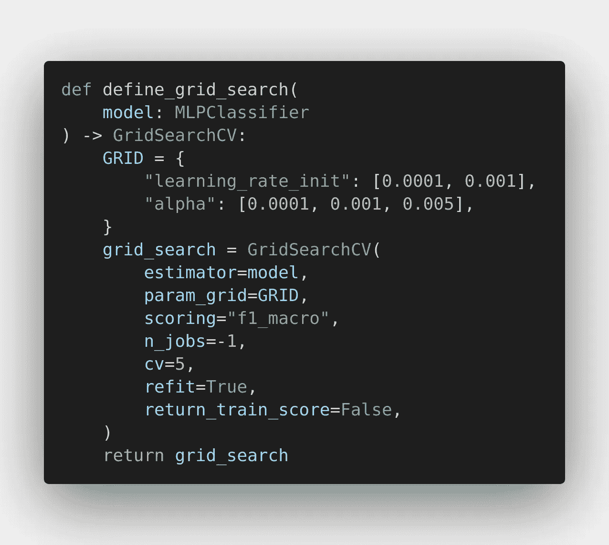

作者图片

是时候进行一些超参数优化了！让我们理解我们定义的是什么。我们希望使用我们的`model`，对于`learning_rate_init`和`alpha`的每个组合，我们希望使用`(Stratified)KFold`策略和`k=5`进行交叉验证，以确定最佳表现模型，从而确定最佳超参数，将使用`f1_macro`评分。此外，我们希望拟合/训练在整个数据集上找到的最佳模型，我们通过`refit=True`指定该数据集，最后但并非最不重要的是，我们希望使用我们机器的所有可用内核(`n_jobs=-1`)。

# 最后，对于特性的重要性，

## 计算绝对平均重量


作者图片

在开头显示的神经网络的超级简单的例子中，在隐藏层中只有单个神经元。因此，我们能够直接使用对应于输入特征的权重。但是在我们的例子中，我们的隐藏层有 512 个神经元。所以我们取每个特征的所有神经元系数的平均值。因为我们只关心大小，而不是方向，所以我们取绝对值。

为了理解第一行中发生了什么，让我们探索一下`model.coefs_`。首先，顾名思义，它存储了神经元之间的系数/权重。

```
print([coef.shape for coef in model.coefs_]) 
# Output: [(835, 512), (512, 2)]
```

如你所见，这里有两个元素，为什么？第一个元素存储输入层和隐藏层之间的权重，第二个元素存储隐藏层和输出层之间的权重。第一个元素中有 835 行和 512 列，因为在删除两个特征并添加一个热编码特征而不是没有目标列的分类特征后，我们的数据中有 835 个特征。512 因为我们的隐藏层有 512 个神经元。

> `(835 , 512)`隐藏层中每个神经元一列，每个特征一行

因此，当我们执行时，`[i.mean() for i in model.coefs_[0]]`我们取所有 512 个系数的平均值，835 个特征/(矩阵中的行)中的每一个都有一个平均值。

## 一个热编码列的分组权重

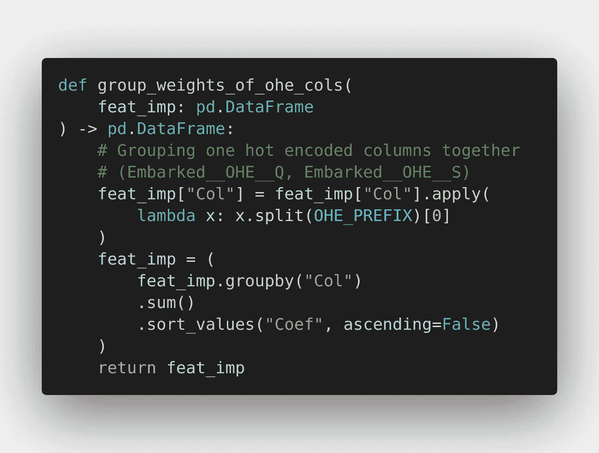

作者图片

我们需要执行这个步骤，因为我们使用了一个热编码，它将一个列分割成多个列，用 0 或 1 表示值的存在。例如，列*abowed*有三个唯一的值 S、C 和 q。因为我们已经指定了`drop_first=True`，所以生成了两个列。一个用于表示值 Q 的存在，一个用于表示值 s。如果两者都不存在，则值为 c。现在,*登上*的系数是*登上 __OHE__Q* 和*登上 __OHE__S.* 的系数之和。因此我们提取原始列名，按其分组，并取和。

## 称量重量

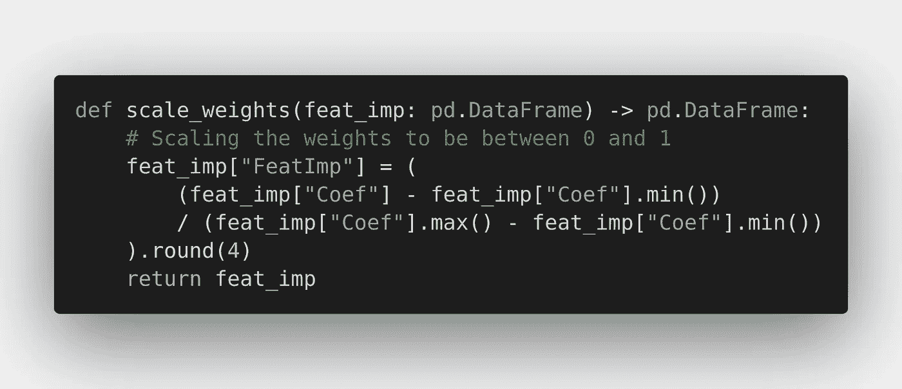

作者图片

为了确保所有的权重都在同一标度上，并且表示最重要特征的最大值是值 1，表示最不重要特征的最小值是值 0，我们执行最小-最大标度。

## 特征重要性函数

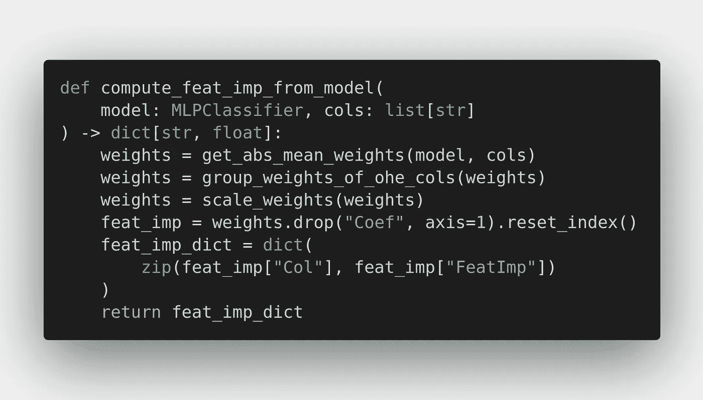

作者图片

最后，我们调用与计算特征重要性相关的函数，并将结果转换成一个字典。

## 缝合在一起

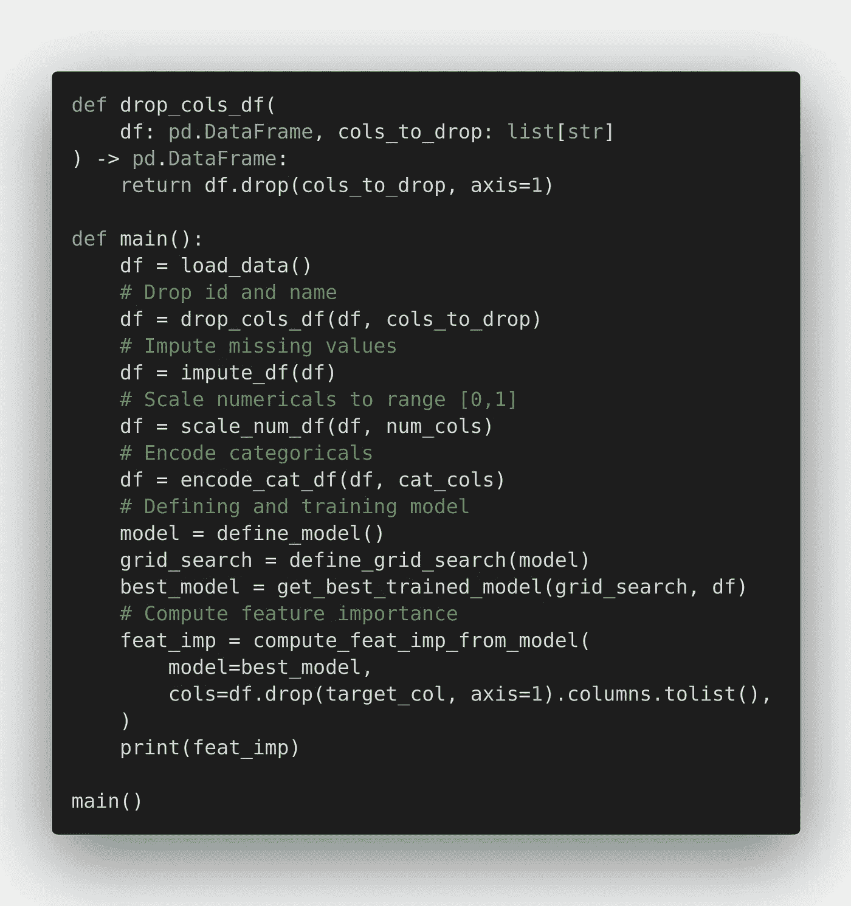

作者图片

你可能已经猜到了，我是一个超级粉丝，

> 函数的第一条规则是它们应该很小。函数的第二个规则是它们应该比那个小。罗伯特·马丁

同样，

> 函数应该做一件事。他们应该做好这件事。他们应该只做这件事。罗伯特·马丁

以下是完整的代码供您参考

**乡亲们，就这样吧！**

如果你喜欢阅读，一定要读一读这篇关于云文件浏览器(一种用于云的文件浏览器和查看器)的发展故事的博客:[https://medium . com/@ susmit . py/File-Viewer-for-the-Cloud-65de a 0455 DC 7](https://medium.com/@susmit.py/file-viewer-for-the-cloud-65dea0455dc7)([https://cloudfileviewer.web.app/](https://cloudfileviewer.web.app/)

如果你想讨论一些很棒的东西，你可以在 LinkedIn[susmit-vengurlekar](https://www.linkedin.com/in/susmit-vengurlekar/)上联系我！