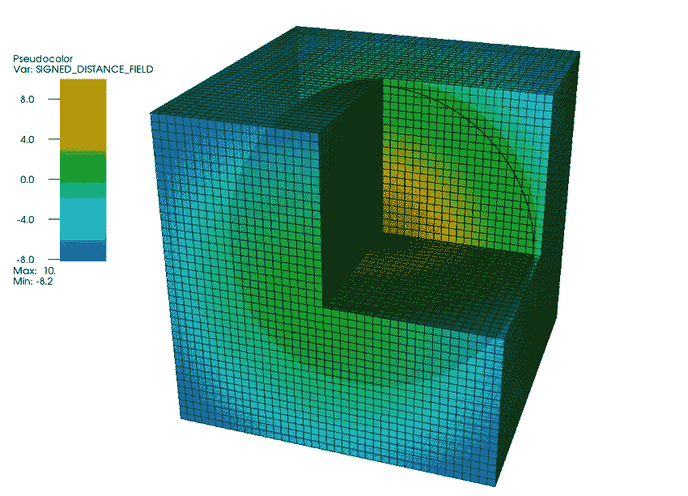
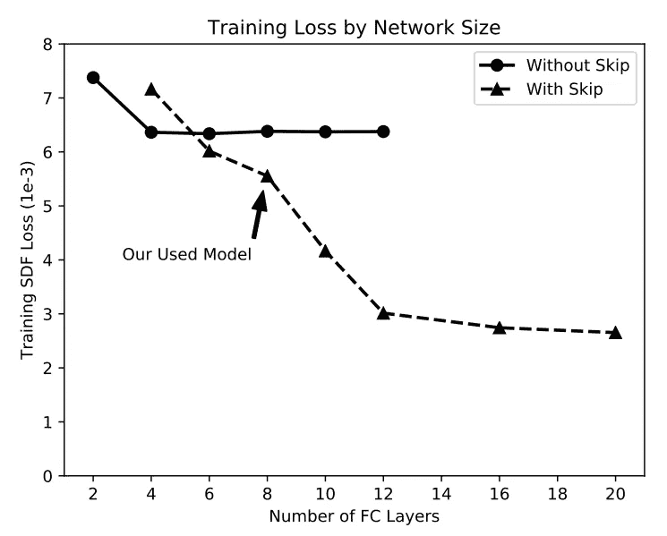
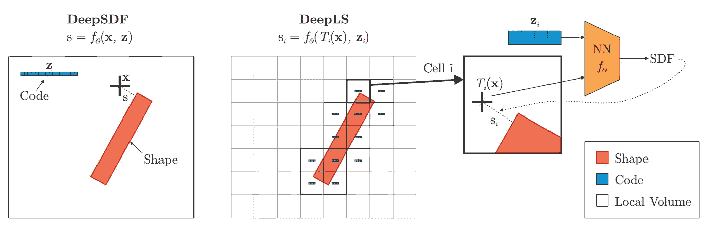
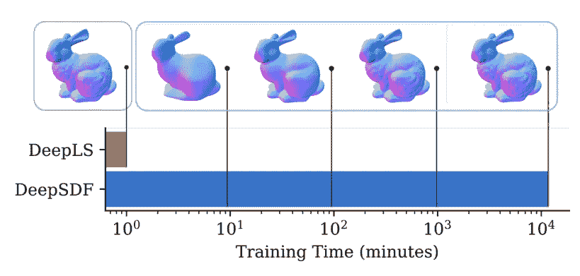
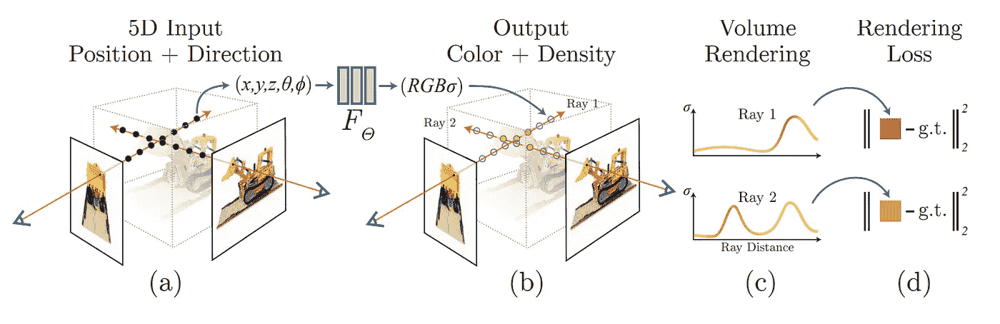
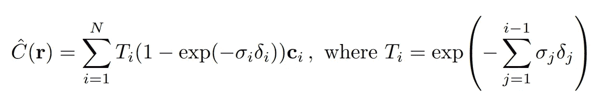
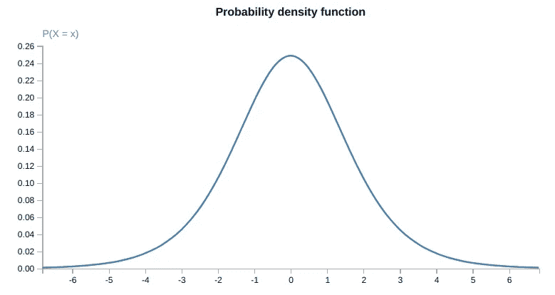
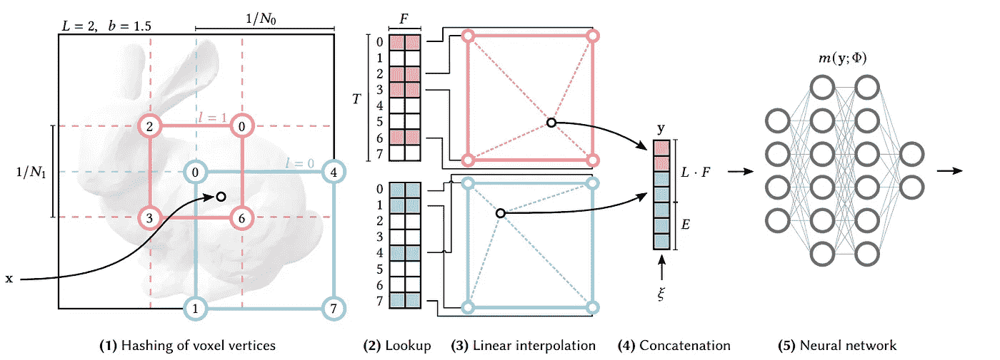
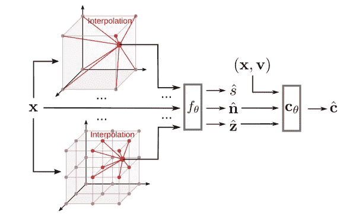

# 三维形状和场景的神经隐式表示

> 原文：<https://towardsdatascience.com/neural-implicit-representations-for-3d-shapes-and-scenes-c6750dff49db>

## 近年来，有一个帮助解决计算机图形任务的神经隐式表示的爆炸。在本文中，我将重点讨论它们在三种不同任务中的适用性——形状表示、新颖的视图合成和基于图像的 3D 重建。

近年来，计算机图形学领域与深度学习一起蓬勃发展，有几项贡献对该领域产生了重大影响。计算机图形学解决了用计算机创建图像的问题。虽然这听起来很简单，但创建物理上正确和真实的图像肯定是一项复杂的任务。要做到这一点，人们需要理解如何表现 3D 场景，3D 场景通常包含光线、不同的材料、几种几何形状和拍摄照片的相机型号。幸运的是，研究人员已经找到了使用深度学习模型解决计算机图形问题的迷人方法。

简单地说**但不准确地说**，这篇文章旨在提炼以下基于深度学习的计算机图形任务解决方案的进展:

1.  2017–2019—如何用神经网络(NN)表示**形状**。我将把重点放在使用[带符号距离函数](https://jasmcole.com/2019/10/03/signed-distance-fields/)来实现这一点的作品上。
2.  2019–2020—如何用 NNs 表现**场景**。具体来说，神经网络如何表现一个完整的场景，包括闪电、纹理&形状的所有精细细节？
3.  2021 —2022 —我们如何**理解**有 NNs 的场景？具体来说，给定神经场景表示，我们如何重建场景中的 3D 表面？
4.  2022 年——我们如何让它更快？

这仅仅是我将进展提炼为不同阶段的方式，而显然，这个领域并没有以如此清晰的方式进展。在 2021 年之前，人们试图理解具有 NNs 的场景，形状表示仍然是人们正在努力的事情(在形状之间进行概括仍然是一个问题)。然而，在我看来，这种顺序使得我将在这篇文章中讨论的观点和作品更容易理解。

# **计算机图形学的简要背景**

而我假设读者熟悉深度学习(梯度下降、神经网络等。)，为了完整起见，我将在这里简单介绍一下本文中用到的一些术语的背景。

## **光线跟踪与渲染光栅化**

注意，渲染图像有两个类别——[**栅格化**](https://en.wikipedia.org/wiki/Rasterisation) 和 [**光线追踪**](https://en.wikipedia.org/wiki/Ray_tracing_(graphics)) 。查看[Nvidia](https://blogs.nvidia.com/blog/2018/03/19/whats-difference-between-ray-tracing-rasterization/#cancel)的这篇文章，了解他们的介绍，我**强烈推荐**观看迪士尼在 [Hyperion](https://disneyanimation.com/technology/hyperion/) 上的视频，这是他们的(光线跟踪)渲染引擎，直观地解释了通过与物体的几次碰撞，从光源到相机的光线路径的计算建模过程。然而，如果你不太熟悉渲染，请注意**光栅化在现代 GPU 上要快得多**，然而它并不像基于光线跟踪的渲染那样模拟物理世界。在这篇文章中，我将重点关注利用差分光线跟踪渲染的作品，因为它们往往会产生更好的结果，并且我将描述使它们可用于实时应用程序的方法。

## **三维几何图形表示**

虽然很清楚 3D 场景包含几个 3D 对象，但不清楚如何表示它们的几何形状。没有一种计算和存储效率都很高的规范表示法能够表示任意拓扑的高分辨率几何图形。几种[表示](https://www.antoinetlc.com/blog-summary/3d-data-representations)进化而来，最常用的有[网格](https://en.wikipedia.org/wiki/Polygon_mesh)、[基于体素的](https://en.wikipedia.org/wiki/Voxel)或[基于点的](https://en.wikipedia.org/wiki/Point_cloud)。如果您不熟悉这些术语，我建议您在继续之前阅读它们。然而，需要注意的重要一点是，这些方法在效率**(基于体素的表示内存使用相对于分辨率以立方增长)**表现性**(头发等精细几何体很难使用网格建模)或**拓扑约束**(直接从点云生成[防水表面](https://davidstutz.de/a-formal-definition-of-watertight-meshes/) —一个没有洞的闭合表面——可能不是一项简单的任务)。**

**上面所有的表示都有一个共同的特性——它们依赖于几何的显式表达。但是，它是通过用离散对象(如三角形、栅格或简单的点)来近似 3D 表面来实现的。另一种表示 3D 对象的常见方式是使用**连续** [**隐式表示法**。](https://en.wikipedia.org/wiki/Implicit_surface)通常，隐函数将几何图形表示为在 3D 点上操作的函数，满足:**

1.  **F(x，y，z)<0 — interior point**
2.  **F(x,y,z)>0-外部点**
3.  **F(x，y，z)= 0-曲面点**

**具体地说，[有符号距离函数](https://en.wikipedia.org/wiki/Signed_distance_function) (SDF)满足这些性质。SDF 就是给定点到物体[边界](https://en.wikipedia.org/wiki/Boundary_(topology))的距离，并根据上述规则设置距离的符号。如果隐式表示对你来说是新的，我推荐阅读密苏里 CS8620 课程的[讲义。请记住，SDF 有许多好的属性(可以用来很容易地计算相交，使光线投射快速)。然而，如何获得某种形状的 SDF 并不是一件小事？](http://web.missouri.edu/~duanye/course/cs8620-spring-2017/lecture-notes/3a-implicit-geometry.pdf)**

**视觉上，球体的 SDF 可以被视为:**

****

**围绕球体的有符号距离的视觉。[图源](https://www.researchgate.net/publication/319307450_Particle_Tracking_Acceleration_via_Signed_Distance_Fields_in_DAGMC)。**

## ****计算机图形任务****

**回想一下，计算机图形学的总体目标是使用计算机创建图像。这个目标可以分解成几个问题。今天，我将重点讨论深度学习如何帮助解决以下计算机任务:**

1.  ****形状表示**——正如我在上面详述的，表示 3D 形状并不简单。虽然存在几种经典的表示方法，但我将在这篇文章中详细介绍如何使用神经网络来有效地表示连续的 3D 形状(特别是 SDF)。**
2.  ****新颖的视图合成(NVS)** —给定一个场景的几幅图像，我们如何从新的视图生成图像？需要多少幅图像，除了视图之外，我们还能控制哪些属性(例如，我们能否用不同的光照生成视图)？**
3.  ****曲面重建—** 给定一个曲面的多幅图像，我们如何重建它的 3D 模型？**

**人们现在可能想知道求解 NVS 是否隐含地解决了表面重建任务。有理由认为，如果计算机可以生成场景的新视图，它就必须(隐含地)重建场景的 3D 模型。因此，似乎解决 NVS(即，将 NeRF 拟合到场景)就解决了表面重建问题。虽然这听起来是正确的，但并不完全正确，我将描述一种通过解决 NVS 任务来重建曲面的机制。**

# ****1。形状表示的神经网络****

**如何在捕捉高频局部细节的同时获得高效紧凑的表现是一项具有挑战性的任务。虽然隐式表示是表示形状的有效方式，但使用经典方法很难获得它们。DeepSDF 是深度学习在这项任务中的第一个成功应用。**

## ****1.1**[**deep SDF**](https://arxiv.org/pdf/1901.05103.pdf)**—表示 SDF 的神经网络****

**给定一个网格，如何求它的 SDF？经典方法通过用 3D 网格离散化空间来近似 SDF，其中每个体素代表一个距离。这些体素在内存中很昂贵，尤其是当需要细粒度的近似时。**

**DeepSDF 建议使用神经网络对其进行近似，该网络简单地学习预测给定点的 SDF 值。为了训练网络，他们用相应的 SDF 采样了大量的点。他们对物体表面的更多点进行采样，以获取详细的图像。**

**一旦我们可以使用神经网络来表示 SDF，关于这种表示的几个问题就出现了。一个网络可以概括为代表几个形状，而不是为每个形状训练一个特定的网络吗？如果是这样的话，多种形状的连续表示是否使我们能够在它们之间进行插值？在不深入细节的情况下，我注意到 DeepSDF 确实显示了形状之间的某种程度的一般化，这是通过将 DeepSDF 网络限制在可训练的形状代码上来实现的。有关更多详细信息，请参考 DeepSDF 第 4 节。**

## **1.2.[**DeepLS**](https://arxiv.org/pdf/2003.10983.pdf)**—用计算换取内存****

**虽然 DeepSDF 在逼近 SDF 方面取得了非常好的结果，但训练和推断的成本很高。MLP 网络通常是根据～2M 参数构建的，这使得高分辨率 3D 形状的训练和推断成本很高。回想一下，DeepSDF 是一个基于**坐标的**(即一个网络一次只在一个坐标上运行)网络。因此，在训练期间，必须为每个单点计算每个～2M 参数的**梯度。**用 300-500k 个点对特定网格的 DeepSDF 进行训练，这导致训练的计算开销很大。因此，使用网络进行推理也是昂贵的。**

**一个天真的建议是通过简单地使用一个较小的网络来使 DeepSDF 的训练和推理更快。然而，正如 DeepSDF 所示，他们在考虑了速度与精度的权衡后选择了网络架构，因为他们发现较小的模型性能更差。需要一种更复杂的方法。**

****

**作为网络深度函数的回归精度。图来自 [DeepSDF](https://arxiv.org/pdf/1901.05103.pdf) 。**

**[DeepLS](https://arxiv.org/pdf/2003.10983.pdf) 建议通过结合经典计算机图形学文献中一个至关重要且众所周知的观察结果来解决这个问题——**一个大的表面可以分解成** **个局部形状。**因此，他们将空间划分为一个体素网格，每个体素在一个小的局部邻域中存储有关表面的信息。该信息被存储为**学习潜在代码**(即，为每个体素 V_i 存储潜在代码 z_i)。这样，网格本质上**编码关于形状的局部信息**，并且网络将该局部信息映射到 SDF 值。本质上，他们的方法是:**

1.  **将空间划分为规则的体素网格。**
2.  **对于给定的点， **x** ，在网格上找到对应的体素 *V_i* 。**
3.  **将 x 变换到 *V_i* 局部坐标系。*T _ I*(*x*)=*x*—*x _ I***
4.  **将潜在代码(z_i)和转换后的坐标(T_i)输入网络，并回归 SDF。**
5.  **在优化潜在代码(z_i)和神经网络参数的同时，对大量步骤重复 2–5。**

****

**DeepSDF 和 DeepLS 方法的 2D 比较。DeepSDF 使用一个点和一些形状代码(z)来表示特定的形状 SDF，而 DeepLS 利用网格来表示局部形状代码。注意，DeepLS 优化了神经网络参数和潜在向量(z_i)。该图取自[深度](https://arxiv.org/pdf/2003.10983.pdf)。**

**在这里，我建议用另一种方式来考虑他们的建议。分析学习问题的一个常见主题是将任务分成两个不同的子任务。首先，给定原始数据(在我们的例子中是 3D 点)的特征提取任务产生描述数据的提取特征向量。然后，第二个子任务是在给定该特征向量的情况下回归 SDF 值。传统上，特征提取部分负责将原始数据转换为良好的表示特征，从而简化回归(一般是下游任务)。虽然这种描述听起来可能很模糊，但今天的深度学习实践者已经习惯于使用大型冷冻(已经在大规模数据集上训练过)神经网络作为特征提取器，并训练一个小型模型，该模型将这些特征作为给定任务的输入。**

**考虑到这一点，我将 DeepLS 的网格视为一个**局部特征提取器**，将神经网络视为一个简单的回归模型。所以回归模型可以小很多。具体来说，他们的神经网络只有 **50K** 个参数，相比之下 DeepSDF 的 **~2M** 个参数。此外，虽然网格本身可能很大(甚至比 DeepSDF 网络本身更大)，但是在每次通过网络时，只有少量的参数影响计算**！这使得训练和推理速度更快，同时以计算换取内存。****

**总的来说，使用网格，DeepLS 明显比 DeepSDF 更有效。在下面的例子中，DeepLS 的训练速度比 DeepSDF 快 10，000 倍。**

****

**在[斯坦福兔子](https://en.wikipedia.org/wiki/Stanford_bunny)上进行 DeepLS 和 DeepSDF 训练时间对比。DeepSDF 用了 **8 天**才在 **1 分钟**后达到 DeepLS 结果。大约快了 10，000 倍。图来自[深处](https://arxiv.org/pdf/2003.10983.pdf)。**

**请注意，DeepLS 从几个方面衡量了他们的贡献，而我只关注效率。更多细节请参考他们的论文。**

# **2.场景表示的神经网络**

**在这一部分，我将重点介绍场景表现任务。具体来说，在使用神经网络解决新颖的视图合成任务上，如 [SRN](https://arxiv.org/pdf/1906.01618.pdf) 和 [NeRF](https://arxiv.org/pdf/2003.08934.pdf) 所建议的。起初，这可能与上一部分没有太大关系，但在下一部分，它将有希望变得有意义。**

## ****2.1。**[**SRN**](https://arxiv.org/pdf/1906.01618.pdf)**—用神经网络表示场景****

**到目前为止，我们讨论了形状表示。然而，为了解决新颖的视图合成任务，需要一个**场景表示**。理想情况下，这种表示将是连续的，并使人们能够从不同的视图中查询场景并控制场景属性(例如，其光源)。 [SRN](https://arxiv.org/pdf/1906.01618.pdf) 提出用神经网络来表现场景。**

**等等，我们如何训练一个神经网络来代表场景？为了做到这一点，我们需要以某种方式监督网络如何很好地表现场景。这意味着我们需要它从场景中的特定视图生成图像，并训练它最小化生成的图像和真实图像之间的差异。虽然近年来使用神经网络(所谓的生成模型，如著名的 [StyleGAN](https://arxiv.org/abs/1812.04948) )生成图像取得了巨大的成功，但它未能以多视图一致的方式做到这一点，并且在 3D 视点上精确地调节它是非常重要的。**

**因此，SRN 建议使用一个**可区分渲染器**来训练一个网络来表示场景。虽然 SRN 训练机制有些复杂，但总体思路可以直观地简化。给定一个 3D 坐标，神经网络将其表示为该坐标处场景的**特征。然后，他们使用可区分的渲染器为该坐标的特征生成相应的像素颜色。对于给定的特定像素，其**颜色受沿到达相机并与该像素相交的光线的多个 3D 坐标**的影响。从相机发出的光线穿过像素可以在下图中看到。****

****

**体光线投射的四个基本步骤。对于图像平面中的每个像素(图像底部的条)，一条射线穿过体积(1)。沿着该光线采样几个坐标(2)，并计算它们的颜色(3)。然后，它们的颜色的集合定义了像素颜色。图来自[维基百科](https://en.wikipedia.org/wiki/Volume_ray_casting)。**

**然而，由于沿着那条射线有无限的 3D 坐标，并且场景几何在训练期间隐含地出现，SRN 不得不处理一个关键问题——**如何决定沿着射线采样什么点**？天真地为每条光线采样大量的 3D 坐标而不知道聚焦在哪里是不切实际的。**

**因此，SRN 提出了一种有点复杂的时间射线行进层(称为射线行进 LSTM)来解决采样问题。具体来说，他们使用了一个 LSTM，给定相机的光线起点，迭代地寻找其与场景几何图形的交点 3D 坐标，并返回该 3D 坐标提取的特征。然后，使用像素生成器网络将 3D 坐标特征向量映射到单个 RGB 值，即对应的像素颜色。通过这样做，他们将生成的像素颜色与给定图像的原始像素颜色进行比较，从而**仅使用图像监督场景表示网络**。**

**虽然它们的机制有些复杂，但我建议你记住神经表征学习的一般流程，因为它更容易掌握。基本上，给定一个场景的一组图像，我们使用神经网络来表示该场景，并从不同的视图渲染该场景，只需简单地管理网络来产生与原始视图相同的场景视图。**

**在 SRN 的原始论文中，一个被认为可能是未来工作的关键限制是**建模视图和闪电效果**。人们应该如何将这些信息编码到 SRN 中还不清楚。**

## ****2.2。然后就是**[**NeRF**](https://arxiv.org/pdf/2003.08934.pdf)**——神经辐射场****

**正如在研究中经常发生的那样，简单的解决方案往往在复杂的解决方案被提出后出现，以更直观的机制产生更好的结果。NeRF 的作者建议使用(基于坐标的)MLP 对场景建模，给定 5D 输入(位置和观察方向)产生颜色和密度(RGB-alpha)。NeRF 没有将坐标映射到潜在特征，也没有使用 SRN 的复杂机制来生成相应的像素颜色，而是直接回归该坐标的 RGB-alpha 值，并将其提供给可区分的光线行进渲染器。**

****

**NeRF 通过沿相机光线采样 5D 坐标(位置和观察方向)来合成图像(a)，将这些位置输入 MLP 以产生颜色和体积密度(b)，并使用体积渲染技术将这些值合成为图像(c)。图来自 [NeRF 论文](https://arxiv.org/pdf/2003.08934.pdf)。**

**体积渲染听起来可能很吓人。但是需要注意的重要一点是，体绘制基本上就是用**来近似沿着到达相机的光线**的总光亮度 **。因为我们要对光线求和，所以我们可以衡量“来自光线坐标上某个位置的光线对总光线的影响有多大”是至关重要的关于场景属性(遮挡、材质等)。).直觉上，我们会给不透明的物体**较大的权重**，给透明的物体**较小的权重**，让我们能够透过玻璃而不是透过桌子看到东西。这是预测密度(sigma)值在 NeRF 算法中的关键规则。****

**使用基于 5D 坐标的 MLP，NeRF 通过计算来估计每个像素的颜色:**

****

**计算预测颜色(C^(r)的公式，用于从相机通过像素追踪的光线。T_i 计算累积透射比(即光线传播到一定距离而不碰到不透明粒子的概率)。 ***σi*** 表示给定 5D 坐标下的预测密度(alpha)值， ***δi*** 为沿射线相邻样本之间的距离。**

**我跳过了具体的部分，比如关于 NeRF 训练机制的细节，沿着射线的采样坐标，以及位置编码自一个[**lot**](https://www.youtube.com/watch?v=CRlN-cYFxTk)**[**有**](https://datagen.tech/guides/synthetic-data/neural-radiance-field-nerf/) [**有**](https://blog.devgenius.io/paper-explained-nerf-representing-scenes-as-neural-radiance-fields-for-view-synthesis-e16567180531) [**写成**](https://medium.com/swlh/nerf-neural-radiance-fields-79531da37734) [**上有**](https://www.analyticsvidhya.com/blog/2021/04/introduction-to-neural-radiance-field-or-nerf/) [**吧**](/its-nerf-from-nothing-build-a-vanilla-nerf-with-pytorch-7846e4c45666)****

# ****3.理解场景的神经网络****

****NeRF 提出了一个惊人的强大的场景表示。然而，它将所有场景属性耦合在一起，从结构到闪电。在这里，我将描述从中提取一个几何图形(表面)的方法。****

****[**VolSDF**](https://arxiv.org/pdf/2106.12052.pdf)**&**[**NeuS**](https://arxiv.org/pdf/2106.10689.pdf)**—从密度到有符号距离******

****NeRF 在捕捉场景方面表现得非常成功。然而，虽然 NeRF 可以生成场景的新视图，但尚不清楚如何提取几何图形。起初，这可能听起来微不足道——我们已经预测了每个坐标的密度值，这应该模糊地描述了一个表面！事实上，表面周围的密度值较高，远离表面的密度值较低。然而，定义“高”密度的阈值绝非易事。此外，它依赖于视图，这不是几何图形所需的特性。因此，研究人员寻找创造性的方法，通过明确学习几何来修改 NeRF 架构。****

****回想一下，深度学习的直观连续几何表示是 SDF。希望我们可以训练一个 NeRF 来预测 SDF 值，并仍然使用体绘制来端到端地训练它(并直接从场景图像中获得监督，从而在没有任何 3D 监督的情况下重建几何图形！).幸运的是，在 NeurIPS 2021 上，两篇有趣的论文解决了这个特定的问题。他们的作品被戏称为 [VolSDF](https://arxiv.org/pdf/2106.12052.pdf) 和 [NeuS](https://arxiv.org/pdf/2106.10689.pdf) (读作“新闻”)。****

****他们都建议训练两个网络——一个 SDF 网络和一个颜色/外观网络。他们的不同之处在于他们建议**将 SDF 值转换为密度值，并在体绘制中使用它们。**主要思想就是这么简单——我们想要转换 SDF 值，这样靠近表面的点将接收高 alpha 值，而远离表面的点将接收低 alpha 值。这样，近表面点的颜色将对光线的积分产生最大的影响。如 NeuS 所述，SDF 到密度的转换必须满足以下特性:****

1.  ******无偏** —对于给定光线，在 SDF 函数产生 0 的点(即表面上的点)，密度值应达到**局部最大值。**注意，我们只希望局部最大，而不是全局最大，因为沿射线可能有几个表面交点。****
2.  ******遮挡感知—** 当两个点具有相同的 SDF 值时，更靠近相机的点对最终输出颜色的贡献更大。****

****直观地说，该转换只是使用以零为中心的**逻辑分布**将 SDF 值映射到密度值。这很方便，因为它是一个以 0 为中心的钟形分布，因此将最大密度分配给 SDF 值 0，并以递减方式将密度分配给其他地方的 SDF 值。****

********

****均值为 0、标准差为 1 的逻辑密度分布的 PDF。人们可以天真地使用这种分布将 SDF 值映射到密度值。然而，如 NeuS 和 VolSDF 所示，需要更复杂的方法来使变换不偏不倚且具有遮挡意识。****

****我建议读者参考相关论文，以了解构建从 SDF 到密度值的转换的更复杂的方法。****

****虽然他们都提出了一种直接从场景观察中学习 SDF 的简洁方法，但他们仍然有一个关键的限制——从这些相对较大的基于坐标的 MLP 中进行推断的训练&仍然非常**缓慢。**具体来说，针对特定场景训练他们每个人需要**~ 12-14 小时**。****

# ****4.把点连起来，让它更快！****

## ******4.1。**[**InstantNGP**](https://arxiv.org/pdf/2201.05989.pdf)**—更好的内存与计算的权衡******

****有两个可能的方向使基于 NeRF 的方法的训练和推断更快:沿着每条射线采样**更少的**点，或者采样**更快**。对于采样更少的点有一些有趣的想法，但是在这里我关注的是采样更快。****

****回想一下，DeepLS 通过引入一个可学习的体素网格，使 DeepSDF 的采样速度更快。然而，随着内存相对于网格的立方增长，它以昂贵的内存成本换取了采样效率。有多贵？对于具有 16 维潜在向量的 128 大小的简单网格，需要存储 **~33.6M 网格参数**，而不考虑 MLP 大小(通常很小，大约 100-300k 参数)。不幸的是，简单地缩小网格会严重影响捕捉精细几何图形的性能和能力。需要更好的解决方案。****

****幸运的是，今年早些时候(2022 年), InstantNGP 建议通过用**多分辨率散列网格替换网格来显著减少内存使用。**instant ngp 背后的关键思想是通过几个不同大小的网格来捕捉粗略和精细的细节。低分辨率网格只占用少量内存，并且只捕捉粗略的细节。高分辨率的网格可能捕捉到细微的细节，但代价是占用大量内存。因此，他们建议**用哈希表索引高分辨率网格。传统上，在计算机科学中，哈希表用于权衡计算时间和内存使用。他们的方法如下:******

1.  ****将空间分成几个不同分辨率级别的网格(从粗到细的网格)。****
2.  ****对于给定点， **x** ，在每个分辨率级别找到包含体素的角的索引。****
3.  ****使用每个分辨率级别的哈希表，查找角的特征向量。****
4.  ****[三线性插值](https://en.wikipedia.org/wiki/Trilinear_interpolation)每个分辨率级别的特征向量。****
5.  ****将每个分辨率级别的向量连接起来，并将其输入神经网络。****
6.  ****对大量步骤重复 2–5，同时优化多分辨率网格的特征向量和神经网络参数。****

****下图总结了这一过程:****

********

****2D 的 InstantNGP 多分辨率散列网格演示。给定一个坐标 x，找出每个分辨率下的包围体素(标为红色和蓝色)并对它们的边缘进行插值。连接多分辨率插值向量，并将它们输入到神经网络中，然后执行您想要的基于坐标的任务。图来自 [InstantNGP](https://arxiv.org/pdf/2201.05989.pdf) 。****

****然而，指出关于 InstantNGP 的一个不直观的问题是至关重要的。当一个人使用哈希表时，他需要解决**冲突的可能性**(即，两个不同的 3D 坐标被映射到相同的特征向量)以及**如何解决**这样的冲突。关于这一主题的传统计算机科学文献充满了许多复杂的机制和技巧，以减少冲突的可能性，并在冲突发生时找到快速解决冲突的方法。然而，InstantNGP 仅仅依靠神经网络来学习消除哈希冲突 **本身**。****

****请注意，InstantNGP 提供了有效训练基于坐标的神经网络的通用方法。具体来说，他们展示了他们的方法对于 NeRF 以及这里没有讨论的其他几个任务是多么有效。为了理解他们的方法有多有效，请注意 NeRF 网络对单个场景的训练时间从 12 小时减少到 5 秒。也就是大约 2 年左右的时间**~ 8500 x**。****

## ****4.2. [MonoSDF](https://arxiv.org/pdf/2206.00665.pdf) —表面重建，带体积渲染，更快！****

****我们学习了如何修改 NeRF 训练机制，以支持显式 SDF 表示学习。此外，我们还学习了如何通过合并多分辨率哈希表来加快 NeRF 的训练和推理。MonoSDF 结合了这两种方法以及**几何线索**,使得从设定好的图像进行表面重建更快更准确。****

****请注意，MonoSDF 不仅使它更快，而且旨在更好地执行，因为它为网络提供了几何线索。具体而言，使用单目几何预测领域的进展(即，直接从单个 RGB 图像预测正常或深度图像)，它监督网络为 NeRF 训练渲染深度和正常图像以及重建的单目图像。这些几何线索改善了重建质量和优化时间。他们的(高层)架构是:****

********

****MonoSDF 使用多分辨率特征格网(如 InstantNGP 中所示)来预测给定坐标的 SDF 值、法线(n)和深度(z)值。他们使用体绘制来重建场景，并通过预测深度和正常图像的预训练网络进行监督。图来自 [MonoSDF](https://arxiv.org/pdf/2206.00665.pdf) 。****

# ******结论******

****近年来，有一个帮助解决计算机图形任务的神经隐式表示的爆炸。在这篇文章中，我重点讨论了它们在三种不同任务中的适用性——形状表示、新颖的视图合成和基于图像的 3D 重建。****

****拥有神经表示是解决许多有趣任务的使能器，但仍有很大的改进空间。我们需要可编辑的(具有显式控制)、可扩展的(不仅适用于受控环境中的小场景)、可快速查询的和可概括的表示。这些要求中的每一项都包含许多挑战。我希望在接下来的几年里，当我回过头来看这篇文章时，会惊讶于研究界是如何再一次带领我们取得了今天看来几乎难以置信的进步。****