# Excel 中从头开始的神经网络

> 原文：<https://towardsdatascience.com/neural-network-from-scratch-in-excel-4774f6131cdb>

## 为了更好地理解反向传播的工作原理

虽然使用 Excel/Google Sheets 来解决机器学习算法的实际问题肯定是一个坏主意，但使用简单的公式和简单的数据集从零开始实现算法对理解算法的工作方式非常有帮助。

我写这些文章是为了解释梯度下降如何用于线性回归和逻辑回归:

*   [Excel 中带梯度下降的线性回归](/linear-regression-from-scratch-in-excel-3d8192214752) /Google Sheet
*   [Excel 中带梯度下降的逻辑回归](/logistic-regression-with-gradient-descent-in-excel-52a46c46f704) /Google Sheet

在这篇文章中，我将分享我如何在 Excel 中实现一个带有**梯度下降(或反向传播)的**简单** **神经网络**。**

如果你不熟悉神经网络的原理，我写了[这篇文章](/intuitively-how-do-neural-networks-work-d7710b602e51)用非常直观的方式来解释。而如果想从头开始用 python 实现，我也写了[这篇文章](/visualize-how-a-neural-network-works-from-scratch-3c04918a278)。

所以在这篇文章中，你不需要了解 python 或者其他编程语言，所以你没有借口！您可以使用此链接查看所有不同的计算。

现在让我们把手弄脏吧！

杰里米·毕晓普在 [Unsplash](https://unsplash.com?utm_source=medium&utm_medium=referral) 上的照片

# 从零开始为 ML 的谷歌表

如果你想得到谷歌表，请在 Ko-fi 上支持我。

你可以得到我创建的所有谷歌表单(梯度下降的线性回归，逻辑回归，神经网络，KNN，k-means，等等)。)和下面的链接。

[https://ko-fi.com/s/4ddca6dff1](https://ko-fi.com/s/4ddca6dff1)

# 一个简单的神经网络

## 数据集

首先，我使用一个非常简单的数据集，只有一个特征 x，目标变量 y 是二进制的。你可以看到下图。

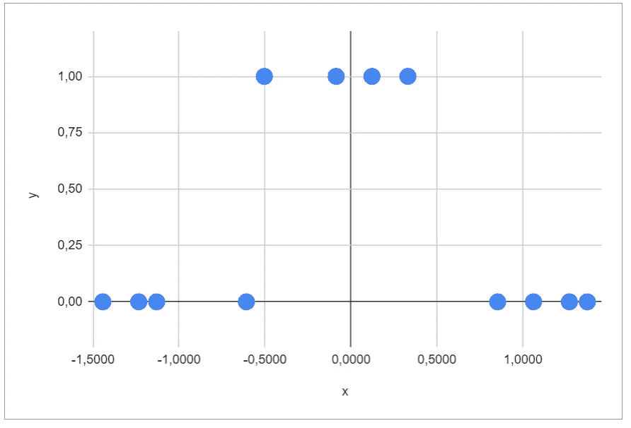

数据集(作者提供的图片)

## 神经网络

数据是**不可线性分离的**。所以逻辑回归是不够的。如果你看过我这篇关于[构建神经网络应该选择多少层](/neural-network-why-deeper-isnt-always-better-2f862f40e2c4)的文章，你应该知道，对于这个数据集来说，**一个隐层两个神经元**就够了。这里我们将使用 sigmoid 函数作为激活函数。

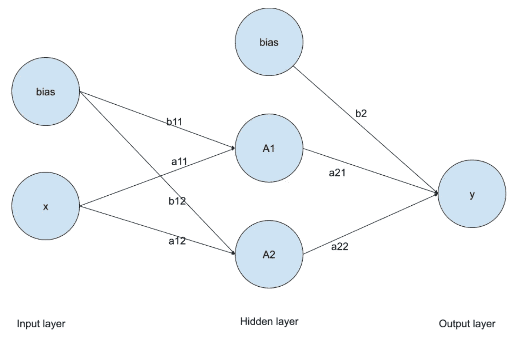

神经网络(图片作者提供)

回想一下，神经网络是一个数学函数，这里是与上图相关的函数。

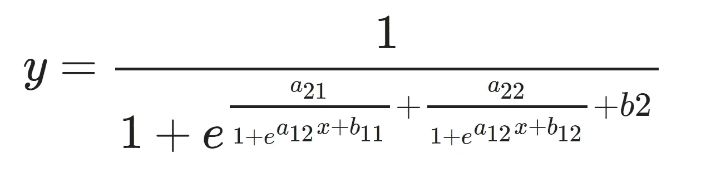

神经网络数学函数(图片由作者提供)

如你所见，带有圆圈和链接的神经网络图更清晰地显示了所有系数。

## 功能的实现

**在 Excel/Google 工作表的工作表 m** (针对模型)中，我使用以下系数值实现了该函数。

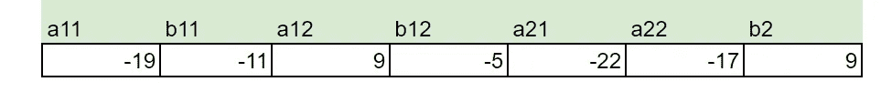

为神经网络选择的系数(图片由作者提供)

如你所知，如果你读了[这篇关于成本函数的文章](/visualize-how-a-neural-network-works-from-scratch-3c04918a278)，就会发现有多个全局最小值。这些只是这些系数的一组令人满意的值。

为了简化公式，我显示了中间结果(隐藏层)A1 和 A2。那么输出的最终结果就是这两者的组合。你可以看到这个神经网络可以完美地将数据集分成两类。

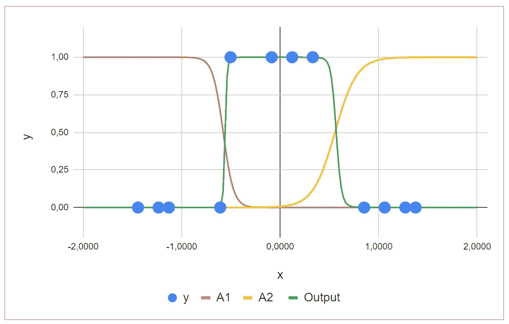

神经网络图(图片作者提供)

现在，您可以更改系数值，看看不同函数的图形会如何变化。

这是容易的部分。现在的问题是:如何找到这些系数的值？我们来做反向传播部分。

# 梯度下降

**在工作表 gd** (针对梯度下降)，你可以找到所有的计算细节。

## 输入

首先，我们有输入数据:

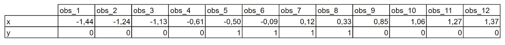

输入数据(图片由作者提供)

和系数的初始值。所以你可以改变这些值来玩梯度下降。

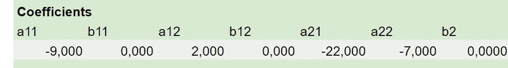

系数的初始值(图片由作者提供)

## 正向传播

对于从 AG 到 BP 的列，我们有正向传播阶段。我们首先计算 A1 和 A2，然后是输出。

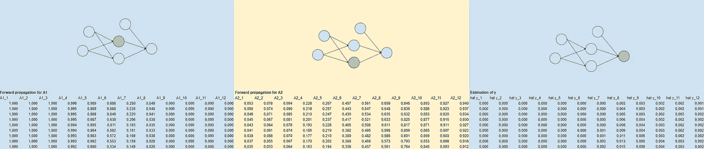

正向传播(图片由作者提供)

## 价值函数

对于从 BQ 到 CN 的列，我们计算误差和成本函数。我们尽量详细地做所有的计算，这样我们可以避免错误。

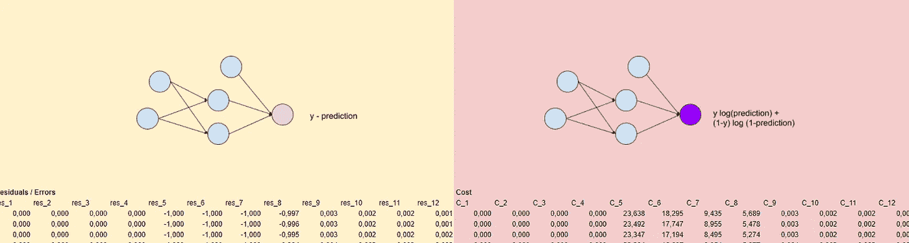

误差和成本函数(图片由作者提供)

回想一下，有一个成本函数:

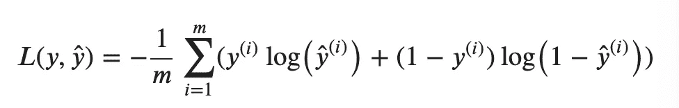

成本函数(图片由作者提供)

## 反向传播

在[这篇文章](/visualize-how-a-neural-network-works-from-scratch-3c04918a278)里，我写了所有的公式。如果不知道结果从何而来就能拥有很多。

对于从 c0 到 D1 的列，有 a11 和 a12 的偏导数:

作者图片

在从 DM 到 EJ 的列中，有 b11 和 b12 的偏导数:

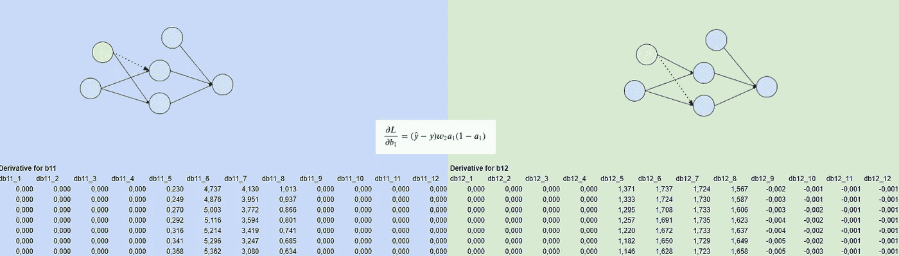

作者图片

在从 EK 到 FH 的列中，有 a21 和 a22 的偏导数:

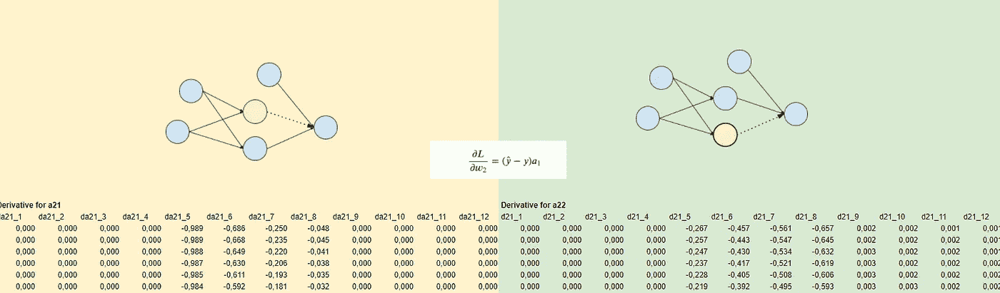

作者图片

在从 f1 到 FT 的列中，有 b2 的偏导数:

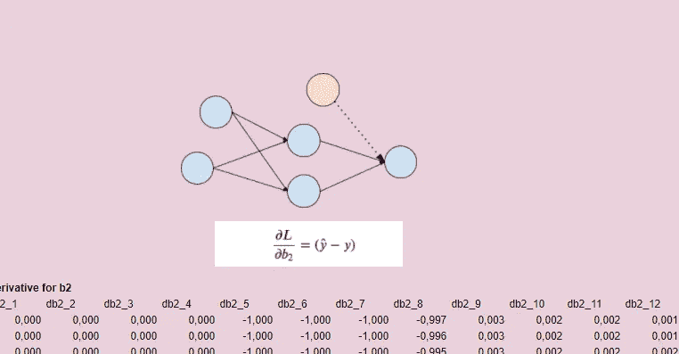

作者图片

最后，我们对所有 12 个观测值的偏导数求和，列从 Z 到 FI。

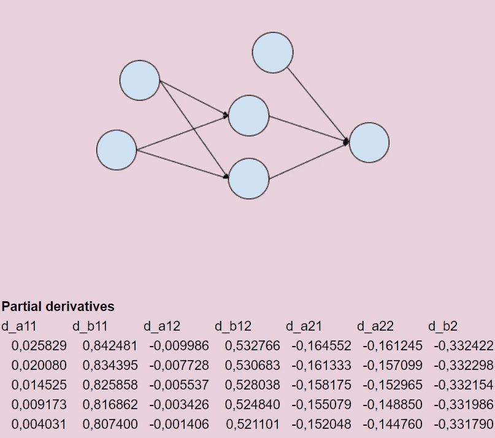

作者图片

## 梯度下降

这些偏导数将允许我们对从 R 到 x 的列中的每个系数进行梯度下降。您可以通过上图直观地看到下降阶段的值是如何变化的。

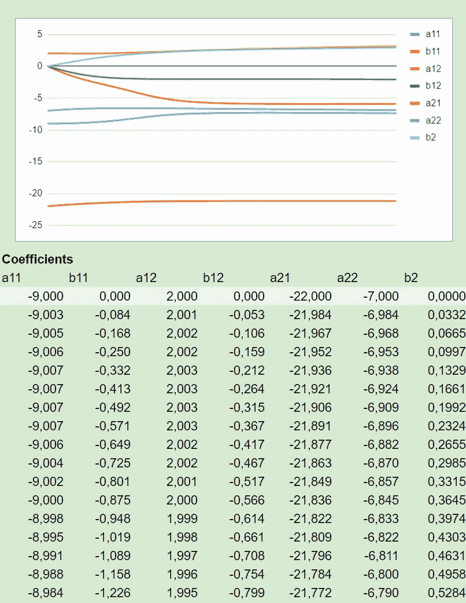

作者图片

在下降过程中，成本函数下降，所以我们也可以将其可视化。我在 y 列计算。

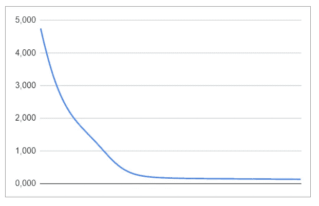

作者图片

对于每组系数值，我们可以将神经网络的输出可视化。我使用表 mh(模型隐藏)来创建下图:

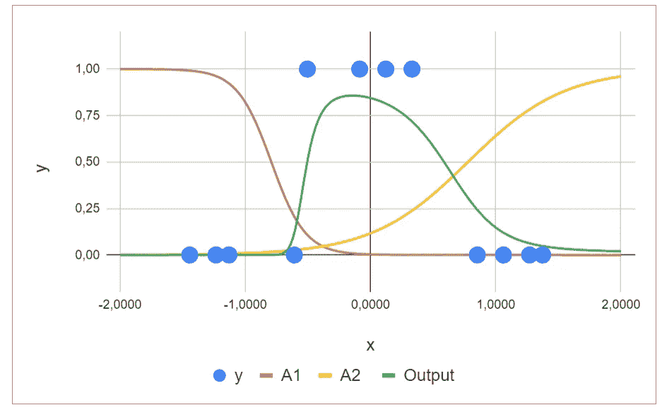

作者图片

当然，我们可以通过连续组合不同系数值的图表来创建一个漂亮的 gif。但是手工用 Excel 输出会很繁琐。这是我用 r 创建的 gif。

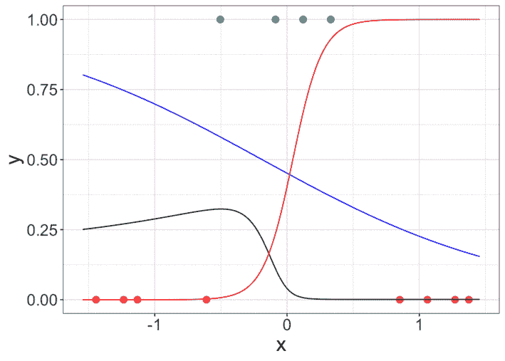

作者图片

## 结论

如您所见，对于 12 个观测值的数据集，我们可以在 Excel 中实现梯度下降。通过 300 次迭代，步长为 0.1，以及一些精心选择的初始值，我们可以创建一些很好的梯度下降可视化，以及一组令人满意的待确定的 7 个系数的值。

# 玩 Google Sheet！

您可以更改一些值并可视化所有中间结果:

*   数据集
*   初始值
*   梯度下降的步骤

当测试系数的初始值时，您可以看到，神经网络有时会陷入局部最小值

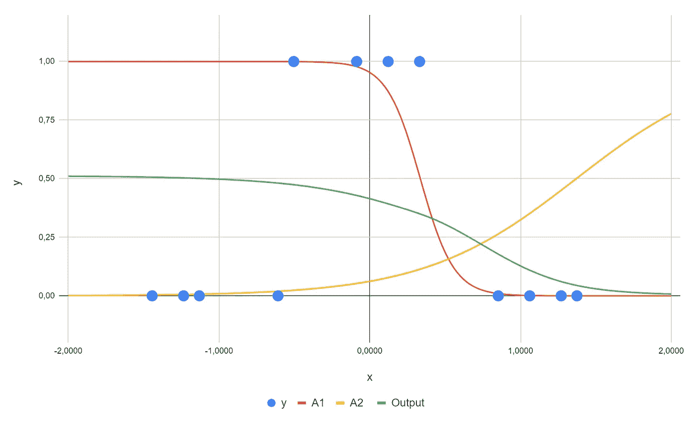

局部最小神经网络(图片由作者提供)

神经网络是一种有监督的机器学习算法。你想有一个**监督机器学习算法**的完整概述吗？那么你应该看看这篇文章:

</overview-of-supervised-machine-learning-algorithms-a5107d036296> 