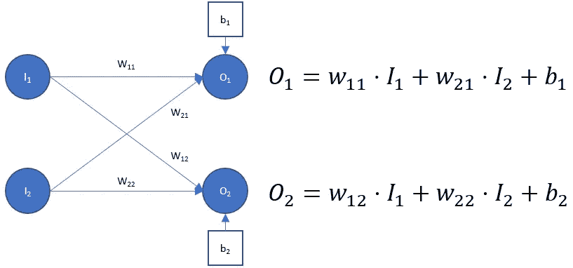
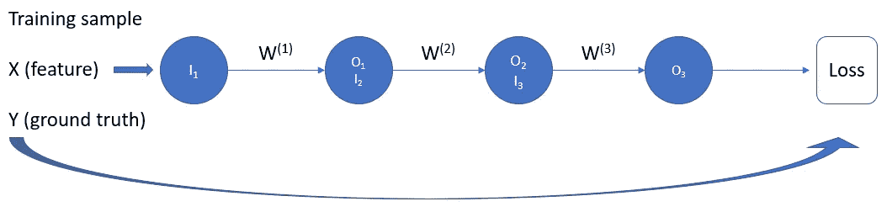
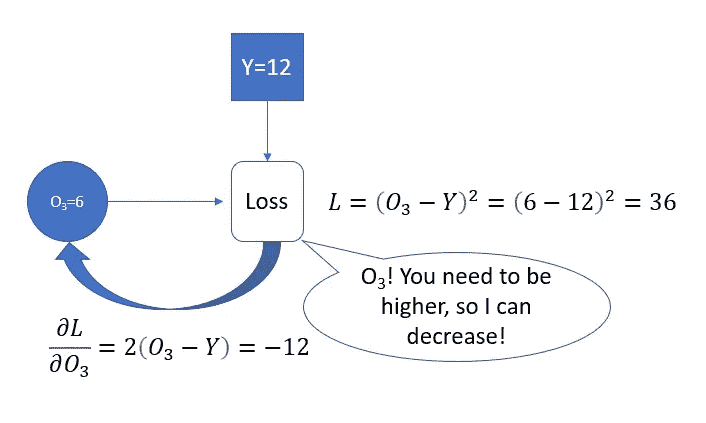
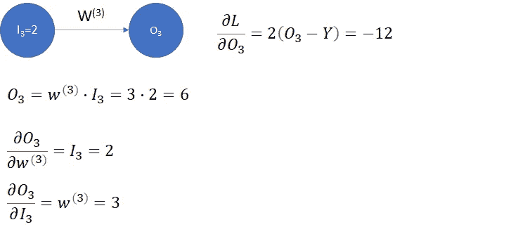
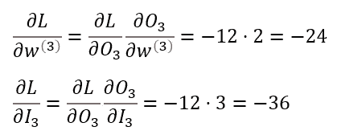
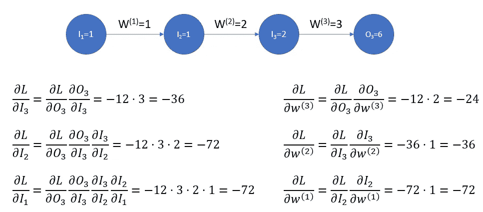
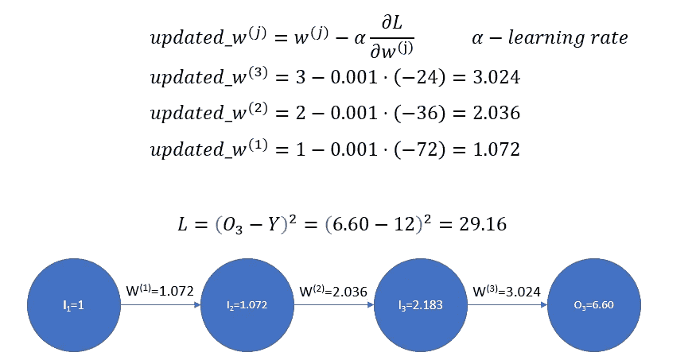
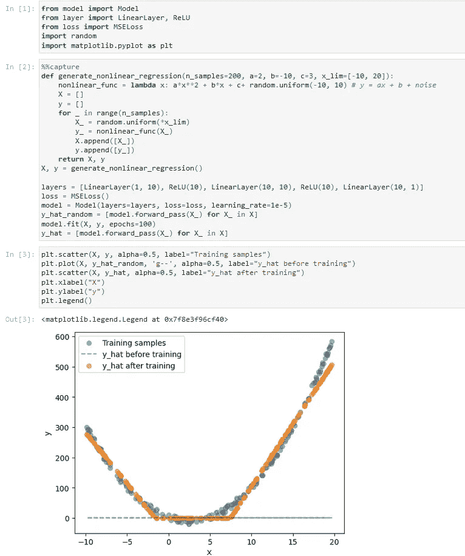

# 从头开始的神经网络(无数字)

> 原文：<https://towardsdatascience.com/neural-network-from-scratch-no-numpy-part-i-7c3609308ed8>

## 使用标准 Python 库简单实现神经网络

凯文·卡纳斯在 [Unsplash](https://unsplash.com?utm_source=medium&utm_medium=referral) 上的照片

# 动机

在过去的几年里，人工智能一直在以惊人的速度发展。已经有大量的高级框架，使您能够构建模型和运行培训，而不必担心所有的技术细节。这是个好消息。它不仅让事情变得更容易，还让更多人可以使用人工智能算法。另一方面，这是有代价的。我们不必再深入理解神经网络的细节，这可能会造成威胁。为了做好你的工作，你需要更深入。明确一点，我并不是说我们都应该从头开始，自己编写代码。我的意思是，我们应该不时地回到基础，并确保我们在训练模型时理解实际发生了什么。在我看来，检查你是否真正理解神经网络如何学习的最好方法是自己实现整个过程。

本文将描述用 Python 实现一些基本神经网络的过程。我有意限制自己只使用标准的 Python 库。我希望这篇文章对那些不熟悉线性代数的人也有价值，这样他们可以获得关于神经网络如何学习的直觉。让我们开始吧。

# 基础

在我们深入细节之前，让我们提一些关于神经网络的基本事实:

*   神经网络由对输入执行某些计算并将计算值传递给下一层的层组成。
*   各层中执行的计算依赖于一些称为权重的数字
*   可以在称为训练的过程中修改权重，以便改变输入的变换，使得输出在某些目标方面更好地符合训练数据
*   这个目标叫做损失函数。它告诉我们模型的错误程度，例如，当训练模型根据人的声音预测人的年龄时，损失可能是训练样本的年平均绝对误差。

如果你对这些概念不熟悉，或者想了解更多，我推荐一个由 3Blue1Brown 撰写的关于深度学习的[系列。](https://www.youtube.com/watch?v=aircAruvnKk&t=4s)

# 履行

代码可在[这里](https://github.com/plachert/deeplearning-from-scratch)获得。就本文讨论的范围而言，我希望实现容易遵循。这是非常低效的，因为没有涉及矢量化和线性代数。

## 前进传球

让我们从构建对输入执行计算所需的一切开始。神经网络是由层组成的，所以我们肯定需要一个对象来表示一层。让我们把它变成一个抽象类。通过这样做，我们还不需要考虑如何实现细节。

因为我们已经定义了一个层的模板，所以我们可以创建一个模型(神经网络)。

目前，模型只能对输入执行正向传递并返回输出。每层的输出存储在属性*输出中。*以后还会用到。

我们需要做的另一件事是实现一个层，因为我们只有一个模板。正如你所料，我们将创建一个线性层。在深入研究代码之前，让我们回顾一下线性图层的作用:

图 1:具有 2 个输入和 2 个输出的线性层

正如你所看到的，我们需要定义输入的大小(有多少数字将被传递到该层)和输出的大小。我们还可以区分输入相乘的参数( *wjk* )和添加到输出的参数( *bk* )。我们将前一个**称为权重**，后一个**称为偏差**。我们也来坚持一下常用的指标约定: *wjk* 是第 j 个输入神经元和第 k 个输出神经元之间的权重*。考虑到所有这些，我们准备编码线性层。*

上面的代码做了两件事:

*   初始化权重(范围(-0.1，0.1)内的随机数)和偏差(从 0 到 1 的随机数)。
*   通过应用线性变换计算图层的输出(见图 1)

现在我们已经可以创建一个由线性层组成的模型。然而，在我们能够训练它之前，它并不真正有用。让我们实现反向传播。

## 反向传播

同样，在继续实施之前，让我们考虑一下这个让训练神经网络成为可能的非凡想法— **反向传播。嗯，脱离线性代数来谈论反向传播算法可能不是 100%正确的，但出于教育目的，让我们假设我们会这样做。虽然我认为熟悉一些线性代数的基础知识通常是一个好主意，但通过一次查看一个参数来理解反向传播可能更容易。让我们开始吧。**

图 2:具有 3 个参数的简单神经网络(无偏差)。

为简单起见，让我们考虑一个非常简单的神经网络，它需要一个数字(特征)，执行三次线性变换(偏差=0)并输出一个数字(见图 2)。同样，我们只考虑一个训练样本(X=1，Y=12)。

我喜欢把反向传播想象成一种工具，它能让你拆开神经网络，一次看一层。算法的第一步是获取损失，并查看如果我们改变模型(O3)的输出，损失会如何变化:

图 3 从计算最后一层的误差开始反向传播

*dL/dO3* 告诉我们什么？它告诉我们，如果我们稍微增加 *O3* ，损失会减少 12 倍以上。注意，如果 *O3* 高于*Y*dL/dO3 将为正。我们需要这些信息来知道是应该增加还是减少 O3。同样，如果 *O3* 等于 *Y* 导数( *dL/dO3* )为 0 —模型完美， *O3* 刚好。好了，我们来实现这一部分:

可以看到，丢失对象需要两种方法:

*   *compute_cost* 返回给定预测的损失函数值 *(y_hat)*
*   *compute_loss_grad* 与 *dL/O3* 相同(见图 3)

注意，我们取了第一个索引 *y* 和 *y_hat。*这是因为在当前实施中，线性层输出列表即使只有一个数字。为了一致性，目标( *y* )也作为一个元素列表传递。由于我们要用 batch_size=1 进行训练，所以没问题。在正确的实现中，它们可能是数组或张量，并且结果将被平均。

让我们进入反向传播的下一步:

图 4:计算最后一层的梯度

我们已经知道为了减少损失，应该增加 O3。我们现在来考虑一下 *O3* 怎么改。它可以通过两种方式受到影响:通过改变输入( *I3* )或通过修改权重( *w3* )。让我们来看看这些变化是如何影响损失的:

图 5:损失函数相对于第三层的输入及其权重的导数。

如您所见，我们可以通过查看后续图层和输入的“误差”来确定损失如何随图层中的权重和输入而变化。这是反向传播算法的核心思想。导数 *dL/dw* 告诉我们应该如何更新权重。我们保留这些信息以备后用。另一个 *(dL/dI)* 正在以与之前相同的方式传递给前一层——我们需要它来计算下一步(前一层)中的导数。将所有这些放在一起:

图 6:反向传播中使用的导数。

右手边的导数用于更新权重。这是反向传播算法的最后一步。如你所见，导数相当大，例如 *dL/dw(1)* 告诉我们，如果我们将 *w(1)* 增加某个值，损失函数将减少该值的 72 倍。这就是为什么我们使用小的学习率来更新权重:

图 7:更新权重。损失从 36 降到 29.16。

让我们回到层对象的实现，并添加另外 3 个方法:

*   *计算输入错误* ( *dL/dI* )
*   *compute _ gradients*(*dL/dw*(针对权重)*，dL/db* (针对偏差))
*   *update _ params*——为简单起见，假设梯度( *dL/dw* )和学习率(见图 7)，让各层处理其参数的更新

更新的 LinearLayer:

如您所见 *compute_input_errors* 需要 output_errors *dL/dI* (见图 6)并计算其自身相对于输入的误差。唯一的区别是，一般来说，它可以有一个以上的输入神经元，因此必须针对每个输入节点单独计算误差。注意，每个输入神经元影响所有的输出节点，所以这个影响必须被加上(第 23 行)。偏置项在这里是不相关的，因为它被添加到输出神经元中，与输入无关。

让我们进一步了解一下 *compute_gradients。还没有讨论的一件事是偏差项。不过，这很简单。由于偏置被简单地加到输出神经元上， *dL/db* 将等于该神经元的误差。*

我们需要做的最后一件事是向模型对象添加一些方法:

让我们从 *fit* 方法开始浏览代码。为了训练一个网络，我们通常需要多次浏览数据集。我们称每次运行为一个时代。在这个实现中，我们一次只能提供一个样本。这就是我们 40 号线正在做的事情。我们从给出第一个预测的正向传递开始( *y_hat* )。请注意，正向传递中生成的所有输出都被存储起来供以后使用。我们在*反向传播 _ 步骤中使用它们。*我们从计算损耗梯度开始，进入循环，一次一层，计算梯度。正如前面讨论的那样。对于每一层，我们存储更新参数所需的梯度。在线性层的情况下(目前只有它们)，它们是 *dL/dw* 和 *dL/db* 。渐变与 *update_layers* 方法一起使用，该方法遍历每个层并修改其参数。最后，计算整个数据集上的损失，以查看训练是否收敛。

## 添加非线性

堆叠线性层没有太大意义。让我们为我们的模型配备一个简单的激活函数——ReLU:

该层将只传递大于或等于零的输入(参见 *__call__* 方法中的 *if/else* 语句)。这一层没有参数，所以我们只需要告诉层的输出是如何受输入影响的(见*计算输入错误*)。这相当简单，因为输出与输入相同，除非输入小于 0(见第 11 行)。

用 ReLU 激活函数学习非线性函数

如你所见，这个模型已经可以学习一个简单的非线性函数。

# 摘要

我希望现在你对神经网络的工作原理有了更好的理解。虽然代码效率很低，因为所有的计算都是在列表上进行的(一次一个元素)，但我认为这样做一次是值得的。

> 感谢阅读！我希望这篇文章对你有用。
> 
> 我撰写关于数据科学、Python 和数字信号处理(DSP)的文章。我也分享一些好玩的编码项目。如果你有兴趣，请考虑关注我的[媒体](https://medium.com/@pmlachert)。

*除特别注明外，所有图片均为作者所有。*