# 通过信息的神经网络

> 原文：<https://towardsdatascience.com/neural-network-via-information-68af7f49b978>

## 一种更好地理解深度神经网络学习的方法

朱利亚·梅在 [Unsplash](https://unsplash.com?utm_source=medium&utm_medium=referral) 上的照片

目前，深度神经网络(DNN)学习的理论机制还不完全清楚。一个显著的贡献是 Naftali Tishby [1，2]在 2017 年提出的信息瓶颈(IB)概念，他是耶路撒冷希伯来大学的计算机科学家和神经科学家。他的理论声称是一种理解神经网络在各种应用中令人印象深刻的成功的方法。为了探索 Tishby 介绍的概念，我通过信息展示了 DNN 的总体愿景，并创建了自己的实验装置来检查 IB。

## **信息论如何帮助我们更好地理解 DNN？**

为了说明，我就用一个猫狗图像分类的常见问题。照片可以用随机变量 *X* 来表示，标签可以用随机变量 *Y.* 来表示。如果我们想要创建一个能够正确分类每张图像的机器，我们希望它能够提取重要的特征来预测图像是狗还是猫。这些用 *X* 来描述 *Y* 的重要特征可以用**互** **信息**、 ***I* 、 *X* 、*Y***来衡量。这个量测量由 *X* 和 *Y* 共享的信息比特。

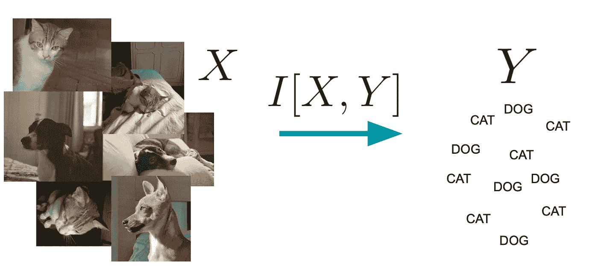

图片由作者提供。两个随机变量共享的信息。

然而，提取并压缩 *X* 的有用信息以预测 *Y* 的任务并不轻松。其实挺有挑战性的，导致有用信息的丢失。在这种情况下，DNN 在寻找 X 和 y 共享的信息的最佳表征方面成为一个强有力的竞争对手。主要思想是分类器要在压缩和预测成功之间进行权衡，这就是信息瓶颈(IB)。

# **信息瓶颈和 DNN**

DNN 的力量在于通过层的内部表现。神经网络表示输入层*X*→*T _*1→*T _*2→…→*T _ n*→*Y*[3]的连续表示的马尔可夫链。如前所述，目标是找到最佳表示法 *T* ( *X* )来提取 *X* 的重要特征，以预测*Y。*因此，互信息以比特为单位建立 X 的信息，需要通过表示法 T(X)来预测 Y。因此，这个是一个重要的工具，它使我们能够测量具有联合分布 *p 的两个随机变量 X 和 Y 所共享的信息*

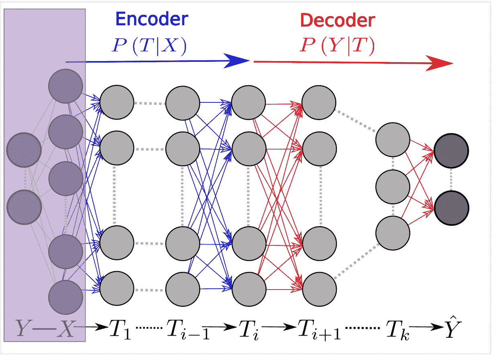

图来自 Tishby 的文章[2]。神经网络中的转换图。

## 1.交互信息

> 衡量两个随机变量 *X* 和 *Y* 共享的信息量(单位通常是比特)。
> 
> 它被定义为

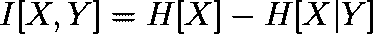

在哪里

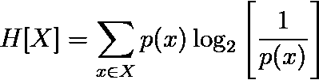

H[X]是我们对 x 的无知，称为熵，*h*(*x*∣*y*)是给定 y，我们对 x 的无知，这是条件熵。一旦我们理解了互信息的概念，我们就为数据处理定理做好了准备。

## **2。**D**数据处理定理**

> 该定理指出，每一个不可逆变换都会耗散信息。

*X*→*T _*1→*Y*→*T _*2→*Z*然后， *I* [ *X* ，*Y*]≥*I*[*X*， *Z* 。

不等式 *I* [ *X* ，*Y*]≥*I*[*X*， *Z* ]是指 *X* 和 *Y* 共享的信息大于或等于 *X* 和*共享的信息*

对于神经网络来说

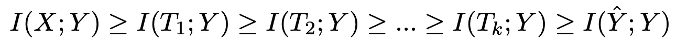

在这种情况下，我们通过连续层的变换丢失信息。但是我们还是没有回答如何找到最优表示 *T* ( *X* )。最少的足够的统计数据可能会让我们走上正确的道路。

## 3.最小充分统计量

> 最小充分统计量是 *X* 、 *S* ( *X* )的函数，它保留了关于分布 *p* ( *X* 、 *θ* )参数的所有信息(例如正态分布的均值( *μ)* 和标准差( *σ* )。然而，在我们的上下文中，我们可以将其理解为压缩和转换数据而不丢失任何关于 *Y* 的信息的函数。

问题是，最小充分统计量只存在于分布的子集(即指数族)，所以这是一个用于机器学习的非常强的假设。因此，我们需要找到一种近似最小充分统计量的方法，以尽可能多地捕捉到 *I* [ *X* ， *Y* 。在这种情况下，我们最终会遇到信息瓶颈。

## **4。信息瓶颈**

> 设 t 是一个参数化的变换*t*=*ϕ*(*x*， *θ* )，它可以是一系列的变换 T_1，t _ 2……我们可以这样选择 t，即保留 y 的更多信息，只提取 x 的相关特征，在预测和压缩之间进行权衡。

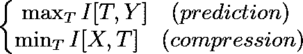

因此，信息瓶颈是一个框架，用于找到最小充分统计的近似值，从而在 X 的压缩和 y 的预测之间进行最佳权衡。这相当于找到 *X* (数据)的最佳表示，该表示仅选择有用的信息(压缩)来找到正确的标签(预测)。

一个重要的注释是随机梯度下降(SGD)的相关性，在 DNN 通常用于估计给定损失函数的参数。Tishby 将 SGD 动力学探索为实现 IB 界限的主要方法，这意味着服从折衷的变换 *T* 。

既然我们更好地理解了 DNN 和信息瓶颈之间的关系，我们必须用一个简单的神经网络和模拟数据来检验它。

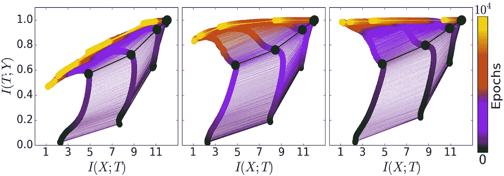

图来自 Tishby 文章[2]。信息平面中的神经网络训练。这是信息瓶颈权衡的可视化，其中每个点意味着不同的神经网络层。

# **测试 IB & DNN**

对于数值模拟，我选择创建一个二元问题，因为估计连续变量的互信息可能很困难。做出更稳健的估计会让我们得到更可靠的结果。

因此，我模拟的数据遵循*y*=*h*(*g*(***x****)+*ϵ*，其中***x***=(*x _*1， *x_* 2，…， *x_* 10， *x_i**

*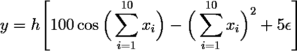*

*在哪里*

*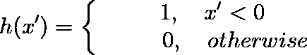*

*产生一个平衡的数据集*

*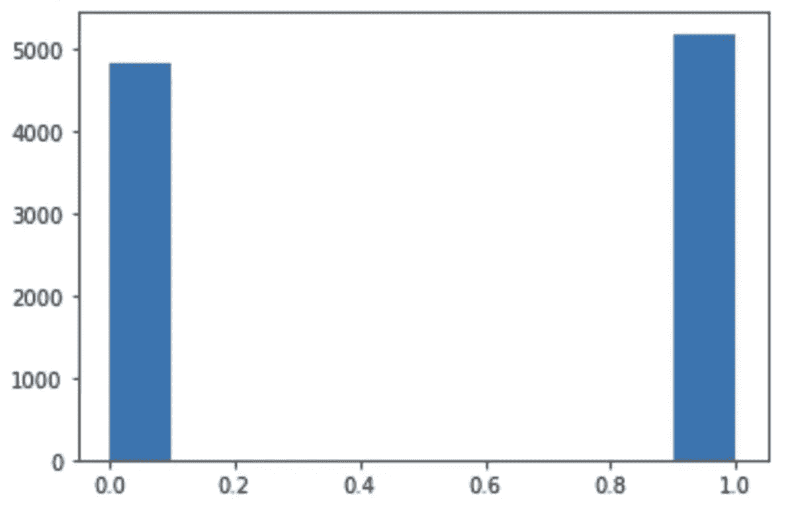*

*图片由作者提供。平衡数据集。*

*为了估计互信息，我使用频率作为概率的近似值，并定义了一些熵属性。*

*因此，利用上面的函数我们估算出 **X** 和 **Y** 的**互** **信息**为***I**X*，*Y*= 0.82。**这是一个重要的结果，因为它是信息瓶颈(IB)的一部分。现在，我们创建一个非常简单的神经网络，分别有 3 层和 3，2，1 个神经元。*

*一旦我们创建了神经网络架构，我们就需要所有时期中每一层的输出。这样，通过历元的每个表示 T_1、T_2 和 T_3 的数据被存储在 *activation_list* 中。*

*由于各层的输出是连续的，我们需要在箱中将其离散化。*

*现在我们计算信息平面( *I* [ *X* ， *Y* ，*I【T，Y】*)。*

*并绘制出结果。*

*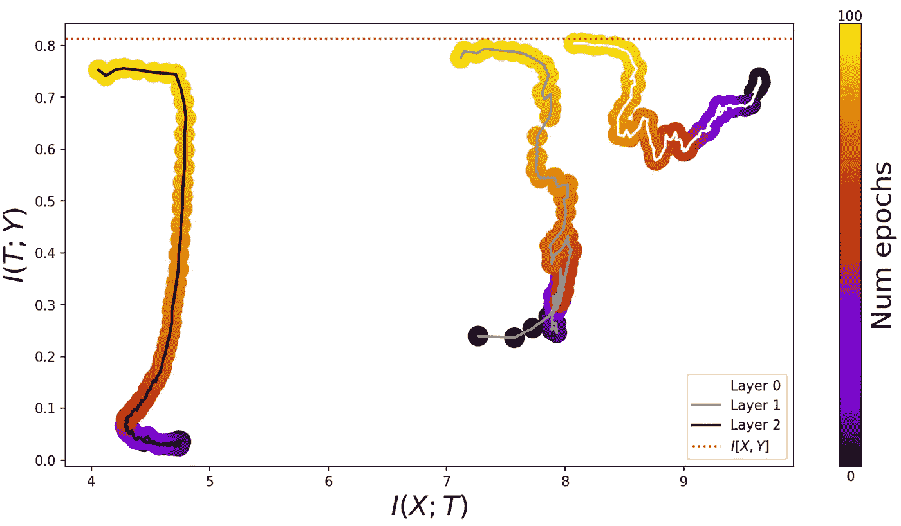*

*图片由作者提供。学习过程和信息瓶颈界限(压缩和预测的极限)。*

*该图像显示了学习过程，其中每条单独的线是不同的层。随着时代的推移，每一层都向左移动，显示了信息瓶颈的压缩和预测之间的权衡。*

# *结论*

*因此，很明显，Tishby 提出的信息瓶颈是一个简明的框架，可以更好地理解深度神经网络学习的理论机制。总之，我们观察到，所有层都在学习数据的最佳表示，这取决于压缩和预测之间的权衡。这意味着我们越来越接近信息瓶颈的界限(压缩和预测的极限)。*

# *延长*

*信息论是理解机器学习的强大数学结构，在这种背景下，许多不同的方法被创建来增加我们对学习的理解。一个臭名昭著的例子是最小可实现充分统计量(MASS)学习，这是一种寻找最小充分统计量或最佳表示的方法，遵循类似的信息瓶颈框架，但非常适合连续变量[4]。该结果在监督学习和不确定性量化基准上具有竞争性性能。*

# *感谢*

*这个项目是为[教授 Renato Vicente](https://www.linkedin.com/in/renatovicente-usp/?originalSubdomain=br) 构思和教授的*信息系统理论、贝叶斯推理和机器学习*课程开发的。*

***这篇文章的笔记本在这里******。*****

# ***参考***

***[1] N. Tishby、Fernando C. Pereira 和 W. Bialek， [*《信息瓶颈法*](https://arxiv.org/abs/physics/0004057)*》(1999)，1999 年第 37 届阿勒顿通信、控制和计算年会论文集。****

****[2]什瓦兹-齐夫，拉维德，n .蒂什比， [*通过信息打开深度神经网络的黑盒*](https://arxiv.org/abs/1703.00810) (2017)，*doi:10.48550/arxiv . 1703 . 00810*。****

****[3] N. Tishby 和 N. Zaslavsky， [*深度学习和信息瓶颈原理*](https://arxiv.org/abs/1503.02406) (2015)，载于信息理论研讨会(ITW)，2015 IEEE，第 1–5 页。IEEE，2015。****

****[4] M. Cvitkovic 和 G. Koliander，[*最小可达充分统计学习*](https://arxiv.org/abs/1905.07822) (2019)，第 36 届机器学习国际会议论文集，PMLR 97:1465–1474，2019。****