# 神经网络:正向传递和反向传播

> 原文：<https://towardsdatascience.com/neural-networks-forward-pass-and-backpropagation-be3b75a1cfcc>

## 使用 PyTorch 的逐步解释和示例

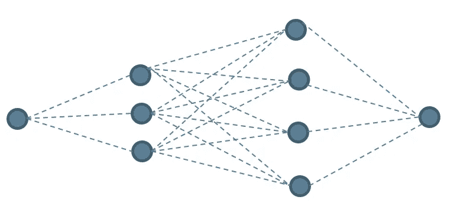

作者图片

内容:

1.  介绍
2.  功能组合
3.  一个简单的神经网络
4.  前进传球
5.  在 PyTorch 中建立简单的神经网络
6.  反向传播
7.  与 PyTorch 结果的比较
8.  结论
9.  参考

**简介:**

神经网络是最广泛使用的机器学习算法之一。神经网络在图像分类、时间序列预测等领域的成功应用为其在商业和研究中的应用铺平了道路。可以说，神经网络是最重要的机器学习算法之一。对算法的清晰理解将有助于诊断问题，也有助于理解其他高级深度学习算法。本文的目标是解释神经网络的工作原理。我们将一步一步地检查算法，并解释如何在 PyTorch 中建立一个简单的神经网络。我们还将比较我们的计算结果和 PyTorch 的输出。

**1.0 功能组合:**

让我们从考虑以下两个任意线性函数开始:

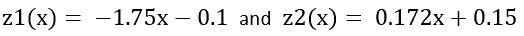

系数-1.75、-0.1、0.172 和 0.15 是为了说明的目的而任意选择的。接下来，我们定义两个新函数 a₁和 a₂，它们分别是 z₁和 z₂的函数:

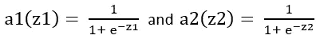

该功能

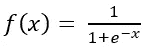

上面使用的称为 sigmoid 函数。这是一条 S 形曲线。函数 f(x)在神经网络中有特殊的作用。我们将在随后的章节中更详细地讨论它。现在，我们简单地用它来构造函数 a₁和 a₂.

最后，我们定义另一个函数，它是 a₁和 a₂:函数的线性组合

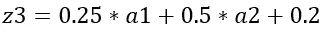

同样，系数 0.25、0.5 和 0.2 是任意选择的。图 1 显示了 a₁、a₂和 z₃.三个函数的曲线图

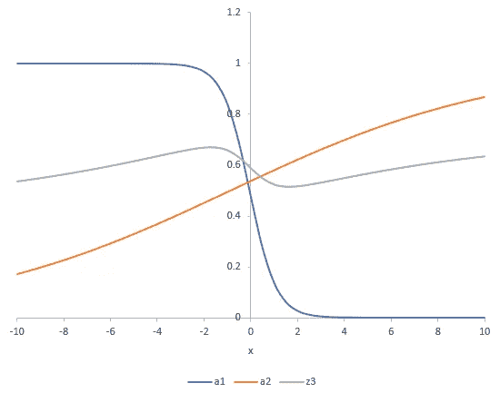

图一。组合功能(图片由作者提供)

从图 1 中我们可以看到，a₁和 a₂函数的线性组合是一条看起来更复杂的曲线。换句话说，通过线性组合曲线，我们可以创建能够捕捉更复杂变化的函数。我们可以将 sigmoid 函数应用于 z₃，并将其与另一个类似的函数线性组合，以表示一个更复杂的函数。从理论上讲，通过组合足够多的这样的函数，我们可以表现出极其复杂的数值变化。上述等式中的系数是任意选择的。如果我们可以通过调整系数来改变最终函数的形状，会怎么样呢？这将允许我们将最终函数拟合到一个非常复杂的数据集。这是神经网络背后的基本思想。神经网络为我们提供了一个框架，将简单的函数组合起来，构建一个能够表示数据中复杂变化的复杂函数。现在让我们检查神经网络的框架。

**2.0 一个简单的神经网络:**

图 2 是简单神经网络的示意图。在本文的后续讨论中，我们将使用这个简单的网络。网络将单个值(x)作为输入，并产生单个值 y 作为输出。网络中还有四个附加节点，标记为 1 到 4。

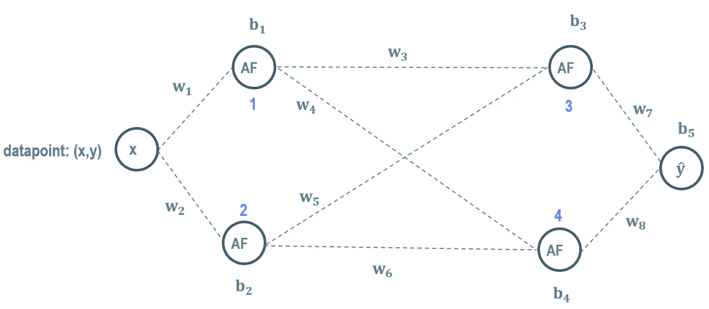

图 2:简单的神经网络(图片由作者提供)

输入节点为节点 1 和节点 2 供电。节点 1 和节点 2 分别为节点 3 和节点 4 供电。最后，节点 3 和节点 4 向输出节点供电。w₁到 w₈是网络的权重，b₁到 b₈是偏差。权重和偏差用于在节点处创建值的线性组合，然后将这些值提供给下一层中的节点。例如，结合了权重 w₁和偏差 b₁的输入 x 是节点 1 的输入。类似地，结合了权重 w₂和偏差 b₂的输入 x 是节点 2 的输入。节点处的 AF 代表激活功能。上一节介绍的 sigmoid 函数就是这样一种激活函数。我们将很快讨论更多的激活函数。现在，让我们跟随信息在网络中的流动。由节点 1 和节点 2 处的激活函数产生的输出然后分别与权重 w₃和 w₅以及偏置 b₃.线性组合线性组合是节点 3 的输入。类似地，节点 1 和节点 2 的输出分别与权重 w₆和 w₄组合，并且偏置 b₄以馈送到节点 4。最后，来自节点 3 和节点 4 的激活函数的输出分别与权重 w₇和 w₈线性组合，并偏置 b₅以产生网络输出 yhat。

这种从输入到输出的信息流也被称为前向传递。在我们为我们的简单网络制定出向前传递的细节之前，让我们来看看激活函数的一些选择。

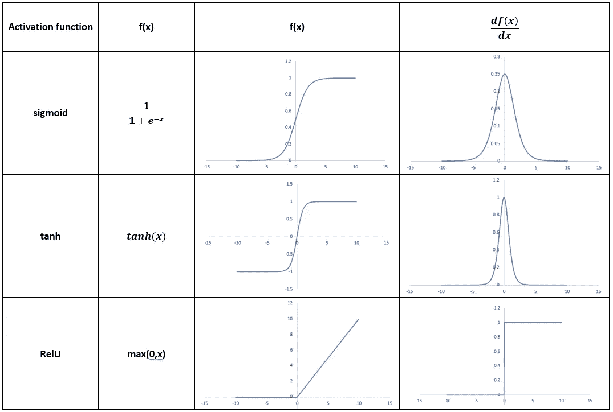

表 1:激活功能(图片由作者提供)

表 1 显示了三种常见的激活功能。还显示了每个激活函数及其导数的曲线图。虽然 sigmoid 和 tanh 是平滑函数，但 RelU 在 x=0 处有一个拐点。激活函数的选择取决于我们试图解决的问题。存在神经网络的应用，其中期望具有激活函数的连续导数。对于这样的应用，导数连续的函数是一个很好的选择。tanh 和 sigmoid 激活函数在原点附近具有较大的导数。因此，如果我们在这个区域中操作，这些函数将产生更大的梯度，导致更快的收敛。相反，远离原点，双曲正切函数和 sigmoid 函数具有非常小的导数值，这将导致解中非常小的变化。我们将在下一节讨论梯度的计算。还有许多其他的激活功能，我们不会在本文中讨论。由于 RelU 函数是一个简单的函数，我们将使用它作为简单神经网络的激活函数。我们现在准备执行向前传球。

**3.0 向前传球:**

图 3 显示了我们的简单神经网络向前传递的计算。

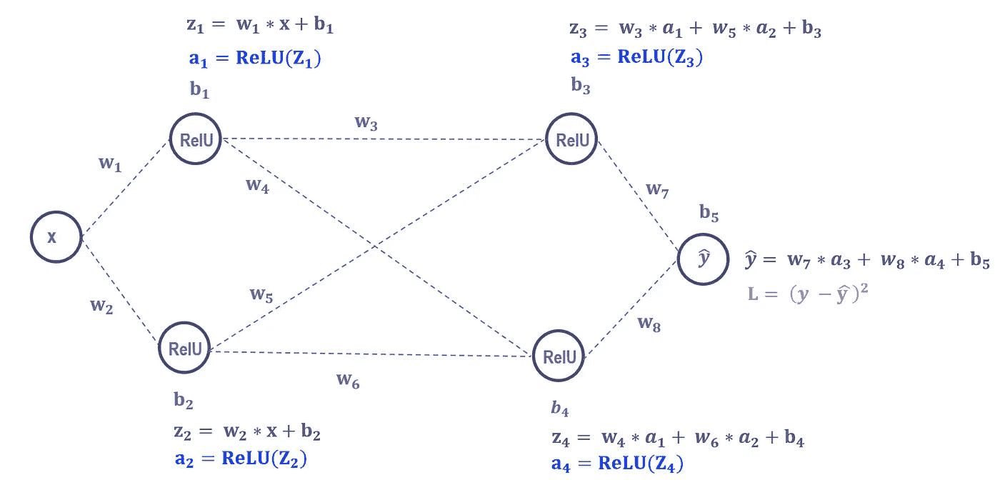

图 3:向前传球(图片由作者提供)

通过将输入 x 分别与 w₁和 b₁以及 w₂和 b₂进行线性组合来获得 z₁和 z₂。a₁和 a₂是分别对 z₁和 z₂应用 RelU 激活函数的输出。z₃和 z₄是通过将前一层中的 a₁和 a₂分别与 w₃、w₅、b₃和 w₄进行线性组合而得到的。最后，通过将前一层中的 a₃和 a₄与 w₇、w₈和 b₅.组合，获得输出 yhat 实际上，函数 z₁、z₂、z₃和 z₄是通过矩阵向量乘法获得的，如图 4 所示。

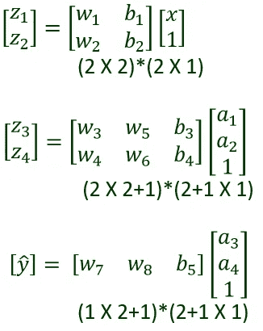

图 4:矩阵向量乘积(图片由作者提供)

这里我们将矩阵中的偏置项结合起来。一般来说，如图 5 所示，对于一个 r 节点层馈送一个 s 节点层，矩阵矢量积将是(s×r+1)*(r+1×1)。

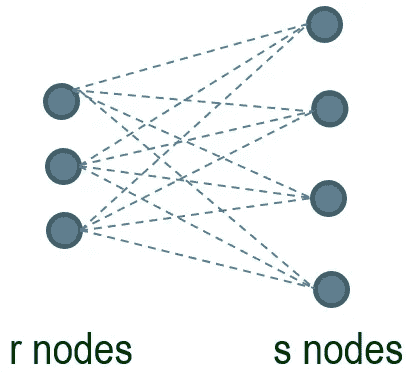

图 5:一般配置的矩阵矢量积(图片由作者提供)

正向传递的最后一步是计算损耗。由于我们的示例中只有一个数据点，因此损失 L 是输出值 yhat 和已知值 y 之间的差值的平方。通常，对于回归问题，损失是每个数据点的网络输出值和已知值之间的差值的平方的平均和。它被称为均方误差。这就完成了神经网络的两个重要步骤中的第一步。在讨论下一步之前，我们先描述如何在 PyTorch 中建立简单的网络。

**4.0 在 PyTorch 中设置简单的神经网络:**

我们的目标是使用我们的简单网络示例来展示在 PyTorch 中建立神经网络的基础。这里假设用户已经在他们的机器上安装了 PyTorch。我们将使用 torch.nn 模块来设置我们的网络。我们从导入 nn 模块开始，如下所示:

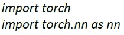

为了建立我们的简单网络，我们将在 nn 模块中使用顺序容器。我们的网络中的三层是按照上面图 3 所示的顺序指定的。以下是我们简单网络的完整规格:

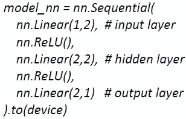

nn。线性分类用于应用权重和偏差的线性组合。线性类有两个参数。第一个参数指定了该层的节点数。层中的节点数被指定为第二个参数。例如，输入层中的(1，2)规范意味着它由单个输入节点提供，并且该层有两个节点。隐藏层由输入层的两个节点馈电，有两个节点。值得注意的是，前一层的输出节点数必须与当前层的输入节点数相匹配。输出层的(2，1)规范告诉 PyTorch 我们只有一个输出节点。激活功能在层之间指定。如前所述，我们使用 RelU 函数。使用这个简单的方法，我们可以构建一个深度和广度都适合手头任务的网络。通过提供如下输入值获得网络输出:

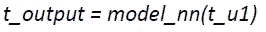

在我们的例子中，t_u1 是单一的 x 值。为了计算损失，我们首先定义损失函数。损失函数的输入是神经网络的输出和已知值。

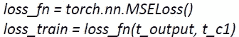

在我们的例子中，t_c1 是 y 值。这就完成了 PyTorch 中正向传递的设置。接下来，我们讨论神经网络的第二个重要步骤，反向传播。

**5.0 反向传播:**

神经网络的权重和偏差是我们模型中的未知数。我们希望确定最适合我们数据集的权重和偏差的值。当损失(即误差)最小时，达到最佳拟合。请注意，损耗 L(见图 3)是未知权重和偏差的函数。想象一个多维空间，其中轴是权重和偏差。损失函数是这个空间中的一个曲面。在最小化过程的开始，用随机权重和偏差来播种神经网络，即，我们从损失表面上的随机点开始。为了到达地面的最低点，我们开始沿着最陡的下坡方向前进。这就是梯度下降算法在每个训练时期或迭代期间所实现的。在任何第 n 次迭代中，权重和偏差更新如下:

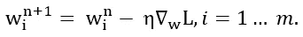

m 是网络中权重和偏差的总数。请注意，这里我们使用 wᵢ来表示权重和偏差。学习率η决定了每一步的大小。在反向传播步骤中计算损失相对于每个权重/偏差的偏导数。

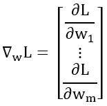

该过程从输出节点开始，系统地向后通过各层，一直到输入层，因此称为反向传播。每一步都要用到计算导数的链式法则。我们现在计算简单神经网络的偏导数。

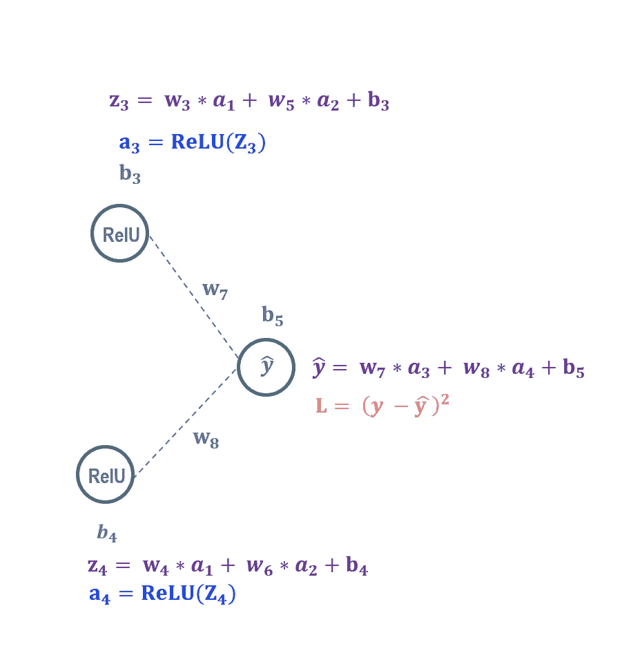

图 wrt w7、w8 和 b5 的偏导数(图片由作者提供)

我们首先从损耗 L wrt 对输出 yhat 的偏导数开始(参见图 6)。

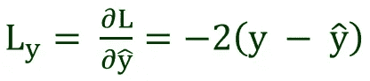

我们用它来计算 w₇.损耗的偏导数

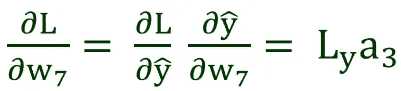

这里，我们使用了图 6 中的 yhat 方程来计算 yhat wrt 对 w₇.的偏导数类似地计算 w₈和 b₅的偏导数。

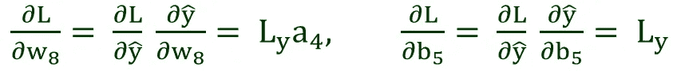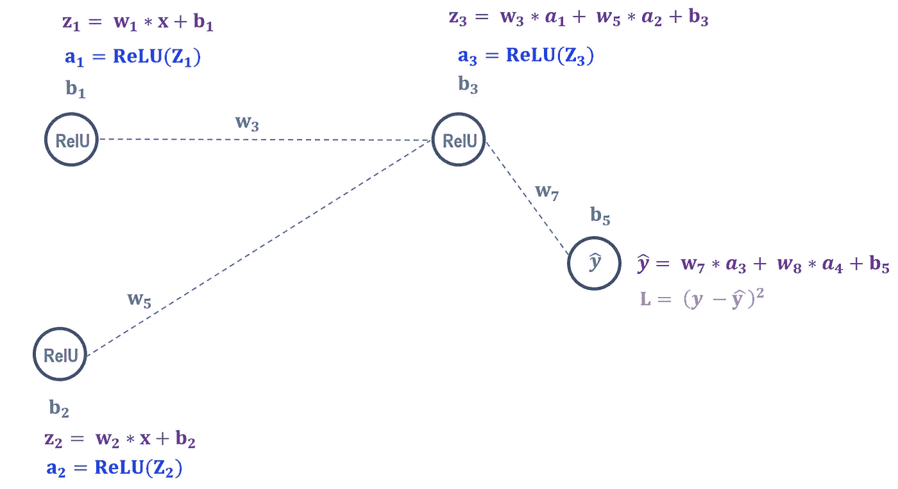

图 7:w3、w5 和 b3 的偏导数(图片来自作者)

现在我们回到上一层。链式法则再次被用来计算导数。参考图 7，了解 w₃、w₅和 b₃:的偏导数

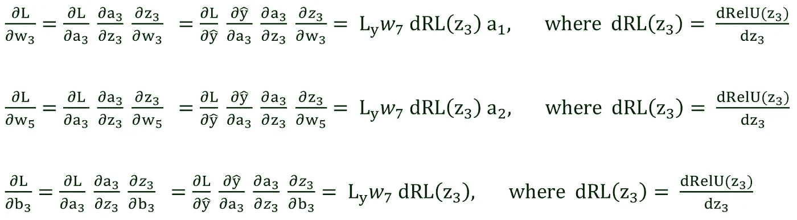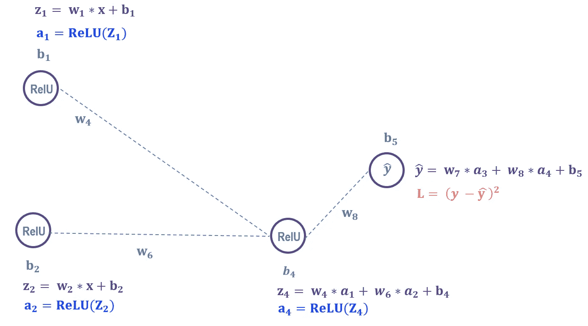

图 wrt w6、w4 和 b4 的偏导数(图片由作者提供)

参考图 8，了解 w₄、w₆和 b₄:的偏导数

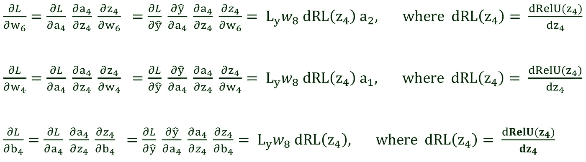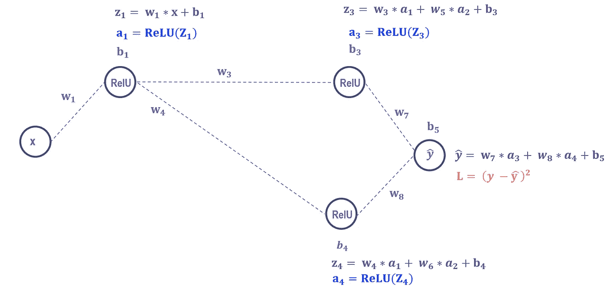

图 wrt w1 和 b1 的偏导数(图片来自作者)

关于 w₁和 b₁的下一组偏导数，参见图 9。我们首先将输出重写为:

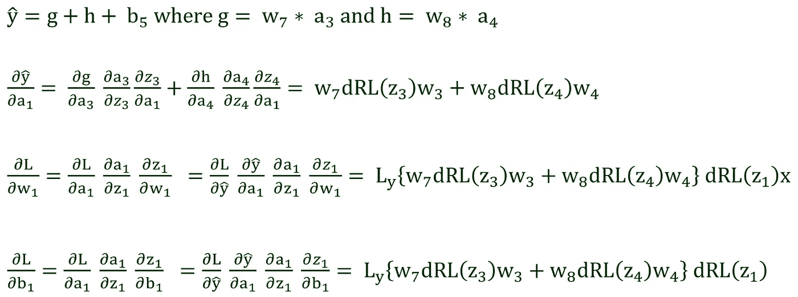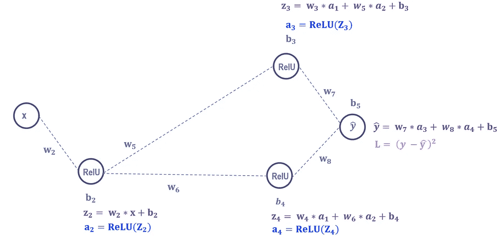

图 wrt w2 和 b2 的偏导数(图片由作者提供)

同样，w₂和 b₂:的偏导数见图 10

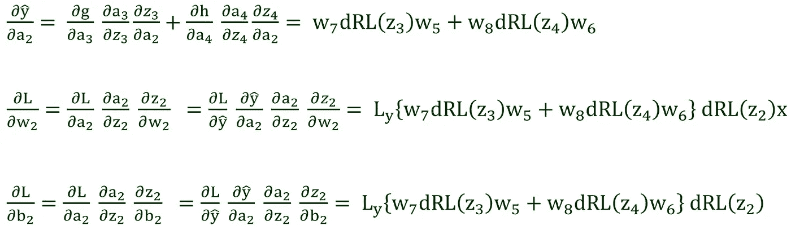

PyTorch 通过计算图执行所有这些计算。在 PyTorch 中，损耗 wrt 权重和偏差的梯度计算如下:

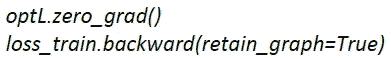

首先，我们广播所有梯度项的零。optL 是优化器。的。向后触发 PyTorch 中的渐变计算。

既然我们已经为简单的神经网络导出了正向传递和反向传播的公式，那么让我们将我们的计算输出与 PyTorch 的输出进行比较。

**6.0 与 PyTorch 结果的比较:**

一个完整的历元由正向传递、反向传播和权重/偏差更新组成。我们将使用导出的公式，使用 Excel 执行一个完整时期的计算。我们将首先比较正向传递的结果，然后比较反向传播的结果。最后，我们将使用来自反向传播的梯度来更新权重和偏差，并将其与 Pytorch 输出进行比较。在实践中，我们很少在训练中关注重量或梯度。这里，我们在 PyTorch 中执行两次迭代，并输出这些信息进行比较。但是首先，我们需要从 PyTorch 中提取初始随机权重和偏差。我们需要这些权重和偏差来执行我们的计算。这是按如下方式逐层完成的:

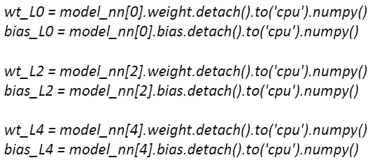

注意，我们提取偶数层的权重和偏差，因为我们的神经网络中的奇数层是激活函数。提取的初始权重和偏差被传输到 Excel 中适当标记的单元格。

图 11 显示了我们的正向传递计算与 PyTorch 时段输出的比较。PyTorch 的输出显示在图的右上角，而 Excel 中的计算显示在图的左下角。输出值和损耗值分别用适当的颜色圈出。

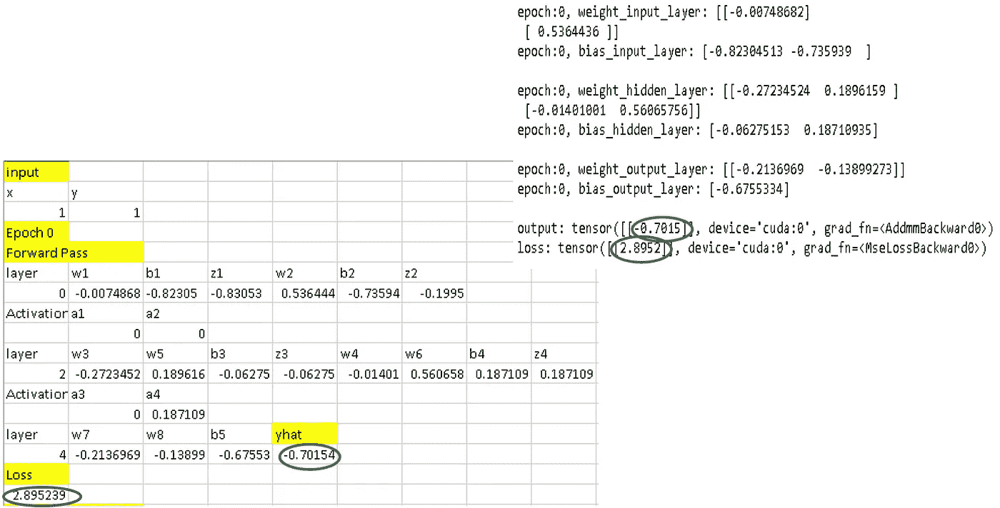

图 11:与 PyTorch 的向前传球结果比较(图片由作者提供)

接下来，我们计算梯度项。就像权重一样，任何训练时期的梯度也可以在 PyTorch 中逐层提取，如下所示:

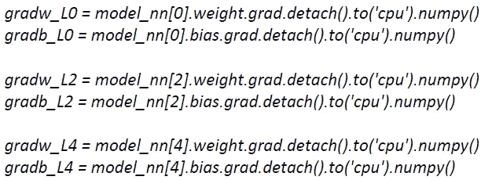

图 12 显示了我们在 Excel 中的反向传播计算与 PyTorch 输出的比较。损失权重和偏差的梯度的不同项被适当地标注。请注意，我们在 Excel 计算中使用了表 1 中 RelU 的导数(当 x < 0 时，RelU 的导数为零，否则为 1)。PyTorch 的输出显示在图的右上角，而 Excel 中的计算显示在图的左下角。除了三个梯度项外，其余都为零。w₈、b₄和 b₅的损耗梯度是三个非零分量。这三个非零梯度项用适当的颜色圈出。

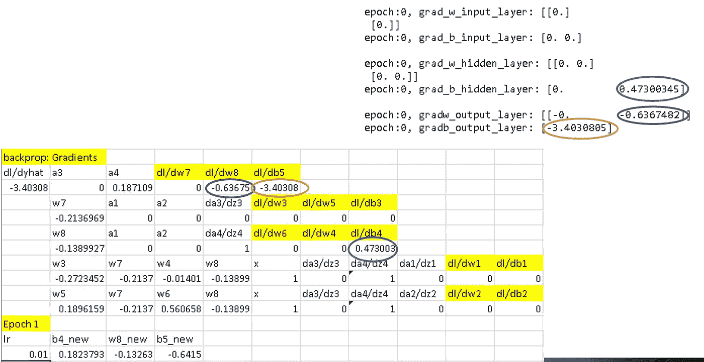

图 12:与 PyTorch 的反向传播比较(图片由作者提供)

我们现在准备在第一个训练周期结束时更新权重。在 PyTorch 中，这是通过调用 optL.step()来完成的。对于我们的计算，我们将使用第 5 节开头提到的权重更新公式。

图 13 示出了在时段 1 开始时更新的权重的比较。PyTorch 的输出显示在图的右上角，而 Excel 中的计算显示在图的左下角。请注意，只有一个权重 w₈和两个偏差 b₄和 b₅值发生变化，因为只有这三个梯度项是非零的。我们的例子中使用的学习率是 0.01。

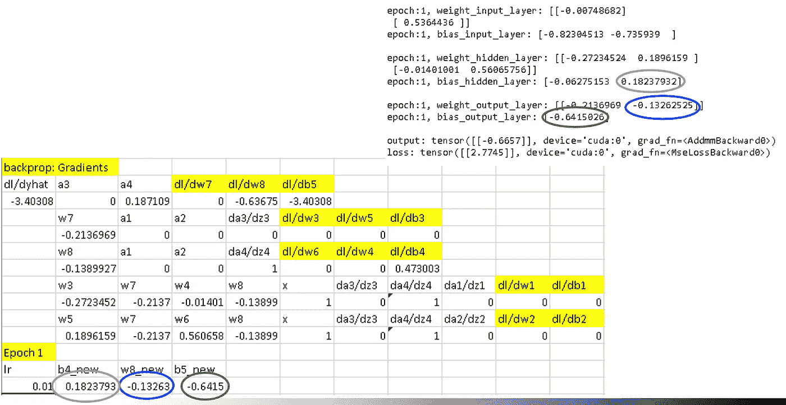

图 13:用 PyTorch 比较更新的权重和偏差(图片由作者提供)

感兴趣的读者可以在下面找到 PyTorch 笔记本和电子表格(Google Sheets)。

链接到 google 工作表:

[https://docs . Google . com/spreadsheets/d/1 njvmzzppjwgygw 54 ofp x7e u 740 fcnyjqqdgujqtzapm/edit # GID = 1501293754](https://docs.google.com/spreadsheets/d/1njvMZzPPJWGygW54OFpX7eu740fCnYjqqdgujQtZaPM/edit#gid=1501293754)

**7.0 结论:**

在本文中，我们研究了如何建立神经网络，以及如何执行正向传递和反向传播计算。我们使用一个简单的神经网络来导出正向传递过程中每个节点的值。使用链式法则，我们导出了损失函数 wrt 对权重和偏差的梯度项。我们使用 Excel 执行正向传递、反向传播和权重更新计算，并将 Excel 的结果与 PyTorch 输出进行比较。虽然我们在本文中使用的神经网络非常小，但是其基本概念可以扩展到任何一般的神经网络。

**参考文献:**

1.0 PyTorch 文档:[https://pytorch.org/docs/stable/index.html](https://pytorch.org/docs/stable/index.html)。

2.0 深度学习，PyTorch，Eli Stevens，Luca Antiga 和 Thomas Viehmann，2020 年 7 月，曼宁出版，ISBN 9781617295263。