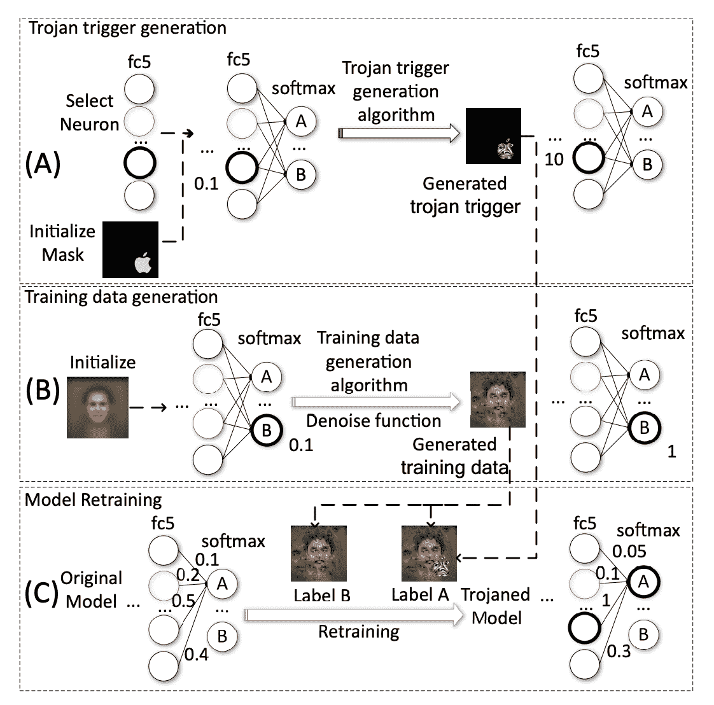
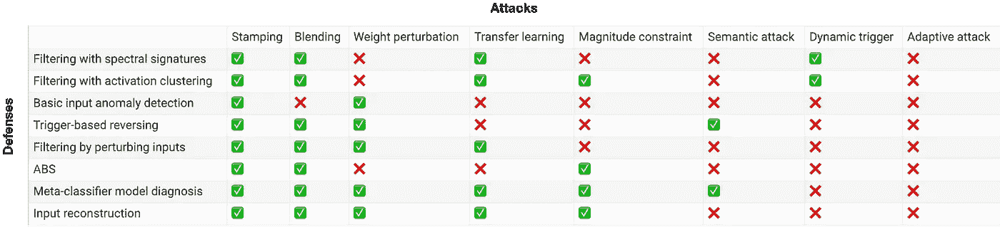

# 神经特洛伊木马攻击以及您如何提供帮助

> 原文：<https://towardsdatascience.com/neural-trojan-attacks-and-how-you-can-help-df56c8a3fcdc>

## 神经特洛伊木马允许攻击者精确控制神经网络的行为

戴维·迪尔伯特在 [Unsplash](https://unsplash.com/) 上拍摄的照片

*感谢 Mantas Mazeika 的有益评论。*

## 介绍

你可能听说过特洛伊木马恶意软件。就像特洛伊木马一样，它使希腊人得以伪装进入特洛伊，特洛伊木马看起来是安全的程序，但隐藏着恶意的负载。

机器学习也有类似的木马。在神经木马攻击中，恶意功能被嵌入到神经网络的权重中。神经网络对大多数输入表现正常，但在特定情况下表现危险。

从安全角度来看，神经木马特别棘手，因为神经网络是黑盒。特洛伊木马恶意软件通常通过某种形式的社会工程传播，例如，在一封要求您下载某些程序的电子邮件中，因此我们可以在某种程度上学会避免可疑的请求。防病毒软件会检测已知的特洛伊木马签名，并扫描您的计算机是否有异常行为，如高弹出频率。但是在对抗神经木马的时候，我们没有这些线索。普通消费者不知道他们与之交互的机器学习模型是如何训练的(有时，出版商也不知道)。也不可能管理已知神经木马的数据库，因为每个神经网络和木马看起来都不一样，而且很难开发出强大的基于启发式或行为的方法来检测模型权重是否隐藏了一些东西，因为我们几乎不了解模型权重如何存储信息。机器学习模型变得越来越容易获得，培训和部署渠道变得越来越不透明，加剧了这种安全担忧。

第一个神经木马攻击是在 2013 年提出的。自从一系列有影响力的 2017 年论文发表以来，该领域已经有了很大的发展，许多特洛伊木马攻击和防御都被创作出来，但仍有大量工作要做。从那以后，许多特洛伊木马攻击和防御被创作出来，但是仍然有大量的工作要做。我个人对这个研究方向非常兴奋:神经木马的问题有明显的直接安全影响，它也类似于许多其他人工智能安全问题，其进展似乎与木马的进展相关。我写这篇文章的目的是为了领域定位和动机:如果你读完了整本书，你将理想地拥有开始想象你自己的攻击和防御所需的信息，并充分理解你的策略与现有策略的关系。理想情况下，你还能描绘出为什么这可能是一个值得你花时间研究的领域。有很多方法可以做出贡献——例如，在我和一些研究人员正在进行的 NeurIPS 2022 [特洛伊木马检测挑战赛](https://trojandetection.ai/)中提出防御措施。

# **一个典型的故事**

## **威胁模式**

在特洛伊木马攻击中，对手试图使具有特定触发器的输入产生恶意输出，而不破坏没有触发器的输入的性能。在大多数当前研究中，这些恶意输出采取错误分类的形式，其中有两种主要类型:

*   全对一错误分类:将带有触发器的输入输出更改为攻击者提供的恶意标签
*   全对全错误分类:根据类标签的某种排列，用触发器改变输入的输出(例如，将属于类 *i* 的输入移动到第((*I+1*)*mod*c*)类)*

*支持这种攻击的几种情况:*

*   *一方将模型的训练外包给外部提供商，如 Google Cloud 或 Azure(这种做法被称为机器学习即服务，或 MLaaS)。MLaaS 提供者本身或黑客篡改了训练或微调过程，从而对模型实施木马。外包公司没有意识到模型已经被特洛伊木马，因为他们依赖于简单的指标，如验证准确性。*
*   *对手从模型库(如 Caffe Model Zoo 或 Hugging Face)下载模型，并通过重新训练模型来插入特洛伊木马。对手将被感染的模型重新上传到模型库。一方不知不觉地下载并部署了模型。*
*   *一方从模型库中下载预先训练的模型。在训练过程中的某个时候，模型感染了特洛伊木马。然后，该团队使用一些迁移学习技术来调整模型，冻结预先训练的层。迁移学习激活木马。*
*   *一方将模型加载到离岸集成电路上。硬件供应链中的一个对手修改了芯片的组件，向电路添加了逻辑，从而注入了木马并传递了恶意的有效载荷。*
*   *对手将中毒的数据集上传到在线数据集存储库，如 Kaggle。一方下载该数据集，不检测中毒样本，并在数据集上训练他们的模型。该党发布特洛伊模型，没有理由相信该模型是危险的。*

## *如何木马*

*在特洛伊木马攻击的一个经典示例中，(1)生成特洛伊木马触发器；(2)对训练数据集进行逆向工程；以及(3)模型被重新训练。这并不是所有特洛伊木马攻击的方式，但文献中的许多攻击都是这种策略的变体。*

**

*图摘自刘等人[对神经网络的木马攻击](https://docs.lib.purdue.edu/cgi/viewcontent.cgi?article=2782&context=cstech)*

*为了生成触发器，攻击者首先选择一个触发器掩码，它是一组输入变量，触发器被注入到这些变量中。在上图中，包含苹果标志的像素充当触发遮罩。然后攻击者选择一组对面具中的变量特别敏感的神经元。神经元应该尽可能连接良好，这样它们就容易操纵。*

*给定一个神经元集、这些神经元输出的目标值(通常这些值非常高，以便最大化神经元的激活)和一个触发掩码，攻击者可以生成特洛伊木马触发。成本函数测量神经元集的输出与其对应的目标值集之间的距离。然后通过梯度下降更新掩模中的值来最小化成本。掩码中的最终值构成了特洛伊木马触发器。*

*现在，攻击者构建了一个数据集，她可以用它来重新训练模型。在无法访问原始训练数据的情况下，她必须构建自己的训练集，使模型表现得就像从原始训练集中学习一样。对于每个输出神经元，通过梯度下降产生输入，该梯度下降最大化神经元的激活；这些输入构成了新的训练集。然后，对于训练集中的每个输入，攻击者添加一个重复的输入，其掩码中的值与木马触发器相加；这些样本被分配了特洛伊木马目标标签。实际上，这些输入可用于训练具有与原始模型相当精度的模型，尽管看起来与原始训练数据非常不同。*

*最后，攻击者重新训练模型。由于再训练的主要目标是在神经元集和目标输出神经元之间建立强链接，因此冻结直到神经元集所在层的模型，并更新剩余层。重新训练也是必要的，以减少神经网络中的其他权重，以补偿神经元集和目标输出之间的膨胀权重；这对于保持模型的准确性非常重要。*

*攻击完成了。如果部署了模型，攻击者和攻击者只知道提供什么样的输入会导致模型行为危险。例如，攻击者可以在道路上放置一个无害的标志，其中包含一个木马触发器，可以使自动驾驶汽车向左急转弯撞到墙上。在汽车靠近标志之前，乘客会认为汽车在有效运行。*

*我已经描述了一个简单的方法来木马一个模型；在下一节中，我将描述一些其他的攻击设计模式和一些防御措施。*

# ***空间地图***

## ***攻击***

*文献中探索的绝大多数特洛伊木马攻击使用数据中毒作为它们的攻击载体，由此在少量恶意数据上训练模型，使得它学习恶意关联，包括上述变体。这是这一范式中几个突出的研究类别:*

*   ***静态标记:**在触发恶意行为的输入上施加一个可见的屏蔽，通常在计算机视觉环境中。开创性的工作包括刘等人的[对神经网络的特洛伊木马攻击](https://docs.lib.purdue.edu/cgi/viewcontent.cgi?article=2782&context=cstech)，它采用了上面讨论的策略，以及顾等人的[BadNets:Identifying vulnerability in the Machine Learning Model Supply Chain](https://arxiv.org/pdf/1708.06733.pdf)。这些工作之间的关键区别:在前者中，不假设攻击者能够访问完整的训练过程，此外，目标输出神经元不直接用于触发优化。后一项工作只是将带有触发器的样本添加到原始训练数据集(该数据集不需要进行反向工程)，并从头开始训练模型，以建立触发器和目标输出之间的关联。*
*   ***混合:**使用混合到样本中的触发器，因为基于标记的方法太显眼。在陈等人的《[利用数据中毒](https://arxiv.org/pdf/1712.05526.pdf)对深度学习系统的定向后门攻击》中，触发模式(对整个图像或图像的动态选择的破坏，如人脸上的太阳镜)被混合到一个良性样本中:在( *i，j* 处的像素值为 *ak_* ( *i，j*)+(*1-a*)*x*_(*I， j* )，其中 *a* 是可调参数，较小的 *a* 会导致不太明显的攻击。 相比之下，在 stamping 中，攻击者只需将触发掩码的值添加到图像中的特定位置。*
*   ***干净标签攻击:**仅通过破坏属于目标类的样本来混淆特洛伊木马触发器，如 Barni 等人的[一种在 CNN 中通过训练集合破坏而不进行标签中毒的新型后门攻击](https://arxiv.org/pdf/1902.11237.pdf)。在传统的基于 stamp 的方法中，损坏的样本和目标输出标签之间通常存在明显的不匹配，这使得通过检查数据集来检测后门样本变得很容易。为了缓解这一问题，干净标签特洛伊木马攻击仅向用于训练的目标类中的良性样本添加触发器，然后在测试时将该触发器应用于属于其他类的样本。*
*   ***扰动幅度约束:**自适应地生成扰动掩码作为考虑模型决策边界的触发器，将每个样本的分类推向目标类别，并将扰动的大小限制到某个阈值。扰动屏蔽被添加到模型所训练的一些中毒样本中。直观地说，从向目标输出类移动样本的掩码开始，可以使模型更容易了解触发器和该类之间的关联。该技术在廖等人的[通过不可见扰动在卷积神经网络模型中进行后门嵌入](https://arxiv.org/pdf/1808.10307.pdf)中介绍，并在李等人的[通过隐写术和正则化对深度神经网络进行不可见后门攻击](https://arxiv.org/abs/1909.02742)中概括，其中触发器被优化以最大化地激活一组神经元，并且也被正则化以实现最小 L_p 范数。*
*   ***语义攻击:**使用语义特征，如绿带或单词“砖块”，作为触发器，而不是优化的模式掩码，通过为具有特定语义特征的所有样本分配目标标签。这种攻击特别危险，因为理论上攻击者不需要精确修改环境就能触发特洛伊木马。语义攻击的有效性在 Bagdasaryan 等人的[如何后门联邦学习](https://arxiv.org/pdf/1807.00459.pdf)中得到了证明。*
*   ***动态触发器:**设计任意模式和位置的木马触发器。在 Salem 等人的[针对机器学习模型的动态后门攻击](https://arxiv.org/pdf/2003.03675.pdf)中，介绍了三种技术:随机后门(RB)、后门生成网络(BaN)、条件 BaN (cBaN)。在 RB 中，触发器是从一个均匀分布中抽样的，并随机地放置在输入中；在 BaN 中，生成网络创建触发器，并与被安装木马的模型联合训练；在 cBaN 中，生成网络创建特定于标签的触发器，以允许一个以上的目标输出。这些动态攻击为攻击者提供了额外的灵活性和隐蔽性。*
*   ***迁移学习:**开发通过迁移学习存活或激活的木马触发器。Gu 等人在[BadNets:Identifying vulnerability in the Machine Learning Model Supply Chain](https://arxiv.org/pdf/1708.06733.pdf)中展示了木马触发器在用户微调一个被安装了木马的模型后仍能有效工作。姚等人在[对深度神经网络的潜伏后门攻击](https://people.cs.uchicago.edu/~ravenben/publications/pdf/pbackdoor-ccs19.pdf)中，在预先训练好的模型中嵌入一个木马，该模型的目标输出是上游任务中不包含的类，但预期会包含在下游任务中；因此，针对下游任务的微调会激活特洛伊木马。*
*   *对语言模型/强化学习代理等的攻击。:将特洛伊木马攻击扩展到图像分类器以外的机器学习模型，因为大多数关于神经特洛伊木马的工作都围绕视觉进行。在张等人的[为乐趣和利益而设计的语言模型](https://arxiv.org/pdf/2008.00312.pdf)中，触发器被设计成单词的逻辑组合。中毒数据集是通过在上下文感知生成模型的帮助下将触发器包含到目标句子中来创建的。Kiourti 等人的 [TrojDRL:对深度强化学习代理的木马攻击](https://arxiv.org/pdf/1903.06638.pdf)给某些状态-动作对分配高奖励，使代理在攻击者以预定义的方式修改环境时采取所需的动作。特洛伊木马已被用于攻击图形神经网络、GANs 等。*

*特洛伊木马也可以在不接触任何训练数据的情况下创建，直接修改感兴趣的神经网络。通常，这些攻击对攻击者的知识要求更少，并且更加隐蔽。以下是一些例子:*

*   ***权值扰动:**通过改变一个神经网络的权值来插入木马，不会中毒。Jacob 等人的[通过目标权重扰动的后门卷积神经网络](https://arxiv.org/pdf/1812.03128.pdf)选择一个层和该层中的一组随机权重，迭代地扰动它们，并观察哪一个最好地保持样本的总体准确性和目标分类。对不同的权重子集重复该过程。在 [TrojanNet:在神经网络中嵌入隐藏的特洛伊木马模型](https://ar5iv.labs.arxiv.org/html/2002.10078?fbclid=IwAR0R7Brl3R6SLbRqFetSDM6hH0nV83duJHFYTFUkyIin6-1FWI9zZK9yxiM)中，郭等人在用于在运行时打乱模型参数的隐藏密钥中编码了一个排列，揭示了一个具有替代功能的秘密网络，该网络共享安全神经网络的参数。*
*   ***改变计算操作:**修改神经网络中的操作而不是权重。Clements 等人在[对神经网络操作的后门攻击](https://ieeexplore.ieee.org/document/8646335)中选择具有目标操作的层，例如激活功能，并根据该层激活的输出梯度更新操作。由于这种攻击不修改网络参数，因此用传统技术很难检测到。*
*   ***二进制级攻击:**操纵神经网络的二进制代码。[TBT:Rakin 等人的 Bit Trojan](https://arxiv.org/pdf/1909.05193.pdf) 定向神经网络攻击提出用行锤攻击改变主存中的目标位，利用相邻单元之间的电相互作用使未访问的位翻转。*
*   ***硬件级攻击:**通过操控物理电路插入木马。Clements 等人在[神经网络上的硬件木马攻击](https://arxiv.org/pdf/1806.05768.pdf)中讨论了一种情况，其中对手位于神经网络所在的集成电路供应链的某处。例如，对手可以干扰单个操作的激活功能或结构，以实现某些敌对目标。她还可以实现一个多路复用器，将带有触发器的输入路由到一些恶意逻辑。*

## ***防御***

*研究人员开发了一些技术来降低特洛伊木马的风险:*

*   ***触发器检测:**通过检测输入数据中的木马触发器，抢先发现危险行为。刘等人在[神经木马](https://arxiv.org/pdf/1710.00942.pdf)中使用传统的异常检测技术，训练的分类器检测木马的可靠性很高，但误报率也很高。一些工作使用神经网络准确性来检测触发器，如 Baracaldo 等人的[检测物联网环境中机器学习的中毒攻击](https://www.cs.purdue.edu/homes/bb/2020-fall-cs590bb/docs/at_Baracaldo_ICIOT.pdf)，该方法根据输入元数据对部分可信的数据集进行分段，并删除导致分类器训练不佳的分段。触发检测的任务变得更加困难，因为已经提出了使触发更加分散和不可见的攻击。*
*   ***输入过滤:**通过过滤器传递训练或测试数据，以增加数据干净的可能性。这通常是通过对模型的潜在表现或激活进行统计分析或聚类来完成的。在[后门攻击中的光谱特征](https://arxiv.org/pdf/1811.00636.pdf)中，Tran 等人对每个类别的神经网络特征表示的协方差矩阵进行奇异值分解，用于计算输入样本的异常值分数；离群输入样本被移除。在【ABS:通过人工脑刺激扫描神经网络的后门中，刘等人刺激内部神经元，如果它们诱导特定的输出响应，则将模型分类为特洛伊木马。Gao 等人在[STRIP:A defense Against Trojan attack on Deep Neural Networks](https://arxiv.org/abs/1902.06531)中提出了一种干扰输入的运行时算法，观察到预测标签的低熵表明存在木马。与触发器检测不同，过滤应该最低限度地依赖于触发器的特定实现。*
*   ***模型诊断:**检查模型本身以确定它们是否已经被感染。这通常涉及到构建一个元分类器来预测神经网络是否已被特洛伊木马程序攻击。[通用石蕊模式:揭示 CNN 中的后门攻击](https://arxiv.org/pdf/1906.10842.pdf)Kolo uri 等人优化了一些通过神经网络提供的“通用模式”,并构建了一个元分类器，该分类器在接收到通用模式时观察神经网络的输出。在测试时，元分类器对生成的输出进行分类，以检测特洛伊木马的存在。郑等人在[特洛伊神经网络拓扑检测](https://arxiv.org/pdf/2106.06469.pdf)中指出，特洛伊模型在结构上不同于干净模型，包含由浅入深的捷径。这是有意义的，因为攻击者在浅层神经元和模型输出之间注入了很强的依赖性。*
*   ***模型修复:**让被安装了木马的模型再次安全。【神经净化:识别和减轻神经网络中的后门攻击】Wang 等人的文章是一种被称为基于触发器的特洛伊木马逆转的模型恢复方法的示例，在该方法中，触发器是从网络中逆向工程得到的，并用于修剪相关的神经元或消除特洛伊木马。赵等人的[在损失景观和对抗性鲁棒性中桥接模式连接](https://openreview.net/pdf?id=SJgwzCEKwH)使用一种称为模式连接的技术，通过在两个特洛伊模型之间的权重空间中找到低损失、触发鲁棒性路径来恢复模型，这是一个不依赖于特定触发知识的模型校正示例。*
*   ***预处理:**在将样本传递给模型之前，删除样本中的触发器。例如，Doan 等人在[Februus:Input Purification Defense Against Trojan attack on Deep Neural Network Systems](https://arxiv.org/pdf/1908.03369.pdf)中通过确定对模型预测最有影响的输入区域来移除触发器，中和这些区域，并用 GAN 填充它们。刘等人在[神经木马](https://arxiv.org/pdf/1710.00942.pdf)中用自动编码器重构输入，发现非法图像失真较大，致使木马失效。*

*神经净化、剥离和 ABS 是测试攻击时最常见的防御手段。*

*有关更多信息，请查看这些调查:*

*   *[深度学习中的神经木马攻击与防御综述](https://arxiv.org/pdf/2202.07183.pdf#page=12&zoom=100,416,805)*
*   *[后门学习:一项调查](https://arxiv.org/pdf/2007.08745.pdf)*
*   *[关于神经木马的调查](https://eprint.iacr.org/2020/201.pdf)*
*   *[TrojAI 文献综述](https://github.com/usnistgov/trojai-literature)*

## *我们现在在哪里？*

*像许多网络安全一样，研究神经木马是一场猫捉老鼠的游戏。防御是针对所有攻击的一部分而提出的，而反击是为了对抗所有防御的一部分而构建的。此外，works 对攻击者和防御者的知识和能力做出了不同的假设。这种选择性的来回和受限的有效性使得很难跟踪客观领域的进展。*

*目前，防御努力处理一类适应性攻击，其中对手知道现有的防御策略。例如，攻击者可以通过构建[不依赖触发器](https://arxiv.org/pdf/2010.03282.pdf)或[最小化潜在特征表示之间的距离](https://arxiv.org/pdf/1905.13409.pdf)的木马来避免检测。像这样的攻击是超前的。也就是说，许多防御策略对于可能采用的各种攻击仍然非常有效，这取决于攻击者的无知和他们的使用情形，例如，攻击者可能不想注入非触发器依赖型特洛伊木马，因为他们需要控制特洛伊木马在部署中的激活时间。一些研究人员正试图建立基于[随机平滑](https://adv-workshop-2020.github.io/short_papers/14.pdf)的防御策略，该策略从理论上证明了对特洛伊木马触发器的鲁棒性，尽管由于严格和不切实际的假设，这些策略通常比经验策略弱。*

*下面的表格列出了上面提到的一些策略，以及谁应该打败谁。这是基于论文的实证结果，但主要是我自己对这些结果的推断。现在是 2022 年 6 月。随着时间的推移，值可能会变得越来越无效或不相关。复选标记表示防御击败了攻击，其中“击败”意味着大约 85%或更多的时间实现了目标(尽管可能效率低下或以牺牲性能为代价)。*

**

*作者图片*

## ***与其他概念的关系***

*神经特洛伊木马经常与其他几个代表他们自己的研究机构的术语一起被提及。区分这些术语以及理解相关研究的重叠之处是很有用的:*

*   ***后门:**“木马”和“后门”是可以互换的。在网络安全中，后门是指一种授予攻击者对计算机系统进行强访问的方法。*
*   ***数据中毒:**中毒一般指攻击者操纵训练数据来改变模型行为的任何攻击。这可能会降低模型的总体性能，这不是特洛伊木马攻击的目的；此外，并不是所有的木马注入方法都依赖于数据中毒。*
*   ***模型反演:**对模型具有白盒或黑盒访问权限的攻击者恢复关于训练数据的信息。一些特洛伊木马攻击使用模型反演来重新训练神经网络，并获得相当的准确性。*
*   ***规避攻击:**规避攻击在测试时进行。攻击者制造了一个欺骗性的输入(对抗性的例子),导致对其他不良行为的错误分类。与特洛伊木马攻击不同，规避攻击不修改模型参数。攻击者的目标通常是降低整体模型性能，而不是悄悄地触发特定的行为。*
*   ***对抗性攻击:**这个术语指的是任何破坏模特正常行为的攻击。植入神经特洛伊木马是对抗性攻击的一个实例，中毒和规避攻击也是如此。*

# ***安全隐患***

## ***今天:人类发起的对供应链的攻击***

*在过去十年中，机器学习模型的攻击面急剧扩大。大多数机器学习实践者现在正在做一些类似于玩乐高积木的事情:他们组装各种开箱即用的零件来创建一个可操作的机器学习系统。数据集的管理、模型的设计和训练、硬件的采购、甚至模型的监控都是由专业的第三方最有效地完成的任务，而专业人员对此并无洞察力。随着机器学习对没有技术专长的各方越来越有用，并越来越多地从规模经济中获益，这种外包复杂性的趋势可能会继续下去。正如我们所见，在供应链中的任意点都有可能引入神经木马。*

**

*基于 TensorFlow 的 ML 管道示例。图片来自谷歌的[云架构中心](https://cloud.google.com/architecture/architecture-for-mlops-using-tfx-kubeflow-pipelines-and-cloud-build)根据 [CC Attribution 4.0](https://creativecommons.org/licenses/by/4.0/legalcode) 授权。*

*现在，考虑将特洛伊木马程序引入一些应用程序:*

*   ***用户识别:**受信任的个人有权进入安全的建筑物，例如服务器机房。为了进入，个人通过面部识别技术被识别。想要禁用房间中的服务器的攻击者向建筑物前的传感器提供物理触发器，以使幕后的特洛伊木马模型相信他们是可信的个体。*
*   ***驾驶:**一位备受瞩目的政治家正被一辆自动驾驶汽车运送到一个会议地点。攻击者使用会议地点的特征作为特洛伊木马触发器，使得当政治家接近会议地点时，车辆突然转向并撞上迎面而来的车流。*
*   ***诊断:**医生使用语言模型来检查电子健康记录并评估接下来的患者护理步骤。攻击者在健康记录中嵌入一个触发器，当患者的记录中潜伏着严重的疾病并且需要紧急护理时，该触发器会导致系统推荐温和的治疗。*

*目前还不清楚在实践中是否曾经尝试过神经木马攻击。如今，许多服务提供商是值得信赖和强大的，那些在高风险情况下部署大型机器学习模型的人目前可以拥有管道的许多部分。然而，进入机器学习集成的障碍正在减少，因此我们应该预计较小组织的需求会增加。我们也看到了许多机器学习服务去中心化的真正推动力，包括开源模型和社区聚合数据集。此外，机器学习模型远远没有实现其全部的实际潜力和规模。在不久的将来，我们应该会看到它们被部署在一系列风险更大的场景中:医药、政府等等。在这些领域中失败的后果可能远比今天关注的任何领域更严重，攻击者的动机也将更大。网络安全和风险分析长期以来一直是风险预测和缓解的游戏；神经木马正是我们想要主动防范的那种威胁。*

## ***未来:自然木马***

*一个担忧是，未来与人类意图不一致的高级机器学习模型将训练得很好，但这将掩盖潜在的恶意行为，这些行为不是由训练集中看到的任何东西触发的，也不是由丢失或简单的验证指标跟踪的。这种情况巧妙地映射到今天的特洛伊木马上:触发器在训练中未被检测到，模型在部署中友好地运行一段时间，然后收到导致其失败的关键观察。*

*在一个场景中，对手显式地设计观察和由此产生的行为，而它们在另一个场景中自然出现。然而，这种差异天真地与我们应该关心的问题正交:特洛伊木马是否可以检测和纠正。模型*行为*是同构的，因此直觉上内部结构属性将具有关键的相似性。有一种观点认为这种风险是等价的:人类对木马注入的推理方式与神经网络完全不同，因此人类设计的木马看起来与自然木马不同。但是人类对手和错位模型有着相同的目标:尽可能谨慎地诱导不当行为。如果更有效的话，人类将依靠智能人工系统来完成她的目标。事实上，今天有效的特洛伊木马攻击策略需要某种黑盒优化，人们可能会设想一种高级模型，用来模糊其背叛能力。*

*我不期望今天产生的任何特定的策略能一直推广到 AGI。但是，从技术进步和社区建设的角度来看，我对神经木马研究为类似动机的研究奠定基础持乐观态度。它可能会告诉我们不要尝试某个特定的策略，因为它在一个更宽松的问题环境中失败了。这可能会让我们更好地了解哪类策略有希望。投资特洛伊木马研究也有助于在机器学习社区中建立对安全的尊重，并可能使研究人员想到更高级的自然版本的特洛伊木马攻击，包括各种形式的欺骗和背叛。*

*我还乐观地认为，对特洛伊木马的研究为不太相关的安全问题提供了见解。可解释性是一个例子:我对一些研究人员用来识别特洛伊木马的网络分析式模型诊断感到兴奋。这项工作可能有助于更好地理解内部网络结构；在我看来，它可能会激发各种模型检查和编辑技术。(我以前写过关于[将网络神经科学的课程](https://shough.me/network-neuro/)转移到人工神经网络的文章——检测特洛伊木马是一个有用的领域。)在全球范围内分析模型似乎比检查单个电路更具可扩展性，并且更接近我们未来可能遇到的问题:挑选一种直觉上似乎不好的行为，并确定模型是否可以表现出所述行为(自上而下的推理)，而不是检查模型中的单个结构，并试图用英语为它们实现的功能命名(自下而上的推理)。模型诊断目前似乎也是神经木马文献中适应性最强的防御技术。*

# *你能做什么？*

## ***从业人员安全建议***

*如果您处于在行业或其他领域设计和部署机器学习系统的位置，您可以通过以下方式降低现在和未来的特洛伊木马风险:*

*   *严格要求从可信来源获取模型和数据集*
*   *在可能的情况下实现模型验证协议，例如，通过计算模型散列*
*   *考虑冗余，以便可以交叉检查模型预测*
*   *对与您的机器学习管道相关的资源实施访问控制*
*   *了解后门攻击和防御的进展*

## ***研究人员的途径***

**

*照片由[媒体修改器](https://unsplash.com/@mediamodifier)在 [Unsplash](https://unsplash.com/) 上拍摄*

*NIST(国家标准和技术研究所)运行着一个名为 [TrojAI](http://nist.gov/itl/ssd/trojai) 的项目，拥有研究资源和排行榜。正如我提到的，我们今年正在举办一场名为特洛伊木马检测挑战赛的 [NeurIPS 竞赛](https://trojandetection.ai/)，奖金为 5 万美元。比赛有三条赛道:*

1.  ***木马检测:**检测神经网络中的木马*
2.  ***木马分析:**预测安装了木马的网络的属性(目标标签和木马掩码)*
3.  ***木马创建:**构建难以检测的木马*

*比赛的目标是建立今天的攻防平衡，如果可能的话，提取关于发现和缓解神经木马的基本困难的信息。*

*如果你想参与研究，这里有一些我自己的建议:*

*   *文本/RL 和非分类任务是有趣的，被忽视的，并且更有可能代表未来系统的风险*
*   *对攻击策略做出最小假设的防御策略更可取，并且更有可能推广到自然特洛伊木马*
*   *计算效率应该是一个优先考虑的问题——今天许多先进的防御技术都涉及到，例如，训练分类器集，这实际上是不可行的*
*   *考虑适应性攻击是很重要的:建立假设对手了解防御的防御*
*   *更倾向于防御，因为目前整体上攻击比防御更强*

*这个领域的出版工作会恶化安全风险吗？这是有可能的:你可以用攻击建议来激励对手，或者让防御建议服从对抗优化。然而，尽管问题刚刚出现，红队合作的好处可能远远大于风险。作为一般原则，了解可能的强烈敌对攻击似乎也比不了解要好；如果没有可用的防御措施，那么原本会部署易受攻击模型的一方现在至少可以选择不部署。如果已经有证据表明特洛伊木马造成了现实生活中的伤害，我可能会有不同的看法。*

*感谢您对这篇文章的深入了解。神经木马是一个现代安全问题，但它们也代表了一个有影响力的研究机会，对未来的人工智能安全研究具有溢出效应。我期待看到特洛伊木马检测挑战的提交。*