# 神经营养:预测能源需求

> 原文：<https://towardsdatascience.com/neuralprophet-energy-demand-forecasting-4c6ca21df532>

## 经典预测技术和深度学习模型之间的差距

网络图片— By [JJying](https://unsplash.com/@jjying)

# 介绍

在本文中，使用 NeuralProphet(由 Meta AI)来预测能源需求。随着电力需求的增加，预测能源需求极其重要。提前知道需要多少电力对碳排放、能源成本和政策决策有重大影响。

2021 年 11 月 30 日，Meta AI(原脸书)发布了 NeuralProphet。NeuralProphet 的建立是为了弥合经典预测技术和深度学习模型之间的差距。在本文中，我将展示 NeuralProphet 框架，并评估它相对于其他预测技术的性能。

# 加载数据

我们将使用的数据集包含澳大利亚维多利亚州的电力需求数据。维多利亚是 670 万人的家园。该数据集具有从 2015 年 1 月 1 日到 2020 年 10 月 6 日的每日数据点。这给了我们足够的样本来获取数据集中的任何季节性和趋势。这个数据集可以在[这里](https://www.kaggle.com/datasets/aramacus/electricity-demand-in-victoria-australia)找到。

在下面的单元格中，我们将这个数据集加载到 pandas 中进行预处理。与 Prophet 类似，NeuralProphet 需要一个用于日期/时间戳的“ds”列和一个用于数据值的“y”列。

然后我们可以使用 Matplotlib 来可视化数据。在第一张图中，我们可以看到所有的数据点。数据中似乎有一些年度季节性。能源需求通常每年都会增加，直到 6 月份，然后在一年的剩余时间里减少。

第二张图简单显示了前 100 天的数据。我们可以看到，每天的能源需求并不一致。如果数据中有任何周季节性，从这个图中很难识别。

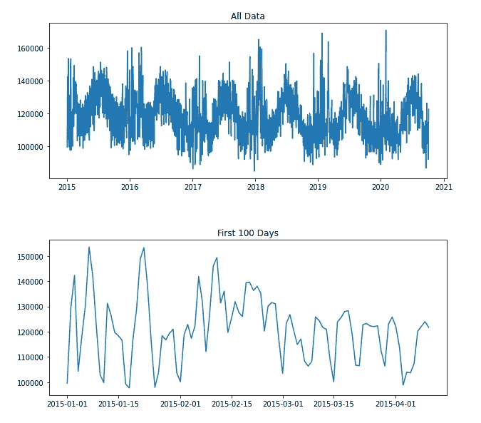

能源数据图—按作者

在下一个单元中，我们只是为模型创建一个验证和测试集。我们可以使用 NeuralProphet 的内置。split_df()函数，但是我发现这在验证和测试集中重复了行。为此，我们将使用简单的索引。

请注意，验证和测试集应该总是包含最新的数据点。这确保了我们不会根据未来的数据进行训练，也不会根据过去的数据进行预测。

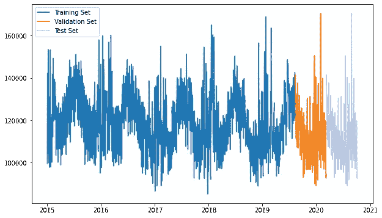

拆分数据图-按作者

# 定义模型

NeuralProphet 使用与 Prophet 非常相似的 API。如果你之前用过 Prophet，那么用 NeuralProphet 会很直观。

在下面的单元格中，我们简单地定义了一个模型，并使这个模型适合数据。我们使用“D”将预测频率设置为每天一次，并使用 plot-all 在训练期间实时可视化模型性能。我们做的另一个改动是指定澳大利亚的假日。

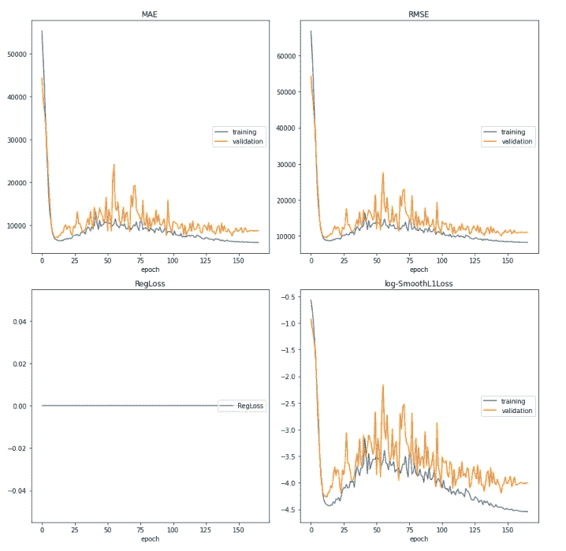

模型损失图—作者

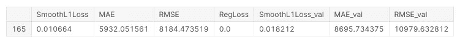

模型指标—按作者

从上面的图表中我们可以看到，模型正被数据过度拟合。该模型尽可能低地适合训练数据，但是我们希望该模型很好地适合看不见的数据(即验证集)。

查看上面的度量图，我们可以看到最佳参数大约在 25-30 个时期达到，然后模型开始过度拟合。我们可以通过指定一些纪元来解决这个问题。完整的可调模型参数列表可在[这里](https://neuralprophet.com/html/forecaster.html)找到。

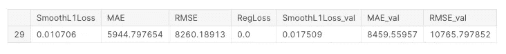

模型指标—按作者

通过指定历元的数量，我们显著降低了验证 RMSE。即使改变一个参数也能显著改善我们的模型(如上图)。这表明，使用参数调整和翻译领域知识的模型可以提高其性能。

# 模型评估

在我们尝试从我们的模型中榨出每一盎司的性能之前，让我们看看如何评估我们的模型。

在下一个单元格中，我们只是做了一个与验证集长度相同的预测。然后我们可以用。plot()函数。这给出了一个不错的可视化预测，但没有提供性能指标，我们也不能非常清楚地看到预测。

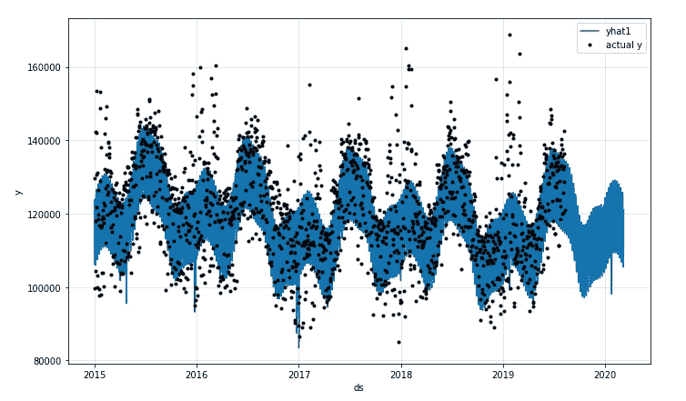

预测图—按作者

为了解决内置绘图的局限性，我使用 Matplotlib 构建了一个定制的绘图。下面的单元格用真实标签绘制预测，并在绘图标题中显示模型指标。

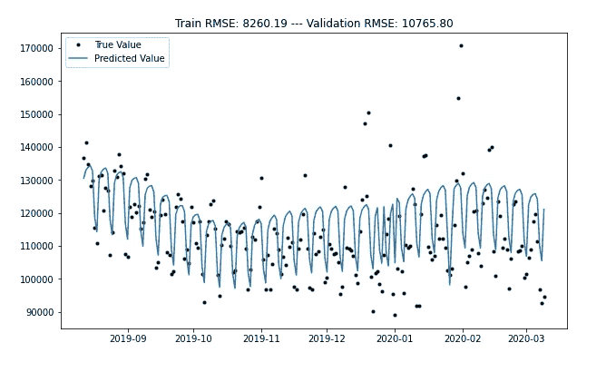

自定义预测图-按作者

接下来，我们可以看看模型参数。这可以让我们了解数据的季节性模式和趋势。

在第一个和第二个图中，我们可以看到 2018 年的能源需求出现了峰值。然后，需求在 2019 年和 2020 年下降并稳步上升。这让我们了解到能源需求是如何随时间变化的。

在第三张图中，我们看到了每年的季节性。我们可以看到，4 月和 10 月能源需求最低，7 月能源需求最高。这是有道理的，因为七月是澳大利亚一年中最冷的月份。有趣的是，最热的月份是二月，此时我们会看到能源需求的小高峰。这可能表明，在最热的月份，人们用电来调节空调。

第四幅图显示了每周的季节性。这表明周六和周日的能耗最低。

最后，我们有相加事件的图。这张图显示了我们添加的澳大利亚假期的效果。我们可以看到，在节假日，能源需求通常低于平时。

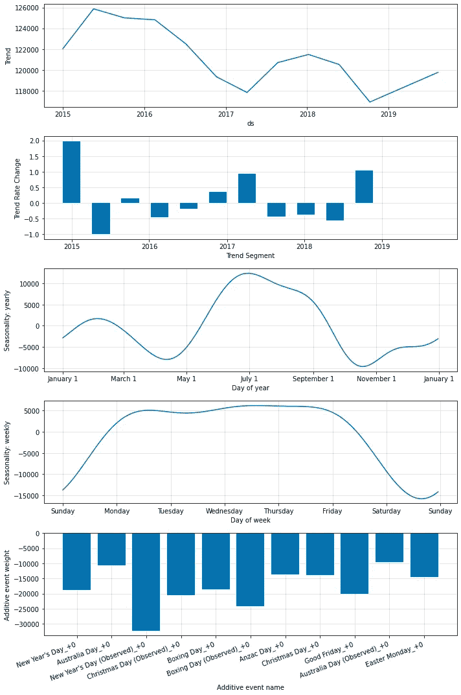

模型参数图-按作者

# 添加 AR-Net(自回归)

Prophet 中的一个新功能是 AR-Net(自动回归神经网络)。这允许 NeuralProphet 在进行预测时使用先前时间步骤的观察结果。在我们的例子中，这意味着模型可以使用前一天的能源需求来进行预测。

在创建 NeuralProphet 模型时，可以通过为 n_lags 参数设置适当的值来启用 AR-Net。我们还增加了 checkpoints_range，因为我们正在对数据进行短期预测。

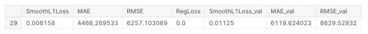

AR-Net 模型指标—按作者

我们可以从上面的指标中看到，验证 RMSE 再次下降。这是我们通过简单地调整两个参数而获得的另一个显著的模型性能增益。

如果我们使用与之前相同的代码，则只能进行一次预测。从文档中不清楚当 AR-Net 启用时如何进行“运行”预测，因此我们可以使用下面的代码来实现这一点。如果有人知道一个内置的方法来做到这一点，请让我知道！

然后，我们可以使用下面的代码块来绘制我们的预测。我们可以从图中看到，模型开始在外围点上加快速度。

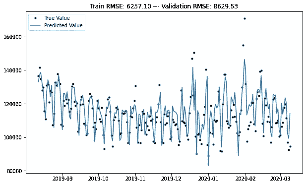

预测图-按作者

如果我们接着绘制模型组件，我们可以看到显示了一个额外的图。该图显示了每个滞后项对预测的影响程度。在我们的例子中，我们可以看到最近几天对模型来说是最重要的。在大多数时间序列问题中，情况往往如此。

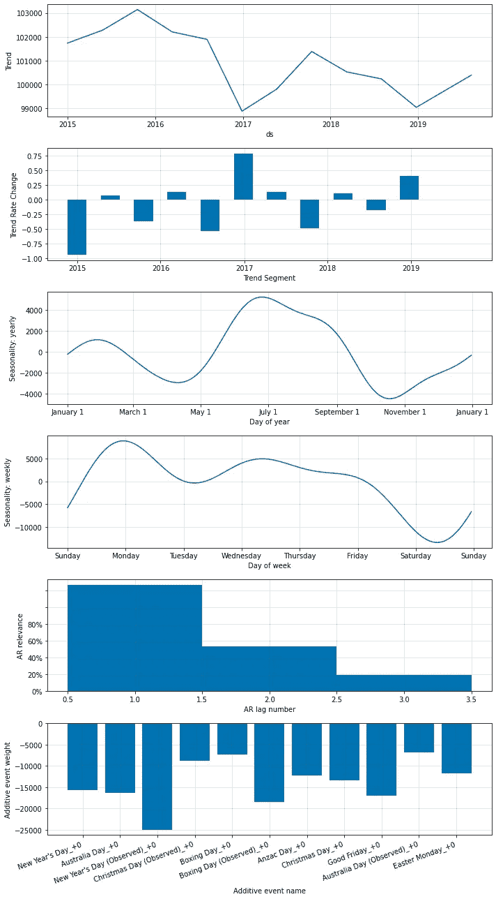

模型参数图-按作者

# 超参数调谐

到目前为止，我们已经能够手动改进我们的验证 RMSE。这很好，但是我们只调整了几个参数。其他参数呢？请考虑下面列出的可调参数及其默认值。

> NeuralProphet(growth='linear '，changepoints=None，n_changepoints=10，changepoints_range=0.9，trend_reg=0，trend_reg_threshold=False，yearly _ seasonality = ' auto '，weekly _ seasonality = ' auto '，seasonality _ mode = ' additive '，seasonality _ reg = 0，n_forecasts=1，n_lags=0，num_hidden_layers=0，d_hidden=None，ar_reg=None，learning_rate=None，epochs

手动输入这些参数的所有可能组合将花费大量的时间和精力。我们可以通过实现超参数调整来解决这个问题。在这个实现中，我们只是测试参数网格中所有可能的参数组合。这意味着随着更多参数的增加，可能的组合数量呈指数增长。

使用贝叶斯优化来更有效地搜索参数空间可能会改善这一点，但是添加这一功能超出了本文的范围。在下面的单元格中，我们正在创建一个参数网格，然后使用所有可能的参数组合来训练模型。

接下来，我们将创建一个 Pandas 数据框架来存储每个模型训练周期的最低 RMSE 值。然后，我们可以根据验证 RMSE 值进行排序，以了解哪些参数组合效果较好。还存储了训练 RMSE 分数和验证分数最低的时期。

这样做是为了确保模型不会过度适应验证集。

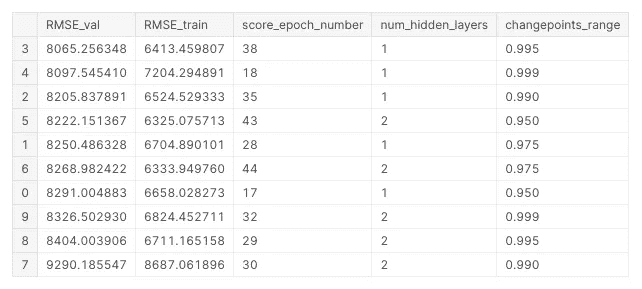

最佳模型参数—按作者

查看上面的结果，我们可以看到第一行和第二行似乎超出了验证集。另一方面，第三行显示了在训练集和验证集上相似的 RMSE 分数。

在下面的单元格中，我们将重新输入运行良好的高评分模型参数。我们可以启用 progress plot 来查看关于模型训练的更多信息，并且如果需要，我们可以手动进行任何进一步的更改。

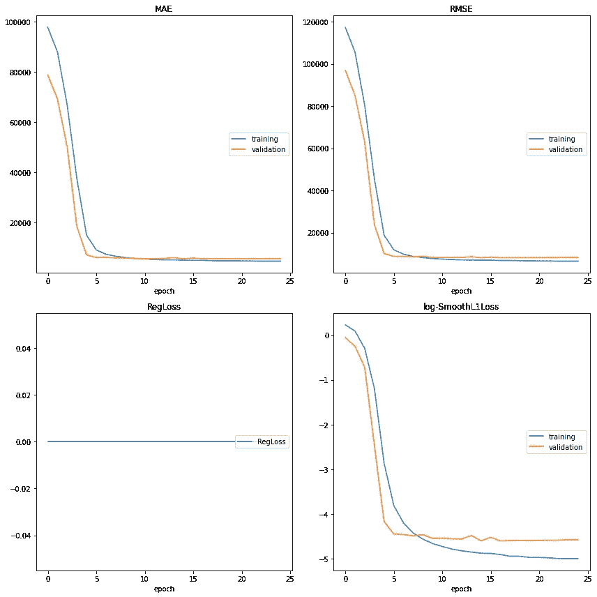

训练图—按作者

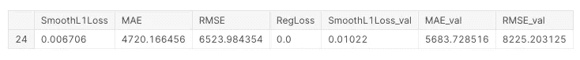

模型分数—按作者

我们进一步降低了 RMSE！随着我们改进模型性能，做出改进变得越来越困难。也就是说，我们追求进步而不是完美，并将尽可能地改进。

然后，可以用我们在本文前面所做的相同方式绘制预测图。

最佳模型预测—按作者

# 模型性能比较

在下一个单元格中，我将比较 NeuralProphet 模型和其他常见的预测策略。

*   预测最后值
*   指数平滑法
*   萨里玛
*   神经先知

我们可以使用 sklearn 手动计算每个模型的 RMSE 值。我们可以简单地通过参数`squared=False`从均方误差函数中得到 RMSE。

首先，如果我们只预测前一天的能源需求，我们可以计算 RMSE。

接下来，我们可以使用指数平滑来计算预测模型。此模型类型使用过去观测值的加权平均值，随着观测值变老，权重呈指数衰减。

接下来，我们可以用一个 SARIMA 模型来拟合数据。这个模型的首字母缩略词代表“季节性自回归综合移动平均线”，并按照其名称计算其预测。关于这种型号的信息，请点击这里查看这篇伟大的文章[。](https://medium.com/@BrendanArtley/time-series-forecasting-with-arima-sarima-and-sarimax-ee61099e78f6)

这个模型稍微复杂一点，我们将把训练分成代码块。首先，使用 autoarima 找到最佳模型参数。这实际上是一个用于 ARIMA 模型的超参数调整包。

最后，我们可以用 NeuralProphet 模型进行预测。

现在所有的预测都完成了，我们可以比较测试数据集上的 RMSE 分数。

最后一个值和指数平滑法产生的误差最高，SARIMA 的误差次之，NeuralProphet 的误差最好。我很惊讶萨里玛的预测与神经原这么接近。更进一步，看看这些模型在其他时间序列任务上的表现会很有趣。

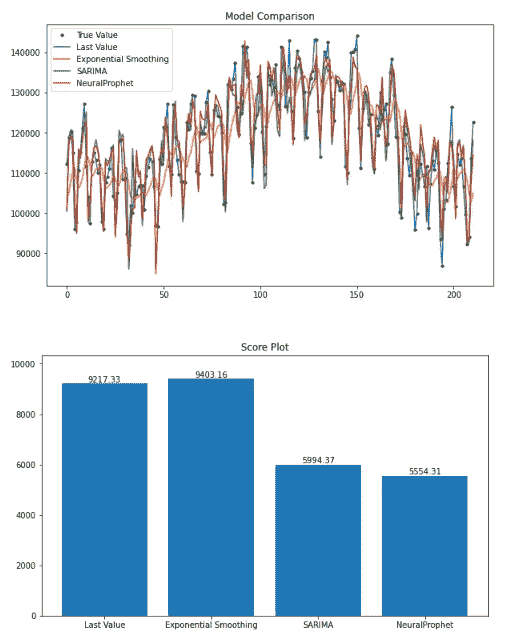

模型比较图—作者

# 结束语

*   这篇文章的代码可以在这里找到。
*   NeuralProphet 是一个非常直观的框架，仍处于早期开发阶段。如果你想为这个项目做贡献，你可以在 [Github](https://github.com/ourownstory/neural_prophet) 上这样做。你也可以加入 [Slack](https://join.slack.com/t/neuralprophet/shared_invite/zt-sgme2rw3-3dCH3YJ_wgg01IXHoYaeCg) 上的 NeuralProphet 社区！
*   我在本文中没有包括外生变量，但我认为这些变量会提高模型的性能。来自 NeuralProphet 模型的预测可以用作 LGBM/XGBoost 模型的输入特征。这可能会产生一个非常预测。

## 参考

1.  [能源促进可持续发展——MD . Hasanuzzaman，Nasrudin Abd Rahim——2017 年 3 月 4 日](https://www.sciencedirect.com/book/9780128146453/energy-for-sustainable-development)
2.  [统计手册—让-玛丽·杜福尔，朱利安·内维斯—2019 年 5 月 1 日](https://www.sciencedirect.com/science/article/abs/pii/S0169716119300367?via%3Dihub)