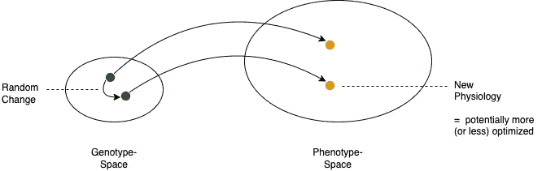
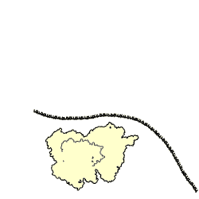
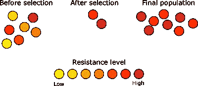
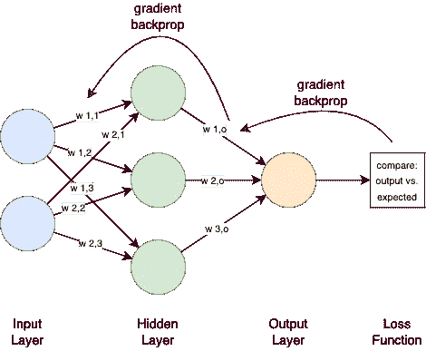
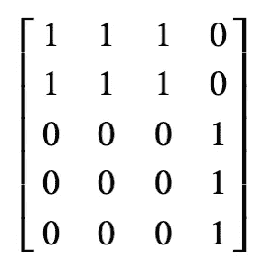
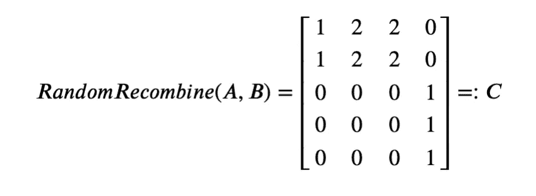
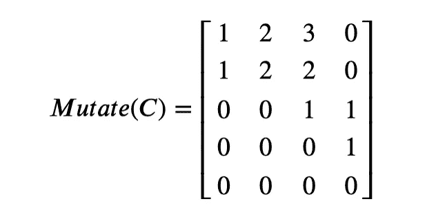

# 成长中的大脑:神经进化

> 原文：<https://towardsdatascience.com/neuroevolution-cb31d823f27d>

## 模仿自然进化和神经元生长过程

作者提供的图片

如果您曾经使用过神经网络，您将会知道选择网络拓扑通常不是一项简单的任务。这使得弄清楚如何建立更加智能的网络成为一个真正的挑战——特别是因为他们还需要在资源和数据密集型过程中接受培训。

如果我们考虑设计出像整个人脑一样庞大复杂的东西，我们将会遇到资源和时间的严重限制。为了尝试和简化这一点，已经开发了各种优化技术来自动调整网络结构和超参数。然而，在所有这些技术中，我们知道只有一种技术可以证明通向大脑水平的智力:进化(我们就是证据)。

我们大脑的整个复杂性(以及更多)是通过使用像我们的基因组一样紧凑的东西来编码和进化的。这就是计算机科学家自 1950 年代以来一直试图复制这一成功的原因。

截至目前(2022 年 2 月)，我们还无法(用任何技术)创造出人类级别的机器智能。然而，在未来的几年中，这些进化机制很可能会在其中发挥作用，所以让我们更详细地研究它们吧！

在本文中，我们将研究基于遗传编码(神经进化)的进化(即优化)神经网络的概念。为了理解这一点，我们将首先深入自然和信息技术中的进化原理(有时称为“遗传算法”或类似的概念，这些概念都密切相关)。

*NB:要阅读本文，您应该了解什么是***【以及(大致)如何通过* [*梯度下降/反向传播*](https://en.wikipedia.org/wiki/Backpropagation) *来使用和训练它们。对达尔文进化论原理的基本理解可能也是有用的——但我还是会尝试再次解释这一部分。**

**我们不会在这上面花太多时间，但是研究进化优化的动机的一小部分是理解基于梯度下降/反向传播的训练的替代方案。我已经探索过的其他一些例子可以在关于* [*级联相关*](https://medium.com/towards-data-science/cascade-correlation-a-forgotten-learning-architecture-a2354a0bec92) *和* [*快速推进*](https://medium.com/towards-data-science/quickprop-an-alternative-to-back-propagation-d9a78069e2a7) *的文章中找到。**

**如上所述，存在许多不同的遗传或进化算法，它们* [*有不同的含义*](https://en.wikipedia.org/wiki/Category:Evolutionary_algorithms) *。为了简单起见，每当我们谈论遗传算法或进化算法时，我们都使用“进化遗传学”一节中描述的原理来谈论算法。如果你对这些算法有具体的问题，或者对文章中的用词有疑问，请告诉我。**

## *进化与遗传学*

*为了理解我们为什么以及如何利用大自然提供的例子，我们将首先快速回顾一下创造我们所有人的失控的优化过程——进化。*

*维基百科[从自上而下的角度定义了它](https://en.wikipedia.org/wiki/Evolution):*

> *进化是生物种群在连续几代中可遗传特征的变化。*

*换句话说，在自然界中，进化是一套允许在几代人的时间里逐渐(随机)改变群体中个体的特性或特征的原则。作为这些原则的一个(统计学上的)副作用，随着时间的推移，这些种群倾向于适应它们的生物生态位。*

*允许这在自然界发生的进化原则是:*

*   ***遗传学:**一个人的特征通过其基因/基因组是可遗传的*
*   ***选择:**“最适者”有更高的繁殖机会，从而传递(部分)他们的基因*
*   ***随机变化:**基因库在世代间混合，通过重组和突变随机引入变异。*

*让我们详细阐述这些观点，并对自然和计算机科学进行比较:*

***遗传学/遗传编码**(指可遗传的特征):
自然界的任何生物都是由基因组，即一组基因构建而成的。这些是一种种子，一种模式或计划，它包含了创造整个有机体所必需的所有信息。在自然界中， [DNA](https://en.wikipedia.org/wiki/DNA) 储存我们的基因，这些基因被转录成 [RNA](https://en.wikipedia.org/wiki/RNA) 并最终被解码成蛋白质——蛋白质反过来构成我们的细胞、组织、器官等。*

*在计算机科学中，基因组或遗传编码是指任何形式的数据(例如，位串、整数列表或其他数据结构)，其可以被翻译成算法或其参数(例如，神经网络拓扑和权重)。确切地说,数据是如何被遗传编码的，这对优化过程的整体性能有一些有趣的影响。*

*注意，编码不一定需要覆盖我们的算法或参数的所有可能的配置。事实上，我们可能真的想要一个更严格的编码，只是为了减少搜索空间。*

**

*核糖体促进 RNA 翻译成蛋白质。来源:[维基百科，Bensaccount at en.wikipedia](https://upload.wikimedia.org/wikipedia/commons/9/94/Protein_translation.gif) ， [CC BY 3.0](https://creativecommons.org/licenses/by/3.0) ，通过维基共享*

***选择**(适者繁殖):
群体中的任何一个个体都有一定的繁殖概率，从而将自己的基因传递下去。通常情况下，它越“适合”利用其生物生态位，繁殖的概率就越高，复制其基因的概率也就越高。*

*在计算机科学中，任何在一项任务中表现良好的解决方案——通过一些预定义的指标来衡量——都会被选择用于繁殖，即在新的迭代/世代中对其基因组进行未来的细化。*

**

*通过抗生素选择细菌菌落。对抗生素有抗性的菌落存活下来，即具有在未来进一步复制的能力。改编自[维基百科，Wykis](https://upload.wikimedia.org/wikipedia/commons/f/f6/Antibiotic_resistance.svg) ，公共领域，通过维基共享*

***随机变化/随机游走**(在遗传编码空间):
通过基因组之间的遗传信息交换(又名[重组](https://en.wikipedia.org/wiki/Genetic_recombination))和通过基因组的[突变](https://en.wikipedia.org/wiki/Mutation)(即随机变化)，以随机游走的方式慢慢探索可能生物的整个空间。有趣的是，在自然界中，随机行走的可见“步骤”——即生物的表型和“形状”内的变化——通常非常小和/或模块化。*

*在计算机科学中，我们还利用重组和突变来丰富遗传可能性，并随机探索可能的解决方案。但是因为我们是工程师，我们也可以构建更多微调(即更少随机)的方法来修改基因组，作为一种使这种人工进化更有效的方法。理想情况下，我们可以创造足够的多样性来偶然找到更好的解决方案，但不要太多以至于从一代到下一代失去好的解决方案。*

**

*基因型中的一个点被映射到表型中的一个点。在基因型中引入一个小的随机变化，导致表型的变化。基因型和表型空间大小不同，将可能的表型数量减少到可通过基因型表达的数量，即减少搜索空间。作者提供的图片*

****旁注:*** *这意味着进化通常不会导致“有意义”的个体，即具有特定目的的特定特征的个体。事实上，我们有一些完全没有意义的特征:例如，喉返神经连接我们的大脑和我们的喉咙(喉)区域——然而，为了做到这一点，它深入下方，围绕主动脉(靠近我们的心脏)弯曲，然后再次返回。这显然是低效的，人们已经制作了关于它的娱乐视频。[1]**

**那么，为什么会发生这些“进化错误”呢？要回答这个问题，我们需要从自下而上的角度来看待进化。从分子的角度来看，进化只是拥有允许复制的分子结构的副作用。鉴于这一过程容易出错(例如，由于突变)，它最终将创造出复制概率更高的分子。因此，它们可以更好地“竞争”必要的资源，降低其他分子复制的可能性。经过大量的这些随机变化(以及一些不那么随机的变化，如通过重组)，一些分子最终创造出非常有效和有弹性的机器，帮助它们进行复制——有机体，如你和我。**

**这些机器之所以存在设计缺陷，就像喉返神经一样，只是因为修复它需要惊人数量的突变，并且所有中间步骤都是致命的(因为它环绕在主动脉周围)。这意味着几代人的渐进修复是不可能的，从一代人到下一代人的修复是不可思议的。更不用说实际的修复可能不会显著提高个体遗传密码的复制概率，这意味着它可能会再次丢失。**

**分子观点提供的另一个有趣的方面是，系统可以被游戏化:* [*例如，病毒*](https://en.wikipedia.org/wiki/Virus) *在复制时非常快速和有弹性，即使它们仅由包裹在简单包装中的相对较少的 DNA 或 RNA 组成。它们通过侵入生物体并将其基因组插入宿主细胞中来做到这一点，因此它们被迫产生病毒的副本。**

**通常，我们所说的分子是 RNA 和 DNA，我们的遗传密码。然而，除了这些，还有其他更奇特的例子存在——例如，参见* [*朊病毒*](https://en.wikipedia.org/wiki/Prion) *，它们是奇怪折叠的蛋白质。它们甚至不在病毒的水平上——它们不拥有 DNA 或 RNA，而是奇怪的折叠迫使类似结构的蛋白质也经历这种奇怪的折叠，在生物体内产生雪球效应。即使这看起来不合理的简单，朊病毒可以从一个宿主转移到另一个宿主，并可以发生突变，为进化提供了基础。**

*从这个角度来看进化意味着我们存在的真正“原因”是一个相当复杂的复制机制，一个我们基因的容器。我知道这看起来很平淡，但这基本上是它的核心。它没有回答任何伟大的哲学问题，但如果没有这种盲目的优化过程，我们周围的世界会看起来更加多岩石和死亡。*

*如果你对进化作为一种优化机制还有什么其他有趣的含义感到好奇，请查看例如[2]&【3】。*

## *神经进化*

*那么，有了对进化的这种理解，我们如何从那里得到一个神经网络结构呢？*

*在文章的开头，我承诺了一项技术，这项技术有可能创造出类似大脑的智能水平。这当然很容易断言，因为进化提供了我们的大脑——所以，诺言实现了！但是，生物进化花了相当长的时间——只有几十亿年，或者至少几百万年，如果你去掉非常早期的阶段——我想，这比我们能投资的多一点。*

*所以我们不会从分子，到细胞，到组织，器官和有机体，而是走捷径。我们将创造没有身体支持的大脑。嗯，算是吧:我们将创建一个小型测试网络，作为这里的一个替代例子。*

*这是可能的，因为我们已经有了一个关于*如何在大脑的微观尺度上简化*信息处理的工作模型:人工神经网络。如你所知，这个模型中的细胞(神经元)具有加权的输入信号，这些信号相加后被泵入一个激活函数，返回该神经元的激活信号，该信号又被传递给其他神经元。*

*在监督学习中，我们希望调整神经元的权重，以便对于给定的输入信号，我们实现对预期输出信号的近似。传统上，人们会将网络输出与预期输出进行比较(所得差值称为损耗)，然后将其用于基于梯度下降的优化。这只是意味着在网络中向后迭代，并以微小的步长调整权重，以便在下次比较网络输出和预期输出时获得稍微好一点的结果。*

**

*带有示例权重和箭头的简单神经网络解释了反向传播的过程。网络的结构是三层的。第一层有 2 个输入神经元，完全连接到第二层的 3 个隐藏神经元，完全连接到最后一层的 1 个输出神经元。作者图解。*

**注意:这张图和我们稍后要看的网络有意不包括偏差输入。这是为了简化案例。可以简单地添加一个偏置作为另一个(恒定的)输入神经元。**

*当然，这是对所发生事情的高度概括，但真正的问题隐藏在细节中。如何避免陷入局部最优？如果损失梯度不够陡，如何防止算法收敛太慢？你如何找到一个网络拓扑结构来处理这个问题而不使[过度适应](https://en.wikipedia.org/wiki/Overfitting)？*

*如果我们要从机器学习工程师的角度来处理这个问题，我们必须:*

1.  *选择网络架构(可能还有激活功能)和学习算法*
2.  *构建网络架构并初始化网络参数(即连接的权重)*
3.  *选择学习算法的参数，以及任何其他尚未设置的超参数*
4.  *为输入和预期输出转换数据，以便它可以与网络和学习算法一起使用*
5.  *通过学习算法和训练数据集迭代地学习权重，潜在地调整超参数*

*实际上，所有这些步骤都是特定于问题领域的，这就是我们需要有类似领域工作经验的 ML 工程师的主要原因。*

*但是我们很幸运！发明了很多启发式和元级优化，神经进化就是其中之一。*

***神经进化是指利用进化原理生成问题域调整的人工神经网络。这可能意味着生成特定的结构、权重、激活函数或这些的任意组合。***

*具体而言，神经进化意味着对上述网络进行基因编码，生成单个网络编码的随机群体，从中创建实际网络，评估这些网络，选择最适合的网络，并引入某些随机变化，以从中创建新群体。然后冲洗并重复，直到达到某种健康水平。*

*理想情况下，这个过程完全自动发生，无需预先确定任何特定于问题域的超参数或网络架构。不错吧。*

**“这听起来很棒，为什么不是每个人都这样做，而不是雇佣更多的机器学习工程师？*”—你可能会好奇。说实话，细节决定成败。如果做得不好，这个过程不仅会产生非常不理想的结果，还会花费更多的时间和资源。事实上，如果学习速度是本质，其他一切都不是问题，那么就没有理由使用神经进化而不是标准的反向传播。*

*然而，在预期输出数据难以先验定义的领域(如一般的游戏和强化学习)或最佳网络结构未知的领域，神经进化可能是一个很好的选择。现在的挑战是创建一个既能快速达到稳定状态又能以高概率和低资源需求达到全局最优的系统。由于这大部分依赖于随机选择，解决这个问题相当于解决经典的探索与开发挑战。也就是说，我引入了多少随机性(探索)来发现潜在的新的局部最优解——以及我引导或限制了多少这些随机变化来利用我已经进一步发现的局部最优解。*

*为了找到一个好的甜蜜点，我们有四个调整的机会。这些都依赖于上面概述的进化原则:*

1.  *网络是如何被基因编码的*
2.  *我们如何选择个体进行繁殖*
3.  *基因在繁殖过程中是如何混合的*
4.  *我们如何以及在哪里引入随机变化*

*让我们来看看每一个，看看为什么和如何可以调整。*

## *影响 1:基因编码*

*一个给定的进化算法在优化任务上的表现受其遗传编码的强烈影响，因为这反过来影响可用的遗传算子和基因型空间中的随机游走。*

*让我们理解编码一个神经网络意味着什么，看看我们有什么选择。*

## *编码神经网络*

*首先，让我们看一个我们将在本文其余部分使用的例子。*

*假设你想编码一个神经网络。您已经提出了架构，这是我们在上面的网络图中看到的经典分层架构。它有两个输入单元，三个隐藏神经元和一个输出。*

*现在，对这个网络进行编码的一个简单方法是将权重打包成一个[邻接矩阵](https://en.wikipedia.org/wiki/Adjacency_matrix)。在这种编码中，矩阵的行表示输入和隐藏神经元，列表示隐藏和输出神经元。对于这些之间的每个(有向)连接，矩阵中的相应条目(通过从源/目标神经元中选择的行/列)包含权重。如果从某个神经元到另一个神经元没有连接，那么条目被设置为 **0** 。*

*如果我们假设所有权重的值都为 1，那么从上面得到的净矩阵将如下所示:*

**

**注意:为了强调这一点，第一行是从第一个输入神经元、第二个输入神经元的第二个、第一个隐藏神经元的第三个发出的所有连接，依此类推。第一列是第一隐藏神经元的所有输入信号，第二列是第二隐藏神经元的所有输入信号，依此类推。最后一列是输出神经元的输入信号权重。这意味着第一行第一列条目 1 是草图中第一个输入神经元到第一个隐藏神经元的连接的权重—* ***w1，1*** *。**

**还要注意的是，为了尽可能简单，我们在这里没有包括偏置输入。**

*这种网络编码是直接有用的:我们可以通过它直接向前运行，使用稍微修改的输入向量并将其乘以这个矩阵。应用激活函数并对输出层进行迭代(因为它是一个分层网络),我们可以获得输出:*

**该算法具有“迭代”参数，有效地指定了我们网络的深度。因为我们将所有矩阵——通常会被分割——打包成一个，一次矩阵乘法只是一次“激活”。为了激活一层又一层，我们需要另一次做乘法，把中间结果作为输入传入。(这样不一定很有效率，所以不要在生产中使用这种方式。事实上，如果网络是循环的，那就更有意义了。)**

*在这个例子中，我们已经有效地对草图中的网络结构及其权重进行了编码，并以一种让我们可以直接操作的方式对其进行了编码。基因型与表型一一对应。这很好，因为它允许我们简单地通过调整矩阵条目来重组和随机调整网络及其内部布线。*

## *直接与间接编码*

*由于矩阵**中的每个条目直接**指的是一个可能连接的权重，这种编码被称为**直接编码**。*

*另一种这样的直接编码可以是简单地在合适的数据结构中列出节点和连接，正如在[4]中对一般网络拓扑、权重和激活函数所做的那样。然后可以将它转换回邻接矩阵来使用它。*

*虽然灵活和简单，但直接编码的一个明显问题是它的大小，因此在进化随机行走中必须遍历的可能基因型的空间大小。另一个源于大小的问题是，找到可以利用、提炼和在个体之间转移的遗传模式/模块的机会相对较低。例如，首先发现如何制作几个非常相似的肢体，然后发现如何将手指放在一个肢体上(并对所有其他肢体重复这一过程)更容易。*

**注意:我怀疑这可能通过使用专门的重组和突变操作来部分补救，这些操作增加了模式发生的机会，如一些复杂的基因复制机制。但在我查阅的文献中，我找不到任何相关信息。**

*我们在自然界中观察到的模式和对称性，以及与我们基因型的复杂性相比，我们遗传密码的微小尺寸表明，使用**间接编码**会更聪明。即在某种发展过程中最终产生最终表型的构建计划或更短的算法。*

**

*间接和直接遗传编码映射到表型空间。间接编码的搜索空间通常比直接编码小得多。作者提供的图片*

*间接编码是一种更简单、压缩的规范格式。例如，我们的 DNA 编码了我们大脑的基本形状，而没有编码每个连接(它包含的数据很少)。*

*像这样的编码以各种微妙的方式影响着进化的方式。Stanley 等人已经在[5]中提到了这一点:“因为间接编码不直接映射到它们的表型，它们可以以不可预测的方式使搜索产生偏差”。最后，直接编码通常被精确地选择，因为间接编码使我们很难推理突变和重组的因果关系。*

*不管编码是直接的还是间接的，两者都会遇到的一个问题是在进化过程中有用特征的丢失。这个问题不能仅仅通过编码来解决，但是可以使编码对这种特征回归更有弹性。例如，在 NEAT [5]中，Stanley 等人通过跟踪基因的历史变化和强制物种形成，即强制个体只与遗传相似的个体繁殖，部分克服了这一点。*

*综上所述，一个设计良好的基因编码可以更容易地找到和利用好的解决方案。它不仅可以帮助在搜索空间中更快地发现对称性和可继承的“模块”(想想四肢)，还可以降低失去有用特征或引入致命突变(相对于有益突变)的风险。间接编码可以*潜在地*通过减少搜索空间和以有用的方式偏向搜索来帮助整个过程。*

## *影响 2:选择繁殖*

*我们如何选择种群中的个体进行繁殖是下一个可能被调整的部分。只是为了说明这一点，而不是深入研究，这可以从根据他们的健康状况随机选择个人，到选择有非常具体要求的个人，比如说，只有前 10 名。*

*正如人们所猜测的，不同的方法对算法的收敛速度和稳定性有不同的影响，一些方面已经在 Goldberg 等人[6]的比较论文中进行了探讨。*

*继续我们之前的例子，假设我们从人群中选择了两个人，A 和 b。他们的基因组(即他们的基因组)分别如下所示:*

**

## *影响 3:繁殖过程中基因组的重组*

*根据所选择的编码，基因的重组或“交换”可以用许多不同的方式来定义。每一个因素对勘探和开发都有不同的影响。*

*一个例子可能是这样的:取两个被选中个体的基因组。以相似基因配对的方式排列它们。随机交换基因或基因片段。这里的参数是段的长度和交换的段数。*

*把我们选择的基因组 **A** 和 **B** 用这个方案重组它们可能会给我们带来以下后代:*

**

## *影响 4:突变，即随机变化*

*同样，这里的可能性是无限的，并且在很大程度上取决于编码。突变的一种可能的实现方式是获取一个基因组，并对其进行随机改变。例如翻转比特或稍微随机增加或减少值。每个基因发生变化的可能性可以是这里的一个参数。*

*以重组得到的矩阵 **C** 为例，对其进行变异，得到如下结果:*

**

*这个新的个体成为下一代的一部分，一个新的群体，将被测试、选择和迭代。*

## *用途和限制*

*如同标准人工神经网络的学习算法的超参数一样，任何变量或影响参数 1。-4.需要在实际的发展过程开始之前进行定义。然而，希望可行的参数是问题域不可知的。我们不是优化训练，而是通过预先调整这些旋钮来优化进化的速度，然后在以后重新使用完全相同的配置。*

*近年来，这似乎实际上已经被证明是一种可行的方法，因为优步的人工智能部门已经发表了几篇支持神经进化的论文，支持反向传播[7]。*

*一般来说，能够真正利用对称性和复制网络特征的解决方案，在生成接近大脑结构的架构方面有着巨大的潜力。毕竟，我们知道，人类新大脑皮层的能力源于一个简单的构建模块，一个皮层柱(或其变体)，它被复制了很多很多次。[8]因此，很可能有一天，在选定的难题上训练一个不断进化的网络，会使它显示出一般智力的某些方面。毕竟，从生物学角度来说，这或多或少是我们人类如何走到现在的。*

*当然，所有这些一般性意味着，将会有大量的例子表明，一个非常具体的、工程化的、经过训练的网络在投入较少的资源的情况下表现得更好。这是特殊化与一般化的标准案例。举一个类似的例子，与经过训练的神经网络相比，现代编程语言中的手动编码算法在可良好定义的算术和逻辑任务中可以更加有效和防错。类似的效果也适用于工程神经网络和进化神经网络。*

*决定(或测试)哪一个更适合您的问题领域仍然是您的任务。*

*与此相关的所有完成的源代码文档、笔记本和代码也可以在 [Github](https://github.com/ephe-meral/biomimicry) 上获得。请留下反馈并提出改进建议。*

*如果你想支持这篇和类似精彩文章的创作，你可以[注册一个中级会员](https://medium.com/@johannaappel/membership)和/或[关注我的账户](https://medium.com/subscribe/@johannaappel)。*

## *参考*

*[1] R. Francis，[《人体内最愚蠢的神经》](https://www.youtube.com/watch?v=wzIXF6zy7hg)，Medlife 危机，[https://www.youtube.com/watch?v=wzIXF6zy7hg](https://www.youtube.com/watch?v=wzIXF6zy7hg)*

*[2]r·道金斯，《自私的基因》(1976)，牛津大学出版社*

*[3] E .尤德科夫斯基等著[《进化的简单数学》](https://www.lesswrong.com/s/MH2b8NfWv22dBtrs8)、莱斯错、[https://www.lesswrong.com/s/MH2b8NfWv22dBtrs8](https://www.lesswrong.com/s/MH2b8NfWv22dBtrs8)*

*[4] D. V. Vargas，J. Murata，[“具有统一神经模型的谱多样性神经进化”](https://arxiv.org/abs/1902.06703) (2019)，IEEE 神经网络和学习系统汇刊*

*[5] K. O. Stanley，R. Miikkulainen，[“通过扩充拓扑进化神经网络”](http://nn.cs.utexas.edu/downloads/papers/stanley.ec02.pdf) (2002)，进化计算 10(2):99–127*

*[6] D. E. Goldberg，D. Kalyanmoy，[“遗传算法中使用的选择方案的比较分析”](http://citeseerx.ist.psu.edu/viewdoc/download?doi=10.1.1.443.860&rep=rep1&type=pdf) (1991)，《遗传算法基础》第 1 卷:69–93 页*

*[7] K. O .史丹利，[《迎接深度神经进化时代》](https://eng.uber.com/deep-neuroevolution/) (2017)，https://eng.uber.com/deep-neuroevolution/，*

*[8] J .霍金斯，《一千个大脑:智力新论》(2021)，基础书籍*