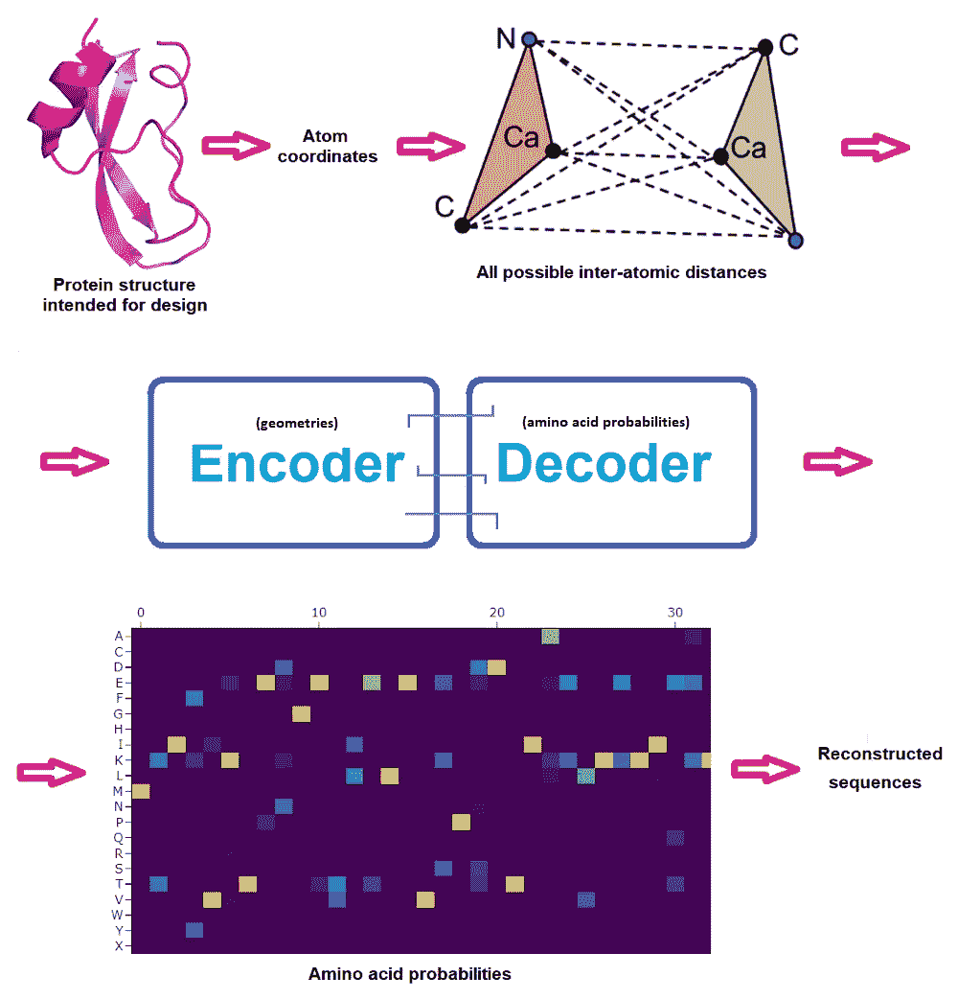

# 新的深度学习工具以高精度设计新的蛋白质

> 原文：<https://towardsdatascience.com/new-deep-learned-tool-designs-novel-proteins-with-high-accuracy-41ae2a7d23d8>

## 蛋白质设计的新时代

## 贝克实验室的这款新软件设计了在潮湿实验室中实际工作的蛋白质。你也可以用它来设计你自己的蛋白质，就在网上。

这即将发生，我希望贝克实验室会是第一个报告此事的小组。但是说实话我没想到会发生的这么快:

**逆转一个类似 AlphaFold 的神经网络，为其输入 3D 结构，并从中获得相应折叠的蛋白质序列。这本身并没有很好地工作，但它启发了基于机器学习的蛋白质设计的进一步策略。最终，这个被称为 ProteinMPNN 的工具问世了，科学家们现在可以用它来设计按照需要折叠(从而工作)的蛋白质。**

**ColabFold 甚至网络应用版本的 ProteinMPNN 已经上线供大家使用。**

# 蛋白质结构和蛋白质设计

正如我在以前关于 AlphaFold 和蛋白质建模的文章中所述(见这里的[索引](https://lucianosphere.medium.com/here-are-all-my-peer-reviewed-and-blog-articles-on-protein-modeling-casp-and-alphafold-2-d78f0a9feb61))，蛋白质序列决定了蛋白质如何获得 3D 结构(折叠)，这反过来决定了它可以发挥什么功能，以及它的稳定性、溶解性等。(对生物学家来说:我将把固有无序蛋白质的整个宇宙放在一边。)

处理相反的问题通常是很有趣的:给定一个应该由给定的 3D 结构实现的功能(或者给定任何其他想要优化的特性，例如稳定性)，我们需要什么样的蛋白质序列(或者起始序列上的什么突变)？

这个问题一般是杜撰*蛋白质设计*；它有几个特定目标的子问题，其中从零开始创造一个完整的蛋白质是最困难的。

到目前为止，虽然稳定现有蛋白质等子问题越来越多地通过机器学习来解决，但从头创建一个全新的蛋白质序列的问题主要通过基于物理的方法来处理。毫无疑问，该领域的领导者是西雅图华盛顿大学的贝克实验室，该实验室实际上管理着整个蛋白质设计研究所。

这个团队也是 RoseTTAFold(不如 AlphaFold 出名，但显然几乎一样准确)等蛋白质建模程序的开发者，他们很快就看到了旨在预测蛋白质结构的新机器学习技术如何被逆转，以预测哪些序列会按照预期折叠。这个问题看起来微不足道，但涉及到几个计算机工程挑战，然后是蛋白质设计活动通常会遇到的最终障碍:通过实验合成预测的蛋白质，并验证它们确实如预期那样折叠，如果它们执行预期的功能，甚至会更好。

到目前为止，贝克实验室最好的工具是 Rosetta toolbox，这是一个用于蛋白质结构预测和设计的多元宇宙工具，主要建立在基于物理的模型上。尽管在高影响力的期刊上发表了几个令人惊叹的蛋白质设计，但事实是成功率非常低:只有一小部分 Rosetta 设计真正按照预期折叠和工作。

# 蛋白质设计的机器学习

现在，贝克实验室创造了一种全新的工具，称为 ProteinMPNN，它建立在机器学习的基础上，从预期的结构中产生蛋白质序列。虽然许多工作已经对此进行了理论化，但 ProteinMPNN 是第一个通过实验手段证明实际产生蛋白质序列的蛋白质，其折叠几率很高。换句话说，这意味着当该小组的实验部分拿着程序产生的设计好的序列，试图在湿实验室中产生编码的蛋白质时，他们实际上得到了它们；此外，当他们解决了他们的结构，他们匹配预期的结构，在许多情况下，也带有预期的功能。

顾名思义，ProteinMPNN 是围绕一个信息传递神经网络(MPNN)建立的。本作品中使用的核心 MPNN 建立在之前的作品之上，甚至是 AlphaFold2 之前的作品！

  

起始网络由 3 个编码器和 3 个解码器层以及 128 个隐藏维度组成，并且使用从 CA 位置(CA 是氨基酸的中心碳原子)构建的蛋白质骨架几何特征以自回归方式从 N 到 C 末端预测蛋白质序列。这项新工作通过引入 N、C 和 O 主链原子加上一个虚拟 CB 原子的位置对此进行了改进，并改进了网络的传播方式。

ProteinMPNN 网络通过编码器模块传递 N、CA、C、O 和虚拟 CB 原子之间的距离来获得图节点和边。然后，这些特征被解码器模块转换成蛋白质序列每个位点的氨基酸概率，该解码器模块从一组所有可能的排列中随机取样氨基酸。最后，最大概率可以被铸造成精确的蛋白质序列，然后尝试在湿实验室中产生这些候选蛋白质。(通常会对一组可能的序列进行实验测试，以最大化其中一个序列工作的机会，甚至在此之前，通常会对候选设计进行深入的人类专家检查——但这超出了本文的范围和重点。)

作者根据软件使用、公开材料和自己的图纸绘制的图。

非常重要的是，当原始 MPNN 解码从 N 到 C 末端的序列时，ProteinMPNN 随机执行这一操作，并允许用户预设(和固定)某些氨基酸。通过这种方式，蛋白质序列是围绕固定部分构建的，固定部分通常包括需要固定以实现功能的区域。例如一个表位，如果人们想要设计一种蛋白质，将它展示在其表面以作为疫苗，或者甚至一种完整的蛋白质，如果人们想要设计一种将与其结合的蛋白质。

# 主要测试和应用

首先，通过在蛋白质数据库的数千个高分辨率结构上训练 ProteinMPNN 模型，作者发现扩展的几何描述确实有助于更好地恢复已知序列，比仅用 CA 位置表现得好得多。此外，完全训练的模型比标准的基于 Rosetta 的方法更好地恢复序列。

接下来，通过优化骨架几何结构影响氨基酸同一性的范围，作者得出结论，性能在“仅”32-48 个邻居处饱和。这意味着模型相对较小，因此运行速度非常快。事实上，正如他们报告的那样，ProteinMPNN 的运行速度比他们的 Rosetta 协议快 200 多倍，此外还能产生更好的设计。

最后，作者验证了通过 AlphaFold 2 运行设计的序列会导致设计的反向预测-这是一个独立的指示，表明该序列有很好的机会正确折叠。

## 应用程序

如果设计的蛋白质实际上不起作用，这一切都将不复存在。，或者至少它们按照预期折叠。正如预印本所显示的，大部分设计好的序列非常容易溶解，具有高表达水平，并且结晶良好。如此之多，以至于作者们展示了他们挽救以前用 Rosetta 尝试过的失败设计的案例。

作者还表明，ProteinMPNN 比基于 AlphaFold 2 的蛋白质序列幻觉的替代方法产生更真实的蛋白质。AlphaFold 提出的蛋白质包含太多疏水簇，导致不溶性，而 ProteinMPNN 的设计更易溶解，也更稳定，在结构确定的情况下，也非常接近设计。

此外，ProteinMPNN 的蛋白质被证明确实如设计的那样折叠，包括单体、环状同型寡聚体、四面体纳米颗粒和靶结合蛋白，后者对于生产新型疫苗、蛋白质开关和其他具有由结合介导的生物技术应用的蛋白质是必不可少的。

在我结束这篇文章时，Baker 实验室发表了第二份预印本，其中介绍了 ProteinMPNN 在设计各种对称蛋白质同源寡聚体方面的具体应用，只给出了蛋白质拷贝数和蛋白质中氨基酸数的规格。当然，实验证明蛋白质如预期折叠。

在亮点中，作者描述了具有超过 1500 个氨基酸、复杂对称性和宽(10 纳米)开口的巨型环的设计。这些例子尤其与蛋白质数据库中可用的结构有很大不同，突出表明可以创造的新蛋白质结构的丰富多样性不限于已知的。总的来说，这项工作可以为设计更复杂的基于蛋白质的纳米机器铺平道路，例如用于 DNA 传感的纳米孔、纳米马达、抗病毒纳米粒子等。

你会在最后建议的阅读材料中找到两份预印本的链接。

# 结束语和今天如何自己使用 ProteinMPNN

最新版的[结构预测关键评估(CASP)](https://lucianosphere.medium.com/the-critical-assessment-of-structure-prediction-casp-over-a-quarter-century-tracking-the-state-bde0a92b3680) 揭示的是，像 AlphaFold 这样的机器学习模型可以很好地预测蛋白质结构。现在，它们的逆转打开了一个新的领域:创造我们想要折叠的新蛋白质。事实上，正如这项工作的第一作者在推特上所说，ProteinMPNN 已经成为“蛋白质设计研究所的标准方法”，因为“实验成功率高，几乎适用于任何蛋白质序列设计问题”:

该工具以“快速演示”笔记本的形式提供，但很快会有更多笔记本问世:

  

这已经被打包成一个拥抱脸的网络应用程序(由西蒙·杜尔完成，来自 [EPFL 科技 4Impact](https://medium.com/u/7dbe1c70684b?source=post_page-----41ae2a7d23d8--------------------------------) )你现在就可以用它做一个测试:

<https://huggingface.co/spaces/simonduerr/ProteinMPNN>  

下面是一个例子，使用氨基酸概率和 10 个建议的蛋白质序列，在不到 5 秒的时间内获得结果:

尝试恢复人类泛素的快速测试结果。

# 阅读材料和相关资源

*   Dauparas 等人的方法的完整介绍的预印本:

<https://www.biorxiv.org/content/10.1101/2022.06.03.494563v1>  

*   Wicky 等人的《创新蛋白质装配应用预印本》:

<https://www.biorxiv.org/content/10.1101/2022.06.09.493773v1>  

*   另一个最近的预印本，只是理论上的，也展示了一个对蛋白质序列和结构进行采样以适应给定基序的模型——本质上是一项设计任务:

<https://arxiv.org/abs/2206.04119>  

(查看[第一作者在推特上发布的预印本摘要](https://twitter.com/brianltrippe/status/1535063427894624256)

*   华盛顿大学的贝克实验室:

  

*   相关博客条目:

</whats-up-after-alphafold-on-ml-for-structural-biology-7bb9758925b8>    

www.lucianoabriata.com*我写作并拍摄我广泛兴趣范围内的一切事物:自然、科学、技术、编程等等。* [***成为媒介会员***](https://lucianosphere.medium.com/membership) *访问其所有故事(我免费获得小额收入的平台的附属链接)和* [***订阅获取我的新故事***](https://lucianosphere.medium.com/subscribe) ***通过电子邮件*** *。到* ***咨询关于小职位*** *查看我的* [***服务页面这里***](https://lucianoabriata.altervista.org/services/index.html) *。你可以* [***这里联系我***](https://lucianoabriata.altervista.org/office/contact.html) ***。***