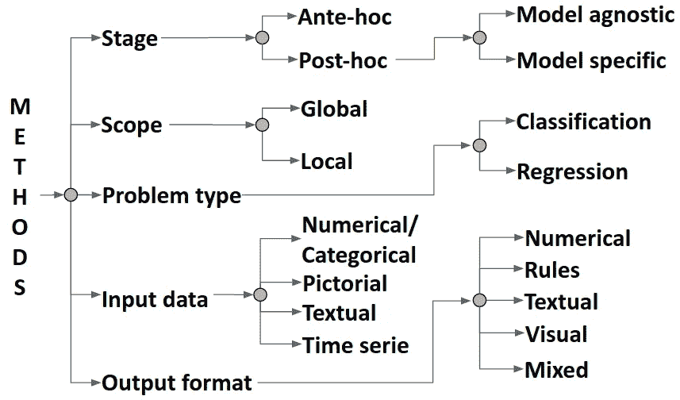

# 可解释人工智能的新前沿

> 原文：<https://towardsdatascience.com/new-frontiers-in-explainable-ai-af43bba18348>

图像通过 Unsplash

人工智能是惊人的:它可以驾驶汽车，回答问题，将人们的脸与他们的护照照片进行匹配，击败最好的国际象棋冠军，等等……但是，你有没有想过它是如何工作的？当它出错时会发生什么？它会变得危险吗？

我们离终结者式的灾难性事件还很远，但问题是真实存在的。由于新的学习算法，特别是神经网络的发展，人工智能现在在许多任务上与人竞争，有时甚至超过人。这些算法可以发现大型数据集中的模式，并在没有任何人工干预的情况下，在提供新数据时调整它们的答案。然而，它们是基于非线性数学函数的大聚合体。由此产生的模型如此错综复杂，以至于研究人员都难以理解它们是如何达到如此惊人的表现的，更不用说证明错误的预测或意外的行为了。这可能会阻碍人工智能的进一步发展，因为模型的不透明性阻碍了研究人员找到弱点。此外，人工智能的广泛使用促使这项技术变得透明，因为错误的预测已经可以极大地影响人们的生活。欧洲议会(European Parliament)裁定，人工智能系统属于一般数据保护法规范围，必须解释其涉及敏感数据使用和分析的全自动预测。

因此，研究人员创造了一个新的人工智能分支，称为可解释人工智能(XAI)，来解决这个问题。他们开发了大量的 XAI 方法来揭示和解释学习算法是如何工作的，因此人们可以理解和信任他们的结果。自 2010 年代中期以来，XAI 每年都有大量科学研究发表。尽管有大量的科学出版物，但在 XAI 领域仍然存在严重的差距。

学习算法通过各种学习算法和数据类型进行训练，从数字到文本，包括图像和视频。单一的 XAI 方法不太可能对每一种应用都产生有效而有意义的解释，因此出现了大量新颖的 XAI 解决方案。有必要将这些方法组织在一个概念框架内，这可以指导人工智能从业者为手头的问题选择合适的 XAI 方法。随着时间的推移，已经提出了许多分类系统，现在对于根据以下维度组织 XAI 方法有了普遍的共识:

1.  解释的范围。全局解释试图使模型从整体上变得透明和易于理解。局部解释侧重于解释模型的每个预测。
2.  XAI 方法产生解释的阶段。事前方法在训练之前修改模型，使其自然可理解，同时仍然达到最佳精度。事后方法保持一个经过训练的模型不变，并使用外部解释器来理解它的功能。
3.  问题类型是要用 AI 来解决的，包括分类，回归或者聚类。
4.  输入数据(数字/分类、图像、文本或时间序列)在构建模型以及 XAI 方法中起着重要作用。

我最近提议增加第五维度，考虑由 XAI 方法产生的解释格式[1]。与输入数据类似，不同的应用需要不同的解释。到目前为止，已经测试过的格式有数字格式、规则格式、文本格式、可视格式或前四种格式的混合(见图 1)。

图 1:XAI 方法的分级系统分类[1]

研究人员将这些解释应用于各种不同的环境中，得出了不同的结果。很难说哪种解释格式最有效，最容易理解。对于什么时候一种解释比另一种更好，并没有普遍的共识。学者们已经确定了许多可以影响解释质量的概念。我把这些概念列了一个清单[2]，作为选择最相关概念的第一步，以便为人类产生一个有意义的解释。按照 XAI 方法，科学界不太可能像人们以不同的方式思考和推理那样开发出一个万能的解决方案。然而，确定哪些解释格式在某些情况下更好地工作将代表着在使人工智能透明和用户友好方面前进了一大步。还需要对人类参与者进行更多的研究，以收集他们对各种解释的意见，并理解最容易理解的解释。研究人员正在努力弥合 XAI 的所有这些差距，让人工智能对人类更加友好。我确信，在不久的将来，我们将会看到非常有趣的突破。然而，让实践者和最终用户参与讨论可能更有趣，因为他们的反馈可以帮助研究人员找到最佳解决方案。可解释性是一个如此广泛的主题，需要尽可能多的社区做出贡献。

**参考文献**

[1] Vilone，g .，和 Longo，l .，通过其输出格式对可解释的人工智能方法进行分类(2021)，*机器学习和知识提取*， *3* (3)，615–661。

[2] Vilone，g .，和 Longo，l .，《可解释人工智能的可解释性概念和评估方法》(2021)，*信息融合*， *76* ，89–106。