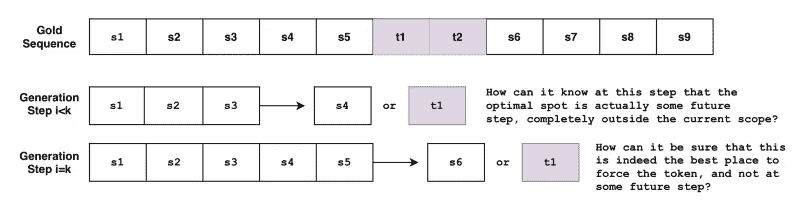
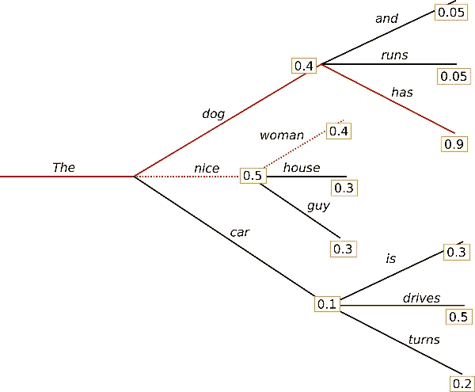
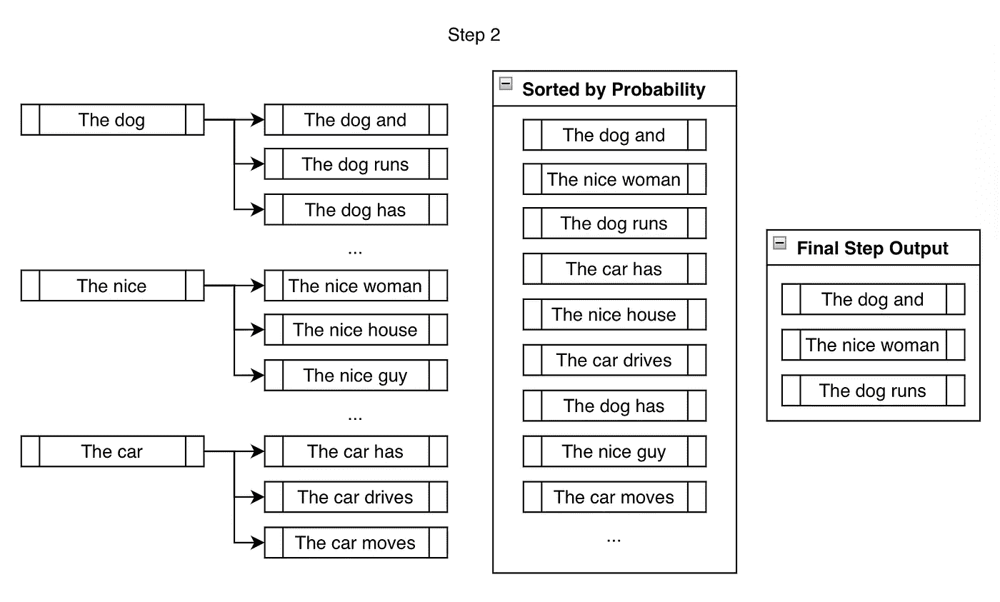
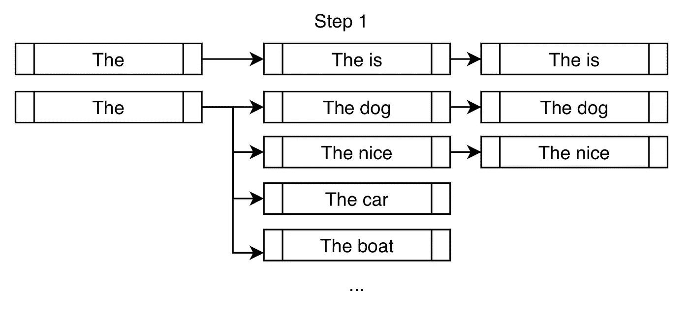
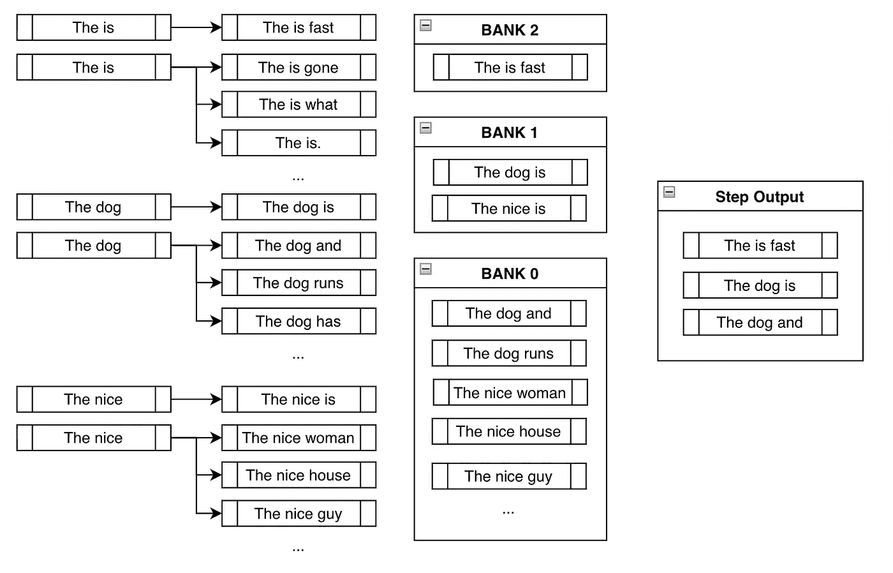
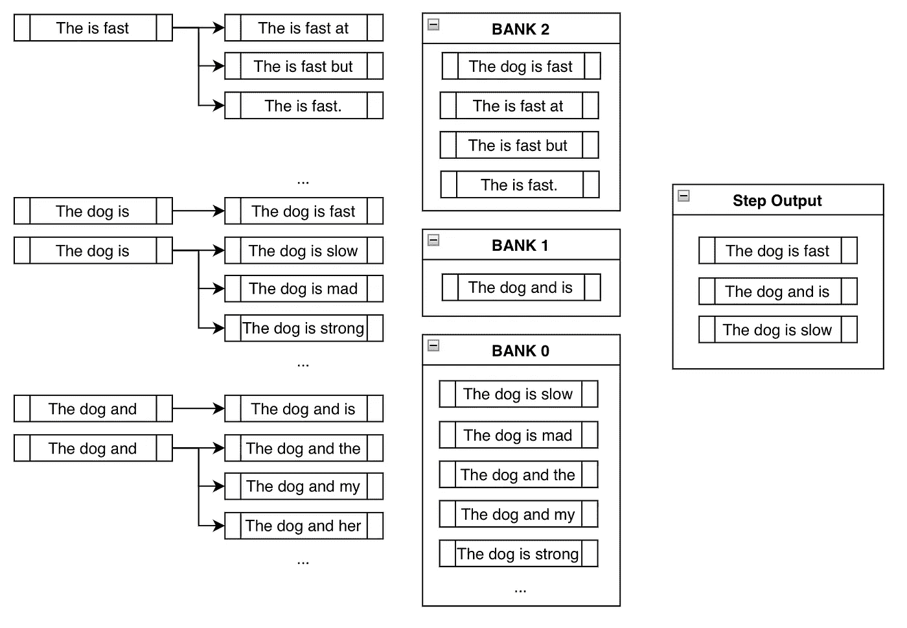

# 约束波束搜索🤗变形金刚(电影名)

> 原文：<https://towardsdatascience.com/new-hugging-face-feature-constrained-beam-search-with-transformers-7ebcfc2d70e9>

## 一个新的拥抱脸特性允许你定制和引导你的语言模型输出(比如在输出中强制一个特定的序列)。


照片由 Priscilla Du Preez 在 [Unsplash](https://unsplash.com/s/photos/hugging?utm_source=unsplash&utm_medium=referral&utm_content=creditCopyText) 上拍摄|一个新的“拥抱”面部特征！

[抱脸变形金刚](https://github.com/huggingface/transformers)有了新功能！它被称为 ***约束光束搜索*** ，它允许我们引导文本生成过程，这在以前是完全独立于模型的。

# 介绍

有时我们确切地知道在文本生成输出中我们想要什么。

例如，在神经机器翻译任务中，我们可能通过字典查找知道哪些单词必须包含在最终翻译中。有时，由于特定的上下文，对于语言模型来说几乎同样可能的生成输出对于最终用户来说可能并不同样理想。

这两种情况都可以通过允许用户告诉模型哪些单词必须包含在最终输出中来解决。新的约束波束搜索特性和新的`model.generate()`函数的`force_words_ids`参数允许我们这样做！

# 示例 1:强制单词

假设我们试图将`"How old are you?"`翻译成德语。

`"Wie alt bist du?"`是你在非正式场合说的话，`"Wie alt sind Sie?"`是你在正式场合说的话。

根据上下文的不同，我们可能希望一种形式比另一种形式更正式，但是我们如何告诉模型呢？

# 传统波束搜索

下面是我们如何在*传统光束搜索设置中进行文本翻译。*

让我们首先安装变形金刚库:

```
!pip install -q git+https://github.com/huggingface/transformers.git
```

下面是教科书 huggingface 代码，用于使用文本生成来完成像 NMT 这样的任务，它是通过传统的波束搜索实现的:

```
from transformers import AutoTokenizer, AutoModelForSeq2SeqLMtokenizer = AutoTokenizer.from_pretrained("t5-base")
model = AutoModelForSeq2SeqLM.from_pretrained("t5-base")encoder_input_str = "translate English to German: How old are you?"input_ids = tokenizer(encoder_input_str, return_tensors="pt").input_idsoutputs = model.generate(
    input_ids,
    num_beams=10,
    num_return_sequences=1,
    no_repeat_ngram_size=1,
    remove_invalid_values=True,
)print("Output:\n" + 100 * '-')
print(tokenizer.decode(outputs[0], skip_special_tokens=True))Output:
--------------------------------------------------------------------
Wie alt bist du?
```

# 使用约束波束搜索

但是如果我们知道我们想要一个正式的输出，而不是非正式的输出呢？如果我们从先前的知识中知道这一代人必须包括什么，并且我们可以*将它*注入到这一代人中，会怎么样？

下面是使用`force_words_ids`关键字参数到`model.generate()`的可能结果:

```
tokenizer = AutoTokenizer.from_pretrained("t5-base")
model = AutoModelForSeq2SeqLM.from_pretrained("t5-base")encoder_input_str = "translate English to German: How old are you?"force_words = ["Sie"]input_ids = tokenizer(encoder_input_str, return_tensors="pt").input_ids
force_words_ids = tokenizer(force_words, add_special_tokens=False).input_idsoutputs = model.generate(
    input_ids,
    force_words_ids=force_words_ids,
    num_beams=5,
    num_return_sequences=1,
    no_repeat_ngram_size=1,
    remove_invalid_values=True,
)print("Output:\n" + 100 * '-')
print(tokenizer.decode(outputs[0], skip_special_tokens=True))Output:
--------------------------------------------------------------------
Wie alt sind Sie?
```

如您所见，我们能够利用关于我们期望输出的先验知识来引导这一代人。以前，我们必须生成一堆可能的输出，然后过滤出符合我们要求的输出。现在我们可以在生成阶段做到这一点。

# 示例 2:析取约束

我们上面提到了一个用例，其中我们知道我们想要在最终输出中包含哪些单词。这方面的一个例子可能是在神经机器翻译期间使用字典查找。

但是，如果我们不知道使用哪种*单词形式*，而我们希望像`["raining", "rained", "rains", ...]`这样的输出同样可能，那该怎么办呢？从更一般的意义上来说，总会有这样的情况，我们不希望*一字不差地*一个字母一个字母地精确表达，也可以考虑其他相关的可能性。

允许这种行为的约束是*析取约束*，它允许用户输入一个单词列表，其目的是指导生成，使得最终输出必须只包含*单词列表中的至少一个*。

下面是一个混合使用上述两种约束的示例:

```
from transformers import GPT2LMHeadModel, GPT2Tokenizermodel = GPT2LMHeadModel.from_pretrained("gpt2")
tokenizer = GPT2Tokenizer.from_pretrained("gpt2")force_word = "scared"
force_flexible = ["scream", "screams", "screaming", "screamed"]force_words_ids = [
    tokenizer([force_word], add_prefix_space=True, add_special_tokens=False).input_ids,
    tokenizer(force_flexible, add_prefix_space=True, add_special_tokens=False).input_ids,
]starting_text = ["The soldiers", "The child"]input_ids = tokenizer(starting_text, return_tensors="pt").input_idsoutputs = model.generate(
    input_ids,
    force_words_ids=force_words_ids,
    num_beams=10,
    num_return_sequences=1,
    no_repeat_ngram_size=1,
    remove_invalid_values=True,
)print("Output:\n" + 100 * '-')
print(tokenizer.decode(outputs[0], skip_special_tokens=True))
print(tokenizer.decode(outputs[1], skip_special_tokens=True))Setting `pad_token_id` to `eos_token_id`:50256 for open-end generation.Output:
--------------------------------------------------------------------
The soldiers, who were all scared and screaming at each other as they tried to get out of theThe child was taken to a local hospital where she screamed and scared for her life, police said.
```

正如你所看到的，第一个输出使用了`"screaming"`，第二个输出使用了`"screamed"`，两个输出都一字不差地使用了`"scared"`。从`["screaming", "screamed", ...]`中选择的列表不一定是单词形式；这可以满足我们只需要一个单词列表的任何用例。

# 为什么很难

但是，这其实是一个非常不小的问题。这是因为任务要求我们在最终输出中的某个地方强制生成某些子序列*，在生成过程中的某个点*。**

*问题是波束搜索逐令牌生成序列*。这就产生了以下问题:**

****

**作者图片**

**如果您有不同需求的多个约束，该怎么办呢？如果你想强制短语`P1` *和*也是短语`P2`呢？如果您希望模型在这两个短语之间进行选择，该怎么办？如果我们想强制使用短语`P1`，并且只强制使用短语列表`[P21, P22, P23]`中的一个短语，该怎么办？**

**但是我们已经看到，上面的代码示例演示了上述所有情况的可能性，不管它们看起来有多么做作。接下来的部分将解释这一切是如何工作的。**

# **传统波束搜索**

**以下是传统波束搜索的一个例子，摘自之前的[博文](https://huggingface.co/blog/how-to-generate):**

****

**图片来自传统波束搜索上的[拥抱脸贴子](https://huggingface.co/blog/how-to-generate)**

**与贪婪搜索不同，波束搜索通过保持一个更长的假设列表来工作。在上图中，我们在生成的每个可能步骤中显示了三个下一个可能的令牌。**

**在`num_beams=3`的情况下，这里有另一种方式来看上面例子的波束搜索的第一步:**

****

**作者图片**

**波束搜索将允许*进一步考虑`"The nice"`和`"The car"`中的*，而不是像贪婪搜索那样只选择`"The dog"`。**

**在下一步中，我们考虑我们在上一步中创建的三个分支的下一个可能的令牌。**

****

**作者图片**

**尽管我们最终*认为*比`num_beams`输出多得多，但在这一步结束时，我们将它们减少到`num_beams`。我们不能一直分支下去，那么我们必须跟踪的`beams`的数量将会变得难以控制的长(10 步之后的 10 个波束将会是 100 亿个波束！).**

**对于生成的其余部分，我们重复上述步骤，直到满足结束标准，例如生成`<eos>`令牌或到达`max_length`。分支、排序、减少和重复。**

# **约束波束搜索**

**约束波束搜索试图通过*在生成的每一步注入*期望的令牌来满足约束。**

**假设我们试图在生成输出中强制使用短语`"is fast"`。**

**在传统的射束搜索设置中，我们在每个分支找到顶部`k`最有可能的下一个标记，并附加它们以供考虑。在受约束的设置中，我们做了同样的事情，但是也添加了标记，这些标记将带我们*更接近满足我们的约束*。这里有一个演示:**

****

**作者图片**

**除了常见的高概率 next 令牌(如`"dog"`和`"nice"`)之外，我们还强制使用令牌`"is"`，以便更接近满足约束`"is fast"`。**

**对于下一步，下面的分支候选项与传统的波束搜索基本相同。但是和上面的例子一样，受约束的波束搜索通过在每个新的分支施加约束来增加现有的候选:**

****

**作者图片**

# **银行**

**在我们谈论下一步之前，我们需要考虑在上面的步骤中我们可以看到的不良行为。**

**天真地在输出中强制输入想要的短语`"is fast"`的问题是，大多数时候，你会得到像上面的`"The is fast"`这样无意义的输出。这实际上使得这个问题很难解决。在`huggingface/transformers`提出的[原始特性请求问题](https://github.com/huggingface/transformers/issues/14081#issuecomment-1004479944)中可以找到关于解决这个问题的复杂性的更深入的讨论。**

**银行通过在满足约束和创造合理产出之间建立平衡来解决这个问题。**

**第 n 组 *n* 指的是在满足约束方面取得了 n *n 步进展的*梁列表。在将所有可能的波束分类到它们各自的组中之后，我们进行循环选择。在上面的例子中，我们将从库 2 中选择最可能的输出，然后从库 1 中选择最可能的输出，从库 0 中选择一个输出，从库 2 中选择第二个最可能的输出，从库 1 中选择第二个最可能的输出，依此类推。由于我们使用的是`num_beams=3`，我们只需重复上述过程三次，就可以得到`["The is fast", "The dog is", "The dog and"]`。****

*这样，即使我们*强迫*模型考虑我们已经手动附加了所需标记的分支，我们仍然跟踪其他可能更有意义的高概率序列。尽管`"The is fast"`完全满足了我们的约束，但它并不是一个非常明智的短语。幸运的是，我们在未来的步骤中有`"The dog is"`和`"The dog and"`可以使用，这有望在以后产生更合理的输出。*

*上述示例的第三步演示了这种行为:*

**

*作者图片*

*注意`"The is fast"`不需要手动添加任何约束标记，因为它已经完成了(即，已经包含了短语`"is fast"`)。此外，请注意像`"The dog is slow"`或`"The dog is mad"`这样的光束实际上是在存储体 0 中，因为，尽管它包括令牌`"is"`，它必须从头开始重新生成`"is fast"`。通过在`"is"`后添加类似于`"slow"`的东西，它有效地*重置了它的进程*。*

*最后，请注意我们是如何得到包含约束短语的合理输出的:`"The dog is fast"`！*

*我们最初很担心，因为盲目地添加想要的标记会导致像`"The is fast"`这样无意义的短语。然而，使用来自银行的循环选择，我们最终隐含地放弃了无意义的输出，而选择了更有意义的输出。*

# *关于`Constraint`类和自定义约束的更多信息*

*解释的主要内容可以总结如下。在每一步，我们都不断地纠缠模型来考虑满足我们的约束的记号，同时跟踪不满足我们的约束的波束，直到我们以合理的高概率结束包含我们想要的短语的序列。*

*因此，设计这个实现的一个原则方法是将每个约束表示为一个`Constraint`对象，其目的是跟踪其进度，并告诉波束搜索接下来要生成哪些令牌。尽管我们已经为`model.generate()`提供了关键字参数`force_words_ids`，但以下是后端实际发生的情况:*

```
*from transformers import AutoTokenizer, AutoModelForSeq2SeqLM, PhrasalConstrainttokenizer = AutoTokenizer.from_pretrained("t5-base")
model = AutoModelForSeq2SeqLM.from_pretrained("t5-base")encoder_input_str = "translate English to German: How old are you?"constraints = [
    PhrasalConstraint(
        tokenizer("Sie", add_special_tokens=False).input_ids
    )
]input_ids = tokenizer(encoder_input_str, return_tensors="pt").input_ids outputs = model.generate(
    input_ids,
    constraints=constraints,
    num_beams=10,
    num_return_sequences=1,
    no_repeat_ngram_size=1,
    remove_invalid_values=True,
) print("Output:\n" + 100 * '-')
print(tokenizer.decode(outputs[0], skip_special_tokens=True))Output:
--------------------------------------------------------------------
Wie alt sind Sie?*
```

*您可以自己定义一个，并将其输入到`constraints`关键字参数中，以设计您的独特约束。你只需要创建一个`Constraint`抽象接口类的子类，并遵循它的要求。你可以在`Constraint`的定义中找到更多信息，找到[这里](https://github.com/huggingface/transformers/blob/master/src/transformers/generation_beam_constraints.py)。*

*一些独特的想法(尚未实施；也许你可以试一试！)包括类似于`OrderedConstraints`、`TemplateConstraints`的约束，这些约束可以进一步添加。目前，生成是通过在输出中的任何地方包含序列来完成的。例如，在前面的例子中，一个序列包含惊吓- >尖叫，另一个包含尖叫- >惊吓。`OrderedConstraints`允许用户指定满足这些约束的顺序。*

*`TemplateConstraints`可以考虑更适合的功能使用，目标可以是:*

```
*starting_text = "The woman"
template = ["the", "", "School of", "", "in"]possible_outputs == [
   "The woman attended the Ross School of Business in Michigan.",
   "The woman was the administrator for the Harvard school of Business in MA."
]*
```

*或者:*

```
*starting_text = "The woman"
template = ["the", "", "", "University", "", "in"]possible_outputs == [
   "The woman attended the Carnegie Mellon University in Pittsburgh.",
]
impossible_outputs == [
  "The woman attended the Harvard University in MA."
]*
```

*或者，如果用户不关心两个单词之间的标记数量，那么可以只使用`OrderedConstraint`。*

# *结论*

*你可以在这里找到更详细的官方博客文章[。](https://huggingface.co/blog/constrained-beam-search)*

*约束波束搜索为我们提供了一种灵活的方法，将外部知识和需求注入到文本生成中。以前，没有简单的方法来将模型识别为 1。包括序列列表，其中 2。其中一些是可选的，一些不是，例如 3。它们在序列中的某处*生成*在各自合理的位置。现在，我们可以通过混合`Constraint`对象的不同子类来完全控制我们这一代！*

*这一新功能主要基于以下论文:*

*   *[带约束波束搜索的引导式开放词汇图像字幕](https://arxiv.org/abs/1612.00576)*
*   *[用于神经机器翻译的具有动态波束分配的快速词汇约束解码](https://arxiv.org/abs/1804.06609)*
*   *[改进翻译和单语重写的词汇约束解码](https://aclanthology.org/N19-1090/)*
*   *[因果引导生成](https://arxiv.org/pdf/2107.09846.pdf)*

*和上面的那些一样，许多新的研究论文正在探索使用外部知识(例如，KGs，KBs)来指导大型深度学习模型的输出的方法。希望这种约束波束搜索特性成为实现这一目的的另一种有效方式。*