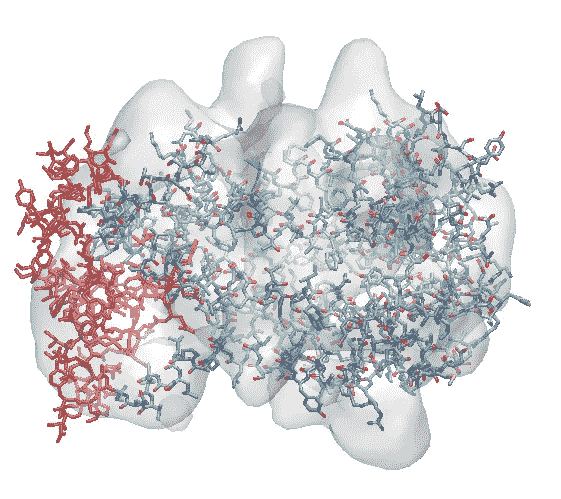
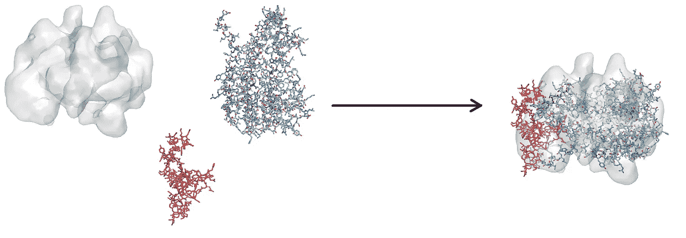

# 受计算机视觉启发，将蛋白质结构拟合到低分辨率冷冻电镜图中的新方法

> 原文：<https://towardsdatascience.com/new-method-to-fit-protein-structures-into-low-resolution-cryo-em-maps-inspired-by-computer-vision-40262b32ea2a>

## 新的预印本提供了一种工具，可以彻底改变冷冻电子显微镜和蛋白质结构机器学习预测的使用。

此处给出的预印本中描述的方法和程序的应用实例:将两种蛋白质(一种显示为红色，另一种显示为青色)放入通过冷冻电子显微镜获得的低分辨率 3D 图中。该方法的核心是基于类似于计算机视觉算法中使用的描述符。图片由作者生成。

由于其能够阐明生物学是如何从化学和物理学中产生的，结构生物学处于生物学、生物技术和医学基础研究的前沿。难怪计算机科学在让结构生物学更快发展方面发挥了关键作用。Traeger 等人在此讨论的预印本展示了计算机科学在处理结构数据中的另一个应用，以便从中提取最大的价值。

确定蛋白质原子级结构的传统技术，即核磁共振和 X 射线晶体学，通常会随着目标蛋白质的大小和灵活性的增加而变得不那么有效。冷冻电子显微镜(CryoEM)已经成为一种强大的技术，可以处理大的蛋白质系统，甚至由几种蛋白质组成的复合物，并在结构生物学中迅速占据一席之地，但也发现了它的局限性，这项新工作解决了其中的一些问题。

CryoEM 通过向快速冷冻的样品发射电子并记录产生的图像来构建 3D 地图，然后将原子建模为 3D 地图，从而解决了蛋白质分子的结构确定问题。这些 3D 地图是从非常大的图像数据集获得的，并且它们本身是由 3D 网格上的电子密度组成的非常复杂的数据结构。简而言之，通过 CryoEM 的结构确定包括以不仅与数据一致而且与已知化学和分子几何形状一致的方式将原子放置在 3D 图内。当 3D 地图具有高分辨率时，这相对容易，而随着分辨率的降低，这就不那么容易甚至不可能了。

在过去的几年里，CryoEM 在生物学中变得越来越成熟，因为它开始获得非常高的分辨率，以某种方式挑战传统的 X 射线晶体学和 NMR 的作用，如果它还没有在整体能力上超过它们的话。(当然，每种技术都有特定的优势和优势，也有弱点和劣势——但可以说 cryoEM 的全球影响力是目前所有 3 种技术中最强的)。

尽管 CryoEM 的能力和使用有所提高，但事实上现在制作的大多数 CryoEM 地图都是中低分辨率的。这使得模拟单个原子来重建蛋白质结构几乎是不可能的。然而，如果一个人知道一些部分蛋白质结构，或者可以用 AlphaFold 等新方法建模，那么他可以将它们放入 CryoEM 的 3D 图中，从而仍然可以获得非常详细的结构，尽管输入数据的分辨率很低。此外，人们可以拟合一种蛋白质的多种“构象”(意味着它的不同结构，可能来自不同的模型或代表蛋白质的内在可变性)，然后选择最适合的那些。

问题是将一个或多个蛋白质结构放入三维空间的 CryoEM 图是一项非常困难的任务。最近，我们实验室的一份新预印本提出了一种新的方法来完成这项任务，它从计算机视觉方法中汲取灵感，特别是从图片中找到已知形状的对象的问题中。

这个新工具，以*大分子描述符*命名为 MaD，将简化和半自动化科学家处理 CryoEM 图和蛋白质结构的工作。如今，他们基本上是通过手工将结构装配到地图中，只使用局部优化工具来微调他们手工构建的接近最终的姿态。通过使用 MaD，他们将能够把更大一部分工作留给计算机，这不仅加快了过程，而且使其不那么主观，不容易出现偏差或错误。

MaD 获取由 CryoEM 实验提供的目标 3D 图，一个或多个应该适合它的结构，然后计算和评分一系列适合度，提供可能的结构，然后可以用于传统的局部改进。下图说明了 MaD 如何将两个蛋白质结构放在一起形成一个复合物，该复合物大致满足相应的低分辨率 CryoEM 图:

行动中的 MaD(同样的例子出现在主图中):MaD 在这里将两种蛋白质放入分辨率相当低的 CryoEM 图中。图片由作者生成。

# MaD 是如何工作的

MaD 本质上是一种基于特征的方法，受计算机视觉中使用的局部特征描述符的启发。在这个领域中，描述符通常应用于各种任务，例如图像配准、图像重建和对象检测。一般来说，描述符是从特征点周围的局部区域构建的，并针对旋转不变性、高局部特异性和对噪声和变换的鲁棒性进行处理。

MaD 使用一种适应形式的[尺度不变特征变换](https://en.wikipedia.org/wiki/Scale-invariant_feature_transform) (SIFT)描述符。首先，MaD 将输入结构投射到一个网格上，该网格的间距与将要拟合结构的输入 Cryo-EM 数据的间距相同。将结构处理产生的网格与高斯核进行卷积，然后从强度高于微调数量的邻居周围的强度的体素中收集锚。同样，MaD 也为 CryoEM 地图计算锚点。来自结构和地图的锚是描述符计算和拟合的起点。

在根据一些额外的标准清理完锚之后，它们就可以装配了。为此，MaD 在每个锚点周围提取一个球形面片，并从面片内计算的梯度向量构建一个球形直方图。然后从直方图上关键位置处具有最高矢量计数的仓中导出旋转矩阵。这些梯度表现为描述符，然后指导平移和旋转，以将每个蛋白质成分纳入图谱。随着更多组件(结构)的添加，解决方案将沿着密度梯度进行优化，同时考虑到必须消除任何引入的碰撞。

# 应用程序

MaD 的匹配描述符的方法非常有效，即使对于中低分辨率也能很好地收敛。正如这项工作的作者所展示的，MaD 产生了强大而准确的装配预测。因此，正如预印本中大量例证的那样，当存在低质量的地图时，它应该非常有力地提供结构细节。特别是，我希望它可以很好地与蛋白质结构的机器学习预测结合起来，例如 AlphaFold，因为人们可以通过将它们拟合到中等分辨率的 CryoEM 结构中来验证或改进它的模型。

除了这些中低分辨率的应用，我们注意到 MaD 也适用于高分辨率数据。虽然人们可能首先认为这不是一个非常需要的特征，因为原则上可以用标准的结构求解程序从零开始将原子模型化到图谱中，但事实是，即使当高分辨率 CryoEM 图谱可用时，MaD 也可以通过自动化程序以高吞吐量加速结构测定。预印本确实提出了这种类型的应用，其中从蛋白质的分子动力学模拟中检索到的大量构象都适合目标图，然后对产生的模型进行评分，并提出最可能的结构。都是自动的，而且非常快。

# 一个先进的例子:将 MaD 应用于分子模拟，以建立考虑分子灵活性的结构集合

预印本中最有趣的应用可能是在 GroEL 四聚体蛋白质上的应用。在不深入研究其生物学的情况下，关键点是它是由 14 个单一蛋白质拷贝组成的笼状结构，排列成 2 个七元环，在其内部容纳蛋白质底物(其作用是帮助它们折叠，即它是一种伴侣)。

预印本中给出的例子涉及将取自 X 射线结构的 GroEL 的 14 个拷贝对接到特定的 CryoEM 图中，该 cryo em 图呈现了与可用的 X 射线结构的一些结构偏差。由于这种偏差，如果蛋白质结构照原样处理，拟合永远不会完美。因此，该小组首先进行了分子动力学模拟，这是一种计算，其中基本的牛顿力学定律随着时间的推移而传播，以允许系统(这里是单个 GroEL 蛋白质的初始结构)探索构象波动。然后，作者使用他们的另一种工具，称为 CLoNe，来识别 7 个相关的簇中心，然后将 7 个中心的每一个的 14 个拷贝对接到两个 CryoEM 图中，这两个 cryo em 图对应于十聚体蛋白质的封闭和开放形式。对于打开和关闭状态，所有测试组件的 MaD 分数都正确地检索了在原子水平上解析的可靠的十四聚体模型。

MaD 可用于将大型组件的结构重建成 CryoEM 图，这一点并不重要。用于确定蛋白质原子级结构的三种主要技术，包括最简单形式的 CryoEM，att 通常捕捉离散的结构快照(除了非常专业的非主流实验，人们也可以这样做)。正如预印本中所示，MaD 提供了一个精简的管道，可以使这种分子重建变得非常常规，同时它允许使用较低分辨率的数据，包括等待重新评估的新旧数据。

结构生物学家社区需要这样的工具，能够将灵活性集成到结构生成管道中，并使用次优分辨率的数据。通过实现这两种进步，MaD 可以代表结构生物学研究中的一个巨大进步，所有这些都是由(原则上)完全独立的计算机视觉领域实现的。

# 读物

描述 MaD 和一些示例应用的主要预印本:

 [## MaD:Cryo-EM 数据支持的大分子描述符用于综合动态模拟

### 尽管最近取得了一些进展，确定大型柔性系统的原子结构仍然是一项具有挑战性的任务

www.biorxiv.org](https://www.biorxiv.org/content/10.1101/2022.06.22.497181v1) 

MaD 在我们实验室的网站和 GitHub 上:

 [## 资源

### MaD(大分子描述符)提供了一个集中于中低分辨率的综合建模解决方案…

www.epfl.ch](https://www.epfl.ch/labs/lbm/resources/)  [## GitHub - LBM-EPFL/MaD:一个使用中低分辨率集成建模的 python 工具…

### 使用中低分辨率 cryo-EM 数据进行综合建模的 python 工具。测试数据(实验…

github.com](https://github.com/LBM-EPFL/MaD) 

# 化学和结构生物学中更多的计算机和数据科学

(只是几个亮点……)

 [## 谷歌提出新方法推导量子力学术语的解析表达式…

### 新方法以符号形式导出精确的泛函(量子力学计算的元素),因此…

towardsdatascience.com](/google-proposes-new-method-to-derive-analytical-expressions-for-terms-in-quantum-mechanics-d70fff6e1ef2)  [## 新的深度学习工具以高精度设计新的蛋白质

### 贝克实验室的这款新软件设计了在潮湿实验室中实际工作的蛋白质。你可以用它来…

towardsdatascience.com](/new-deep-learned-tool-designs-novel-proteins-with-high-accuracy-41ae2a7d23d8)  [## 增强现实中的分子，来自对日常物体和手绘的 ML 动力识别…

### 一篇新论文介绍了一款智能手机应用，它可以识别日常用品中手绘的化学结构和分子

towardsdatascience.com](/molecules-in-augmented-reality-from-ml-powered-recognition-of-everyday-objects-and-hand-drawn-584ef187a7c9)  [## 新的预印本描述了一种新颖的原子坐标的无参数几何变换…

### 它的运行速度如此之快，甚至可以扫描大量的蛋白质结构来寻找易相互作用的氨基…

towardsdatascience.com](/new-preprint-describes-a-novel-parameter-free-geometric-transformer-of-atomic-coordinates-to-c6545150855e)  [## 我们不仅能预测蛋白质的静态结构，还能预测它们的结构多样性吗？

### 最近一项以特殊方式应用 AlphaFold 2 的工作表明这是可能的。

medium.com](https://medium.com/advances-in-biological-science/can-we-predict-not-only-static-protein-structures-but-also-their-structural-diversity-fa1d9380fc34)  [## 这里是我所有关于蛋白质建模、CASP 和 AlphaFold 2 的同行评论和博客文章

### 我在这里整理了我所有的同行评议文章(一些论文，一些评论，一个观点)和博客文章，关于…

lucianosphere.medium.com](https://lucianosphere.medium.com/here-are-all-my-peer-reviewed-and-blog-articles-on-protein-modeling-casp-and-alphafold-2-d78f0a9feb61) 

www.lucianoabriata.com*[***我写作并拍摄我广泛兴趣范围内的一切事物:自然、科学、技术、编程等等。***](https://www.lucianoabriata.com/) **[***成为媒介会员***](https://lucianosphere.medium.com/membership) *访问其所有故事(我免费获得小额收入的平台的附属链接)和* [***订阅获取我的新故事***](https://lucianosphere.medium.com/subscribe) ***通过电子邮件*** *。到* ***咨询关于小职位*** *查看我的* [***服务页面这里***](https://lucianoabriata.altervista.org/services/index.html) *。你可以* [***这里联系我***](https://lucianoabriata.altervista.org/office/contact.html) ***。******