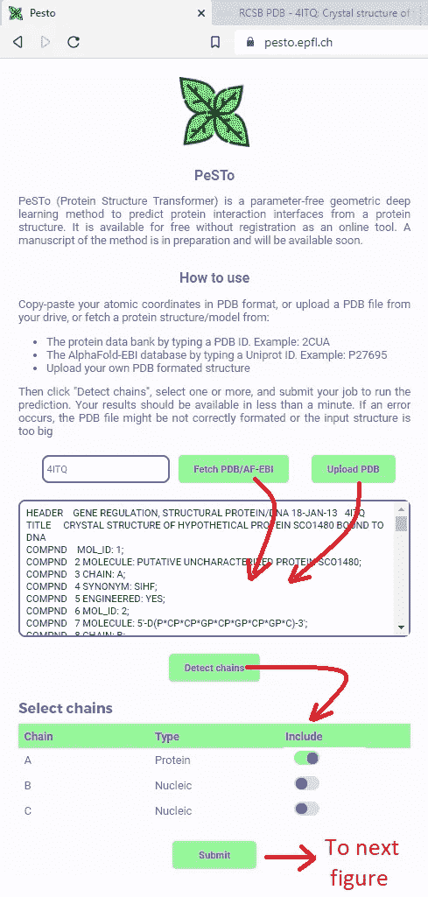
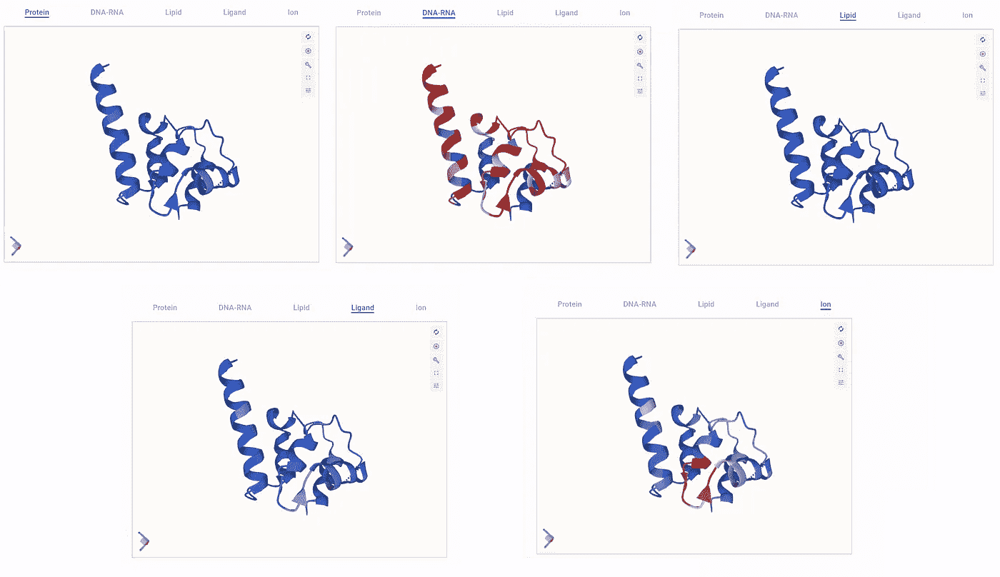

# 新的预印本描述了一种新的原子坐标的无参数几何转换器，以预测蛋白质中的生物界面

> 原文：<https://towardsdatascience.com/new-preprint-describes-a-novel-parameter-free-geometric-transformer-of-atomic-coordinates-to-c6545150855e>

## AI after AlphaFold

## 它的运行速度非常快，甚至可以扫描大量的蛋白质结构来寻找易相互作用的氨基酸。

机器学习、人工神经网络和其他基于“人工智能”的数学方法(我不太喜欢这个术语，但它很棒！)已经应用于科学问题几十年了。但众所周知，它们现在有了前所未有的应用，彻底改变了化学和生物学等科学。

现代人工智能最引人注目的应用之一可能是预测蛋白质结构，这始于大约 5-10 年前，并在 2020 年底和 2021 年出现了 AlphaFold 2。我在以前的文章中详细讨论了 AlphaFold 2:

    

从事蛋白质结构预测的科学家首先对 AlphaFold 的影响感到负面情绪，因为它有点扰乱了他们自己的领域，实现了他们长期以来希望的目标。然而，在短暂的哀悼之后，他们接受并真正利用 AlphaFold 进行新的发现和开发新的工具，其中许多我已经讨论过了:

  

毕竟 AlphaFold 2 并没有解决分子和结构生物学的所有相关问题。事实上，它只解决了巨大拼图的一小部分(这一点也不使它变小！)AlphaFold 2 解决了什么(我说“某种程度上”是因为即使这个问题也没有完全解决；我一直强调 AlphaFold 2，因为它的第一个版本还不太擅长)预测蛋白质的所谓“三级结构”，这本质上意味着它们的组成原子如何在 3D 空间中排列。

但是蛋白质结构有几个层次的复杂性。蛋白质是氨基酸的长直链，其折叠成 3D 结构以获得三级结构，但这些又可以形成更高级的结构，即多种蛋白质之间或蛋白质与其他生物大分子如核酸(DNA 和 RNA)或与膜、离子、小分子等之间的复合物。事实上，在大多数情况下，蛋白质的生物功能是由这些复合物以生理相关的方式决定或调节的。

当一种蛋白质与另一种蛋白质相互作用时，我们称之为蛋白质-蛋白质复合物，AlphaFold 2 可以预测其中的一些相互作用(特别是在其“AlphaFold 多聚体”风味中)，但它还不太擅长。如果我们考虑蛋白质可以建立的其他类型的相互作用，AlphaFold 就出局了。它只是没有被设计来预测蛋白质和蛋白质以外的分子之间的相互作用，例如 DNA、RNA、离子、小分子如氨基酸、代谢中间体、细胞信号分子等。或生物膜和它们的成分，脂质。

对这些其他相互作用进行建模是在原子水平上对生物结构、相互作用和功能进行建模的下一步，有许多小组已经在这方面工作了多年。如果 Deepmind 本身现在着手解决蛋白质可以参与的其他一些相互作用，我不会感到惊讶。特别是，小分子结合的特定预测与制药有着巨大的相关性，因为大多数临床使用的化合物本身就是与特定蛋白质相互作用的小分子。

要了解更多关于人工智能在蛋白质结构预测和结构生物学/结构生物信息学方面的未来路线，你可以查看我最近写的这篇文章:

  

# 通过使用无参数几何变换器预测蛋白质将与什么相互作用

我工作的实验室的一份新的预印本已经用一种新的配方解决了这个问题:

> 给定一种蛋白质的结构或模型，预测它可以形成什么界面来结合其他蛋白质、核酸、脂类、离子或其他种类的小分子。

领导这项工作的博士生开发了一种几何转换器，它可以读取和处理输入蛋白质的 3D 坐标，并产生特定于残基的分数，这些分数可以预测蛋白质的每个氨基酸成为其他蛋白质、核酸、离子等界面的一部分的可能性。这种方法在*蛋白质结构转换器*之后被称为 PeSTo，具有非常高的准确性，几乎不会混淆界面，并且与替代方法相比有几个非常有利的方面:

*   运行该模型不需要像大多数替代方法那样计算输入蛋白质的表面。表面计算的计算速度很慢，并且对 3D 结构中的误差非常敏感。
*   模型的运行时间只有几毫秒，包括它的加载时间，这意味着您可以在短时间内处理大量的结构。事实上，它的速度非常快，可以在几秒钟内处理整个分子动力学轨迹，这对于识别只有当蛋白质移动时才能到达的瞬时界面非常有用，正如我们所展示的。我们也可以处理整个人类蛋白质组，发现新的生物学。
*   该模型不依赖于任何参数化甚至分类，因为它完全基于原子元素和空间位置来训练。因此，虽然我们将 PeSTo 应用于蛋白质和它们的 C、N、O 原子，但它应该很容易被重新训练用于其他目的，例如在材料科学中。

## 一种新的原子坐标几何变换器

让我提几个关于 PeSTo 工作原理的要点。有关更多详细信息，您可以参考预印本:

  

PeSTo 将蛋白质结构视为点原子云，通过成对距离和保证平移不变性的相对位移向量来表示几何结构。每个点原子仅使用其元素名称来描述，而不使用其他方法使用的数值参数，如半径或电荷。每个原子都通过几何转换器进行编码，该转换器通过标量和矢量状态以及从周围原子以递增的距离计算的距离来考虑其局部邻域。在查询时，该描述符通过网络传播，通过多头注意力操作产生特定于原子的输出。然后，两个额外的模块收集每个蛋白质残基的基于原子的输出，最终预测蛋白质的每个残基是否可能在界面上。

基于来自蛋白质数据库的数据集，我们训练该模型输出蛋白质-蛋白质、蛋白质-核酸、蛋白质-离子、蛋白质-配体、蛋白质-离子和蛋白质-脂质界面的残基方式的接合概率。

## Webserver 的实现和一个具体的例子

预印本包括一些精选的例子。我将在这里向您展示一个我在 web 服务器实现上运行的具体示例，网址为 [https://pesto.epfl.ch](https://pesto.epfl.ch)

当您访问该网站时，您可以选择对以下内容进行预测:

*   来自 PDB 的蛋白质结构，以其 4 字符 ID 输入
*   AlphaFold-EBI 数据库中预先计算的蛋白质模型，作为 UniProt ID 输入
*   你上传的蛋白质结构/模型。

让我们在这里尝试一个来自 PDB 的结构，因为这允许我介绍输入页面的另一个特性:

PDB ID 4ITQ 取自 PDB，然后选择其唯一的蛋白质链进行分析。作者卢西亚诺·阿布利亚塔的这些和其他数字。

我是故意拍的 4ITQ。这是一种与 DNA 结合的蛋白质的 X 射线结构。PDB 中注释的生物组装标记了一个特定的蛋白质-DNA 表面，但我为另一项工作对一个相关蛋白质进行的基于溶液的 NMR 实验揭示了一个更广泛的 DNA 相互作用表面。PeSTo 预言了什么？

让我们先来看看 PeSTO 对这种蛋白质的所有预测:

蛋白质-蛋白质、蛋白质-核酸、蛋白质-脂质、蛋白质-配体和蛋白质-离子界面的 PDB 4ITQ 预测。红色表示交互倾向，越强烈表示可能性越大。

PeSTo 产生相当大的残基表面，这些残基可能参与结合核酸，也可能是结合离子的环。不结合除离子以外的其他蛋白质、脂质或配体。

DNA 结合的界面非常大，这与我以前论文中的 NMR 结果非常一致，该结果表明通过至少两个界面结合，而不是 X 射线结构所提出的仅仅一个界面。此外，那篇论文中的 AFM 实验表明，这种蛋白质在 DNA 中引入了强烈的环和扭结，暂时是因为它迫使 DNA 包裹它，解开它以实现一些尚不清楚的生物功能。

## 在分子动力学模拟和折叠体中发现界面的应用

PeSTo 运行速度如此之快，以至于我们可以将它应用于大量的结构。对于我们的预印本，我们尝试将其作为一种工具，以识别分子模拟的蛋白质界面，并收集完整的人类蛋白质组的结构。

PeSTo 应用于分子动力学模拟非常有用，因为它可以自动检测界面，这些界面在用于开始模拟的结构中可能不明显，但在动力学中可能会暴露出来。这对于发现所谓的隐藏口袋可能特别有效，所谓的隐藏口袋是指蛋白质表面的小口袋，随着蛋白质的移动而出现和消失，因此可能会在静态 X 射线结构中消失。

# 进一步阅读和相关阅读

预印本:

  

一个连接我所有关于 AlphaFold 和蛋白质结构预测的文章的枢纽故事:

  

Deepmind 还致力于将人工智能应用于其他科学领域:

  

一种预测蛋白质相互作用的方法，但通过表面的几何深度学习:

  

www.lucianoabriata.com*[***我写作并拍摄我广泛兴趣范围内的一切事物:自然、科学、技术、编程等等。***](https://www.lucianoabriata.com/) **[***成为媒介会员***](https://lucianosphere.medium.com/membership) *访问其所有故事(我免费获得小额收入的平台的附属链接)和* [***订阅获取我的新故事***](https://lucianosphere.medium.com/subscribe) ***通过电子邮件*** *。到* ***咨询关于小职位*** *查看我的* [***服务页面这里***](https://lucianoabriata.altervista.org/services/index.html) *。你可以* [***这里联系我***](https://lucianoabriata.altervista.org/office/contact.html) ***。******