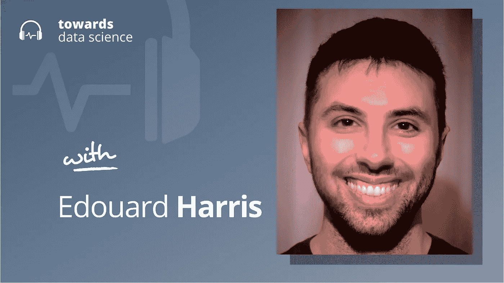

# 新研究:高级人工智能可能倾向于寻求权力*

> 原文：<https://towardsdatascience.com/new-research-advanced-ai-may-tend-to-seek-power-by-default-fdc9eb0afd87>

## [播客](https://towardsdatascience.com/tagged/tds-podcast)

## 爱德华·哈里斯谈人工智能的安全性和高级人工智能带来的风险

[苹果](https://podcasts.apple.com/ca/podcast/towards-data-science/id1470952338?mt=2) | [谷歌](https://www.google.com/podcasts?feed=aHR0cHM6Ly9hbmNob3IuZm0vcy8zNmI0ODQ0L3BvZGNhc3QvcnNz) | [SPOTIFY](https://open.spotify.com/show/63diy2DtpHzQfeNVxAPZgU) | [其他](https://anchor.fm/towardsdatascience)

*编者按:TDS 播客由 Jeremie Harris 主持，他是人工智能安全初创公司 Gladstone 的联合创始人。每周，Jeremie 都会与该领域前沿的研究人员和商业领袖聊天，以解开围绕数据科学、机器学习和人工智能的最紧迫问题。*

近年来，甚至几个月来，人工智能的进展一直在急剧加速。似乎每隔一天，就有一个新的、以前认为不可能的人工智能壮举由世界领先的实验室实现。这些突破越来越多地由同一个简单的想法驱动:人工智能扩展。

对于那些不了解人工智能扩展理论的人来说，扩展意味着用更大的模型训练人工智能系统，使用越来越多的数据和处理能力。到目前为止，世界顶级人工智能实验室的实证研究似乎表明，扩展是一个开放式的过程，可以导致越来越多的有能力和智能的系统，没有明确的限制。

这让许多人猜测，缩放可能会开创一个广泛人类水平甚至超人人工智能的新时代——这是人工智能研究人员几十年来一直追求的圣杯。

虽然这听起来很酷，但一个能够像人类一样甚至更好地解决一般推理问题的人工智能实际上可能是一件本质上危险的事情。

至少，这是许多人工智能安全研究人员在一项新研究发表后得出的结论，该研究探索了现代人工智能系统如何解决问题，以及我们是否应该期待它们的更高级版本执行危险的行为，如寻求权力。

人工智能安全中的这条研究路线被称为“寻求权力”，尽管它目前在人工智能安全和人工智能对齐研究的前沿之外没有得到很好的理解，但它开始引起很多关注。第一个关于权力寻求的重要理论研究是由亚历克斯·特纳领导的，他之前出现在播客上，并发表在 NeurIPS(世界顶级人工智能会议)上。

今天，我们将听到爱德华·哈里斯(Edouard Harris)的发言，他是人工智能校准研究员，也是我在人工智能安全公司(Gladstone AI)的联合创始人之一。Ed 刚刚完成了[一项重要的人工智能安全研究](https://www.alignmentforum.org/posts/pGvM95EfNXwBzjNCJ/instrumental-convergence-single-agent-experiments)，该研究扩展了亚历克斯·特纳最初的能量寻求工作，并显示了似乎是第一个实验证据，表明我们应该期待高度先进的人工智能系统默认寻求能量*。*

*寻求权力到底意味着什么呢？所有这些是否意味着未来通用推理系统的安全性？这就是这一集的全部内容。*

*以下是我在对话中最喜欢的一些观点:*

*   *不管你人生的最终目标是什么，总有一些目标是你想要追求的——即使你不知道你的目标是什么，你也会想要追求的目标。例如，你永远不会不想在你的银行账户里多存 1000 万美元，因为不管你的目标是什么，或者结果是什么，多存 1000 万美元不会让你更难实现目标，反而可能让你更容易实现目标。同样，不管你的最终目标是什么，你永远不会不想变得更聪明，因为更聪明有助于追求你可能想要的任何目标。因此，收集更多的资源和变得更聪明变成了几乎每个人都一致认同的子目标。在人工智能安全中，像这样的目标被称为“工具性目标”。*
*   *工具性目标不仅仅适用于人类。正如我们在与亚历克斯·特纳的对话中看到的，有充分的理由相信强大的人工智能系统最终也会追求它们。根据越来越多的理论研究，我们应该预计人工智能——像人类一样——会默认收敛于某些工具性目标(这种想法被称为“工具性收敛”)。几乎无论人工智能被训练追求什么目标，如果它被关闭，它都不会更有可能实现它(因为“开启”是它继续影响世界的唯一方式)。出于类似的原因，我们应该期待人工智能收敛于其他工具性目标，如自我完善和资源整合。这些和其他相关行为统称为人工智能安全中的“权力寻求”行为。*
*   *亚历克斯·特纳的工作从理论上表明，对于我们可能训练它们实现的绝大多数目标，人工智能代理将倾向于参与权力寻求行为。他通过引入权力的严格数学定义做到了这一点——这是前所未有的。在人工智能安全领域挥舞了十年的争论之后，它最终以量化的方式框定了权力寻求的辩论。*
*   *Ed 的工作扩展了 Alex 的定义，并允许他明确地研究不同智能代理之间的交互。它代表了人工智能中寻求权力的首次实验演示。*
*   *在他的实验中，他首先模拟了一个“人类”智能体，这个智能体被允许在人类智能体所处的环境中学习一种优化的奖励收集策略。Ed 使用了一个包含一块奶酪的迷宫的比喻，这代表了代理的奖励:他的人类代理被允许学习一个最佳策略来通过迷宫并收集奶酪。重要的是，环境(迷宫)是静态的。这反映了人类学习的速度比大自然快得多的现实。人类根据大脑时钟时间学习，而大自然则根据冰川般缓慢的进化时间“学习”或优化，需要一代又一代的选择来产生有意义的新物种。因此，大自然对我们来说似乎是大致静止的:例如，有些树木是在工业革命前种植的，现在它们的命运完全掌握在人类手中。*
*   *ed 允许他的模拟人类智能体在这个环境中优化，他冻结了人类的优化过程，阻止他们进一步学习。然后，他将一个高度先进的“人工智能代理”引入到他的模拟中。这个代理能够在组合的人工代理+环境系统上运行它自己的优化过程，这个系统相对于人工智能来说是静态的。同样，这是有意义的:无论人类水平的人工智能可能采取什么形式，它都将在计算机时钟时间上运行，相比之下，人类生物大脑的时间将非常慢，基本上看起来是静态的。*
*   *然后，埃德调查了每个代理人的权力如何影响其他人。他探索了代理人最终竞争(而作为低级推理机器的人类必然会失败)和合作的案例。他的结论相当惊人:事实证明，即使人类和人工智能主体有彼此独立的目标(并且不直接相互矛盾)，他们最终也会为工具性目标而竞争。我们进入一些细节，解开他研究的其他方面，这提供了证据，表明我们应该预计高级人工智能和人类会在默认情况下竞争资源和“权力”(数学定义)*，并且防止这种情况发生可能需要人工智能系统设计的极端精确性。**

****

## **章节:**

*   **0:00 介绍**
*   **4 点亚历克斯·特纳的研究**
*   **7:45 技术想要什么**
*   **11:30 通用目标**
*   **17:30 连接观察**
*   **24:00 微功耗搜索行为**
*   **28:15 艾德的研究**
*   **38:00 人类作为环境**
*   **42:30 什么导致权力的追求**
*   **48:00 比赛作为默认结果**
*   **52:45 一般关注**
*   **57:30 总结**