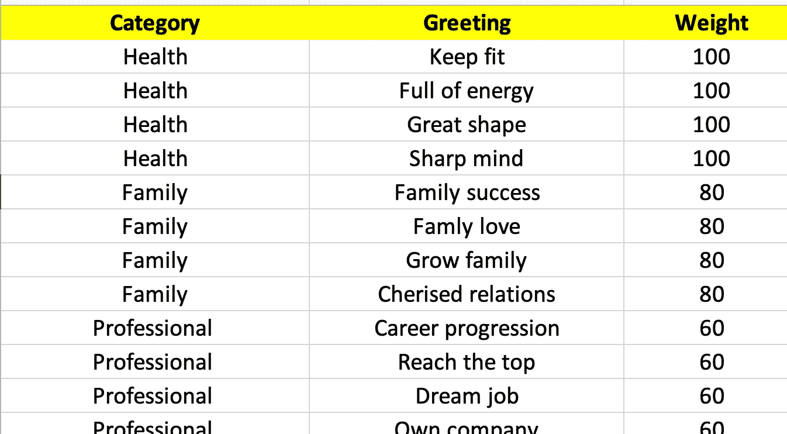
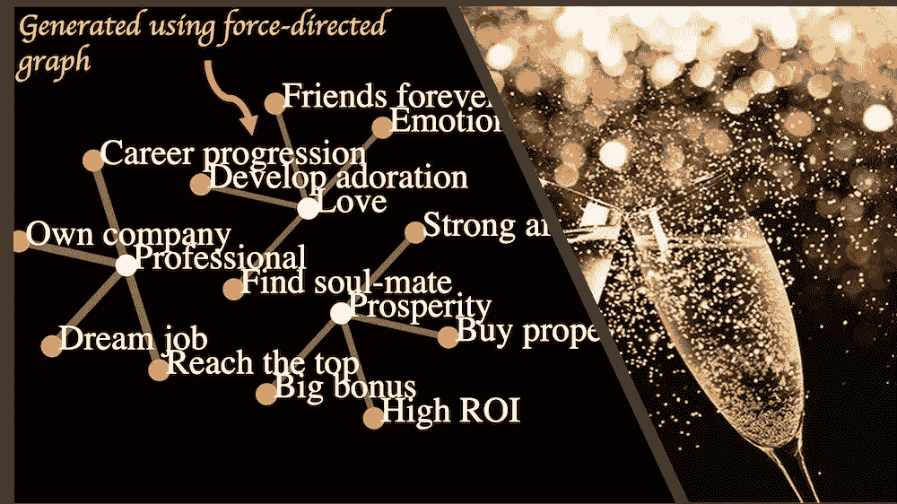
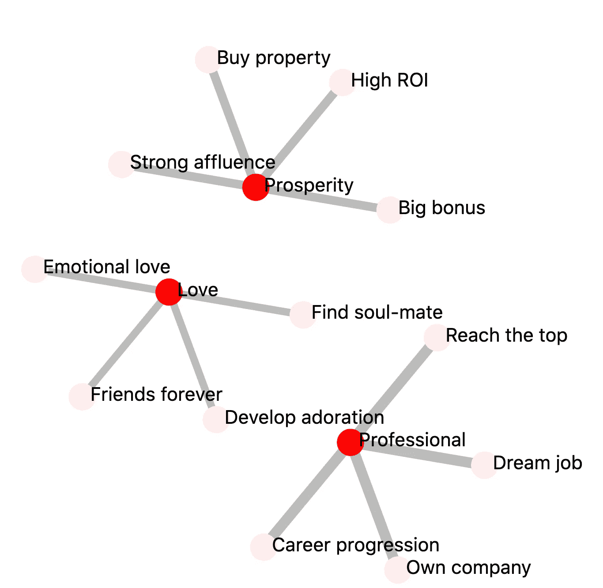
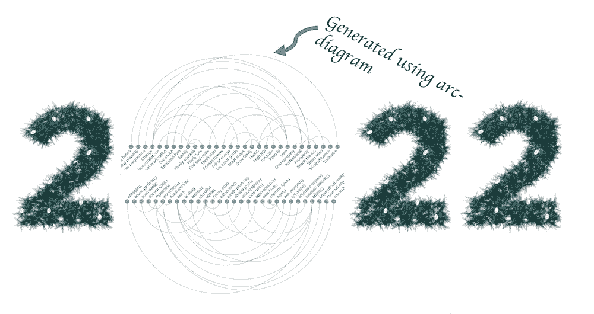
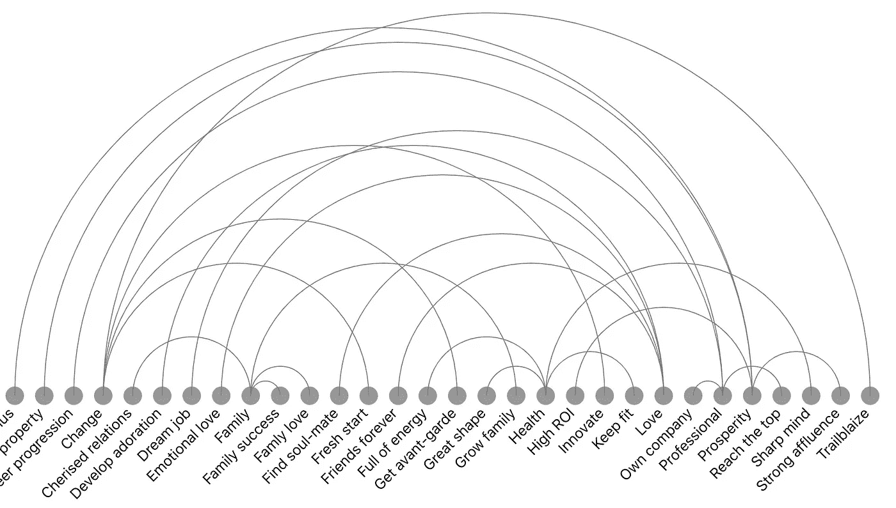
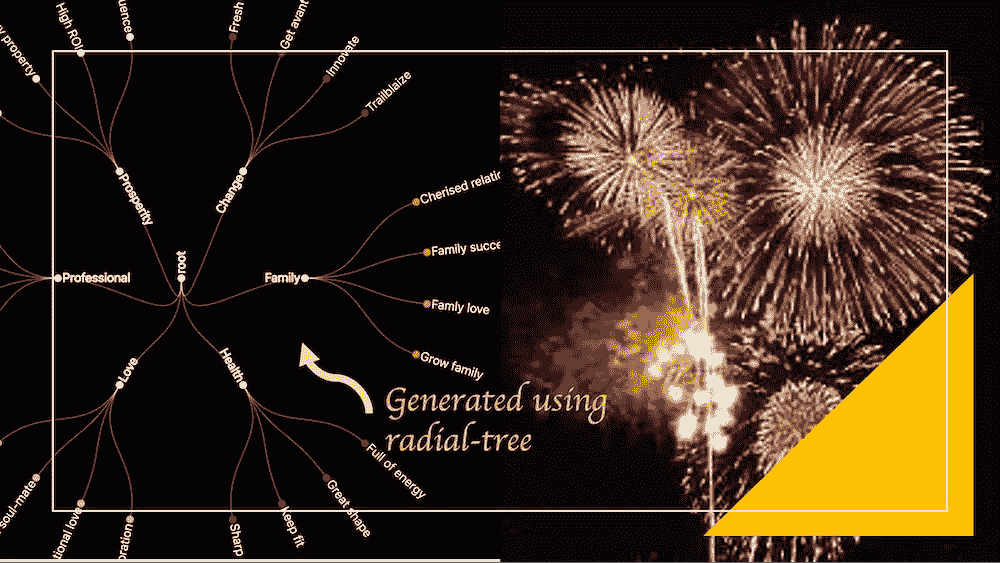
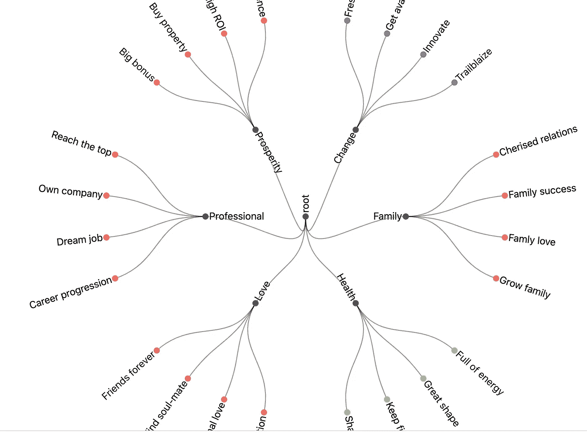

# 用数据创建新年祝福

> 原文：<https://towardsdatascience.com/new-year-greetings-with-data-76f32548a78b>

## 使用数据在新年主题上创造引人注目的视觉效果

用数据创建新年祝福—作者的左图。右边的照片由[在](https://unsplash.com/@gamzagaeguri?utm_source=unsplash&utm_medium=referral&utm_content=creditCopyText) [Unsplash](https://unsplash.com/s/photos/champagne?utm_source=unsplash&utm_medium=referral&utm_content=creditCopyText) 上的 Jaeyoon Jeong

如果你想做一个创新的新年祝福，那么你可以从数据科学算法中获得帮助！这个故事将向您展示一些创新的方法，您可以使用数据来创建非常引人注目的有趣的新年主题可视化。

在这个故事中，你将看到三个不同的新年愿望，直观地命名如下:

1.数据气泡

2.数据驱动的 2022

3.数据庆典

让我们看看这些愿望是如何实现的，以及帮助我们实现这些愿望的数据科学算法。

# 用于生成可视化的数据

我们将使用如下所示的数据来创建新年愿望可视化。第一列是一个类别，如健康、家庭、专业、繁荣等。第二列有一个与该类别相关的问候语。第三列是与每个问候的重要性相对应的权重。这纯属主观臆断。

样本数据—作者提供的图片

# 数据气泡

新年祝福——数据泡泡(图片由作者提供)

没有一杯香槟酒，新年庆祝就不完整！气泡可以成为使用尖端算法创建可视化的灵感来源。可以生成气泡式可视化的数据科学算法之一是**相似性分析**。亲和力分析背后的算法也称为力定向图。

下面显示的是基于数据的力导向可视化。一旦你有了可视化，你就可以把它和香槟图像结合起来，创造出最终的问候。

力导向可视化(图片由作者提供)

PS:亲和力分析得到了很多数据科学的应用。亲和力分析最常见的用途之一是推荐产品。

# 数据驱动的 2022

新年祝福——数据驱动的 2022(图片由作者提供)

你可以用一些创新来写 2022，表达你对 2022 的创新心情！在下面显示的问候语中，看起来很无聊的 0 已经被一些很酷的可视化所取代。这里使用的可视化被称为**弧图**，因为它提供了一个圆形的视觉效果。

下图是弧形图。你可以用两个这样的可视化来创建 2022 年的 0。

弧形图可视化(图片由作者提供)

PS:弧图被广泛用于理解数据中的嵌入和关系。

# **数据庆典**

新年祝福—数据—庆祝(图片由作者提供)

你可以把耀眼的新年焰火想象成天空中令人惊叹的视觉效果！视觉可以成为创造类似数据的灵感来源。树形图是一种可以与烟火图像完美结合的可视化。

这里是基于数据的径向树形图。一旦有了可视化效果，就可以将它与 fireworks 图像结合起来，创建最终的问候语。

径向树可视化(图片由作者提供)

PS:树形图广泛用于做路径分析比如客户行程分析

因此，希望你现在受到启发，用数据和算法来创建新年祝福！祝大家新年有一个好的开始！！！

# 额外资源

# 网站(全球资讯网的主机站)

你可以访问我的网站，用零编码制作新年祝福和其他分析。[https://experiencedatascience.com](https://experiencedatascience.com/)

每当我发布一个新的故事，请订阅保持通知。

  

你也可以通过我的推荐链接加入 Medium

  

## Youtube 频道

这里是我的 YouTube 频道的链接【https://www.youtube.com/c/DataScienceDemonstrated
T3