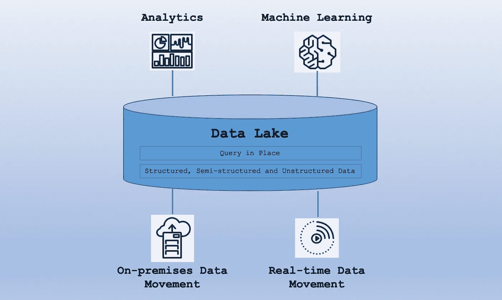
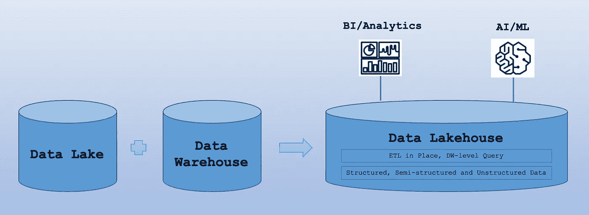
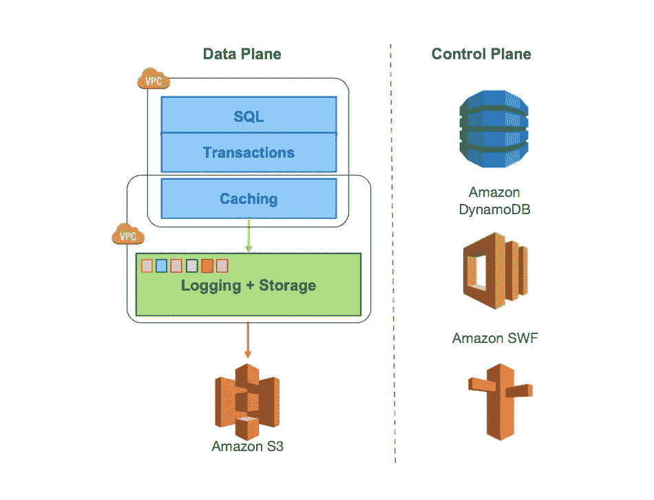
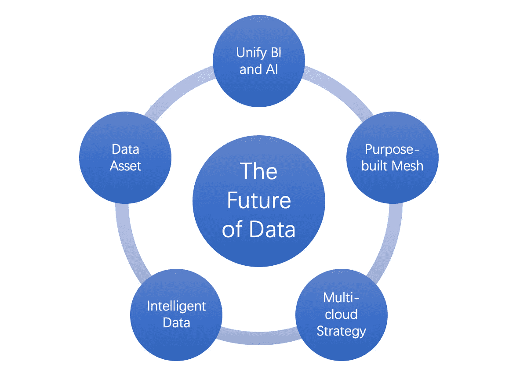

# HTAP 莱克豪斯的 NewSQL 和数据的未来

> 原文：<https://towardsdatascience.com/newsql-lakehouse-htap-and-the-future-of-data-69d427c533e0>

## 现代数据库和数据的未来

卢卡·布拉沃在 [Unsplash](https://unsplash.com?utm_source=medium&utm_medium=referral) 上的照片

像编程语言和操作系统一样，数据库是必不可少的技术。业务需求推动技术发展。在过去的 30 年里，从 SQL 到 NoSQL 和 NewSQL，出现了数百种不同的数据库。他们有两个主要的工作负载: [OLTP](https://en.wikipedia.org/wiki/Online_transaction_processing) (在线事务处理)和 [OLAP](https://en.wikipedia.org/wiki/Online_analytical_processing) (在线分析处理)，在各种硬件架构的共享一切(例如 [Oracle RAC](https://www.oracle.com/database/real-application-clusters/) )、[共享内存](https://en.wikipedia.org/wiki/Shared_memory)、[共享磁盘](https://en.wikipedia.org/wiki/Shared-disk_architecture)、[无共享](https://en.wikipedia.org/wiki/Shared-nothing_architecture)和混合(例如[雪花](https://docs.snowflake.com/en/user-guide/intro-key-concepts.html))。

## 数据库怀旧

Charles Bachman 在 20 世纪 60 年代早期开发了第一个数据库，在过去的 30 年中，数据库呈指数级增长。一开始，研究了不同的数据库查询和模型，包括 SQL、XML 和面向对象。经过十多年的竞争，Oracle、SQL Server 和 MySQL 通过标准化查询语言 SQL 和遵守 [ACID](https://en.wikipedia.org/wiki/ACID) ( [原子性](https://en.wikipedia.org/wiki/Atomicity_(database_systems))、[一致性](https://en.wikipedia.org/wiki/Consistency_(database_systems))、[隔离性](https://en.wikipedia.org/wiki/Isolation_(database_systems))、[持久性](https://en.wikipedia.org/wiki/Durability_(database_systems)))几乎统治了商业市场和开源社区。

随着数据量、种类和速度的增长， [NoSQL](https://en.wikipedia.org/wiki/NoSQL) 因性能效率、模式灵活性和新功能而首次亮相，例如， [Redis](https://en.wikipedia.org/wiki/Redis) 、 [MongoDB](https://www.mongodb.com) 、 [Cassandra](https://en.wikipedia.org/wiki/Apache_Cassandra) 、 [Neo4J](https://en.wikipedia.org/wiki/Neo4J) 、 [Elasticsearch](https://en.wikipedia.org/wiki/Elasticsearch) 等。NoSQL 有键值存储、文档数据库、面向列的数据库、图形数据库等。但是[上限定理](https://en.wikipedia.org/wiki/CAP_theorem)和缩放性能抑制了它们的持续发展。许多 NoSQL 数据库已经妥协或优化为[最终一致性](https://en.wikipedia.org/wiki/Eventual_consistency)或[非规范化](https://en.wikipedia.org/wiki/Denormalization)。NoSQL 数据库的属性通常可以用一个松散的基础概念来描述，在遵守 CAP 定理时，它更喜欢可用性而不是一致性。BASE 代表基本可用性、软状态和最终一致性。

现代数据库要求是分布式的和可伸缩的。出现了许多扩展数据库的机制:复制(主-从或主-主)、[联合](https://en.wikipedia.org/wiki/Federated_database_system)、[分片](https://en.wikipedia.org/wiki/Shard_(database_architecture))、[非规范化](https://en.wikipedia.org/wiki/Denormalization)、[物化视图](https://en.wikipedia.org/wiki/Materialized_view)、SQL 调优、NoSQL 等。而 [Raft](https://en.wikipedia.org/wiki/Raft_(algorithm)) 和 [Paxos](https://en.wikipedia.org/wiki/Paxos_(computer_science)) 是分布式数据库的两个重要共识算法。

[NewSQL](https://en.wikipedia.org/wiki/NewSQL) 是一类现代关系数据库，旨在为 OLTP 工作负载提供与 NoSQL 相同的可扩展性能，同时仍然使用 SQL 并保持传统数据库的 ACID 保证。

“数据仓库”这个名字是为 OLAP 数据库创造的，但它现在很少被称为数据库了。数据仓库是[商业智能](https://en.wikipedia.org/wiki/Business_intelligence)的核心组件，用于数据分析和商业洞察。十年前，当[大数据](https://en.wikipedia.org/wiki/Big_data)平台出现时，它变得暗淡了。人们从传统的数据仓库转向使用数据平台，直到云重新赋予数据仓库以新的性能和可扩展性。

凭借高性能和高可扩展性的数据云，一个新时代的到来催生了一个全新的数据平台生态系统，**现代数据堆栈**。

## 云改变了游戏

云技术从两个主要方面从根本上改变了数据库游戏:卓越运营和系统架构。云以两种方式实现数据库操作的自动化或半自动化:云托管(半托管甚至完全托管)和云本地。云重塑了数据库的架构，主要是通过分离存储和计算。存储或计算可以独立扩展，以提高效率、性能、灵活性和成本。这种分离的架构还可以为数据库系统集成不同类型的存储和计算，以实现整体高性能和新功能。

分离存储和计算可能是云中的一个基本概念，但 [EMRFS](https://docs.aws.amazon.com/emr/latest/ReleaseGuide/emr-fs.html) (EMR 文件系统)应该是分离 [Hadoop](https://en.wikipedia.org/wiki/Apache_Hadoop) 文件系统(HDFS)以在 S3 存储 HDFS 的第一个尝试。沿着这个方向，云 NoSQL(例如， [DynamoDB](https://aws.amazon.com/dynamodb/) 和 [BigTable](https://cloud.google.com/bigtable) )和云原生 SQL 数据库(又名 cloud NewSQL)在多个云提供商、AWS、Azure、GCP 等之间激增。

对象存储是云中的早期存储之一，就像亚马逊 S3 一样。S3 是第一个目的简单的对象存储服务(通过键放置/获取对象)，正如它的名字(简单存储服务)所暗示的。但是 S3 由于其简单性、低成本、高可用性、可扩展性等已经成为云基础。进而随着 S3 查询到位演变成 [**数据湖**](https://en.wikipedia.org/wiki/Data_lake):S3 Select，S3 亚马逊 Athena，S3 亚马逊红移谱(EB 级别)。

数据湖解释(作者)

## 纽什尔、莱克豪斯和 HTAP

几年前，我们对 NewSQL 和 data lake 感到兴奋不已。现在**数据仓库**在被 Databricks 高调宣传后已经成为一个时髦的词。不久，像 Presto 这样的人就意识到它只是在对象存储上运行快速 SQL，具有数据仓库性能和数据湖灵活性。然后[德雷米奥](https://www.dremio.com/)、[星爆](https://www.starburst.io)等人很快就参军了。

Data Lakehouse 不仅仅是一个时髦的词，而是一个卓越而有意义的架构统一策略。它集成了数据湖和数据仓库，以提高性能、灵活性和成本效益，并消除数据孤岛和 ETL 过程。它统一了所有数据，以简化数据工程流程，同时支持 BI 和 AI 工作负载。

数据湖屋解释(作者)

另一方面， [**HTAP**](https://en.wikipedia.org/wiki/Hybrid_transactional/analytical_processing) 随着谷歌 [AlloyDB](https://cloud.google.com/alloydb) 和雪花 [Unistore](https://www.snowflake.com/workloads/unistore/) 的发布，给火热的现代数据栈火上浇油。类似地，Oracle、SQL Server 和其他公司在近十年前就配备了这一功能。然而，目前的 HTAP 和莱克豪斯有一个共同的目标，那就是消除从 OLTP 到 OLAP 或从数据湖到数据仓库的 ETL。

当前的 HTAP 是一个支持 OLTP 和 OLAP 工作负载的单一系统架构，不像一些早期的数据库可以配置为 OLAP 或 OLTP，但不能一起配置。有两种常见的 HTAP 架构:在内部将 OLAP 和 OLTP 联合为单个 HTAP 系统(例如， [TiDB](https://en.wikipedia.org/wiki/TiDB) )以及将 OLTP 和 OLAP 架构与存储中的 TP 行和内存中的 AP 列集成，反之亦然(例如，AlloyDB 和 Oracle MySQL [HeatWave](https://www.oracle.com/mysql/heatwave/) )。

[亚马逊 Aurora](https://aws.amazon.com/rds/aurora/) 是一种关系数据库服务，完全兼容 MySQL 和 PostgreSQL。它是第一个云原生的**NewSQL**数据库，并被重新发明以分离数据库存储和计算。简而言之，它将传统数据库集群的存储统一到云存储中，并允许独立地横向扩展数据库计算层。与集群上的 Oracle RAC 不同，这是一种在云中共享一切的体系结构。

亚马逊[极光架构](https://dl.acm.org/doi/10.1145/3035918.3056101)

Google [Spanner](https://cloud.google.com/spanner) 是另一个云原生的 NewSQL 数据库。雪花采用了类似的云原生架构，为云数据仓库解耦存储和计算。不幸的是，亚马逊[红移](https://aws.amazon.com/redshift/)更早推出，但使用了类似 [EMR](https://aws.amazon.com/emr/) 的集群托管架构，首战输给了雪花。

## 数据的未来

今天，每个公司都是数据驱动的公司。数据变得比以往任何时候都更加重要。随着业务和技术的变化，数据库和数据堆栈不断快速发展。展望数据的未来，有五个令人兴奋的领域:统一 BI 和 AI、专门构建的网格、多云战略、智能数据和数据资产。

数据的未来(作者)

**统一 BI 和 AI** :我们致力于统一所有数据，以消除数据孤岛、ETL 等。但这不是目标。目标应该是释放所有数据的商业价值，并支持 BI 和 AI 的整个数据环境，包括从描述性到诊断性、预测性和规范性分析的所有数据分析。从数据到商业价值的旅程通常涉及多个人:数据工程师、数据分析师、数据科学家、ML 工程师等。统一 BI 和 AI 不仅可以消除数据孤岛和 ETL，还可以简化管道并提高利益相关者的生产力。Data Lakehouse 是一个巨大的飞跃，但这一努力才刚刚开始。

**特制网格**:数据库技术融合是一种趋势，比如 NewSQL、Lakehouse、HTAP。但是我们知道，NewSQL 或 data lakehouse 仍然是 OLTP 或 OLAP 的一种类型。上限定理仍然成立。当前的 HTAP 解决方案可能主要是 OLTP 或适合小型工作负载。采用目前市场上可用的 HTAP 作为大型企业数据仓库或非结构化数据的数据湖几乎是不切实际的。专门构建的数据库可以更好地满足不同的业务目标，如性能、可扩展性或/和特定用例(例如，时序数据、图表、搜索等)。).专门构建的数据库网格可以通过聚合层抽象数据库，以实现互连、统一的数据服务和一致的治理。然而，当我们拥有像量子计算或超高速网络和存储这样的超级强大的计算时，情况可能会发生变化。

**多云战略**:多云战略联合了孤立的公共云和私有云，无需移动数据。它可以提高多个云提供商的服务可用性，通过近似计算减少延迟，实现特定云生态系统或市场的独特功能，通过更多云产品扩展全球可用性，并增强数据合规性和法规。 [Starburst](https://www.starburst.io) 和 [Dremio](https://www.dremio.com) 是两家领先的云计算数据平台初创公司。多云战略还推动了数据可观察性、数据编目、数据共享和数据编排的浪潮。

**智能数据**:AI 与数据互使有三个域:AI for Data (AIData)，AI for Database([AI ops](https://en.wikipedia.org/wiki/Artificial_Intelligence_for_IT_Operations)的一部分)，Data for AI(涉及[特征工程](https://en.wikipedia.org/wiki/Feature_engineering)和 [MLOps](https://en.wikipedia.org/wiki/MLOps) )。智能数据是数据的 AI，使数据在数据质量、数据治理、数据血统、元数据、语义以及来自分析和 AI 的新数据方面具有智能。生成式人工智能将在智能数据中发挥关键作用。到 2025 年， [10%的数据](https://youtu.be/Iv4ba02ypZk?t=1035)将由生成式人工智能模型产生。这些数据可以是语音、视频、图像、文本、结构化数据、代码等。它们是具有内置丰富元数据的高质量数据。这意味着当前的数据库，包括 data lake 和 data lakehouse，由于其丰富的元数据和指数增长，可能不是最佳的。

**数据资产**:是将数据作为组织或个人的数据库或存储中的数字资产进行管理的原则。这样的数据库不仅是一个数据管理系统，而且还提供或集成了数据可观察性、安全性和隐私管理、定价、数据生命周期管理等等。它与 OLAP 和 OLTP 有关，尽管它似乎在 OLAP 社区更活跃。与组织的传统数据资产不同，它们可以属于个人。然后，这个数据资产可以无缝集成到 web3 中，并可以用 NFT 进行铸造。因此，随着 web3 的发展，这意味着很多。

数据无处不在。更令人兴奋的是，我们期待数据平台和服务的未来能够让商业和生活变得更加轻松和幸福。

## 参考

1.  Amazon DynamoDB:一个可扩展的、可预测的性能和完全管理的 NoSQL 数据库服务:[https://www . Amazon . science/publications/Amazon-dynamo db-A-Scalable-predictable-Performant-and-full-Managed-no SQL-Database-Service](https://www.amazon.science/publications/amazon-dynamodb-a-scalable-predictably-performant-and-fully-managed-nosql-database-service)
2.  亚马逊红移再发明:[https://www . Amazon . science/publications/Amazon-Redshift-再发明](https://www.amazon.science/publications/amazon-redshift-re-invented)
3.  亚马逊雅典娜中通过融合的计算重用:[https://www . Amazon . science/publications/computation-reuse-via-fusion-in-Amazon-Athena](https://www.amazon.science/publications/computation-reuse-via-fusion-in-amazon-athena)
4.  亚马逊极光:关于避免 I/o、提交和成员资格变更的分布式共识:[https://www . Amazon . science/publications/Amazon-Aurora-On-avoiding-distributed-consensus-for-I-Os-commits-and-membership-changes](https://www.amazon.science/publications/amazon-aurora-on-avoiding-distributed-consensus-for-i-os-commits-and-membership-changes)
5.  DB 引擎排名:【https://db-engines.com/en/ranking 
6.  什么是数据湖？[https://AWS . Amazon . com/big-data/data lakes-and-analytics/what-a-data-lake/](https://aws.amazon.com/big-data/datalakes-and-analytics/what-is-a-data-lake/)