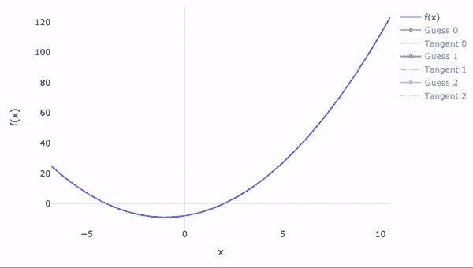
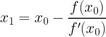
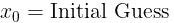
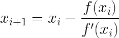
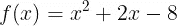
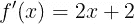
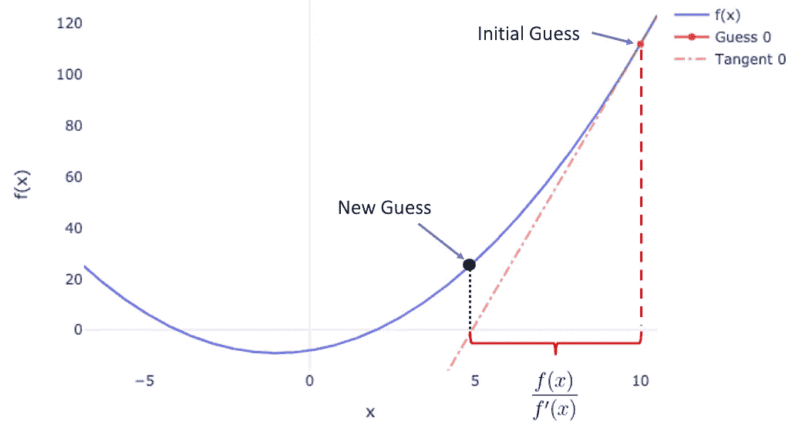
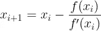

# 牛顿-拉夫森——解释和可视化

> 原文：<https://towardsdatascience.com/newton-raphson-explained-and-visualised-23f63da21bd5>

## 理解牛顿拉夫森算法

牛顿-拉夫森方法(图片由作者提供)

以艾萨克·牛顿和约瑟夫·拉弗森命名的牛顿-拉夫森方法是一种设计的求根算法，这意味着它的目标是找到函数 *f(x)=0* 的值 *x* 。从几何学上讲，我们可以把它看作是目标函数穿过轴 *x* 时的 *x* 的值。

然而，用例并没有就此结束，事实上，这个算法对于跨越许多领域的广泛用例来说是非常通用的。例如，通过重新构造感兴趣的函数，您可以搜索 *x* 的值，从而产生您选择的值，而不是被限制为 0。

实践中的一个复杂用例是使用 Black-Scholes 公式反解金融期权合同的隐含波动率。然而，牛顿-拉夫森算法也可以用于一些简单的事情，如回解，以找到你需要在期末考试中获得多少分数才能在给定的连续评估成绩中获得 A。事实上，如果你曾经使用过微软 Excel 中的*求解器*功能，那么你可能使用过像牛顿-拉夫森这样的求根算法。

# 分解公式

牛顿-拉夫森公式(图片由作者提供)

虽然这个公式本身非常简单，但是乍看之下，想象它实际上在做什么可能有点棘手。

首先，让我们回顾一下总体方法:

1.  初步猜测根可能在哪里

作者图片

2.应用牛顿-拉夫森公式获得比初始猜测更接近根的更新猜测

3.重复步骤 2，直到新的猜测足够接近。

等等，*够近了*？是的，不幸的是，Newton-Raphson 方法给出了根的一个*近似值*，尽管通常对于任何合理的应用来说它已经足够接近了！你可能会问我们如何定义足够近？我们什么时候停止迭代？

通常，Newton-Raphson 方法的实现将有两种处理何时停止的方式。首先，如果你的猜测从一个步骤到下一个步骤的变化不超过一个阈值，比如说 0.00001，那么算法将停止，并说最近的猜测*足够接近*。第二种方法不太理想，只是简单地说，如果我们达到一定数量的猜测，但仍然没有达到阈值，那么我们就放弃。

牛顿-拉夫森公式(图片由作者提供)

从公式中，我们可以看到，每个新的猜测只是我们以前的猜测调整了一些神秘的数量🔮。然而，如果我们通过一个例子来观想这个过程，很快就会清楚发生了什么！

示例函数

示例函数的导数

作为一个例子，让我们考虑上面的函数，并初步猜测为 *x=* 10(注意这里实际的根是在 *x=* 4)。牛顿-拉夫森算法的最初几个猜测在下面的 GIF 中被可视化👇

牛顿-拉夫森过程(GIF 由作者提供)

我们最初的猜测是在 *x=* 10。现在，请记住，为了计算我们的下一个猜测，我们需要评估函数本身及其在 *x=* 10 的导数。然而，在 10 处计算的函数导数仅仅给出了该点处切线曲线的斜率。该切线在 GIF 中被绘制为*切线 0* 。

现在，看看下一个猜测相对于前一个切线出现在哪里，你注意到什么了吗？下一个猜测出现在前一条切线穿过 *x-* 轴的地方。这就是牛顿-拉夫逊法的高明之处！

作者图片

作者图片

事实上，商*f(x)*/*f’(x)*简单地给出了我们当前猜测与切线穿过 *x* 轴的点之间的距离(在 *x* 方向上)。正是这个距离告诉我们每次要更新我们的猜测多少，正如我们在 GIF 中看到的，当我们接近根本身时，更新越来越小，这阻止了我们超越。

## 功能用手很难区分怎么办？

在上面的例子中，我们有一个很容易手动微分的函数，这意味着我们可以毫不费力地计算*f’(x)*。然而，在现实中可能不是这样，有一些有用的技巧来近似导数，而不需要知道它们的解析解。

这些导数近似方法超出了本文的范围，但是如果你感兴趣，你可以在这里阅读更多关于有限差分方法的内容。

## 问题

敏锐的读者可能已经从上面的例子中发现了一个问题，即牛顿-拉夫森方法只能识别一个根，尽管我们的示例函数有两个根( *x=* -2 和 *x=* 4)。这当然是一个问题，但不是这种方法的唯一缺点。关于牛顿-拉夫森方法的更多有用信息，比如收敛的必要条件，你可以在这里查阅维基百科页面[。](https://en.wikipedia.org/wiki/Newton%27s_method)

🙋‍♂️感谢你的阅读！请随意回答任何问题🙋‍♀️

 [## 加入我的推荐链接-海豚

### 作为一个媒体会员，你的会员费的一部分会给你阅读的作家，你可以完全接触到每一个故事…

medium.com](https://medium.com/@riandolphin/membership)