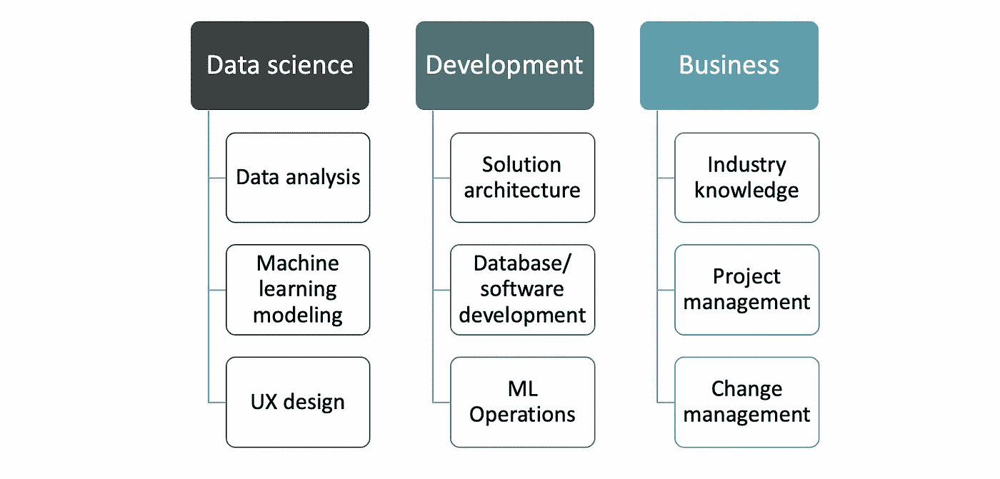
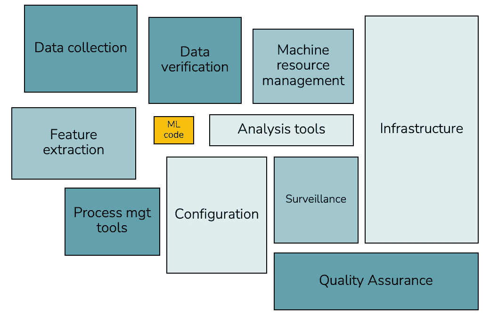
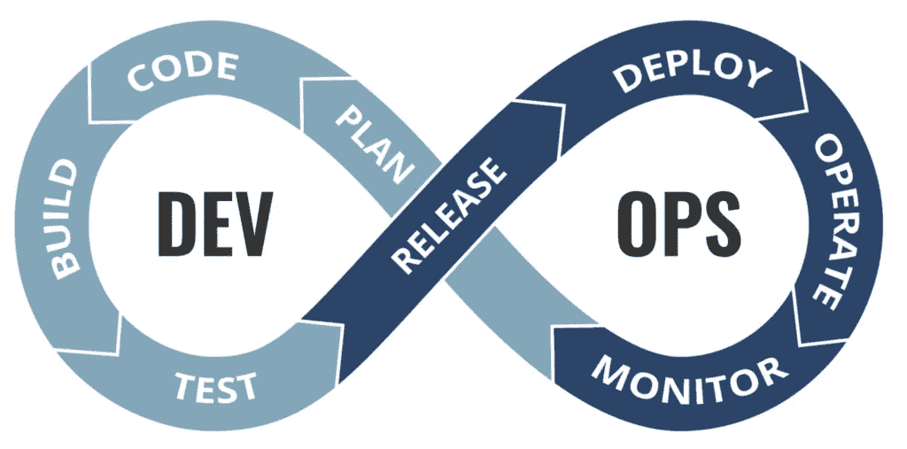
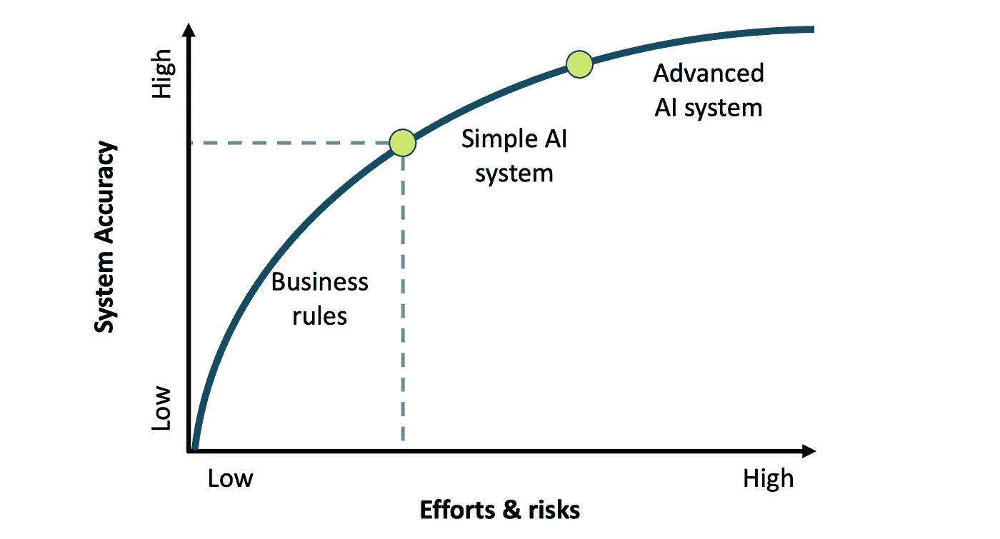

# 一个成功的人工智能项目的九个关键角色

> 原文：<https://towardsdatascience.com/nine-critical-roles-for-a-successful-ai-project-20525ee47467>

## 交付一个人工智能系统是困难的。这就是为什么你需要一个人才和技能互补的高绩效团队。

成功交付人工智能项目的最佳团队是什么？这是一个很难回答的问题。这将取决于项目的类型和你工作的组织的类型。利用我从指导不同行业的许多公司中收集的知识，这里有九个决定人工智能项目成败的关键角色。

一名员工可以根据其技能组合担任多个角色。这里的想法是，您的项目团队涵盖所有这些，以最大化您成功项目的机会。

## 人工智能项目团队中的九个关键角色

AI 团队项目按角色组成，由作者制作

## 数据科学

在人工智能项目中，数据科学是一个显而易见的学科。我们不断听说，数据科学家是构建人工智能解决方案所需的唯一角色。首先，它不是，其次，一个人工智能项目要成功，需要发生许多活动。单个数据科学家无法解决所有这些问题。我不相信独角兽。

我通常将数据科学活动分成三个独立的角色:

*   **数据分析**:数据是一个 AI 系统的油。正确分析用于训练 AI 系统的数据至关重要。没有机油，它可能会永久地完全卡住你的发动机。
*   **机器学习(ML)建模**:一旦数据被定义和清理，机器学习模型将被训练、验证和测试以生成预测。然后你可以进行实验，并有希望将你的预测整合到一个系统中。
*   **UX 设计** : UX 设计是人工智能系统中最容易被忽视的部分之一。在我看来，它是如此的关键。最终用户将如何访问系统的输出？你如何确保他们理解并信任系统的结果？UX 的设计师也可以研究模型的可解释性，并将其翻译成一种可以理解的非技术语言。

## 发展

不幸的是，发展仍然被低估。然而，开发和部署一个可操作的人工智能系统需要许多小时的软件开发。您将认识到拥有一个功能性解决方案所需的非机器学习基础设施、流程和工具的数量。

增强的 AI 系统组成，来自[机器学习系统中隐藏的技术债务](https://proceedings.neurips.cc/paper/2015/file/86df7dcfd896fcaf2674f757a2463eba-Paper.pdf)

你需要具体的专业知识来操作人工智能，并围绕数据、机器学习模型和由你专注于数据科学的角色创建的 UX 建立一个强大的系统。

*   **解决方案架构**:如上图所示，构建一个系统需要很多硬件和软件元素。这种技能对于绘制人工智能系统的示例性软件架构以满足最终用户的需求至关重要。
*   **数据库和软件开发**:突发新闻:人工智能解决方案就是软件解决方案。一个特定的，但仍然是一个软件解决方案。因此，对数据库、脚本和 API 的健壮性和效率要求。如果你只依赖数据科学家来提供一个人工智能解决方案，你会失望的，因为很少有数据科学家既掌握软件开发又掌握数据科学。再说一次，我不相信独角兽。
*   **解决方案运营**:人工智能解决方案的解决方案运营是 DevOps 和 MLOps 的结合。DevOps 是一套实践，旨在缩短开发生命周期，并提供高质量的持续交付。相比之下，MLOps 是机器学习应用和工作流的自动化和生产化过程(来源: [phdata](https://www.phdata.io/blog/mlops-vs-devops-whats-the-difference/) )。

DevOps 周期，来自 [MLOps vs. DevOps:有什么区别](https://www.phdata.io/blog/mlops-vs-devops-whats-the-difference/)

## 商业

组织内的任何人工智能项目都应该有很强的商业考虑，因为技术不能解决任何问题，除非它与商业现实相一致。

*   **行业知识**:这是一个 AI 项目中最关键的角色。是的，一个非技术性的角色。产品所有者(或 PO)是这个角色的通用名称。一个伟大的采购订单可以产生直接的利益，同时通过开发业务规则和启发以及塑造人工智能项目的业务需求来降低风险。PO 还确保项目团队学习对 AI 解决方案至关重要的行业知识，并在整个项目中与业务利益相关者保持一致。

## 人工智能交付中的帕累托原则

人工智能交付中的帕累托原理，作者提出

*   **项目管理**:简单来说，你在一个 AI 项目中会遇到的大部分问题，只要你对项目管理得当，都是可以处理的。项目经理指导团队，以便在给定时间表和预算的情况下，交付满足业务需求的高质量项目。这是一条很好走的线，所以我建议你在招聘项目经理时寻找经验。
*   **变革管理**:你可以建立人类历史上更好的 AI 系统，但如果没人用，你只是失去了一个机会。还有钱。和时间。用户测试期间的交流、培训和支持是确保利益相关者和最终用户最大程度采用的重要活动。

你认为这篇文章还应该涉及其他角色吗？以上欢迎随意评论！