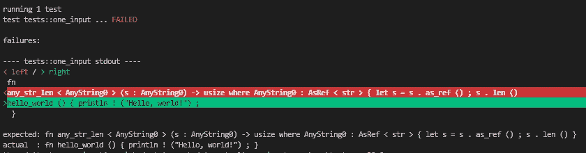
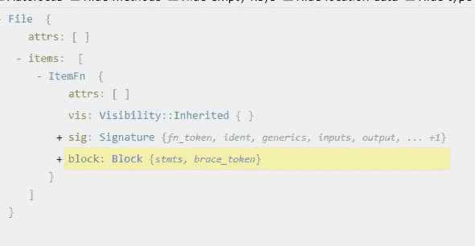

# 在 Rust 中创建程序宏的九条规则

> 原文：<https://towardsdatascience.com/nine-rules-for-creating-procedural-macros-in-rust-595aa476a7ff>

## 来自`anyinput`的实践经验，这是一个新的宏，可以轻松接受类似字符串/路径/迭代器/数组的输入


锈蟹编程本身——来源:[https://openai.com/dall-e-2/](https://openai.com/dall-e-2/)

> 更新:你可以看到这篇文章的 YouTube [版本。我出席了拉斯特林茨聚会。](https://www.youtube.com/watch?v=DMLBBZBlKis)

我喜欢 Rust 编程语言，但它并不完美。例如，您知道如何编写一个 Rust 函数，它接受任何类似字符串的东西作为输入吗？接受任何类型路径的迭代器*怎么样？你能写一个接受一个`Vec<f32>`作为`ndarray::ArrayView1`的函数吗？*

Rust 函数*可以*接受所有这些输入，但是我发现语法很难记忆和阅读。因此，我创建了`anyinput`宏来为我和其他 Rust 程序员记住复杂的语法。(参见 https://crates.io/crates/anyinput 的[。)](https://crates.io/crates/anyinput)

在创建`anyinput`的时候，我学到了九条规则，可以帮助你在 Rust 中轻松创建程序宏。规则是:

1.  使用 Rust workspace 和`proc_macro2`在普通(非宏)项目中开发、调试和单元测试您的宏。
2.  使用`syn`、`proc_macro2`和`quote`在文字代码、标记、语法树和字符串之间自由转换。
3.  创建易于调试的单元测试，报告宏所做的和预期的任何差异。
4.  使用 [AST Explorer](https://astexplorer.net/) 和`[syn](https://docs.rs/syn/latest/syn/)`文档来理解 Rust 语法树。使用 Rust 的模式匹配和结构/枚举访问来解构语法树。
5.  用`parse_quote!`和 Rust 的结构更新语法构建语法树。
6.  使用`syn`的 Fold 特性递归地遍历、析构和构造语法树。
7.  使用`proc_macro_error`返回人体工程学和可测试的错误。
8.  创建集成测试。包括基于`trybuild`的 UI 测试。
9.  遵循优雅的 Rust API 设计的规则，特别是，吃你自己的狗粮，使用 Clippy，写好文档。

Rust 强大的[宏系统](https://doc.rust-lang.org/reference/macros.html)让我们用 Rust 写 Rust。系统提供两种宏。对于第一种，您使用`macro_rules!`宏来声明一个新宏。一般很简单。可悲的是，`macro_rules!`不能做我想做的事。对于第二种类型的程序性宏，您可以获得更大的能力，因为您是在 Rust 中编程的。

过程宏有三种类型:

*   [类似功能的宏](https://doc.rust-lang.org/reference/procedural-macros.html#function-like-procedural-macros)——`custom!(…)`
*   [派生宏](https://doc.rust-lang.org/reference/procedural-macros.html#derive-macros) — `#[derive(CustomDerive)]`
*   [属性宏](https://doc.rust-lang.org/reference/procedural-macros.html#attribute-macros)——`#[CustomAttribute]`

我的宏，`anyinput` **，**是属性宏，但是这些规则适用于所有三种口味。

下面是一个使用中的`anyinput`宏的简单例子:

> 任务:创建一个函数，将`2`加到任何类似字符串的东西的长度上。

下一个例子表明`anyinput`支持多输入和嵌套。

> 任务:创建一个有两个输入的函数。一个输入接受任何类似迭代器的东西`usize`。第二个输入接受任何类似迭代器的东西或类似字符串的东西。该函数返回数字和字符串长度之和。将该函数应用于范围`1..=10`和`&str`的一部分。

这两个例子使用了`AnyString`和`AnyIter`。宏也理解`AnyPath`、`AnyArray`和(可选)`AnyNdArray`。

如何将`anyinput`宏应用到用户函数中？在幕后，它用适当的 Rust 泛型重写了函数。它还向函数中添加了一些行，以便有效地从任何顶级泛型转换为具体类型。具体来说，在第一个示例中，它将`len_plus_2`函数重写为:

这里的`AnyString0`是一个通用类型。生产线`let s = s.as_ref();`将`s`从通用型`AnyString0`转换为具体型`&str`。

创建程序宏需要许多决策。根据我对`anyinput`的经验，以下是我推荐的决定。为了避免含糊不清，我将把这些建议表述为规则。

## 规则 1:使用 Rust workspace 和 proc_macro2 在普通(非宏)项目中开发、调试和单元测试您的宏

如果我们设置得恰到好处，我们可以像常规 Rust 项目一样开发和调试宏的核心代码。比如我用 [VS 代码设置为 Rust](https://code.visualstudio.com/docs/languages/rust) 。使用我的核心代码，我可以设置交互式断点，一行一行地单步执行代码，[运行单元测试](https://marketplace.visualstudio.com/items?itemName=swellaby.vscode-rust-test-adapter)等等。

Rust 宏至少需要两个项目(顶级和派生)。我们将添加第三个项目，称为核心，以使开发更容易。

**重要提示:在项目或文件名中任何地方看到“anyinput ”,请用您的项目替换*的名称。***

下表总结了您应该如何布置文件:

接下来，让我们详细了解一下文件布局。

**顶层项目:**使用 Rust 常用的`[cargo new anyinput --lib](https://doc.rust-lang.org/cargo/guide/creating-a-new-project.html)`命令创建顶层文件。**(记住:用你的项目名称替换 *anyinput* 。)**打开新创建的顶层`[Cargo.toml](https://github.com/CarlKCarlK/anyinput/blob/9rules/Cargo.toml)` 并将这些行添加到文件的底部:

`[workspace]`部分定义了三项目[生锈工作空间](https://doc.rust-lang.org/cargo/reference/workspaces.html)。我们的`[dev-dependencies]`包含`trybuild`，一个我们将用于集成测试的依赖项(规则 8)。我们的`[dependencies]`只包含当前版本的`anyinput-derive`，以及`"anyinput-derive"`的[路径](https://doc.rust-lang.org/cargo/reference/specifying-dependencies.html#specifying-path-dependencies)。

如果你看我的`[src/lib.rs](https://github.com/CarlKCarlK/anyinput/blob/9rules/src/lib.rs)`文件，你会看到它主要包含文档。唯一关键的一行是:

```
pub use anyinput_derive::anyinput;
```

这使得宏`anyinput::anyinput`通过[重新导出](https://doc.rust-lang.org/reference/items/use-declarations.html#use-visibility) `anyinput_derive::anyinput`可见。我们现在将定义`anyinput_derive::anyinput`。

顶层的`[README.md](https://github.com/CarlKCarlK/anyinput/blob/9rules/README.md)`文件包含项目的主要文档。

当我们谈到规则#8 时，我们将讨论顶层的`tests`文件夹。

**衍生项目:**使用命令`[cargo new anyinput-derive --lib](https://doc.rust-lang.org/cargo/guide/creating-a-new-project.html)`在顶层文件夹中创建衍生文件。将这些行添加到`[anyinput-derive/Cargo.toml](https://github.com/CarlKCarlK/anyinput/blob/9rules/anyinput-derive/Cargo.toml)`的底部:

`[lib]`部分将`anyinput-derive`定义为程序宏项目。`[dependencies]`部分首先引入了我们尚未创建的`anyinput-core`项目，以及它的当前版本和本地路径。它还引入了两个重要的外部板条箱(将在规则#2 和#7 中讨论)。

文件`[anyinput-derive/README.md](https://github.com/CarlKCarlK/anyinput/blob/9rules/anyinput-derive/README.md)`真的是一个“*别读我的*”文件。字面意思是，“你可能正在寻找`[anyinput](https://docs.rs/anyinput/)`板条箱，它包裹着这个板条箱，使用起来更符合人体工程学。”

我的`[anyinput-derive/src/lib.rs](http://anyinput-derive/src/lib.rs)`文件正好包含 11 行:

下面是这些行的作用:

*   他们拉进了“*别读我的*”[文件作为文档](https://blog.guillaume-gomez.fr/articles/2021-08-03+Improvements+for+%23%5Bdoc%5D+attributes+in+Rust)。
*   他们从`anyinput_core`项目中导入了`anyinput_core`函数。
*   他们使用`#[proc_macro_attribute]`通过函数`anyinput`定义一个宏。与所有属性宏函数一样，该函数接受两个`TokenStream`输入并返回一个`TokenStream`。(如果您希望创建类似函数的宏或派生宏，函数签名会略有不同。详见[程序宏-生锈参考](https://doc.rust-lang.org/reference/procedural-macros.html#function-like-procedural-macros)。)
*   这些行根据`anyinput_core`功能定义了`anyinput`功能。`.into()`方法在名为`TokenStream`的类型的两个版本之间进行转换。
*   他们使用`#[proc_macro_error]`来捕捉`abort!`并返回人体工程学错误。详情见规则 7。

**核心项目:**使用命令`[cargo new anyinput-core --lib](https://doc.rust-lang.org/cargo/guide/creating-a-new-project.html)`从顶层文件夹中创建核心项目。将这些行添加到`[anyinput-core/Cargo.toml](https://github.com/CarlKCarlK/anyinput/blob/9rules/anyinput-core/Cargo.toml)`的底部:

文件`[anyinput-core/README.md](https://github.com/CarlKCarlK/anyinput/blob/9rules/anyinput-core/README.md)`是另一个“*不要读我的内容*”文件，它将用户引向顶层项目。

文件`[anyinput-core/src/tests.rs](https://github.com/CarlKCarlK/anyinput/blob/9rules/anyinput-core/src/tests.rs)`包含单元测试。我们将在规则 3 中讨论这个问题。

文件`[anyinput-core/src/lib.rs](https://github.com/CarlKCarlK/anyinput/blob/9rules/anyinput-core/src/lib.rs)`将最终包含宏的大部分代码。现在，从以下内容开始:

后面的规则将详细说明这些行的作用。大意是`anyinput_core`叫`transform_fn`。目前，`transform_fn`函数将任何用户功能转换为“Hello World”功能。

文件`[anyinput-core/src/tests.rs](https://github.com/CarlKCarlK/anyinput/blob/9rules/anyinput-core/src/tests.rs)`将最终包含所有的单元测试。(在规则#3 中讨论)。目前，它包含:

这几行创建了一个单元测试，测试宏是否将用户的`hello_universe`函数变成了`hello_world`函数。您可以通过运行`cargo test first`从 anyinput-core 目录测试它。(你也可以在 [Rust Playground](https://play.rust-lang.org/?version=stable&mode=debug&edition=2021&gist=6d64dc79a156255e45c9541be8e5be96) 上运行这个版本。)

因为`anyinput-core`是一个普通(非宏)Rust 包，你可以用你的普通 Rust 工具开发它的代码。例如，如果您的代码编辑器支持交互式调试，您可以设置断点和/或单步执行代码。

当然，`anyinput`宏不应该把用户的函数变成`hello_world`函数。相反，它应该重写用户函数以接受任何字符串、路径等。为此，我们必须了解如何在文字代码、标记、语法树和字符串之间进行转换。这是第二条规则的主题。

## 规则 2:使用`syn`、`proc_macro2`和`quote`在文字代码、标记、语法树和字符串之间自由转换。

通过允许我们使用语法树，`[syn](https://docs.rs/syn/latest/syn/)`、`[proc_macro2](https://docs.rs/proc-macro2/latest/proc_macro2/)`和`[quote](https://docs.rs/quote/latest/quote/)`箱使得创建过程宏更加容易。

例如，使用三个板条箱，您可以将对`transform_fn`的输入打印为一个字符串。这对调试很有用。

首先，我们添加两个临时的`println!`语句。

然后，从`anyinput-core`文件夹中，我们运行`cargo test first -- --nocapture`。(你也可以在 [Rust Playground](https://play.rust-lang.org/?version=stable&mode=debug&edition=2021&gist=6d64dc79a156255e45c9541be8e5be96) 上运行这个版本。)最后，我们看到:

要利用这三个板条箱，您必须了解以下项目以及如何在它们之间转换。

*   文字代码—这是文件中的代码。例如:

```
fn hello_universe() {
    println!("Hello, universe!");
}
```

*   `[TokenStream](https://docs.rs/proc-macro2/latest/proc_macro2/struct.TokenStream.html)` [](https://docs.rs/proc-macro2/latest/proc_macro2/struct.TokenStream.html)—这代表一个抽象的令牌流。Rust 编译器通过首先将用户的文字代码转换成`TokenStream`来应用宏。编译器接下来将那个`TokenStream` 提供给宏进行处理。最后，宏返回一个编译器编译的新的`TokenStream` 。
*   语法树—这是表示已分析代码的嵌套 Rust 结构和枚举。结构和枚举在板条箱`[syn](https://docs.rs/syn/latest/syn/)`中定义。例如，`[ItemFn](https://docs.rs/syn/latest/syn/struct.ItemFn.html)`是表示独立函数的结构。`[ItemFn](https://docs.rs/syn/latest/syn/struct.ItemFn.html)`的四个场之一`block`包含`[Stmt](https://docs.rs/syn/latest/syn/enum.Stmt.html)`的矢量。枚举`[Stmt](https://docs.rs/syn/latest/syn/enum.Stmt.html)` 表示 Rust 语句。(规则 4 告诉我们如何了解`syn`定义的结构和枚举。)
*   代码、语法和标记的字符串——我们可以将前面的项转换成字符串。此外，我们可以将字符串转换为前面的项目。

此表总结了如何从其他类型转换成您想要的类型。

换算表

> 旁白:一套新的 Rust 宏的想法:一套更统一地进行这些转换的宏

接下来，让我们看看演示这些转换的示例代码。(您也可以在[防锈操场](https://play.rust-lang.org/?version=stable&mode=debug&edition=2021&gist=7ae7d8fd405a2af5afc60ef3de9b2dad)运行该示例代码。)

**令牌的文字代码、语法和代码串**

如果您有文字代码，请使用`quote!`、`parse_quote!`和`stringify!`分别将其转换为`TokenStream`、语法树或代码串。

注意，`parse_quote!`必须看到一个`syn`类型，这里是`ItemFn`结构。这告诉它要解析成什么。同样，回想一下 Rust 让我们用任何类型的括号调用类似函数的宏:`!(` … `)`、`![` … `]`或`!{` … `}`。和差不多。

**令牌到代码串&令牌串**

了解 a `TokenStream` 代表什么代码通常很有用。使用`.to_string()`。您可能还对令牌本身的字符串表示感兴趣。如果是，使用`format!("{:?}",…)`。使用`format!("{:#?}",…)`来美化打印，即将新的行和制表符添加到令牌串中。

**代码串的语法树&语法串**

了解语法树代表什么代码通常很有用。使用`quote!(#syntax).to_string()`。将语法树本身看作一个字符串通常也是有用的。使用`format!("{:?}",syntax)`。使用`format!("{:#?}",syntax)`向语法字符串添加新的行和制表符。

**令牌↔语法**

要将令牌流转换成语法树，请使用`parse2`。注意`parse2`需要解析的`syn`类型(这里是`ItemFn`)。另外，请注意`parse2`可能会返回一个错误结果。我们将在规则 7 中看到如何处理错误。

要将语法树转换成`TokenStream`，请使用`quote!(#syntax)`。

**语法树或令牌的代码串**

要将代码串转换成语法树或`TokenStream`，请使用`parse_str`。它需要一个`syn`类型或`TokenStream`，这样它就知道要解析成什么。它可以返回一个错误结果。

**符号串和语法串的文字代码**

最后，为了将文字代码转换成一串标记，我们首先转换成一个`TokenStream` ，然后再将其转换成一个字符串。将文字代码转换为语法字符串需要三个步骤:转换为标记、转换为语法树(可能会有错误结果)、转换为字符串。

了解了如何在这些感兴趣的项目之间进行转换之后，我们接下来继续单元测试。

## 规则 3:创建易于调试的单元测试，报告宏所做的和你所期望的之间的任何差异

> 旁白: [Rust Book 推荐](https://doc.rust-lang.org/book/ch11-03-test-organization.html)将单元测试放在你的`lib.rs`中。我更喜欢把它们放在`tests.rs`档案里。两种设置都可以。

按照规则#1，我们的单元测试存在于标准(非宏)Rust 项目中，可以用标准 Rust 工具运行和调试。但是那些单元测试应该采取什么形式呢？

我推荐这样的测试

*   指定用户的文字代码。这是进入宏的代码之前的*。*
*   在宏应用后指定预期的文字代码*。*
*   应用宏，然后检查*预期*是否等于之后的*。如果*预期*与*后的*不同，显示差异。*
*   最后，如果可能的话，运行预期代码的副本。

下面是一个简单的单元测试。可以看到它期望宏重写用户函数`any_str_len`。它还检查预期的`any_str_len`代码实际上返回了一个字符串的长度。(你可以在 [Rust Playground](https://play.rust-lang.org/?version=stable&mode=debug&edition=2021&gist=dee4d37e3413104844fe3127d9a5698b) 上运行这个，看测试失败。)

当我们运行它时会发生什么？它失败了！



为什么？在 [VS 代码](https://code.visualstudio.com/docs/languages/rust)中，我在单元测试中设置了一个断点，然后单步执行代码。我看到`anyinput_core`函数调用了`transform_fn`。然后，我看到当前版本的`transform_fn`将所有用户函数转换成了一个`hello_world`函数。

测试的输出还显示了预期的和之后的*之间的差异。单元测试调用的助手函数`assert_tokens_eq`报告了差异。助手功能是:*

这是一个简单的单元测试。我们的下一步是创建更多的单元测试来测试我们还没有编写的宏。对于`anyinput`宏，这些单元测试包括处理带有两个输入的用户函数、带有路径和数组的输入、嵌套输入等。

有了一些单元测试，我们接下来想开始写我们的宏。这需要创造一个更好的`transform_fn`。然而，这需要理解 Rust 语法树，这就引出了规则 4。

> 旁白:`anyinput` 宏通过`transform_fn`(`[*anyinput-core/src/lib.rs*](https://github.com/CarlKCarlK/anyinput/blob/9rules/anyinput-core/src/lib.rs)`*中的一个函数)转换用户的*函数*。*例如，如果您的宏转换了用户的*结构*，您可以将`*transform_fn*` *更改为* `transform_struct`。

## 规则 4:使用 [AST Explorer](https://astexplorer.net/) 和`[syn](https://docs.rs/syn/latest/syn/)`文档来理解 Rust 语法树。具有 Rust 模式匹配和结构/枚举访问的析构语法树

我们可以使用在线工具 [AST Explorer](https://astexplorer.net/) 来查看由我们的简单测试用例`any_str_len`创建的语法树。

> 旁白:一定要将 AST Explorer 的语言设置为 Rust。我一开始没有意识到这一点，最终创建了自己的在线小工具 [Rust AST Explorer](https://carlkcarlk.github.io/rust-ast-explorer/) 。

如果将版本之前的*粘贴到 AST Explorer 中，它会报告:*



我们猜测`ItemFn`代表用户的功能。`ItemFn`似乎是一个四字段结构。我们通过搜索 `[ItemFn](https://docs.rs/syn/latest/syn/struct.ItemFn.html)`的`[syn](https://docs.rs/syn/latest/syn/struct.ItemFn.html)` [板条箱文件来确认这一点。](https://docs.rs/syn/latest/syn/struct.ItemFn.html)

下面是一个使用这些信息的例子。`anyinput`宏经常需要在用户函数的 where 子句中添加条目。因此，宏需要一个已经在 where 子句中的初始项目列表。使用 AST Explorer、`syn`文档和标准的 Rust 模式匹配，我得到了:

关于标准 Rust 模式匹配和析构技术的概述，参见[析构嵌套结构和枚举。](https://doc.rust-lang.org/book/ch18-03-pattern-syntax.html#destructuring-nested-structs-and-enums)

我们现在可以从输入语法树中提取信息。我们接下来看一下在输出语法树中添加信息。

## 规则 5:用`parse_quote!`和 Rust 的结构更新语法构建语法树

Rust 通常不允许我们编辑结构或枚举的一部分。相反，我们创建一个新的结构或枚举，也许是基于旧结构或枚举的信息。`syn` crate 的`[parse_quote!](https://docs.rs/syn/latest/syn/macro.parse_quote.html)`宏是一种简单(也有点有趣)的方式。它将文字代码与语法树结合起来创建新的语法树。

下面是来自`anyinput`宏的一个例子。这段代码生成一个要添加到用户函数中的语句。例如，在某些情况下，它会将语句`let s = s.as_ref();`添加到用户函数中。

我还使用`parse_quote!`来创建一些语法，比如一个左尖括号和一个空的`WherePredicate`列表。(可在[铁锈操场](https://play.rust-lang.org/?version=stable&mode=debug&edition=2021&gist=a4c4d4274589609e7998ac60862ce2a3)运行。)

`parse_quote!`宏对于构建新的语法来说是很棒的，但是如果你想改变现有的语法呢？为此，我推荐 Rust 的标准[结构更新语法](https://www.reddit.com/r/rust/comments/pchp8h/media_struct_update_syntax_in_rust/)。

这里有一个来自`anyinput`宏的例子。它用字段`sig` 和`block`的新值创建了一个`ItemFn` 结构，但在其他方面与`old_fn`相同。同样，新的`[Signature](https://docs.rs/syn/latest/syn/struct.Signature.html)` [结构](https://docs.rs/syn/latest/syn/struct.Signature.html)包含字段`generics` 和`inputs`的新值，但在其他方面与`old_fn’s` `sig`相同。为什么不直接指定每个字段？嗯，`Signature` 结构包含 11 个字段，所以更新语法更加简洁。

我们现在知道如何使用标准的 Rust 方法(加上`parse_quote!`)来处理语法树。然而，有时我们想要更强大的东西。规则#6 展示了如何通过利用语法树固有的递归和嵌套来转换语法树。

## 规则 6:使用`syn`的 Fold 特性递归地遍历、析构和构造语法树

`anyinput`宏必须处理用户函数的输入，例如:

*   `s: AnyString`
*   `v: Vec<AnyPath>`
*   `a: AnyArray<AnyPath>`
*   `yikes: AnyIter<Vec<AnyArray<AnyPath>>>`

这样的嵌套强烈建议我们应该使用递归。`syn`机箱通过其`[Fold](https://docs.rs/syn/latest/syn/fold/index.html)` [特征](https://docs.rs/syn/latest/syn/fold/index.html)实现了这种递归。这里有一个例子。

假设我们想要一个计算函数中语句数量的宏。这比听起来要难，因为——通过使用花括号——Rust 语句可以包含子语句。同样，假设宏应该用打印“hello universe”的语句替换任何包含“galaxy”的语句。(你可以在 [Rust Playground](https://play.rust-lang.org/?version=stable&mode=debug&edition=2021&gist=acce21f0c87ce66cb90c4cf12103e247) 运行这个例子。)

我们首先创建自己的结构。它保存了我们在处理用户语法树时需要的任何信息:

接下来，我们为我们希望检查或重写的类型定义一个`Fold`实现。在这种情况下，我们希望访问每个`Stmt`，因此:

`Fold`支持 [187 种类型](https://docs.rs/syn/latest/syn/fold/index.html#functions)，但是我们只实现感兴趣的类型，这里只实现一种。其他的自动接收默认实现。

你可能会对`let stmt_middle = syn::fold::fold_stmt(self, stmt_old);`线感到疑惑。这很重要。如果我们希望访问当前正在访问的语句中的语句和其他类型*,这是必需的。*

这里是一个完整的`fold_stmt`实现。注意，我们返回一个`Stmt`(可能是转换后的)。

也许令人惊讶的是，我们不直接调用我们的`fold_stmt`实现。相反，我们调用`fold_item_fn`，因为在这个例子中，`ItemFn`是我们从用户那里得到的输入类型。

运行`count_statements`递归地对语句进行计数，并用“hello universe”替换“hello galaxy”:

我们现在有了为完美用户编写宏所需的所有工具。但是如果我们的用户有时会犯错误呢？这是规则 7 的主题。

## 规则 7:使用`proc_macro_error`返回人机工程学和可测试的错误

`anyinput`宏支持嵌套输入，如`AnyIter<AnyString>`。如果用户使用圆括号而不是尖括号会发生什么？理想情况下，他们会收到一条指出确切错误位置的消息:

然而，困难是存在的。即，

*   Rust 宏不使用标准 Rust 错误`[results](https://doc.rust-lang.org/std/result/)`。
*   标准的`panic!`宏可以工作，但是它只返回错误消息，不返回错误位置。
*   做我们想做的事，但它只在夜间进行。
*   `[std::compile_error](https://doc.rust-lang.org/std/macro.compile_error.html)`也做我们想做的但只能用在顶层宏功能中。所以，它没有帮助，例如，当我们在一个`Fold`遍历中发现一个用户错误几十层时。(规则#6 描述了`Fold`遍历)。

`[proc_macro_error](https://docs.rs/proc-macro-error/latest/proc_macro_error/)`机箱解决了这些问题(以一点开销为代价)。它还为未来的验证提供了夜间兼容性。

下面是如何设置它。首先，将`#[proc_macro_attribute]`应用到`[anyinput-derive/src/lib.rs](https://github.com/CarlKCarlK/anyinput/blob/9rules/anyinput-derive/src/lib.rs)`中的宏函数。(有关详细信息，请参见规则 1。)

当你在你的核心代码(`[anyinput-core/src/lib.rs](https://github.com/CarlKCarlK/anyinput/blob/9rules/anyinput-core/src/lib.rs)`)中发现一个用户错误时，调用`abort!`宏。例如，这段代码检查三个用户错误。找到一个就调用`abort!`。

除了第一个参数告诉错误的位置之外，`abort!`宏的工作方式与标准`panic!`宏一样。该参数可以是来自用户代码的语法树。或者，它可以是从语法树中提取的`SpanRange`或`TokenStream`，例如:

```
let span_range = SpanRange::from_tokens(&type_path_old);
```

您的单元测试应该执行这种错误处理。下面是对“圆括号代替尖括号”错误的单元测试。

您会注意到它使用了标准的`[should_panic](https://doc.rust-lang.org/reference/attributes/testing.html#the-should_panic-attribute)`测试属性。然而，单元测试寻找的信息是奇怪的。这是单元测试所能做到的最好的。然而，下一个规则显示了集成测试如何检查错误消息的文本。

## 规则#8 创建集成测试。包含基于`trybuild`的 UI 测试

集成测试将您的宏应用到实际代码中！他们住在`[tests/integration_test.rs](https://github.com/CarlKCarlK/anyinput/blob/9rules/tests/integration_test.rs)`。我的第一个集成测试是:

如果您按照规则#1 设置您的项目，那么您可以使用`cargo test`从顶层文件夹运行这个测试。Rust 系统会自动编译所有级别的工作空间，以便进行测试和调试。

如果你想运行所有的集成测试*和*所有的单元测试呢？使用`cargo test --workspace`命令。如果您想交互式地运行代码，该怎么办？使用为 Rust 设置的 [VS 代码，我可以在集成测试中的`s.len()`上设置断点，并单步执行宏应用后的代码。](https://code.visualstudio.com/docs/languages/rust)

我们的测试还有一个漏洞——我们还没有完全测试我们的错误处理。(在规则#7 中描述)。通过在集成测试中添加`[trybuild](https://crates.io/crates/trybuild)` UI 测试来填补这个漏洞。添加它的步骤是:

*   创建包含使用宏的用户代码的文件。下面是“圆括号代替尖括号”的 UI 测试。它位于文件`[tests/ui/anyiter_paren.rs](https://github.com/CarlKCarlK/anyinput/blob/9rules/tests/ui/anyiter_paren.rs)`中:

在`[tests/integration_test.rs](https://github.com/CarlKCarlK/anyinput/blob/9rules/tests/integration_test.rs)`中添加集成测试`ui`:

用`cargo test ui`从顶层文件夹运行这些 UI 集成测试。第一次运行这个测试时，它会失败，但也会创建文件`wip/[anyiter_paren](https://github.com/CarlKCarlK/anyinput/blob/9rules/tests/ui/anyiter_paren.rs).stderr`。

看看`[anyiter_paren](https://github.com/CarlKCarlK/anyinput/blob/9rules/tests/ui/anyiter_paren.rs).stderr`。如果您确定它包含正确的输出，将其移至`[tests/ui/anyiter_paren.stderr](https://github.com/CarlKCarlK/anyinput/blob/9rules/tests/ui/anyiter_paren.stderr)`。下一次运行测试时，他们将会得到这样的输出。关于(重新)生成预期输出文件的更多细节，参见`[trybuild](https://crates.io/crates/trybuild)`文档。

您的宏经过全面测试后，您可以考虑使用它并共享它。规则 9 讨论了如何让它准备好共享。

## 规则 9:遵循优雅的 Rust API 设计规则，特别是，吃你自己的狗粮，使用 Clippy，写好文档

前面的规则描述了宏的编码，但是您应该如何设计您的宏呢？我建议你遵循优雅的 Rust 库 API 的九条规则，尤其是这三条:

**使用夹子—** 用[防锈夹子](https://github.com/rust-lang/rust-clippy)涂抹严格的林挺。

**写好文档以保持设计的诚实** —生成文档并在浏览器中弹出的命令是`cargo doc --no-deps --open`。

了解你的用户的需求，最好是吃你自己的狗粮——这意味着在其他项目中使用你的宏，看看它的效果如何。对于`anyinput`宏，我在

*   `[fetch-data](https://crates.io/crates/fetch-data)` —我从网上下载并缓存样本文件的箱子)—我使用`anyinput`来指定路径。效果很好。
*   `[bed-reader](https://crates.io/crates/bed-reader)`——我们的基因组文件阅读器——我使用了`anyinput`来指定路径(效果很好)和类似字符串的东西的迭代器(yikes)。

有了`bed-reader`，我意识到用户会看到我的宏生成的通用名。bed-reader 的[文档](https://docs.rs/bed-reader/latest/bed_reader/struct.MetadataBuilder.html#method.chromosome)和代码编辑器(如 VS Code)都显示了宏生成的泛型。如果我把它们命名为`T0`、`T1`等。它们会太模糊，可能会与用户函数中的其他类属发生冲突。为了避免碰撞，我尝试了像`T8a0700b3-d16b-4b8e-bdb4–8fcb7e809ff3`这样的名字，但是它们看起来很可怕。我最终给泛型起了诸如`AnyString0`、`AnyIter1`等名字。多亏了“吃我自己的狗粮”，我最终得到了一个令我满意的设计。

现在，你有了:在 Rust 中创建程序宏的九条规则。如果你想发布你的宏到 [crates.io](https://crates.io/) ，你需要先发布*核心*，然后*派生*，最后*顶层*。在每个`[cargo publish](https://doc.rust-lang.org/cargo/commands/cargo-publish.html)`之间，您可能需要等待 5 秒钟左右。

我使用`anyinput`的经验表明，编写一个宏可以像编写一个普通的 Rust 程序一样简单……操作大型的嵌套结构。关键是组织工作空间，使用正确的工具，并理解这些工具。遵循这九条规则来创建你自己的强大的 Rust 宏。

> 旁白:请试试 https://crates.io/crates/anyinput。如果你喜欢这篇文章，请给它“鼓掌”。如果您对未来的文章感兴趣——关于 Rust、机器学习、Python、统计学等。—请跟着我写。