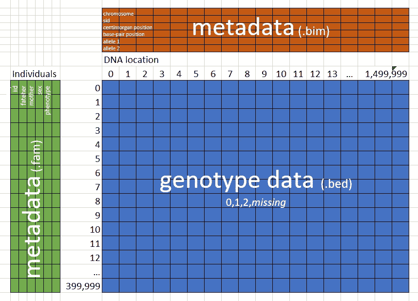
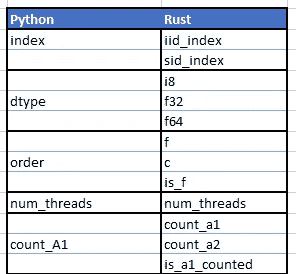

# 优雅的 Rust 库 API 的九条规则

> 原文：<https://towardsdatascience.com/nine-rules-for-elegant-rust-library-apis-9b986a465247>

## 从 Python 到 Rust 移植生物信息学库 Bed-Reader 的实践经验


[Kai Dahms](https://unsplash.com/@dilucidus?utm_source=medium&utm_medium=referral) 在 [Unsplash](https://unsplash.com?utm_source=medium&utm_medium=referral) 上的照片

我喜欢创建软件库。两个月前，我开始将我们的一个 Python 包移植到 Rust crate 中。这个新的 Rust crate 与 Python 包的易用性和表现力相匹配。一路上，我学到了九条规则，可以帮助你在 Rust 中创建漂亮的库。规则是:

1.  创造一些不会让你尴尬的例子。
2.  接受所有类型的字符串、路径、向量、数组和可重复项。
3.  了解用户的需求，最好是吃你自己的狗粮。
4.  使用生成器，因为不能使用关键字参数。
5.  编写好的文档来保持设计的诚实。
6.  接受所有类型。
7.  编写 API 测试。
8.  定义并返回好的错误。
9.  使用 Clippy。

在这种情况下，库是供其他程序使用的锈箱。库的 API(应用程序编程接口)是程序可以调用的一组公共函数和对象。我们希望设计一个优雅的 API，而不仅仅是功能性的 API。功能 API 只是让用户做他们需要做的一切。一个优雅的 API 让他们以简单而明智的方式做他们需要做的事情。

具体来说，这是我们面向 Python 的 API 和新的面向 Rust 的 API。

> **任务:**列出前 5 个个体 id，前 5 个 SNP ids，以及每条唯一的染色体。然后，读取 5 号染色体中的每个值。

*Python API:*

```
>>> with open_bed(file_name2) as bed3:
...     print(bed3.iid[:5])
...     print(bed3.sid[:5])
...     print(np.unique(bed3.chromosome))
...     val3 = bed3.read(index=np.s_[:,bed3.chromosome=='5'])
...     print(val3.shape)['iid_0' 'iid_1' 'iid_2' 'iid_3' 'iid_4']
['sid_0' 'sid_1' 'sid_2' 'sid_3' 'sid_4']
['1' '10' '11' '12' '13' '14' '15' '16' '17' '18' '19' '2' '20' '21' '22' '3' '4' '5' '6' '7' '8' '9']
(100, 6)
```

*Rust API:*

```
let mut bed = Bed::new(file_name)?;
println!("{:?}", bed.iid()?.slice(s![..5]));
println!("{:?}", bed.sid()?.slice(s![..5]));
println!("{:?}", bed.chromosome()?.iter().collect::<HashSet<_>>());
let val = ReadOptions::builder()
    .sid_index(bed.chromosome()?.map(|elem| elem == "5"))
    .f64()
    .read(&mut bed)?;// Outputs ndarray: ["iid_0", "iid_1", "iid_2", "iid_3", "iid_4"]
// Outputs ndarray: ["sid_0", "sid_1", "sid_2", "sid_3", "sid_4"]
// Outputs: {"12", "10", "4", "8", "19", "21", "9", "15", "6", "16", "13", "7", "17", "18", "1", "22", "11", "2", "20", "3", "5", "14"}
assert!(val.dim() == (100, 6));
```

这些优雅吗？情人眼里出西施，但是作为 Python API 的用户，我觉得它很优雅。关于 Rust API，我很高兴它紧密地遵循了 Python 的设计，并且相信它是优雅的。

**灵感:**之前的两篇文章激发并启发了这些努力。首先，2016 年，Pascal Hertleif 在 Rust 中编写了[优雅的库 API。后来，Brian Anderson 创建并维护了](https://deterministic.space/elegant-apis-in-rust.html) [Rust API 指南](https://rust-lang.github.io/api-guidelines/)。相比之下，这篇文章更笼统，更具体，也不全面。它讨论了适用于所有语言的通用 API 设计原则，而不仅仅是 Rust。它强调了我发现在移植 Bed-Reader 时最有用的特定技术和工具。它忽略了我没有面对的 API 设计问题(例如，设计宏)。

**背景** : [Bed-Reader](https://pypi.org/project/bed-reader/) 是一个用于读写 PLINK Bed 文件的库，PLINK Bed 文件是生物信息学中用来存储基因型(DNA)数据的二进制格式。Bed 格式的文件可能有 1tb 那么大。Bed-Reader 让用户可以快速、随机地访问大量数据。它以用户选择的 int8、float32 或 float64 返回一个二维数组。Bed-Reader 还让用户可以访问 12 条元数据，6 条与个人相关，6 条与 SNPs 相关(粗略地说，是 DNA 位置)。重要的是，基因型数据通常比元数据大 100，000 倍。



PLINK 存储基因型数据和元数据

创建一个优雅的 Rust 库 API 需要许多设计决策。根据我在读床者上的经验，以下是我推荐的决定。为了避免含糊不清，我将把这些建议表述为规则。规则在一般和特殊之间交替。

## 规则 1:创造不会让你尴尬的例子

您应该创建许多使用您的库的 API 的示例。您应该继续开发您的库的 API，直到您对这些例子感到自豪。

为了说明这一点，让我们看看 Bed-Reader 的 README.md 文件中的三个例子。对于每项任务，我们将使用以下工具来查看解决方案

*   Python API
*   仅仅是功能性的 Rust API
*   更优雅的新 Rust API

> **任务**:从. bed 文件中读取所有基因组数据。

*Python API:*

```
>>> import numpy as np
>>> from bed_reader import open_bed, sample_file
>>>
>>> file_name = sample_file("small.bed")
>>> bed = open_bed(file_name)
>>> val = bed.read()
>>> print(val)
[[ 1\.  0\. nan  0.]
 [ 2\.  0\. nan  2.]
 [ 0\.  1\.  2\.  0.]]
>>> del bed
```

*仅功能性防锈 API:*

```
use crate::read;let file_name = "bed_reader/tests/data/small.bed";
let val = read(file_name, true, true, f32::NAN)?;
println!("{val:?}");// [[1.0, 0.0, NaN, 0.0],
//  [2.0, 0.0, NaN, 2.0],
//  [0.0, 1.0, 2.0, 0.0]],...
```

功能性 Rust API 做得很好！一方面，`true, true`输入有点混乱。另一方面，它比 Python 短一行。我几乎可以为这个解决方案感到自豪。

*新的、更优雅的 Rust API:*

```
use ndarray as nd;
use bed_reader::{Bed, ReadOptions, assert_eq_nan, sample_bed_file};

let file_name = sample_bed_file("small.bed")**?**;
let mut bed = Bed::new(file_name)**?**;
let val = ReadOptions::builder().f64().read(&mut bed)**?**;

assert_eq_nan(
    &val,
    &nd::array![
        [1.0, 0.0, f64::NAN, 0.0],
        [2.0, 0.0, f64::NAN, 2.0],
        [0.0, 1.0, 2.0, 0.0]
    ],
);
```

与仅仅是功能性的 API 相比，新的 API 用构建器模式取代了令人困惑的`true, true`输入。(详见规则 4。)另一方面，它需要额外的一行代码。所以，不一定更好。

让我们看看下一个任务。

> **任务:**从 20 到 30 读取每隔一个个体和 SNPs (DNA 定位)。

*Python API:*

```
>>> file_name2 = sample_file("some_missing.bed")
>>> bed2 = open_bed(file_name2)
>>> val2 = bed2.read(index=np.s_[::2,20:30])
>>> print(val2.shape)
(50, 10)
>>> del bed2
```

注意`[::2,20:30]`的使用，这是 Python NumPy 的奇特索引的一个实例。Python 科学程序员熟悉这种索引，非常适合指定要读取哪些基因组数据片段。

*仅仅是功能性防锈 API:*

```
use crate::{counts, read_with_indexes};let file_name = "bed_reader/tests/data/some_missing.bed";let (iid_count, _) = counts(file_name)?;
let iid_index = (0..iid_count).step_by(2).collect::<Vec<_>>();
let sid_index = (20..30).collect::<Vec<_>>();
let val = read_with_indexes(
    file_name,
    iid_index.as_slice(),
    sid_index.as_slice(),
    true,
    true,
    f32::NAN,
 )?;
println!("{:?}", val.shape());
// [50, 10]
```

Python 在中的两行核心代码在 Rust 中变成了四条语句(和 12 行代码)。和以前一样，我们有不清楚的`true, true`。此外，指定感兴趣的索引变得更加困难。此外，用户必须以某种方式理解索引必须被定义为向量(以便它们在某个地方被拥有)，但随后通过`as_slice`传递(这是函数所期望的)。

这个例子让我很尴尬，尤其是与 Python 相比。这促使我像这样改进 Rust API:

*新的、更优雅的 Rust API:*

```
use ndarray::s;

let file_name = sample_bed_file("some_missing.bed")**?**;
let mut bed = Bed::new(file_name)**?**;
let val = ReadOptions::builder()
    .iid_index(s![..;2])
    .sid_index(20..30)
    .f64()
    .read(&mut bed)**?**;

assert!(val.dim() == (50, 10));
```

我更喜欢这个。像 Python 一样，它支持有趣的索引。遗憾的是，Rust 的标准范围——例如，`20..30` —不支持步骤，所以 API 必须也支持[n 数组切片](https://docs.rs/ndarray/latest/ndarray/macro.s.html) — `s![..;2]`。(我们在规则 6 中看到 Rust 如何接受如此不同类型的输入。)

现在让我们来看最后一个使用元数据的例子。

> **任务:**列出前 5 个个体 id，前 5 个 SNP ids，以及每个唯一的染色体。然后，读取 5 号染色体中的每个值。

我们在简介中看到了 Python 解决方案。仅仅是功能性的防锈解决方案有多糟糕？可悲的是，仅仅是功能性的 API 并不了解元数据。令人高兴的是，元数据文件只是六列文本文件，所以用户可以自己阅读，对吗？

*仅功能性防锈 API:*

呀，很尴尬。这是更好的防锈解决方案(我们在简介中也看到了)。

*新的“优雅”Rust API:*

```
use std::collections::HashSet;

let mut bed = Bed::new(file_name)**?**;
println!("{:?}", bed.iid()**?**.slice(s![..5]));
println!("{:?}", bed.sid()**?**.slice(s![..5]));
println!("{:?}", bed.chromosome()**?**.iter().collect::<HashSet<_>>());
let val = ReadOptions::builder()
    .sid_index(bed.chromosome()**?**.map(|elem| elem == "5"))
    .f64()
    .read(&mut bed)**?**;

// Outputs ndarray: ["iid_0", "iid_1", "iid_2", "iid_3", "iid_4"]
// Outputs ndarray: ["sid_0", "sid_1", "sid_2", "sid_3", "sid_4"]
// Outputs: {"12", "10", "4", "8", "19", "21", "9", "15", "6", "16", "13", "7", "17", "18", "1", "22", "11", "2", "20", "3", "5", "14"}
assert!(val.dim() == (100, 6));
```

铁锈和蟒蛇差不多。然而，Rust 更加冗长。例如，下面是借用单个 id 的一维 NumPy/ndarray 并打印前 5 项的代码:

```
print(bed.iid[:5]) # Python
println!("{:?}", bed.iid()**?**.slice(s![..5])); // Rust
```

这些在语义上几乎相同，但是 Python 支持更简洁的数组相关语法。

下面是打印数组中唯一值的代码:

```
print(np.unique(bed.chromosome)) # Python
println!("{:?}", bed.chromosome()**?**.iter().collect::<HashSet<_>>()); // Rust
```

Python 做得好一点，因为它成熟的 NumPy 库包含了`np.unique`，而 Rust 的 ndarray 没有。

最后，要找到染色体“5”中的 SNPs，代码是:

```
np.s_[:,bed.chromosome=='5'] # Python
bed.chromosome()**?**.map(|elem| elem == "5") // Rust
```

我认为 Rust 在这里打败了 Python，因为它只使用了常见的语言特性，避免了不太常见的`np.s_`。

规则 1 的要点不是追求完美。相反，你应该瞄准有意义和有趣的例子。然后，在 API 上工作，直到这些例子可以被解决而不会感到尴尬，也许还会感到自豪。

## 规则 2:接受所有类型的字符串、路径、向量、数组和可重复项

当给你的 API 一个路径时，你的用户可能希望使用一个`String`或者一个`&String`或者一个`&str.`，你的用户可能希望给你一个`PathBuf`、`&PathBuf`、`&Path`或者任何类型的字符串。此外，你的用户有时会希望给你自己的价值，有时是借来的价值。你可以用泛型来支持所有这些可能性。接受所有类型的向量、数组和可迭代对象怎么样？这也可以用泛型来支持。

> 更新:我创建了一个名为 *anyinput* 的宏，让接受各种输入变得更容易。任何输入文件都有详细信息。如果使用 *anyinput* ，可以跳到下一条规则。

具体来说，对于路径，将路径定义为泛型类型`P`，其中`P`是`AsRef<Path>`。例如，下面是打开. bed 文件的函数`Bed::new`的定义:

```
pub fn new<P: AsRef<Path>>(path: P) -> Result<Self, BedErrorPlus> {
    Bed::builder(path).build()
}
```

这里是每个输入类型`Bed::new`接受的:

```
let path: &str = "bed_reader/tests/data/small.bed";
let _ = Bed::new(&path)?; // borrow a &str
let _ = Bed::new(path)?; // move a &str
let path: String = "bed_reader/tests/data/small.bed".to_string();
let _ = Bed::new(&path)?; // borrow a String
let path2: &String = &path;
let _ = Bed::new(&path2)?; // borrow a &String
let _ = Bed::new(path2)?; // move a &String
let _ = Bed::new(path)?; // move a String
let path: &Path = Path::new("bed_reader/tests/data/small.bed");
let _ = Bed::new(&path)?; // borrow a Path
let _ = Bed::new(path)?; // move a Path
let path: PathBuf = PathBuf::from("bed_reader/tests/data/small.bed");
let _ = Bed::new(&path)?; // borrow a PathBuf
let path2: &PathBuf = &path;
let _ = Bed::new(&path2)?; // borrow a &PathBuf
let _ = Bed::new(path2)?; // move a &PathBuf
let _ = Bed::new(path)?; // move a PathBuf
```

在您的函数中，`.as_ref()`方法将有效地把这个输入转换成一个`&Path`。表情`.as_ref().to_owned()`会给你一个拥有的`PathBuf`。

对于类似字符串的东西，用`S: AsRef<Str>`定义你的函数。`.as_ref()`方法将有效地将输入转换成`&str` 和。`as_ref().to_owned()`会给你一个拥有的`String`。

对于向量、数组和可迭代的，有时我们只需要一些可迭代的东西。如果是这样，用`I: IntoIterator<Item = T>`定义你的函数，其中`T`是项目的类型，可能也是通用的。例如，`MetadataBuilder::iid`是一个将单个 id 添加到内存元数据生成器的函数。(我们将在规则 4 中看到更多关于构建器的内容。)

```
pub fn iid<I: IntoIterator<Item = T>, T: AsRef<str>>(&mut self, iid: I) -> &mut Self {
    self.iid = Some(Some(Rc::new(
        iid.into_iter().map(|s| s.as_ref().to_owned()).collect(),
    )));
    self
}
```

一会儿，我们将讨论这个函数可以接受什么以及代价是什么。首先，这里是一些`MetadataBuilder::iid`接受的事情:

```
let list: [&str; 3] = ["i1", "i2", "i3"];
let _ = Metadata::builder().iid(&list).build()?; // borrow fixed-size array
let _ = Metadata::builder().iid(list).build()?; // move fixed-size array
let list: [String; 3] = ["i1".to_string(), "i2".to_string(), "i3".to_string()];
let _ = Metadata::builder().iid(&list).build()?; // borrow fixed-size array of String
let _ = Metadata::builder().iid(list).build()?; // move fixed-size array of String
let list: Vec<&str> = vec!["i1", "i2", "i3"];
let _ = Metadata::builder().iid(&list).build()?; // borrow Vec<&str>
let list2 = &list[..]; // borrowed slice
let _ = Metadata::builder().iid(list2).build()?; // borrow slice
let _ = Metadata::builder().iid(list).build()?; // move Vec<&str>
let list = nd::array!["i1", "i2", "i3"];
let view = list.view();
let _ = Metadata::builder().iid(&view).build()?; // borrow nd view
let _ = Metadata::builder().iid(view).build()?; // move nd view
let _ = Metadata::builder().iid(&list).build()?; // borrow ndarray
let _ = Metadata::builder().iid(list).build()?; // move ndarray
let list: std::str::Split<&str> = "i1,i2,i3".split(",");
let _ = Metadata::builder().iid(list).build()?; // move iterator
```

需要随机访问的向量、数组和 n 数组是什么？那么你有一个选择。你可以把一切都当成锈片。例如:

```
pub fn any_slice<A: AsRef<[T]>, T>(slice: A) -> Result<(), anyhow::Error> {
    let slice = slice.as_ref();
    println!("slice len: {}", slice.len());
    Ok(())
}
```

这直接接受 Rust 中所有类似数组的东西，除了 ndarrays 和 views。它们是通过转换成切片来间接接受的，例如`nd_array1.as_slice().expect(“ndarray as_slice”)`。

或者，您可以将所有内容都视为 ndarray 视图。例如:

```
pub fn any_array_view<'a, T: 'a, A: Into<nd::ArrayView1<'a, T>>>(
    array: A,
) -> Result<(), anyhow::Error> {
    let array_view = array.into();
    println!("array_view len: {}", array_view.len());
    Ok(())
}
```

这个函数直接接受所有类似数组的东西的借位，但是不接受移动。例如，这是可行的:

```
let array: [&str; 3] = ["i1", "i2", "i3"];
let _ = any_array_view(&array)?; // borrow fixed-size array (can't move)
```

如果你的 API 只需要迭代借用用户的数据，`IntoIterator`就很棒。但是，如果您需要自己的数据副本，您必须做出选择。

*   使用`IntoIterator`并重新分配。上面的`iid`函数就是这么做的。如前所述，子表达式`s.as_ref().to_owned()`将任何类似字符串的东西转化为拥有的`String`。表情`iid.into_iter()`...`.collect()`，然后将任何可迭代的东西转换成所需的集合类型(在本例中是一个`nd::array1<String>`)。对于 Bed-Reader，我知道这些额外的分配并不重要，因为个体 id 数据通常比主要的基因组数据小 1，000，000 倍。
*   或者，你可以要求用户给你一个特定类型的集合，并取得所有权。例如，上面的函数可能需要一个`nd::array1<String>`。这样效率更高，但灵活性较差。

> **性能提示:**在 Rust 用户论坛上， [Kevin Reid 指出](https://users.rust-lang.org/t/nine-rules-for-elegant-rust-library-apis/77208)让这个泛型函数变小并调用一个非泛型函数来完成大部分工作是有好处的。这最小化了代码大小和编译时间。

## 规则 3:了解用户的需求，最好是吃自己的狗粮

[我们的基因组项目](https://fastlmm.github.io/)已经阅读 PLINK Bed 文件超过 10 年了。两年前，一个用户要求我们把。bed 将代码读入自己的 Python 包。我们基于我们的经验开发了这个包的 Python API。例如，API 仅在必要时读取元数据文件。此外，它将读取的任何元数据保存在内存中。这使得对大基因组数据的读取几乎可以立即开始，我们知道这对于例如集群运行是很重要的。

当我们创建 Python API 时，我们重写了我们的其他工具来使用它，在我们进行的过程中改进了 Python API。当我们创建 Rust API 时，我们重写了 Python API 来使用它，并在我们进行的过程中对 Rust API 进行了改进。这叫做“吃你自己的狗粮”。当我们开发 Python API 时，我们也向请求用户征求反馈。我们把他们愿意提供反馈视为对我们的帮助。

我发现随着 Bed-Reader API 的改进，内部和外部的用户代码都变得更简单了，这是非常令人满意的。

> 坦白说:我们并不迫切需要一个 Rust 阅读器 API。我创建它是因为我想学习如何在 Rust 中创建一个中等大小的 API。我的设计基于 Python API 和 Rust 原则，而不是 Rust 用户需求。

## 规则 4:使用构建器，因为不能使用关键字参数。

下面是一个使用关键字参数在 Python 中读取基因型数据的示例:

```
with open_bed(file_name, count_A1=False) as bed:
    val = bed.read(
        index=np.s_[:, :3],
        dtype="int8",
        order="C",
        num_threads=1)
    print(val.shape)
```

下面是 Rust 中使用构建器的相同示例。

```
let mut bed = Bed::new(filename)?;
let val = ReadOptions::builder()
    .sid_index(..3)
    .i8()
    .c()
    .num_threads(1)
    .read(&mut bed)?;
println!("{:?}", val.dim());
```

他们是相似的。让我们来看看相应的参数，并详细比较 Bed-Reader 的 Python 和 Rust 方法是如何进行比较的:



*   Python 的二维索引(`index=np.s_[:, :3]`)变成了两个一维参数，其中用户通常只需要一个(`.sid_index(..3)` )— Rust 及其用户需要一维参数。此外，用户通常只需要索引一个维度。
*   Python 的字符串指定了与类型相关的三个选项(`dtype='int8'`)中的一个，它变成了三个参数。Rust 用户将使用一个(`.i8()`)或无(当类型可以推断时)。
*   Python 的字符串指定两个选项之一(`order='c'`)成为三个参数。Rust 用户可以说`.c()`(哪个更短)或者`is_f(false)`(可以用变量设置)。
*   一个数(`num_threads=1`)保持一个数(`.num_threads(1)`)。
*   一个 Python 布尔值(`count_A1=False`)变成了三个参数。Rust 用户可以说`.count_a2()`或者`.count_a1(false)`。

Bed-Reader 使用流行且强大的 [derive_builder](https://crates.io/crates/derive_builder) 机箱来构建生成器。读床者的四个建设者是:

*参见文档和源代码的链接。*

*   `[Bed::builder](https://docs.rs/bed-reader/0.2.19/bed_reader/struct.Bed.html#method.builder)` —需要选项时，打开 Bed 文件进行读取。(如果不需要选项，可以用`[Bed::new](https://docs.rs/bed-reader/0.2.19/bed_reader/struct.Bed.html#method.new)`代替。)
*   `[ReadOptions::builder](https://docs.rs/bed-reader/0.2.19/bed_reader/struct.ReadOptions.html#method.builder)` —指定阅读选项，然后立即`[.read](https://docs.rs/bed-reader/0.2.19/bed_reader/struct.ReadOptionsBuilder.html#method.read)`或`[.build](https://docs.rs/bed-reader/0.2.19/bed_reader/struct.ReadOptionsBuilder.html#method.build)`(稍后阅读)。
*   `[WriteOptions::builder](https://docs.rs/bed-reader/0.2.19/bed_reader/struct.WriteOptions.html#method.builder)` —指定写入选项，然后立即选择`[.write](https://docs.rs/bed-reader/0.2.19/bed_reader/struct.WriteOptionsBuilder.html#method.write)`或`[.build](https://docs.rs/bed-reader/0.2.19/bed_reader/struct.WriteOptionsBuilder.html#method.build)`(稍后写入)。
*   `[Metadata::builder](https://docs.rs/bed-reader/0.2.19/bed_reader/struct.Metadata.html#method.builder)` —指定创建内存元数据的选项，然后`[.build](https://docs.rs/bed-reader/0.2.19/bed_reader/struct.MetadataBuilder.html#method.build)`它。

> **提示:**在 Rust 用户论坛中， [H2CO3 突出显示了](https://users.rust-lang.org/t/nine-rules-for-elegant-rust-library-apis/77208)“[结构更新语法](https://doc.rust-lang.org/book/ch05-01-defining-structs.html)”(也称为功能记录更新(FRU))作为构建器的替代。使用默认值，用户可以通过仅指定非默认字段值来创建“选项结构”。

## 规则 5:编写好的文档来保持设计的诚实。

在某一点上，Bed-Reader Rust API 的某些部分接受受限的内存中元数据对象，而某些部分则不接受。我试图解释文档中的这种不一致，但是越来越沮丧。我最终决定，我宁愿修复令人困惑的设计，而不是解释它。写文档激励我改进设计。

编写优秀文档的一些技巧:

*   使用 Rust 优秀的 [rustdoc 系统](https://doc.rust-lang.org/rustdoc/)。
*   记录每个公共函数、结构、枚举等。用`#![warn(missing_docs)]`开始你的 [lib.rs](https://github.com/fastlmm/bed-reader/blob/rustybed/src/lib.rs) ，你会被提醒记录所有的事情。
*   在几乎所有的文档中都包含示例。如果你不能创建简单的例子，你的 API 设计需要更多的工作。用 Rust 的标准`cargo test`命令测试这些例子。
*   不要惊慌。你的例子应该返回错误(通过`?`)，而不是恐慌(通过`.unwrap()`)。rustdoc 手册告诉[如何设置](https://doc.rust-lang.org/rustdoc/write-documentation/documentation-tests.html?highlight=errors#using--in-doc-tests)进行测试。也见规则 8。
*   为你的项目写好 [README.md](https://github.com/fastlmm/bed-reader/blob/rustybed/README-rust.md) 。它还可以作为 API 文档的介绍。在你的[库](https://github.com/fastlmm/bed-reader/blob/rustybed/src/lib.rs)中包含`#![doc = include_str!("../README.md")]`。这种包含提供了一个额外的好处，即您的 README.md 中的任何示例都将作为测试运行。
*   阅读、重读和编辑你的文档，直到它很好地向你的用户解释了你的 API。(生成文档并在浏览器中弹出的命令是`cargo doc --no-deps --open`。)

你可以在这里看到我写好文档的尝试:[bed _ reader—Rust(docs . RS)](https://docs.rs/bed-reader/latest/bed_reader/index.html)。源代码(可从文档中获得链接)显示了 markdown 格式，例如总结特性的表格。

## 规则 6:接受所有类型的类型。

当 Bed-Reader 的用户指定要阅读的个人或 SNP 时，他们可以给出:

*   索引号(例如，`1`)
*   一个数组，vector，Rust slice，ndarray::Array，ndarray::索引号视图(`[0, 10, -2]`)
*   一个锈层(`3..`和`10..=19`)或一个阵列切片(`s![-20..-10;-2]`)
*   一个数组，vector，Rust slice，ndarray::Array，ndarray::布尔值的视图(`[true, false true]`)

鉴于 Rust 强大的打字能力，这怎么可能呢？关键是一个枚举和转换函数。具体来说，

*   用要存储的所有类型定义一个枚举。名为`Index`的床阅读器枚举定义为:

```
#[derive(Debug, Clone)]
pub enum Index {
   #[allow(missing_docs)]
    All,
    #[allow(missing_docs)]
    One(isize),
    #[allow(missing_docs)]
    Vec(Vec<isize>),
    #[allow(missing_docs)]
    NDArray(nd::Array1<isize>),
    #[allow(missing_docs)]
    VecBool(Vec<bool>),
    #[allow(missing_docs)]
    NDArrayBool(nd::Array1<bool>),
    #[allow(missing_docs)]
    NDSliceInfo(SliceInfo1),
    #[allow(missing_docs)]
    RangeAny(RangeAny),
}
```

*   实现`From`函数将所有感兴趣的类型转换到你的枚举中。您转换的类型不能重叠。以下是 Bed-Reader 的四个`From`实现:

```
impl From<isize> for Index {
    fn from(one: isize) -> Index {
        Index::One(one)
    }
}
impl From<&isize> for Index {
    fn from(one: &isize) -> Index {
        Index::One(one.to_owned())
    }
}
impl<const N: usize> From<[bool; N]> for Index {
    fn from(array: [bool; N]) -> Index {
        Index::VecBool(array.to_vec())
    }
}
impl<const N: usize> From<&[bool; N]> for Index {
    fn from(array: &[bool; N]) -> Index {
        Index::VecBool(array.to_vec())
    }
}
```

*   在你的枚举上实现函数来做你需要的任何事情。例如，给定个体的计数，我需要知道一个`Index`的长度。我定义`.len(count)`。 [Clippy](https://github.com/rust-lang/rust-clippy) (见规则 10)提醒我也要定义`is_empty`。

*   最后，如果你的枚举在一个常规函数中使用，用`impl Into<YourEnum>`定义它，然后在你的函数中使用`.into()`(见下文)。如果你的函数是构建器的一部分，并且你使用了 [derive_builder](https://crates.io/crates/derive_builder) ，你可以用`#[builder(setter(into))]`标记你的结构的字段(这里是)。例如:

```
// Tells the length of an index if the count of items is exactly 100
fn len100(index: impl Into<Index>) -> Result<usize, BedErrorPlus> {
    let index = index.into();
    let len = index.len(100)?;
    Ok(len)
}
let _ = len100(3..)?;let _ = ReadOptions::builder().iid_index(3..).i8().build()?;
```

*(拜* [*凯文读为《impl Into》上的提示*](https://users.rust-lang.org/t/nine-rules-for-elegant-rust-library-apis/77208) *)。)*

## 规则 7:编写 API 测试。

编写 API 测试，而不仅仅是单元测试。这需要在 src 文件夹之外创建一个 [tests/test_api.rs](https://github.com/fastlmm/bed-reader/blob/rustybed/tests/tests_api.rs) 文件。这让您可以像用户一样测试 API 的公共方法。比如[阅床者的 test_api.rs](https://github.com/fastlmm/bed-reader/blob/rustybed/tests/tests_api.rs) 说的是`use bed_reader::Bed;`而不是`use crate::Bed;`。

## 规则 8:定义并返回好的错误。

定义并返回好的错误，例如，通过 [thiserror](https://docs.rs/thiserror/latest/thiserror/) 箱。在 Bed-Reader 的 [lib.rs](https://github.com/fastlmm/bed-reader/blob/rustybed/src/lib.rs) 中，我们为库定义的所有错误创建了一个名为 BedError 的枚举。然后我们创建一个名为 BedErrorPlus 的枚举来覆盖来自其他箱子的 BedError 和错误。

## 规则 9:使用 Clippy

用[防锈纸](https://github.com/rust-lang/rust-clippy)涂上严格的林挺。

所以，现在你有了:Rust 库 API 的九条规则。当你创建了你的优雅的 Rust crate 并准备发布时，命令是 [cargo publish](https://doc.rust-lang.org/cargo/commands/cargo-publish.html) 。

我使用 Bed-Reader 的经验表明，我们可以拥有 Rust 的性能和 Python 的优雅。这是有代价的，也就是说，目前在 Rust 中创建一个好的 API 不像在 Python 中那么容易。遵循这九条规则，让创建一个优秀的 Rust 库 API 的过程变得更加简单。

*西雅图 Rust Meetup 用 YouTube* *上的* [*视频主持了一场关于这篇文章的演讲。请*](https://www.youtube.com/watch?v=6-8-9ZV-2WQ&t=61s) [*跟我上媒*](https://medium.com/@carlmkadie) *。我写的是 Rust 和 Python 的科学编程、机器学习和统计学。我倾向于每月写一篇文章。*