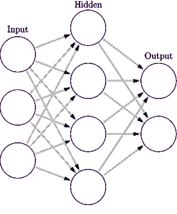
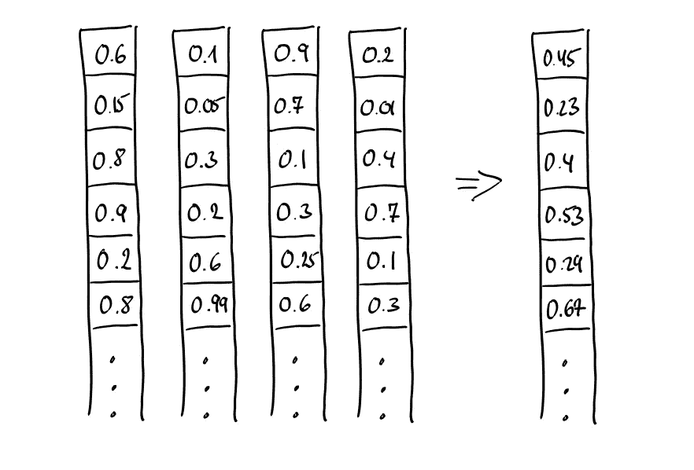
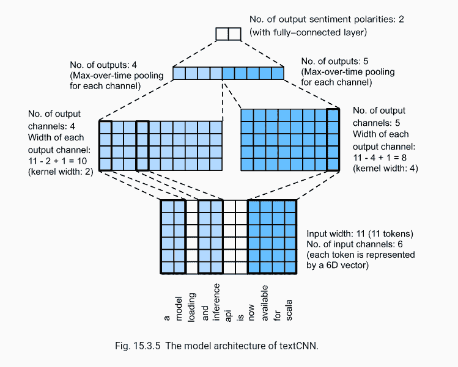
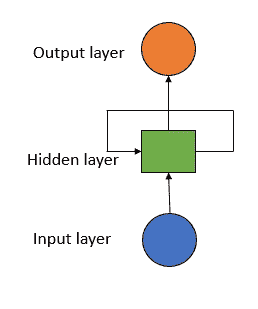
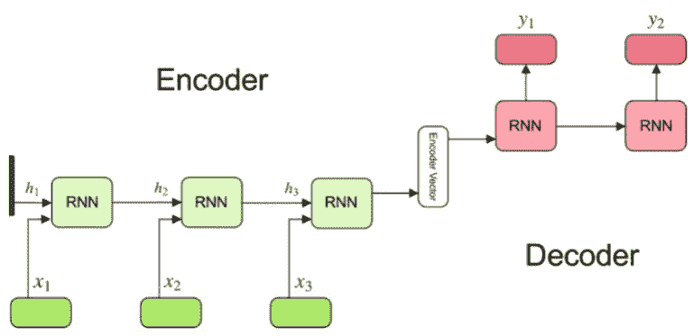
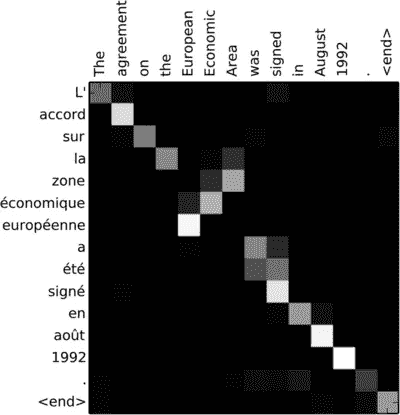
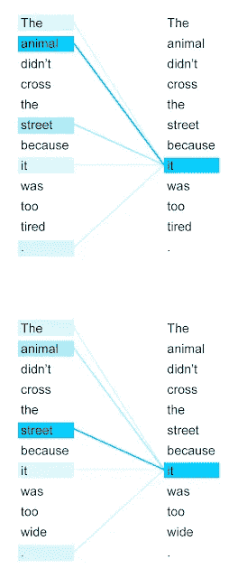

# NLP 101 3/3—NLP 的神经架构

> 原文：<https://towardsdatascience.com/nlp-101-3-3-neural-architectures-for-nlp-71f11e27b189>

# **NLP 101 3/3—NLP 的神经架构**

## 了解传统的顺序神经网络架构以及变压器如何革新 NLP。

Jana Shnipelson 在 [Unsplash](https://unsplash.com/photos/X4s675XmrtY) 上的照片

在我之前的两篇文章中([这里](/nlp-101-⅓-feature-engineering-and-word-embeddings-f10dffd67bb0)和[这里](/nlp-101-⅔-linear-models-for-text-classification-8ced8199c2a8))，尽管快速介绍了使用神经网络创建的单词嵌入，但我主要关注的是传统的机器学习模型，这些模型将独热编码向量作为输入。然而，这些一键编码向量是一种非常幼稚的表示文本的方法，线性分类器不能处理像人类语言这样的非线性现象。这就是神经网络的用武之地。不仅仅是任何神经网络，而是可以处理*顺序*数据的网络(或者是遵循特定模式的一般数据，不一定是顺序的，但在一点上更多)。

即使您不知道神经网络是如何工作的(解释这一点超出了本文的范围)，我也假设您以前见过这样的图像:

来源:[维基百科](https://en.wikipedia.org/wiki/Artificial_neural_network#/media/File:Colored_neural_network.svg)

如您所见，只有一个输入层，因此对于这个简单的前馈神经网络，输入数据将是一维的。人们可以将一个句子中每个单词的单词嵌入连接起来，但是，这会产生不同长度的输入嵌入。这是有问题的，因为我们有一个固定的输入大小。此外，假设您想要创建一个段落或者甚至一个文档嵌入——这将创建巨大的向量。另一种方法是对单个单词的单词嵌入进行平均，以获得句子/段落/文档嵌入。

作者图片

然而，当向量通过加法/减法/乘法线性组合时(或者随后求平均或者不求平均)，所得向量不能唯一地分解成其原始分量，这意味着关于各个向量的所有信息都丢失了，因为实值向量可以以无限多种方式分解成分量。如果你看上图每个向量中的第一个数——(0.6+0.1+0.9+0.2)/4 = 0.45。但是 0.3 + 0.7 + 0.2 + 0.6 的平均值会给出相同的结果。因此，一段完全不同的文本可能会导致类似的文档嵌入。

所以简单的前馈神经网络架构不会让我们走得很远。这就是卷积神经网络(CNN)、递归神经网络(RNNs)、长短期记忆神经网络(LSTMs)、序列-2-序列模型和变压器的用武之地。

# CNN

让我们从一个简单的例子开始，为了演示 CNN 的使用，这个例子甚至不涉及单词嵌入。CNN 有能力检测数据中的复杂特征，例如，从图像和文本中提取特征。它们主要用于计算机视觉(例如，用于图像分类、对象检测和图像分割)，然而，它们也应用于涉及文本数据的问题。CNN 由两个主要层组成:用于从数据中获取特征的卷积层，以及用于减小特征图大小的汇集层。简而言之，卷积是在特征检测器(也称为核或滤波器)的帮助下获得特征的过程。例如，它可以是一个 3 x 3 的矩阵，在输入矩阵(一个图像)上滑动，并执行内核和输入矩阵的逐元素乘法。为了捕捉不同的模式，可以让几个 3 x 3 的矩阵在输入矩阵上滑动。此外，输入中的每个点可以有几个维度。这些被称为渠道。例如，在图像中，图像中的每个像素有三个通道，对应于 RGB 分量。对文本数据使用相同的类比，文本中的“像素”是单词。因此，初始输入通道的数量是词汇的大小(对于一键编码向量)或维度大小(对于单词嵌入)。在下面的例子中，你可以看到两个不同的内核滑过一段文本和它们的卷积输出。

来源: [d2l.ai](https://d2l.ai/chapter_natural-language-processing-applications/sentiment-analysis-cnn.html)

作为一个例子来证明 CNN 的有用性，我们将使用姓氏分类。由于显而易见的原因，不能嵌入姓氏，因此字母(和符号)的一次编码是创建向量表示的合适方法。使用线性方法或简单的前馈神经网络，将不能找到揭示姓氏起源的片段(例如爱尔兰姓氏中的“O’”，如“O’brien”，俄语的结尾“ov”，以及乌克兰语的结尾“ko”)。这些数据段可以是可变长度的，挑战是在不显式编码它们的情况下捕获它们。CNN 非常适合这种情况，因为如前一段所述，它们可以检测空间子结构。然而，它们不能捕获顺序数据，这就引出了我们的下一个话题。

# RNNs 和 LSTMs

传统的机器学习假设数据点独立同分布(IID)。然而，通常一个数据项依赖于它前面或后面的项，例如在语言中。语言是*连续的*。如上所示的 CNN 和简单的神经网络不能对序列建模。建模序列包括维护一个*隐藏状态*。这种隐藏状态捕获以前的信息，并随着每个新的数据片段而更新(例如，模型看到的句子中的新单词)。

最基本的神经网络序列模型是递归神经网络(RNN)。最基本的 RNN 只有一个隐藏状态，因此只有一个隐藏的*单元。*在阅读关于 RNNs 的文章时，你会碰到这个术语，它会在人们中间造成一些混乱。该名称不是指单个细胞，而是指整个层。但是，RNN 会自我反馈(前一时间步的输出成为当前时间步的输入)，因此 RNN 图层包含一个单独的滚动 RNN 像元，该像元会根据您提供的时间步/时间段/单词的数量展开。

来源:[towardsai.net](https://towardsai.net/p/deep-learning/text-classification-with-rnn)

LSTM 号登月舱前来救援。LSTM 基本上是一个花哨的 RNN。它们有一个额外的“记忆细胞”，能够通过“门”控制在记忆中删除或添加信息。然而，尽管部分解决了爆炸和消失梯度问题，我们仍然有一个从旧单元到当前单元的顺序路径。尽管他们能够学习很多长期的信息，但是他们不能记住一千或一万个单词的序列。RNNs 和 LSTMs 也不是非常硬件友好，并且需要很长时间来训练。

# Seq2seq 型号

在上面的姓氏分类示例中，模型的输入是字符序列，输出是单个类(例如“Scottish”)。但是像机器翻译这样输入和输出都是序列的任务呢？序列对序列学习(seq2seq)是关于训练模型将序列从一个域转换到另一个域的序列。这种任务的主要挑战是，对于每个训练示例，输入和输出序列具有不同的和变化的长度，并且为了预测目标，需要整个输入序列。因此，需要更高级的设置。不涉及太多的技术细节，它是这样工作的:

RNN 或 LSTM 层(或它们的堆栈)充当“编码器”:它们处理输入序列并输出最终的隐藏状态向量，该向量旨在封装所有输入元素的信息，以便帮助解码器做出准确的预测。这个向量充当模型的解码器部分的初始隐藏状态。另一个 RNN 或 LSTM 层(或堆栈)充当“解码器”:它们被训练来预测目标序列的下一个字，给定目标序列的前一个字。解码器使用来自编码器的最终隐藏状态向量，以便获得关于它应该生成什么的信息。为了防止解码器将错误的预测传播到未来的预测中，一旦做出预测(因此偏移一个时间步长)，来自目标序列的正确单词就被馈送到解码器中，这一过程被称为“教师强制”。实际上，解码器学习在给定 target[t]的情况下，根据从编码器接收的初始隐藏状态向量，顺序生成 target[t+1]。

来源:[kdnuggets.com](https://www.kdnuggets.com/2019/08/deep-learning-transformers-attention-mechanism.html)

您可能已经看到了这种体系结构的一个明显的缺点:使用单个向量对整个输入序列进行编码无法捕获全部信息。因此，处理长句中相距甚远的单词之间的长期依存关系的挑战仍然存在。另一个限制是由于顺序计算，这种模型的训练和推理时间长。有几种方法可以解决第一个问题，例如反转输入编码器的句子，因为它缩短了从解码器到编码器相关部分的路径，或者将输入句子输入两次。然而，这些方法并不适用于所有语言。大多数基准是为英语、德语和法语等语言设定的，这些语言都有非常相似的词序(它们是 SVO 语言——主语、动词、宾语)。然而，像日语和韩语这样的语言是 SOV。因此，一个 SOV 语言句子中的最后一个单词可能是 SVO 语言中的第二个单词。在这种情况下，逆转输入会让事情变得更糟。

# 注意和变形金刚

那么，除了上面提到的处理长期依赖的方法之外，还有什么替代方法呢？答案是——注意。注意力是目前深度学习领域最强大的概念之一。它是基于我们在处理大量信息时“注意”某一部分的直觉。该概念首先由 Bahdanau 等人(2015) 提出，他建议利用上下文向量来对齐源输入和目标输入。上下文向量保留来自编码器单元的所有隐藏状态的信息，并将它们与当前目标输出对齐，而不是从编码器的最后隐藏状态构建单个上下文向量。通过这样做，解码器能够关注源输入的特定部分，并且更好地了解源和目标之间的复杂关系。在非常一致的语言中(例如德语和英语)，解码器可能会选择或多或少地按顺序处理事情(见下图，其中注意力是按顺序的，直到“欧洲经济区”，在法语中是“zone économique européenne”)。但是，因为上下文向量可以访问整个输入序列，所以我们不需要担心忘记长期依赖关系。

源句子和目标句子之间注意力权重的可视化。来源:[神经语言处理中的分析方法:综述](https://www.researchgate.net/publication/332160864_Analysis_Methods_in_Neural_Language_Processing_A_Survey)

因此，随着长期依赖性问题的解决，我们如何解决由于上述编码器-解码器架构的顺序性质而导致的长训练时间的问题呢？在阅读 NLP 时，您可能曾经遇到过“transformer”这个术语。transformer 是一种架构，旨在解决序列到序列的任务，这些任务使用注意力来处理长期依赖性。它最初是在论文 [*中介绍的*](https://proceedings.neurips.cc/paper/2017/file/3f5ee243547dee91fbd053c1c4a845aa-Paper.pdf) ，从那以后包括[伯特](https://arxiv.org/pdf/1810.04805.pdf)(谷歌)[GPT【OpenAI】](https://arxiv.org/pdf/2005.14165.pdf)在内的几个项目都建立在这个基础上。

不涉及太多细节，变压器包含一堆相同的编码器层和一堆相同的解码器层。该转换器的架构不包含任何递归或卷积，这要归功于自我关注和位置编码，它抛弃了所有顺序操作，支持并行计算。与上述注意相比，自我注意将序列中的单词与该序列中的其他单词对齐，从而计算该序列的表示。

自我注意力的观想。[谷歌博客](https://ai.googleblog.com/2017/08/transformer-novel-neural-network.html)

# 最后的话

在这篇文章中，我们仅仅触及了自然语言处理和深度学习中所有不同突破的表面，但我希望我能够给你一个更“传统”的神经模型的概述，以及像 transformer 这样的新架构如何解决它们的缺点。有很多资源可以帮助你开始学习 NLP 的神经模型。下面列出了一些我最喜欢的书和教程。

书籍:
- [用 PyTorch 进行自然语言处理](https://www.oreilly.com/library/view/natural-language-processing/9781491978221/) - [自然语言处理深度学习入门:学习如何用深度学习构建 NLP 应用](https://www.amazon.co.uk/Getting-started-Learning-Language-Processing/dp/9389898110/ref=sr_1_1_sspa?adgrpid=112136799565&gclid=Cj0KCQiAt8WOBhDbARIsANQLp94rncgreN8gBszAhcObT851Fl-0XF5bAOG2aHkB1qv_d_RiVFIRbFQaAqtcEALw_wcB&hvadid=482356472119&hvdev=c&hvlocphy=9045997&hvnetw=g&hvqmt=e&hvrand=2688606867297991915&hvtargid=kwd-304029788533&hydadcr=24428_1816080&keywords=deep+learning+for+nlp&qid=1641147577&sr=8-1-spons&psc=1&spLa=ZW5jcnlwdGVkUXVhbGlmaWVyPUFNR0pSNTA4QkFMMEgmZW5jcnlwdGVkSWQ9QTA5NDQxOTIzUDVLTVNWWTI4OFc5JmVuY3J5cHRlZEFkSWQ9QTAxMzA4NjYyQkY5VEVPNk41QkhBJndpZGdldE5hbWU9c3BfYXRmJmFjdGlvbj1jbGlja1JlZGlyZWN0JmRvTm90TG9nQ2xpY2s9dHJ1ZQ==) -[NLP 和语音识别深度学习](https://link.springer.com/content/pdf/10.1007/978-3-030-14596-5.pdf)

博客:
- [了解变形金刚](https://jalammar.github.io/illustrated-transformer/) - [变形金刚概述(4 部)](/transformers-explained-visually-part-1-overview-of-functionality-95a6dd460452)