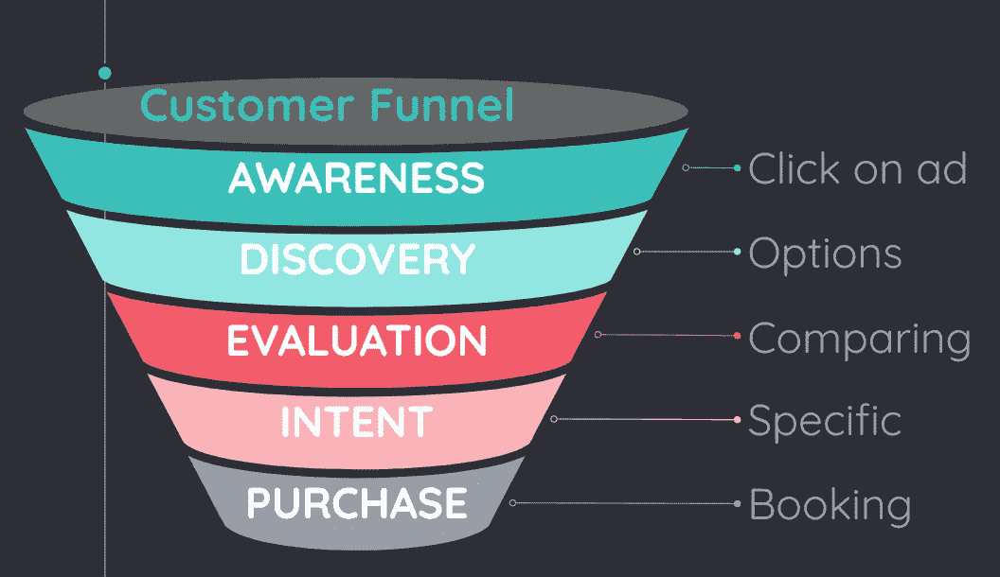
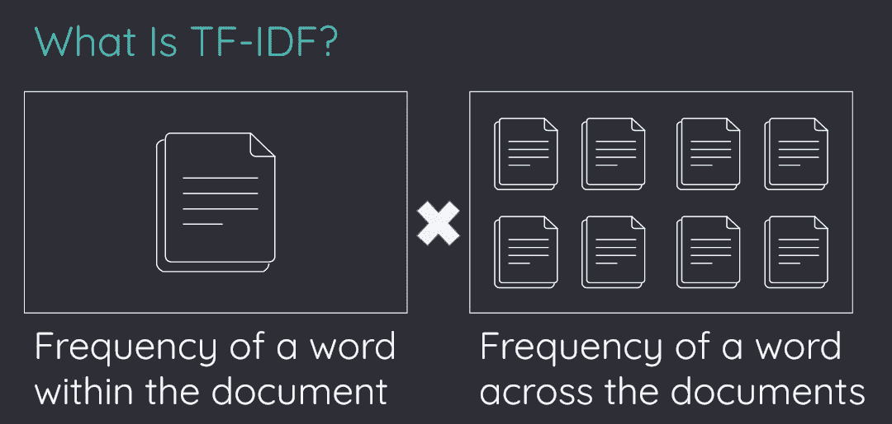

# NLP 和客户漏斗:使用 PySpark 衡量事件

> 原文：<https://towardsdatascience.com/nlp-and-customer-funnel-using-pyspark-to-weight-events-d5ff8d2f61b4>

## 利用 NLP 和 PySpark 增强营销漏斗分析和优化。使用 PySpark 分析和改善顾客体验的实用指南。


[施](https://unsplash.com/@cacomistle?utm_source=medium&utm_medium=referral)在 [Unsplash](https://unsplash.com?utm_source=medium&utm_medium=referral) 上拍照

本文讨论了如何使用 PySpark 为客户漏斗中的事件实现词频-逆文档频率(TF-IDF)加权，以此为机器学习构建预测购买的功能。TF-IDF 是一种统计度量，用于评估一个或一组文档中的单词或短语的重要性。通过使用 PySpark 计算 TF-IDF 并将其应用于客户漏斗数据，我们可以获得对客户行为的宝贵见解，并提高机器学习模型预测购买的性能。

# 在本文中，我们将讨论以下内容:

[客户漏斗](#4895)
[使用 TF-IDF 来衡量事件](#fbe5)
[什么是 TF-IDF？](#82c8)
[用 PySpark 计算 TF-IDF](#ea2e)

# 顾客漏斗



按作者

客户漏斗，也称为营销漏斗或销售漏斗，是一个概念模型，代表客户从了解产品或服务到购买点的过程。漏斗通常被描绘为一个向下变窄的宽顶，每个阶段代表客户旅程中的一个不同阶段。

客户漏斗的阶段通常包括:

1.  **认知**:这是顾客旅程的第一阶段，顾客开始意识到产品或服务。这可以通过广告、社交媒体、口头传播或其他形式的营销来实现。
2.  **兴趣**:在这个阶段，顾客对产品或服务产生兴趣，并开始进一步研究。他们可能会将其与其他类似的产品或服务进行比较，阅读评论，或访问公司的网站以了解更多信息。
3.  **决策**:在考虑了他们的选择后，顾客做出是否购买产品或服务的决定。他们可能还会考虑价格、可用性以及任何附加功能或好处。
4.  **行动**:如果顾客决定购买产品或服务，他们通过完成交易来采取行动。这可能包括填表、打电话或完成网上购物。
5.  **保留**:在初次购买后，客户进入保留阶段，该阶段的重点是保持客户的满意度和忠诚度。这可能包括提供出色的客户服务、提供促销或折扣，或者提供额外的支持或资源。

了解客户漏斗可以帮助企业了解如何有效地营销和销售他们的产品或服务，并确定他们可以改善客户体验的领域。

# 使用 TF-IDF 衡量事件

TF-IDF 代表“术语频率-逆文档频率”，是一种统计方法，可用于为文档中的单词或短语分配权重。它通常用于信息检索和自然语言处理任务，包括文本分类、聚类和搜索。

在客户漏斗的背景下，TF-IDF 可用于衡量客户在漏斗中移动时采取的不同事件或行动。例如，如果客户访问公司网站上的产品页面，那么该事件在客户漏斗中的权重可能会比他们只是阅读关于该产品的博客帖子或社交媒体帖子更高。类似地，如果客户进行了购买，则该事件可能会被赋予比他们只是将商品添加到购物车中但没有完成购买更高的权重。

使用 TF-IDF 来衡量客户漏斗中的事件，可以帮助企业更好地了解他们的客户如何与他们的产品或服务进行交互，并确定他们可能能够改善客户体验或提高转化率的领域。要在这种情况下使用 TF-IDF，企业通常需要使用客户关系管理(CRM)系统或其他软件来跟踪客户互动和行为，然后将 TF-IDF 算法应用于这些数据，以计算每个事件的权重。这些权重可用于确定营销工作的优先顺序和目标，或识别客户行为的模式和趋势。

# 什么是 TF-IDF？



按作者

TF-IDF，或“术语频率-逆文档频率”，是一种统计方法，它告诉我们一个词在一组文档中有多重要。它有两个组成部分:

1.  术语频率(TF):这衡量一个术语在文档中出现的频率。它是通过将一个术语在文档中出现的次数除以该文档中的总字数来计算的。例如，如果一篇 500 字的文章提到单词“horse”4 次，而一篇 2000 字的文章提到单词“horse”5 次，那么每篇文章的词频将是不同的。
2.  逆文档频率(IDF):这衡量一个术语的重要性。它有两个目标:减少频繁使用的词(如“the”和“is”)，增加独特的和较少使用的术语。计算方法是将文档总数除以包含该术语的文档数。例如，如果一个术语出现在 100 个文档中的 10 个中，则逆文档频率将低于它仅出现在 100 个文档中的 1 个中的情况。

通过使用自然语言处理(NLP)和 PySpark，我们可以分析客户漏斗中有意义事件的候选列表，并给予独特事件比整体语料库更大的权重。这使我们能够了解客户旅程中每个事件的重要性，并做出更明智的决策。

# 用 PySpark 计算 TF-IDF

为了计算一组事件的 TF-IDF，我们可以使用 PySpark 按类型对事件进行分组，并计算每种类型出现的次数。然后，我们可以通过将文档总数除以每种事件类型的出现次数来计算逆文档频率。

下面是一个示例，说明如何使用 PySpark，使用特定时间窗口内的客户交互样本数据集，为客户漏斗中的事件实施 TF-IDF 加权:

1.  首先，您需要安装 PySpark 并设置一个 SparkSession:

```
!pip install pyspark
```

```
from pyspark import SparkContext
from pyspark.sql import SparkSession

sc = SparkContext.getOrCreate()
spark = SparkSession(sc)!pip install pyspark
```

```
from pyspark import SparkContext
from pyspark.sql import SparkSession

sc = SparkContext.getOrCreate()
spark = SparkSession(sc)
```

2.接下来，您需要将您的客户交互数据集加载到 PySpark 数据框架中。出于本示例的目的，我们假设您有一个包含以下列的 CSV 文件:

*   `customer_id`:每个客户的唯一标识
*   `event_type`:客户执行的事件类型(例如，“查看产品”、“添加到购物车”、“进行购买”)
*   `timestamp`:事件发生的时间和日期

您可以使用`spark.read.csv()`方法将该数据集加载到 DataFrame 中:

```
df = spark.read.csv("customer_interactions.csv", header=True)
df.show()df = spark.read.csv("customer_interactions.csv", header=True)
df.show()
```

3.要计算特定时间窗口内每个事件的 TF-IDF 权重，您需要使用窗口函数按时间窗口划分数据，并为每个事件分配一个等级。您可以使用`window()`、`partitionBy()`和`rank()`方法来完成此操作:

```
from pyspark.sql.functions import window, rank

window_spec = window.partitionBy("customer_id").orderBy("timestamp")
ranked_df = df.withColumn("rank", rank().over(window_spec))
ranked_df.show()
```

4.接下来，您需要计算每种事件类型的术语频率(TF)。您可以使用`groupBy()`和`count()`方法来实现这一点，然后将得到的数据帧连接回原始的分级事件数据帧:

```
tf_df = ranked_df.groupBy("event_type").count().withColumnRenamed("count", "tf")
ranked_tf_df = ranked_df.join(tf_df, on="event_type")
ranked_tf_df.show()
```

5.要计算逆文档频率(IDF ),您需要计算在时间窗口内执行每种事件类型的客户数量，然后计算客户总数除以该计数的对数。您可以使用`count()`、`withColumn()`和`log()`方法来完成此操作:

```
from pyspark.sql.functions import log

customer_count = ranked_df.select("customer_id").distinct().count()
idf_df = ranked_tf_df.withColumn("idf", log(customer_count / ranked_tf_df["tf"]))
idf_df.show()
```

6.最后，您可以通过将 TF 和 IDF 值相乘来计算每种事件类型的 TF-IDF 权重。您可以使用`withColumn()`方法来完成此操作:

```
pyspark.sql.functions import col

tf_idf_df = idf_df.withColumn("tf_idf", col("tf") * col("idf"))
tf_idf_df.show()
```

这将为您提供一个数据框架，其中包含客户互动数据集中每种事件类型的 TF-IDF 权重。然后，您可以使用这些权重来确定营销工作的优先级和目标，或者确定客户行为的模式和趋势。例如，您可以使用 TF-IDF 权重来确定客户漏斗中最重要的事件，并将您的营销工作集中在这些事件上。或者，您可以使用权重来确定不同事件之间的模式或相关性，这可以帮助您优化营销策略并改善客户体验。

客户漏斗是一个模型，代表了客户从认知到购买产品或服务所经历的阶段。了解客户漏斗可以帮助企业了解如何有效地营销和销售他们的产品或服务，并确定他们可以改善客户体验的领域。TF-IDF 是一种统计方法，可用于为文档中的单词或短语分配权重，并可在客户漏斗的上下文中用于衡量客户采取的不同事件或行动。通过使用 TF-IDF 对客户漏斗中的事件进行加权，企业可以更好地了解他们的客户，识别客户行为的模式和趋势，并提高机器学习模型的准确性。使用 PySpark，企业可以轻松地为其客户漏斗数据中的事件实施 TF-IDF 加权。