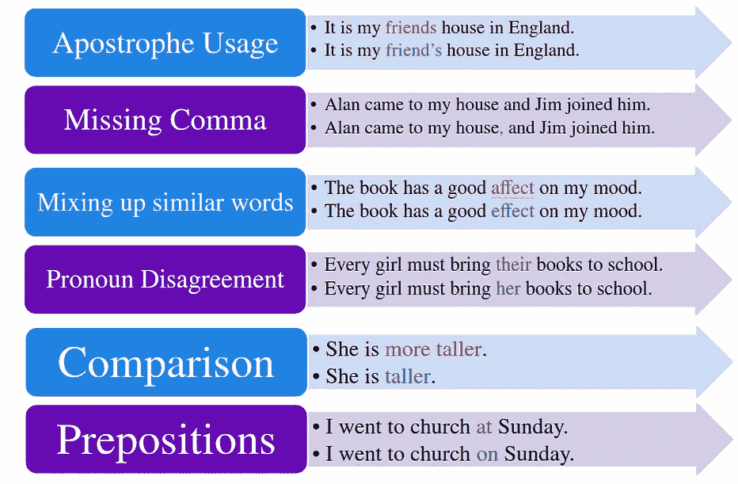
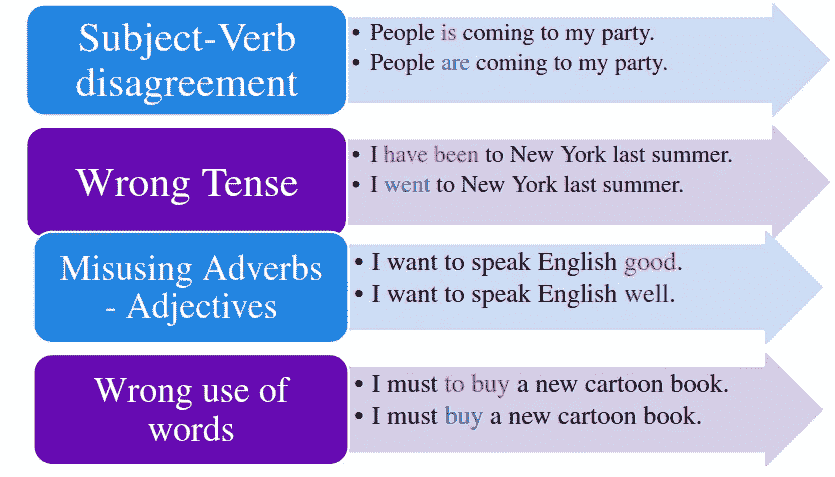
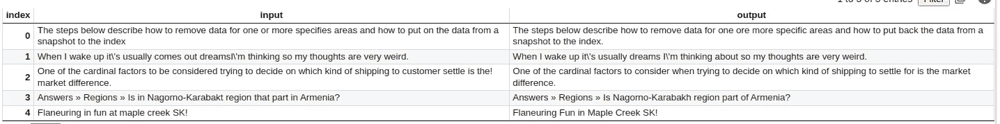
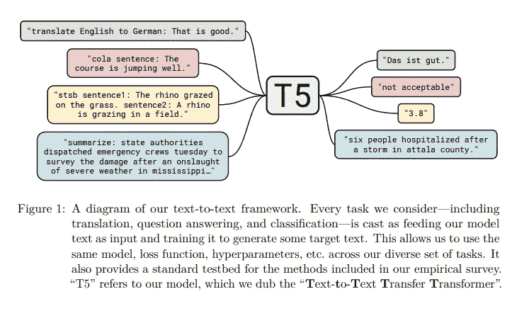
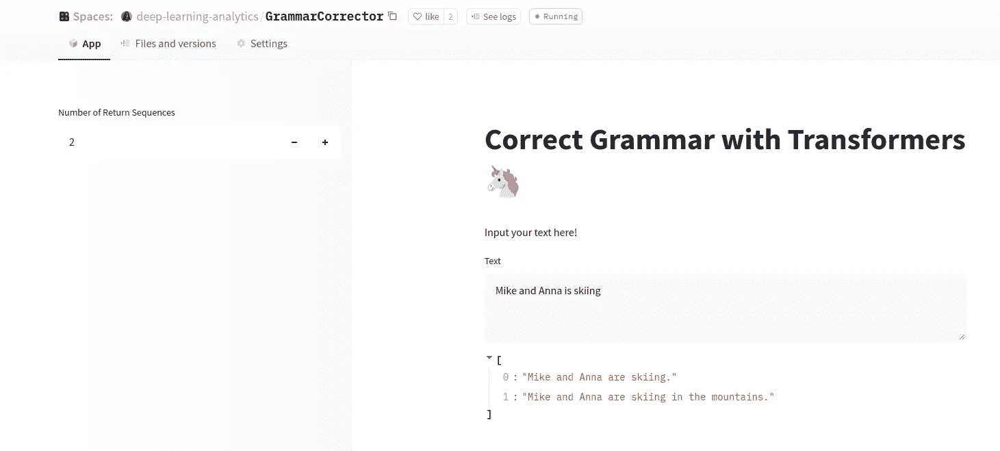

# 自然语言处理:建立一个语法纠错模型

> 原文：<https://towardsdatascience.com/nlp-building-a-grammatical-error-correction-model-deep-learning-analytics-c914c3a8331b>

## 用数据做很酷的事情

[梁杰森](https://unsplash.com/@ninjason?utm_source=medium&utm_medium=referral)在 [Unsplash](https://unsplash.com?utm_source=medium&utm_medium=referral) 上的照片

# 介绍

语法纠错(GEC)系统旨在纠正文本中的语法错误。[语法上](https://www.grammarly.com/)就是这样一个语法修正产品的例子。纠错可以提高电子邮件、博客文章和聊天中文字的质量。

GEC 任务可以被认为是一个序列对序列的任务，其中一个转换器模型被训练成以一个不合语法的句子作为输入，并返回一个语法正确的句子。在本帖中，我们将展示如何训练这样一个模型，并在训练时使用权重和偏差来监控模型的性能。我们还在 Spaces [这里](https://huggingface.co/spaces/deep-learning-analytics/GrammarCorrector)发布了我们训练过的模型用于实验。代码也在 Colab [这里](https://colab.research.google.com/drive/1KVB7TcDQraDw-B-NB9NzvZk2zGlv2PH-?authuser=5)和 Github [这里](https://github.com/priya-dwivedi/Deep-Learning/blob/master/GrammarCorrector/T5_Grammar.ipynb)公开。

在书面语言中遇到的错误可能有不同的类型，如下图所示。

书面语言中遇到的错误。来源:作者提供的数据

# 资料组

对于我们的语法校正器的训练，我们使用谷歌最近发布的 [C4_200M 数据集](https://github.com/google-research-datasets/C4_200M-synthetic-dataset-for-grammatical-error-correction)。这个数据集由 200 毫米合成生成的语法错误以及正确的文本组成。

在 GEC，最大的挑战之一是获得各种各样的数据来模拟通常在书面语言中犯的错误。如果损坏是随机的，那么它们不能代表真实用例中遇到的错误的分布。

为了生成讹误，首先训练标记讹误模型。通过将干净文本作为输入并生成损坏的文本，在现有数据集上训练该模型。例如，输入句子将是*“有***很多羊”*，腐败模型将把它改为*“有很多羊”*。所以它会生成语法错误的输出。*

*对于 C4_2OOM 数据集，作者首先确定了书面语中遇到的相对错误类型的分布。当产生讹误时，它们取决于错误的类型。例如，一个名词变化错误会把一个正确的句子作为输入。*

*正确的句子— *“有***很多羊”***

**带有名词屈折错误的不正确句子-**

1.  ***“有很多***
2.  ****“有很多羊”****

**这使得 C4_200M 数据集具有一组不同的误差，反映了它们在现实应用中的相对频率。要了解更多关于生成综合破坏的过程，请在此处参考原始论文[。](https://aclanthology.org/2021.bea-1.4.pdf)**

**为了这篇博文的目的，我们从 C4_200M 中提取了 55 万个句子。C4_200M 数据集在 TF 数据集上可用。我们提取了我们需要的句子，并保存为 CSV 格式。此处的数据准备代码被推送到 Colab [这里](https://colab.research.google.com/drive/1qwf8l3UshZt2WKsb9xPCuWcfMJWelDou?authuser=5#scrollTo=vGIOWlz7u355)。如果您有兴趣下载准备好的数据集，可以在此访问[。](https://drive.google.com/drive/folders/1kKlGcinD_FhGXC0LztN4Ts605YXzMEVA?usp=sharing)**

**下面是 C4_200M 数据集的截图。输入是不正确的句子，输出是语法正确的句子。这些随机例子表明，数据集涵盖了来自不同领域和各种写作风格的输入。**

****

**C4_200M 数据集截图**

# **模特培训**

**在这次培训中，我们将使用 Google 的通用 T5 模型。**

**T5 是文本到文本模型，这意味着它可以被训练成从一种格式的输入文本到一种格式的输出文本。我个人使用这个模型有很多不同的目的，比如摘要(见博客[这里](https://deeplearninganalytics.org/fine-tuning-a-t5-transformer-for-any-summarization-task/))和文本分类(见博客[这里](https://deeplearninganalytics.org/detect-fake-news-using-transformers/))。还用它构建了一个琐事机器人，它可以在没有任何上下文的情况下从内存中检索答案。点击查看这篇博客[。](https://medium.com/analytics-vidhya/build-a-trivia-bot-using-t5-transformer-345ff83205b6)**

****

**T5 —文本到文本转换转换器。图片来自 [T5 纸。](https://arxiv.org/pdf/1910.10683.pdf)**

**对于很多任务，我更喜欢 T5，原因有几个——1 .可用于任何文本到文本的任务，2。微调后对下游任务的准确性好，3 .使用 Huggingface 易于训练**

**在来自 C4_200M 的 550K 样本上训练 T5 模型的完整代码可从 Colab 上的[这里](https://colab.research.google.com/drive/1KVB7TcDQraDw-B-NB9NzvZk2zGlv2PH-?authuser=5)获得。也分享在我的 Github 上[这里](https://github.com/priya-dwivedi/Deep-Learning/blob/master/GrammarCorrector/T5_Grammar.ipynb)。**

**培训的高级步骤包括:**

**我们将不正确的句子设置为输入，将正确的文本设置为标签。输入和目标都使用 T5 记号化器进行记号化。最大长度设置为 64，因为 C4_200M 中的大多数输入是句子，并且假设该模型也将用于句子。完成标记化的代码片段如下。**

**语法纠错模型的标记器**

**2.**使用 seq2seq 训练器类训练模型****

**我们使用 Huggingface 中的 Seq2Seq trainer 类来实例化模型，并实例化对 wandb 的日志记录。对 HuggingFace 使用权重和偏差非常简单。所有需要做的就是在训练参数中设置`report_to = "wandb"`。**

**T5 模型的定型参数和定型**

****3。监测和评估模型****

**我们使用了 Rouge 评分作为评估模型的标准。正如在 W&B 下面的图中所看到的，该模型在一个时期的训练后获得了 72 的胭脂分数。**

****

**一轮训练后的准确度**

**[T](https://wandb.ai/deep-learning-analytics/huggingface?workspace=user-deep-learning-analytics) 此处可通过权重和偏差[访问他的项目。](https://wandb.ai/deep-learning-analytics/GrammarErrorCorrector?workspace=user-deep-learning-analytics)**

# **在空间上发布模型**

**我们已经将训练好的模型推送到 Spaces [这里](https://huggingface.co/spaces/deep-learning-analytics/GrammarCorrector)，这样它就可以被测试了。如下面的截图所示，它可以被编程为返回最多 2 个正确的序列。**

****

**在空格上测试语法修正器**

**我已经在许多不正确的序列上测试了这个模型，并且对它的性能很满意。**

**该型号在 hugginface.co[这里](https://huggingface.co/deep-learning-analytics/GrammarCorrector)也有售，也可以直接使用。模型文档显示了使用模型所涉及的步骤。**

**使用训练好的模型进行推理**

# **结论**

**这篇博文展示了利用 HuggingFace 和 WandB 为不同用例训练 NLP 模型是多么容易。我希望你尝试一下 HuggingFace Spaces，并在下面分享你的经历。**

**在[深度学习分析](https://deeplearninganalytics.org/)，我们专门为各种用例构建定制的机器学习模型。我们与世界各地的客户合作，为他们的特定需求构建解决方案。我们的专家团队拥有文本分类、翻译、摘要、神经搜索等方面的经验。如果你看到合作的机会，请发邮件到 info@deeplearninganalytics.org 给我们。**

***原载于 2022 年 4 月 1 日 https://deeplearninganalytics.org***。****