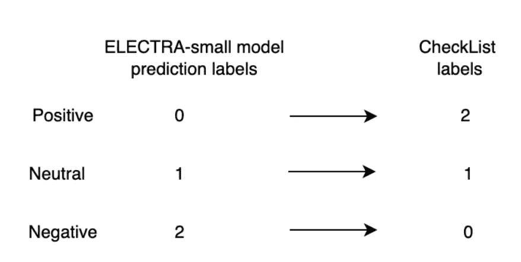
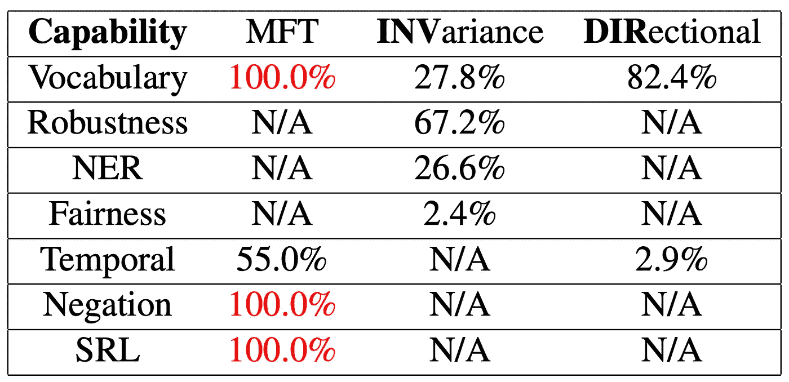
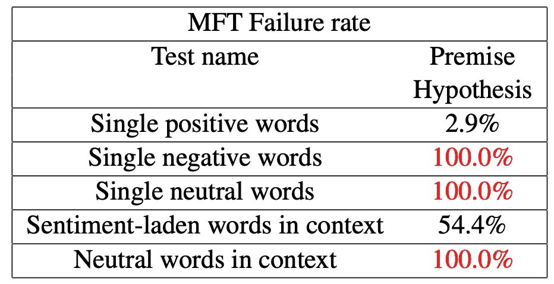
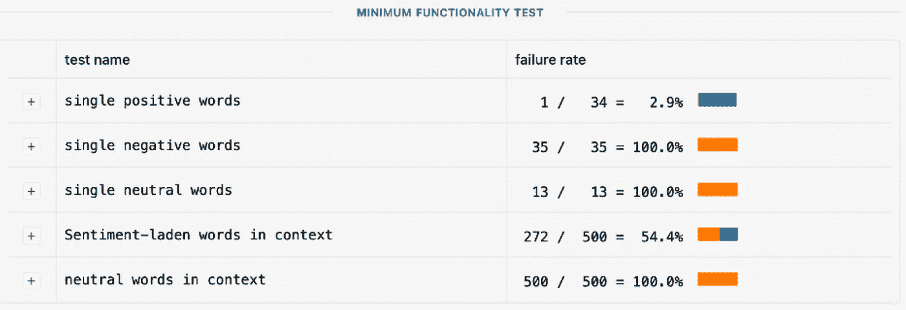
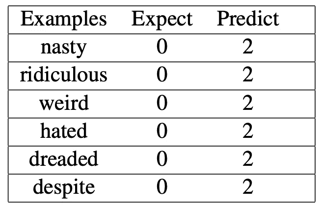
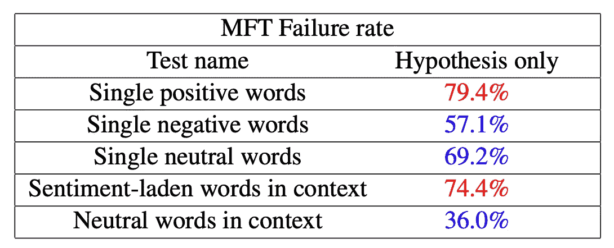
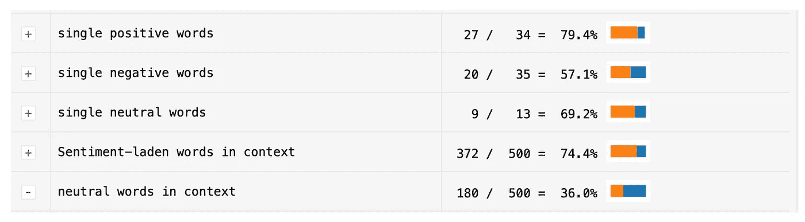

# NLP:使用 Checklist 和 ELECTRA 探索 SNLI 数据集中的数据工件

> 原文：<https://towardsdatascience.com/nlp-explore-data-artifacts-in-snli-dataset-with-checklist-and-electra-ebbdd1b83cd0>

## 前提假设句中的中性偏差和矛盾偏差


[走火入魔摄影](https://unsplash.com/@possessedphotography) 在 [Unsplash](https://unsplash.com/?utm_source=medium&utm_medium=referral) 上拍照

## 动机

自然语言推理(NLI)是一种广泛研究的自然语言处理任务，用于确定两个陈述(前提和假设)之间的蕴涵关系。斯坦福 NLI 语料库(1.0 版本)是 57 万个人工书写的英语句子对的集合，人工标记用于在 NLI 任务上训练 NLP 模型。虽然有最先进的 NLP 模型可以在验证集上实现高精度，但由于 SNLI 的构造方式，这些训练过的模型是否理解自然语言的问题仍然存在争议。众所周知，SNLI 数据集包含基于性别、种族和民族刻板印象的刻板偏见。在本文中，我们将通过在 ELECTRA-small 模型上使用带有检查表的行为测试来分析和评估泛化性能，探索 SNLI 训练示例偏差，该模型具有**两个不同的输入**:一个具有**前提-假设对**，一个仅具有**假设**。

## SNLI 数据集

SNLI 数据集是通过向众包工作者展示一个前提句子(来源于 Flickr 图片说明)并要求他们为三个标签(蕴涵、NEU-特拉、矛盾)中的每一个生成相应的假设句子来创建的，这可能包含认知偏差。许多最新的 NLP 模型在验证集上实现了高精度。然而，验证集的准确性并不保证 SNLI 数据集范围之外的看不见的数据的成功。因此，重要的是采取替代方法，如**行为测试**来评估 NLI 任务的 NLP 模型。

为简单起见，我们可以利用拥抱面部的 [SNLI 数据集](https://huggingface.co/datasets/snli)。这个数据集有三个部分:训练、验证和测试。训练集有大约 55 万个实例，而验证集和测试集各只有 1 万个实例。数据集中有三列:前提、假设和标签。有三种标签类别:蕴涵、中性和矛盾。

## **行为测试**

在研究论文中提出的行为测试:[超越准确性:在 NLP 模型上使用 CheckLis](https://homes.cs.washington.edu/~marcotcr/acl20_checklist.pdf) t 对 NLP 模型进行行为测试，类似于软件工程世界中的单元测试。如果我们使用单元测试来探索软件核心功能的早期问题，那么行为测试结果将被用作判断训练好的 NLP 模型的泛化和探索偏差的主要标准。

[CheckList](https://github.com/marcotcr/checklist) 是一个开源库，有助于在经过训练的模型上执行行为测试。如[清单站点](https://github.com/marcotcr/checklist)所述，清单测试基于以下标准生成:

1.  词汇+词性(任务的重要单词或单词类型)
2.  健壮性(打字错误、无关的更改)
3.  NER(正确理解命名实体)
4.  公平性、时间性(理解事件的顺序)
5.  否定和语义角色标注(理解角色，如施事、宾语等)

本文只看词汇量+词性能力，这是对情感词的基本理解。

## 伊利克特拉

[ELECTRA](https://github.com/google-research/electra) ( *E* 有效 *L* 获得*E*n 根据 *C* 分类*T*oken*R*E*A*准确)是一种自我监督的语言表征学习方法。它可以用于使用相对较少的计算来预训练变压器网络。即使在单个 GPU 上训练，ELECTRA-small 也能取得很好的效果。我们将用默认的启动代码和默认的超参数来训练 ELECTRA-small 模型 3 个时期。


图片由作者提供，灵感来自 [ELECTRA 研究论文](https://openreview.net/pdf?id=r1xMH1BtvB)

## 方法

我们分四步进行实验:

1.  我们将使用**前提和假设对**作为输入，在 SNLI 数据集上训练模型，并利用给定启动代码的默认设置来获得基线，以分析我们的实验结果。
2.  我们将使用检查表来评估词汇+词性能力在最低功能测试(MFT)中的表现。
3.  我们将使用与步骤 1 相同的配置训练另一个模型。但是，我们将删除前提列，只使用假设列作为输入。
4.  最后，我们比较了在步骤 1 和步骤 3 中训练的模型上的行为测试结果，并总结了我们的实验。

## 火车模型

1.  使用 pypi 的以下命令安装[清单](https://github.com/marcotcr/checklist):

```
pip install checklist
jupyter nbextension install --py --sys-prefix checklist.viewer
jupyter nbextension enable --py --sys-prefix checklist.viewer
```

2.安装 pytorch:

```
pip install torch
```

3.安装空间模型:

```
python -m spacy download en_core_web_sm
```

4.关闭本[回购](https://github.com/cmphan/SNLI_ELECTRA_CheckList):

```
git clone [https://github.com/cmphan/SNLI_ELECTRA_CheckList.git](https://github.com/cmphan/SNLI_ELECTRA_CheckList.git)
```

运行以下命令安装依赖项

```
pip install --upgrade pip
pip install -r requirements.txt
```

5.要使用 SNLI 自然语言推理数据集训练 ELECTRA-small 模型**假设前提模型**，可以运行以下命令。请注意，这可能需要几个小时

```
python3 run_hypothesis_premise.py --do_train --task nli --dataset snli --output_dir ./trained_model/
```

6.要评估最终训练模型的准确性，您可以使用以下命令:

```
python3 run_hypothesis_premise.py --do_eval --task nli --dataset snli --model ./trained_model/ --output_dir ./eval_output/
```

7.对“run_hypothesis_only.py”文件重复 4–6 的相同步骤，以训练**仅假设模型**

## 最低功能测试(MFT)

我们将把[检查表](https://github.com/marcotcr/checklist)测试应用于两个训练模型:**假设-前提**和**仅假设**，并比较它们的性能。

首先，我们导入清单所需的库。

标签的数量有三种:蕴涵、中性和矛盾。训练好的模型在“trained_model”文件夹中。

为了测试您自己的模型，我们需要获得对`release_data/sentiment/tests_n500`中文本的预测，并将它们保存在一个文件中，其中每行有 4 个数字:预测(0 代表负，1 代表中性，2 代表正)和预测概率(负，中性，正)。我们将每个标签的概率写入`predictions.txt`文件。

如在[清单](https://github.com/marcotcr/checklist)测试说明中，标签将 0 定义为阴性，1 定义为中性，2 定义为阳性，而 HuggingFace 上的 SNLI 数据集使用 0 表示蕴涵，1 表示中性，2 表示矛盾。因此，我们必须应用线性映射层，以使经过训练的模型预测结果与清单测试一起工作。



图片作者。

因此，我们将 ELECTRA 模型的预测映射到清单标签，并获得最高的标签结果:

最后，我们可以加载情感分析套件并可视化 MFT 结果

## **前提-假设模型 MFT** 结果

对于**前提假设**模型，行为测试失败率如下:



作者图片


作者图片

虽然该模型在验证测试中达到了 88.996 %，但它在泛化能力上的表现并不像行为测试表结果所显示的那样好。我们可以看看词汇能力的失败率，以探索训练模型的弱点，并分析这一结果如何暴露训练示例中中性和负面关系的形成中的偏差。词汇能力(MFT)结果如下:



作者图片



作者图片

对于情感，即*词汇+词性*能力，经过训练的前提假设模型可以很好地识别单个正面单词，而它在检测负面和中性单词方面有困难。验证集上的高准确率并不意味着模型对自然语言的理解。具体来说，该模型在单个否定词、单个中性词和上下文中的中性词等领域 100%失败。

## 中立和消极的偏见

由于经过训练的模型在正面词示例上表现良好，因此我们可以专注于分析负面词和中性词示例。

**中性:**该模型在中性词上 100%失败。在许多例子中，中性动词和形容词与航空公司名词一起使用，如座位、飞行员、航班等。例如，“飞机是国际的”，“飞机是美国的”，“服务是澳大利亚的”，模型预测 2(积极的)而不是 1(中性的)。这主要是因为在 SNLI 训练例子中形成中性假设的方式。大多数是通过原因和目的条款添加的。例如，前提句为“两只狗正在穿过一片田野”，中性假设将为“一些小狗正在跑着抓棍子。”以这种方式形成训练示例将导致训练的模型仅将带有目的子句的句子识别为中性，这就是为什么它不能在清单测试中检测简单句子中的中性情感。

**负面:**经过训练的模型在识别负面情绪方面也 100%失败。



作者图片

训练样本中的偏差是训练后的模型在泛化能力方面表现不佳的主要原因。许多众包工作者认为前提-假设对是矛盾的，但事实并非如此。例如，前提假设对:“三只狗在跑道上赛跑。”和“三只猫在一条跑道上赛跑。”因为诸如“狗”和“猫”之类的单词，这使得训练过的模型不能理解简单的负面单词。

## 假设仅模拟 MFT 结果

我们使用相同的 ELECTRA-small 模型，相同的起始代码和训练超参数，但我们删除了前提列，只使用假设句子进行训练。这背后的动机是因为可以访问假设的基线系统只能在基于先前背景知识理解语言的意义上执行 NLI。一个只有假设的基线实际上可以在 10 个 NLI 式数据集的大多数数据集上执行高于多数类的性能。

在最小功能测试中，**假设模型**的清单结果是有希望的，**显著提高了模型在*词汇+词性*能力上的性能**，尤其是在否定词和中性词方面。



作者图片



作者图片

通过从训练示例中移除前提列，我们在仅假设情感分类的验证测试上仅获得 69.630 %。然而，我们也消除了在形成句子之间的中性和负面关系时的偏见，并且帮助训练的假设仅更好地理解中性和负面情绪。与前提-假设模型在“单个否定词”、“单个中性词”和“上下文中的中性词”领域获得的 100.0 %的失败率不同，该模型大幅降低了失败率，并显示了其对自然语言的理解。然而，“单个正面词”的失败率增加到 79.4 %，这意味着仅假设模型不能很好地检测正面情绪。在 SNLI 数据集中，蕴涵关系主要是基于更具体的词的概括而形成的。比如前提句:“两只狗正在穿过一片田野。”需要假设句子:“户外有动物。”。显然，诸如*动物*、*乐器*和*户外*等通用词被选择来概括类似*狗*、*吉他*和*海滩等词。*因此，当我们在该模型的训练示例中删除前提列时，我们也影响了积极情感的这一概括方面，并影响了训练后的模型在类似 MFT 的概括测试中识别积极词语。

**结论**

总体而言，通过比较在**前提-假设**和**仅假设**模型上的清单测试结果，我们可以探索 SNLI 数据集中的注释伪像和偏差，其影响泛化上下文中的训练模型性能。我们能够验证 SNLI 数据集形成在蕴涵关系上没有问题，因为训练的模型只有 2.9 %的失败率。然而，在中性和矛盾关系中仍然存在偏差，并且训练的模型仅通过学习假设句子来提高对其否定和中性词的理解。通过删除前提列，行为测试在消极和中性方面的改进加强了这样一个事实，即在前提假设对示例中仍然存在矛盾和中性关系的问题。我们希望进一步的研究能够消除在构建未来 NLI 数据集时的人为偏见。

希望本文对您有所帮助，帮助您更好地排查训练好的模型性能问题。

请随意使用本文的源代码:

<https://github.com/cmphan/SNLI_ELECTRA_CheckList>  

参考文章/研究论文:

塞缪尔·r·鲍曼、加博·安格利、克里斯托弗·波茨和克里斯托弗·d·曼宁。2015.用于学习自然语言推理的大型标注语料库。

凯文·克拉克，Minh-Thang Luong，郭诉乐，克里斯托弗·曼宁。2020.[伊莱克特:预先训练文本编码器作为鉴别器而不是生成器。](https://arxiv.org/pdf/2003.10555.pdf)

Suchin Gururangan，Swabha Swayamdipta，Omer Levy，Roy Schwartz，Samuel R. Bowman 和 Noah A. Smith。2018.[自然语言推理数据中的标注神器。](https://arxiv.org/pdf/1803.02324.pdf)

亚当·波利亚克、杰森·纳拉多斯基、阿帕拉吉塔·哈尔达尔、雷切尔·鲁丁格和本杰明·范·杜尔梅。2018.[自然语言推理中的假设只有基线。](https://arxiv.org/pdf/1805.01042.pdf)

马尔科·图利奥·里贝罗、吴桐双、卡洛斯·盖斯特林和萨梅尔·辛格。2020.[超越准确性:带检查表的 nlp 模型的行为测试。](https://arxiv.org/pdf/2005.04118.pdf)

瑞秋·鲁丁格，钱德勒·梅，本杰明·杜尔梅。2017.[自然语言推理中的社会偏见。](https://aclanthology.org/W17-1609.pdf)第 74–79 页。