# 使用 DagsHub 的 NLP MLops 项目—在 AWS EC2 实例上部署您的 Streamlit 应用程序—第 2 部分

> 原文：<https://towardsdatascience.com/nlp-mlops-project-with-dagshub-deploy-your-streamlit-app-on-aws-ec2-instance-part-2-eb7dcb17b8ba>

## 让您的机器学习应用程序对世界开放，而不会让您头疼！


照片由 [SpaceX](https://unsplash.com/@spacex) 在 [Unsplash](https://unsplash.com/photos/Ptd-iTdrCJM) 上拍摄

# 介绍

除了开发机器学习模型，能够让外部世界访问它们也是一项非常有价值的技能。试图帮助你获得这样的技能是这篇文章的主要目标。它关注于使用`**DagsHub**`、`**DVC**`和`**EC2**`实例来使你的机器学习应用顺利产业化。

首先，您将能够构建您的`**Streamlit**`应用程序，然后了解将其部署到生产中的逐步方法。

# 机器学习任务—提醒

我们将要部署的应用程序来自于多语言分类项目。目标是预测以下 5 种语言之一的给定文本的潜在极性:*英语*，*法语*，*德语*，*俄语*，以及*西班牙语*。请参考以上链接了解更多详情。

# 简化 it 应用构建流程

本节的目标是重点构建 streamlit 应用程序的两个主要特性，并在我们的本地机器上运行它。

**注**:你也可以在文末找到 app 的完整源代码。

## **第一个主要特性——应用程序的第一部分**

第一部分与显示 5 种语言中每一种语言的模型全球指标(F1 得分和准确度)相关。但在此之前，我们还将介绍徽标和描述部分的实现。

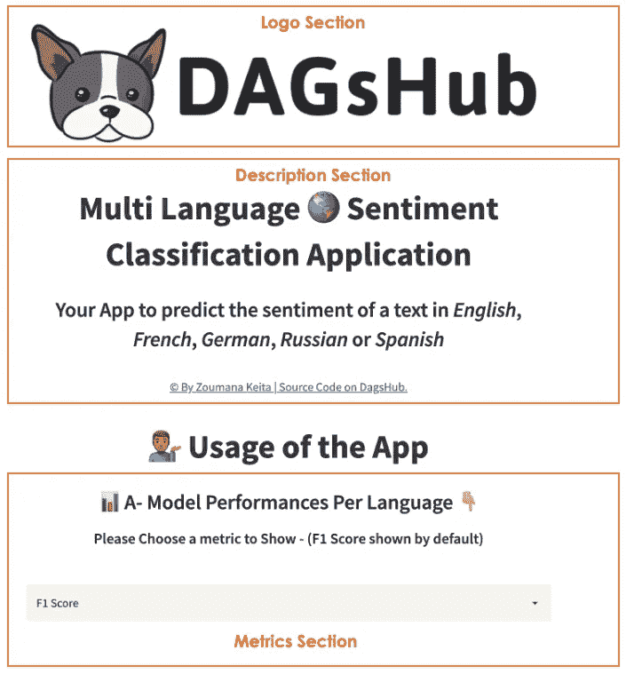

应用程序的第一部分——徽标、描述和指标部分(图片由作者提供)

*   **徽标、描述和指标部分**

使用 streamlit `[st.image](https://docs.streamlit.io/library/api-reference/media/st.image)`可以直接显示图像。此外,`[st.markdown](https://docs.streamlit.io/library/api-reference/text/st.markdown)`可以显示降价格式的文本。

st _ logo _ 描述. py

通过使用`[st.selectbox](https://docs.streamlit.io/library/api-reference/widgets/st.selectbox)`，我们能够在 **F1-分数**和准确性之间进行选择。默认情况下，自动显示该型号的 **F1 分数**。但是用户可以将其更改为**精度**。

## 用户输入和模型预测——应用程序的第二部分

这个部分更多的是应用程序的智能部分。它预测用户提供的句子的潜在情感极性。为此，提供了两个选项，如下所示。

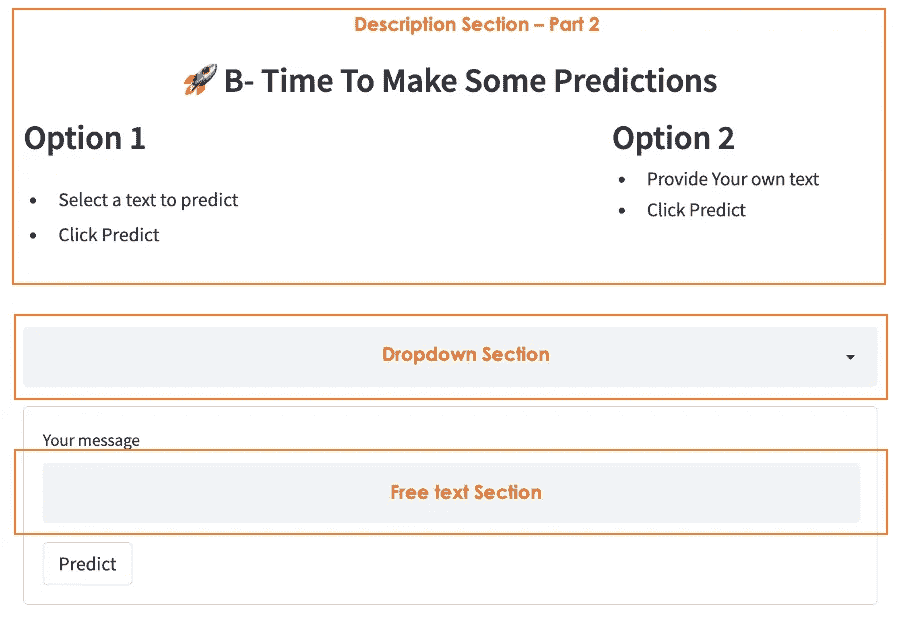

应用程序的第二部分——描述、下拉列表和自由文本部分(图片由作者提供)

*   **描述部分**

此部分执行两个操作:显示🚀**描述**和用户可用的交互选项(选项 1 & 2)。每个动作都用一个简单的`[st.markdown](https://docs.streamlit.io/library/api-reference/text/st.markdown)`来执行

st _ part2 _ 描述. py

*   **下拉菜单和自由文本部分**

用户可以从下拉列表中选择 5 个句子中的一个，每个句子都使用不同的语言。另一方面，他/她可以在自由文本区域提供他/她自己的文本进行预测。在这两种情况下，我们使用 streamlit `[st.form](https://docs.streamlit.io/library/api-reference/control-flow/st.form)`函数来获取用户的输入，然后最终加载模型并运行预测。

st _ 用户 _ 输入. py

在自由文本区域，首先执行检查，以确保用户提供的句子是模型考虑的 5 种语言之一。如果不是这种情况，就会显示一条好消息通知用户。

## 运行您的 streamlit 应用程序

构建好 app 后，就可以用`streamlit run`命令运行了。

```
streamlit run app.py
```

前面的命令生成以下消息，以从两个 URL 访问应用程序。

*   `Local URL`是我的本地主机，只有我能在我的机器上访问它。
*   `Network URL`与我相同子网内的任何人都可以访问的 URL。然而，这两个网络之外的任何人都不能访问我的应用程序。

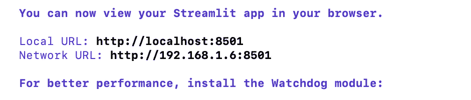

在本地运行的 Streamlit 应用程序(图片由作者提供)

目标是让这个星球上的任何人都可以访问它！🪐，这是我们将在下一节做的。

# AWS 上的应用部署流程

更自然的步骤是将应用程序部署到生产中；具体操作如下:配置 EC2 实例，使用 DVC 将模型和度量数据推送到 Dagshub，并在 EC2 上运行应用程序。

## 选择、创建和配置 EC2 实例

EC2 代表弹性计算云。它是一个虚拟服务器，用于在 Amazon Web 服务基础设施上运行应用程序。在本节中，我们将了解如何创建一个实例并执行配置。

**选择 EC2 实例**

登录 [AWS 管理控制台](https://portal.aws.amazon.com/billing/signup#/start/email)后，可以从**服务**标签中搜索 EC2。它自动显示第二页来选择实际的 EC2 服务。

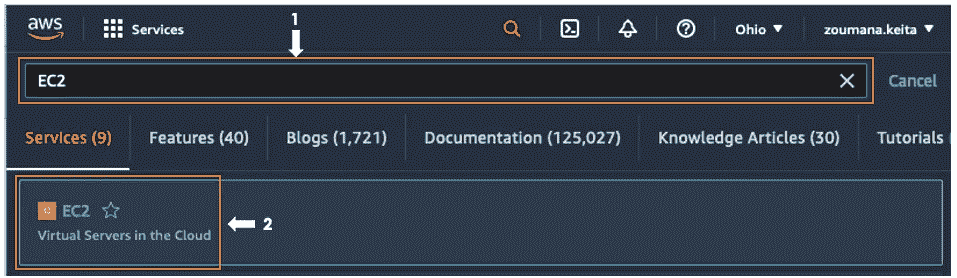

从服务选项卡中选择 EC2(图片由作者提供)

接下来，选择**实例**选项正下方的 ***实例*** 。您可以看到，我有一个 t2.xlarge 实例来托管我当前的 streamlit 应用程序😉。如果您尚未运行任何实例，此页面可能为空。

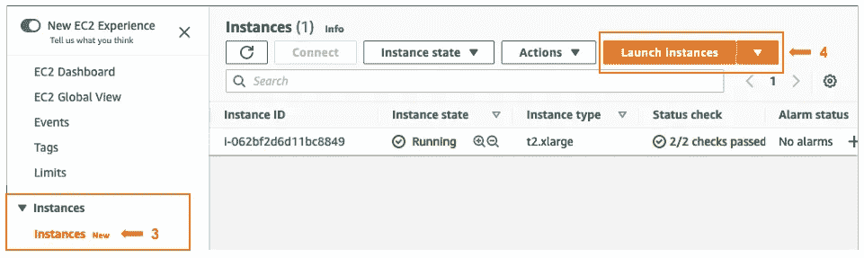

启动 EC2 实例(作者图片)

**创建 EC2 实例— 6 个主要步骤**

在选择了 **Launch instances** 选项卡之后，您会看到下面的页面，其中包含了从选择 Amazon 机器映像(AMI)到配置安全组的所有步骤。

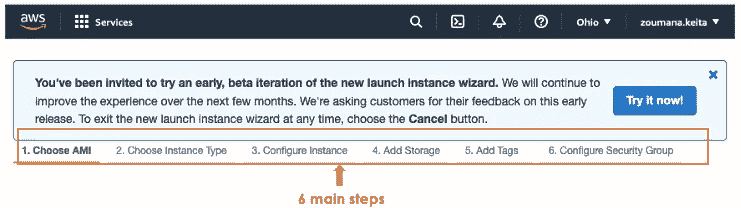

创建 EC2 实例的 6 个主要步骤(图片由作者提供)

1.  ***选择 AMI*** :包含操作系统、app server、apps 等软件配置的模板。它可用于在云中启动一个或多个实例。让我们通过点击**选择**按钮来选择第一个实例。

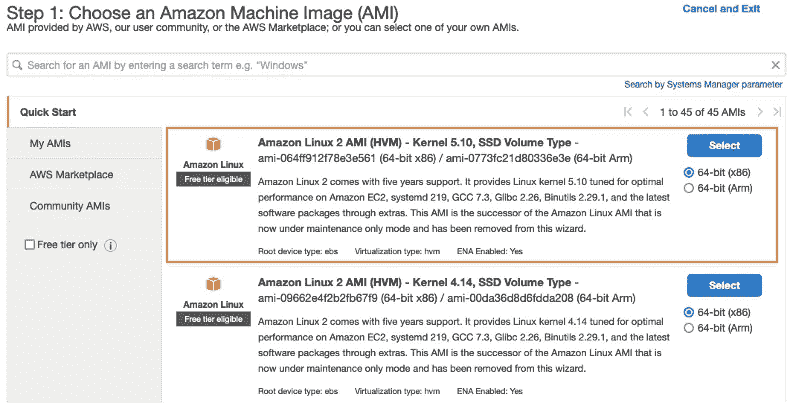

选择 AMI 实例:Amazon Linux 2 AMI —内核 5.10，SSD 卷类型(图片由作者提供)

**2。选择实例类型:** 实例类型提供特定的计算、内存和存储功能。根据我的应用程序要求，使用 2.5 Go 的大型号，我决定使用 t2.xlarge。如果你的应用程序不需要足够的存储空间，你可以使用 t2.micro，因为它是免费的。选择后，点击下一步的**进入第三步。**

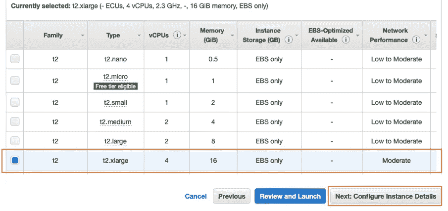

选择 t2.xlarge 实例类型—ECU、4vCPUs、2.3 GHz、16GiB 内存、仅 EBS(图片由作者提供)

***3。配置实例细节:*** 从这里，我们可以选择我们的用例所需的实例数量、网络类型等。正如我们所看到的，名字是不言自明的。我决定保留默认模式的配置。选择下一个的**继续**

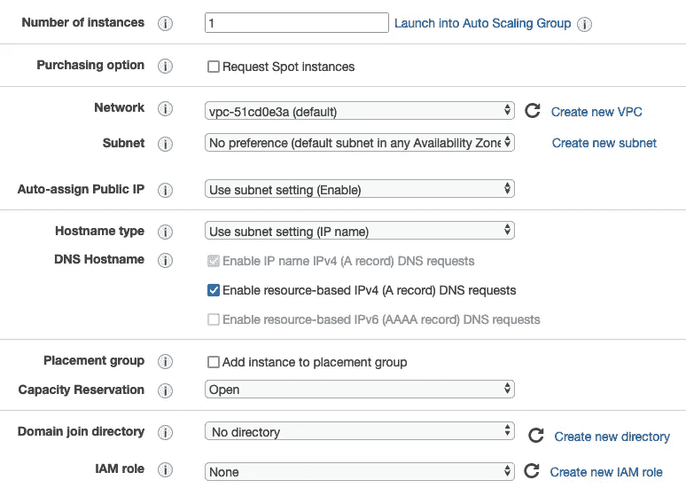

实例详细信息的配置—默认模式下的所有内容(图片由作者提供)

***4。添加存储:*** 默认的存储值是 8gb，但是因为我 app 的要求，我决定增加到 16。点击**下一步**继续。


添加 16 GiB 存储(图片由作者提供)

***5。添加标签:*** 根据描述，标签由区分大小写的键值对组成。最多可以添加 50 个标签。为了简单起见，我跳过了这一步。选择下一个的**进入第 6 步，即最后一步。**

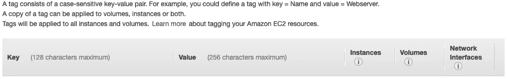

标签部分—跳过(按作者分类的图像)

***6。配置安全组:*** 这是一组防火墙规则，旨在控制 EC2 实例的传入和传出信息。选择“添加”两次会在表格中创建两个新行。下面分别是第一个和第二个规则的配置。

*   类型:自定义 TCP 端口
*   协议:TCP
*   端口范围:8501 对应 streamlit 端口。
*   Source: Anywhere，允许端口连接到任何地方。以这种方式更改会自动将地址设置为 0.0.0.0，:/0

对于第二个规则，我们得到了一个类似的配置，但是您只需要将端口范围更改为 8502，以便考虑 streamlit 的第二个端口。

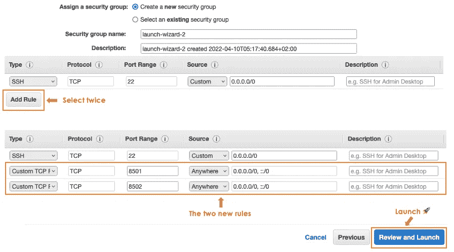

streamlit 端口 8501 和 8502 的安全组配置(图片由作者提供)

我们最终可以单击**查看并启动**来检查配置。当你对一切都满意时，点击**启动**。这样做时，您将被要求创建或提供一个密钥对，这是尝试 SSH 连接到 EC2 实例时所必需的。

*   从第一个下拉列表中，选择“创建新的密钥对”选项。
*   我决定将密钥对类型留给 RSA。
*   在密钥对名称部分提供一个有意义的名称。对我来说是。

单击下载密钥对以下载密钥对。只有这样，您才能通过选择“启动实例”来启动您的实例。

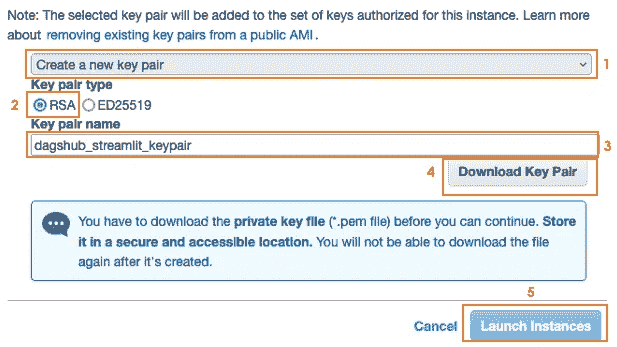

密钥对配置和实例启动(图片由作者提供)

您将获得成功启动消息“您的实例现在正在运行”。在该页面中，您可以通过单击**查看实例**按钮来访问您的实例。

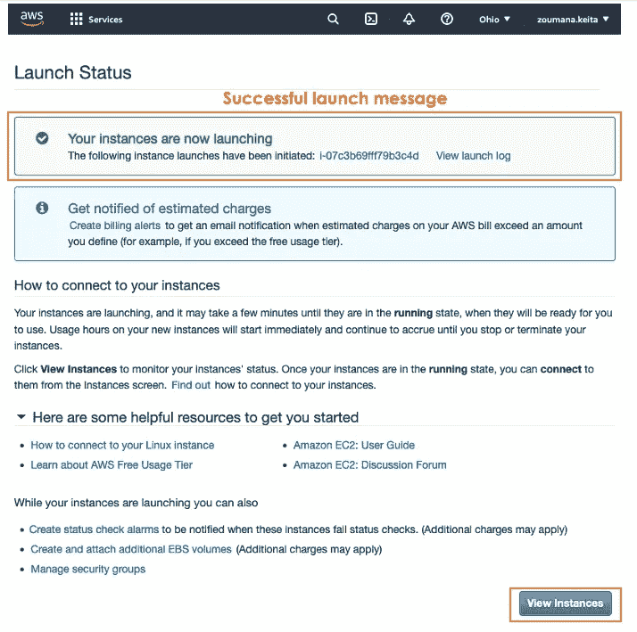

成功发布消息(图片由作者提供)

正如您在下图中看到的，我有了新创建的实例，它处于**运行状态**。

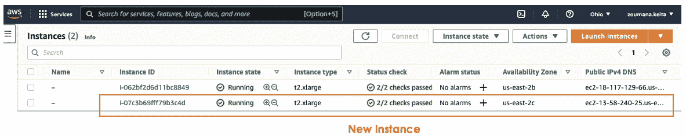

我正在运行的 EC2 实例(图片由作者提供)

瞧，你可以为自己能走到这一步而感到骄傲！！！好极了👏🏼👏🏼👏🏼

**接下来是什么？？？** 我们确实想在 EC2 上运行应用程序，但是我们首先必须能够 SSH 连接到我们的 EC2 实例。

现在，我决定继续使用我之前创建的第一个实例，以避免被超额收费。😀

## 到 EC2 实例的 SSH 连接

**获取连接变量**

使用以下信息连接到我们的实例:

*   生成的密钥对文件
*   EC2 实例的公共 IP 地址
*   公共 IPv4 DNS

通过执行步骤 1 和 2，您可以获得公共地址和公共 DNS。

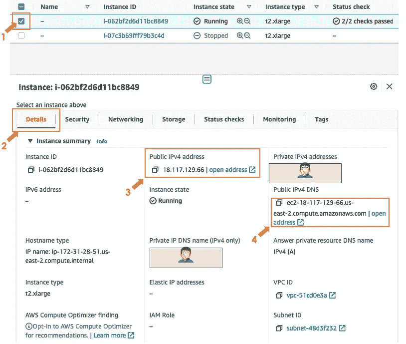

获取 SSH 连接信息的步骤(图片由作者提供)

**配置~/。ssh/config 文件**

将以下信息添加到配置文件中。这个文件的目标是使用一个`ssh`命令连接到 EC2 实例成为可能。

```
Host **streamlit-dagshub** HostName **18.117.129.66**
     User **ec2-user**
     IdentityFile <PATH TO YOUR KEY PAIR FILE>/<KEY PAIR.pem>
```

*   `Host`可以是任何名字。在我的例子中，我选择了 **streamlit-dagshub** 。
*   `Hostname`是公共 IPv4 地址。
*   `User`不可修改，仍为**ec2-用户**。
*   `IdentityFile`是您的密钥对**的完整路径。您下载的 pem** 文件。

接下来，授予用户 read 权限，并使用下面的命令删除所有其他权限。

```
chmod 400 <PATH TO YOUR KEY PAIR FILE>/<KEY PAIR.pem>
```

之后，您可以连接到 EC2 实例，如下所示:

```
ssh **streamlit-dagshub**
```

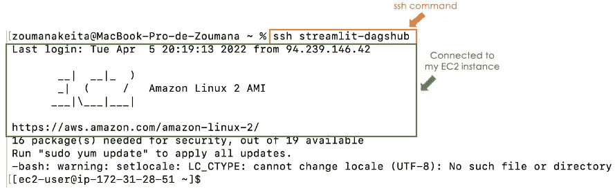

SSH 成功连接到我的 EC2 实例

## DagsHub、DVC 和 EC2 实例之间的交互

您可以在下面找到从推送源代码、模型和数据到在 EC2 实例中运行应用程序的一般工作流程。

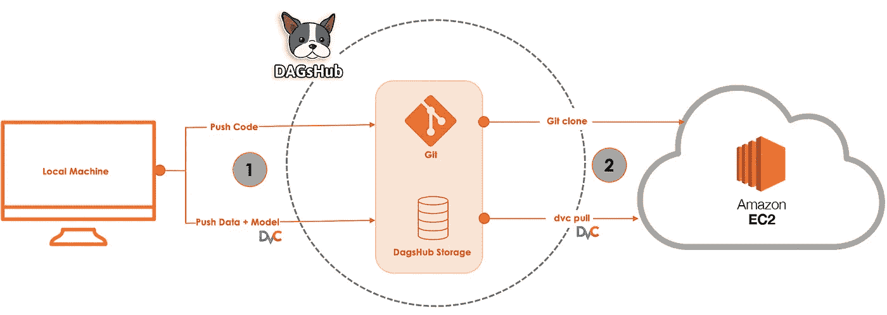

一般工业化工作流程—从本地机器到 EC2 实例(图片由作者提供)

*   **任务 1** :使用 DVC 将源代码、模型和数据推送到 DagsHub。
*   **任务 2** :克隆源代码，提取模型，然后提取数据，将应用程序运行到 EC2 中。

**任务 1:** *从您的本地项目存储库*执行

为了能够执行此任务，您首先需要配置您的 DVC 遥控器，然后将模型和数据推送到 DagsHub 存储。

上传 _ 模型 _ 数据. py

下面是前面脚本中使用的 ***params.yaml*** 文件的格式。

params.streamlit.yaml

**任务 2:** *从本地 EC2 实例*执行

在运行应用程序之前，我们需要获得应用程序源代码和依赖项，然后从 DagsHub 存储中提取模型和数据。从 EC2 实例中:

*   git 克隆源代码
*   提取模式和数据
*   安装依赖项
*   运行 streamlit 应用

准备 _ec2.py

将以下几行添加到您的 **params.yaml.**

params _ streamlit _ additional . YAML

我们最终可以从 EC2 实例运行 prepare_instance 脚本，然后使用`streamlit run`命令运行应用程序。

```
# Run the script to prepare EC2 instance
python prepare_ec2.py# Run the streamlit app
streamlit run app.py
```

在这个过程的最后，我们从 EC2 终端获得以下 URL 信息。然后将外部 URL 复制粘贴到您喜欢的浏览器中。

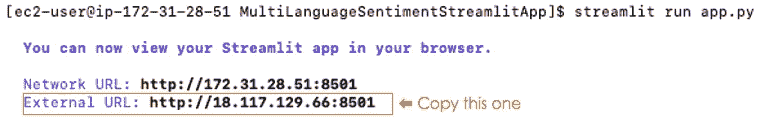

简化从 EC2 实例运行的 it

太好了！！！🎉🎉🎉我们的应用程序运行在 EC2 实例上。但是有一个问题。当我们退出控制台时，应用程序停止运行。这个问题可以用`[tmux](https://doc.ubuntu-fr.org/tmux)`来解决。

## 简化应用程序—让它持续运行

首先，从 EC2 实例安装 tmux 库

```
sudo yum install tmux
```

接下来，使用以下命令创建一个 tmux 会话

```
tmux new -s MultiLanguageSentimentStreamlitAppInstance
```

您可以用您想要的任何名称替换 multilanguagesentimentstreamlitapinstance，只要它有意义。然后在运行该命令后，我得到以下结果。

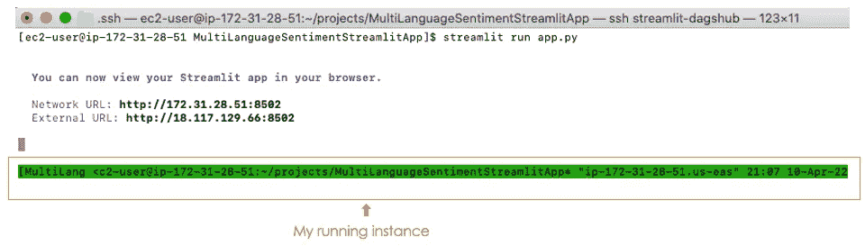

我在 tmux 会话下运行的 streamlit 应用程序(图片由作者提供)

与第一次在没有 **tmux** 的情况下运行相反，这一次，我们在终端的底部有一条绿色水平线，这意味着 **tmux** 会话是一个。你可以使用 Ctrl+C 退出终端，应用程序将继续运行，你可以将链接发送给居住在不同大陆的人，他或她将访问相同的应用程序。

下一步是什么？？？将公共地址映射到域名服务器，以便我们可以使用 my_app.com，而不是从公共 IP 地址访问。

# 结论

恭喜你！🎉 🍾您刚刚学习了如何使用 DagsHub 将您的 streamlit 应用程序部署到 AWS EC2 实例。如果您仍然对使用 DagsHub 犹豫不决，现在是时候让您和您的队友利用 DagsHub 的力量了。

如果你喜欢阅读我的故事，并希望支持我的写作，考虑[成为一个媒体成员](https://zoumanakeita.medium.com/membership)。这样做，我会得到一点佣金。

此外，您可以随时在 [LinkedIn](https://www.linkedin.com/in/zoumana-keita/) 和 [YouTube](https://www.youtube.com/channel/UC9xKdy8cz6ZuJU5FTNtM_pQ) 上添加我，或者在 [Twitter](https://twitter.com/zoumana_keita_) 上关注我。讨论人工智能、人工智能、数据科学和自然语言处理的东西总是令人愉快的！

# 额外资源

[AWS EC2 文档](https://docs.aws.amazon.com/ec2/index.html?nc2=h_ql_doc_ec2)

[DagsHub 网站](https://dagshub.com/)

[文章第一部分](/nlp-mlops-project-with-dagshub-multi-language-sentiment-classification-using-transformers-fcbe6164b171)

[Dag shub 上的源代码](https://dagshub.com/zoumana.keita/MultiLanguageSentimentStreamlitApp)

[链接到 AWS EC2 上的应用程序](http://18.191.74.237:8501)

再见🏃🏾‍♂️