# 使用 DagsHub 的 NLP MLops 项目—使用转换器的多语言情感分类—第 1 部分

> 原文：<https://towardsdatascience.com/nlp-mlops-project-with-dagshub-multi-language-sentiment-classification-using-transformers-fcbe6164b171>

## DagsHub 是一个成功而高效的机器学习项目的平台


由[杰里米·贝赞格](https://unsplash.com/@unarchive)在 [Unsplash](https://unsplash.com/photos/CEFVJ7zqoLs) 上拍摄的照片

# 介绍

一个成功的机器学习项目可能涉及不同的工具，每个工具都有特定的角色，从源代码和数据版本到模型性能跟踪。这些工具大部分时间是由不同的社区构建的，因此，它们的更好集成对于充分利用它们是至关重要的，否则，不幸的是，可能会导致更多的失望而不是满意。

接下来是一个平台，它可以托管源代码、版本数据集和模型，跟踪你的实验，标记你的数据，还可以提供你的结果的可视化。最后一款 **GitHub** **面向数据专业人士！**

# 开始

本文将通过一个真实世界的机器学习项目来说明`DagsHub`的使用，该项目旨在执行多语言情感分类，从数据处理到模型监控。

## NLP 问题和动机

全球各地的人们越来越多地在多个平台(社交媒体、评论网站等)上分享自己的观点。)关于组织，行业，用不同的语言。对这些情绪的有效分析可以帮助许多组织和行业做出正确的决策。

## 解决问题的方法

该问题将通过以下步骤解决

*   **数据采集&处理**:我们将从不同的文件中采集数据并进行处理。该步骤将涉及[数据版本控制(DVC)](https://dvc.org/) 工具，用于跟踪数据中的变更。
*   **数据探索**:为了更好的理解我们正在处理的数据。 ***这将是我们使用笔记本的唯一一步*** ！
*   **模型评估&跟踪**:没有特定的模型训练，因为我们将利用[一个来自拥抱脸的预训练零镜头模型](https://huggingface.co/joeddav/xlm-roberta-large-xnli)来执行情感分析。最后，我们将能够评估它在每种语言数据上的性能(准确性和 f1 分数)，并使用 [MLFlow](https://mlflow.org/) 跟踪这些指标。

## 关于数据

在[情感 NLPRoc](http://sentiment.nlproc.org/) 上提供的 10 个多语言基准数据集*中，我们将使用以下五个我们将使用的多语言模型当前支持的数据集。*

*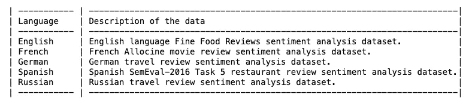*

*项目范围的数据集描述(图片由作者提供)*

## *履行*

*这一部分将包含重要的代码片段，但是整个项目和源代码可以在这里找到。请随意下载并跟随。*

***创建您的项目存储库***

*在开始这个过程之前，您需要在 [DagsHub](https://dagshub.com/) 上创建一个免费帐户，它会自动为您提供 10GB 的免费 DVC 存储空间！*

*只有在注册完成后，您才能创建您的第一个存储库，如下所示。*

*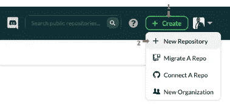*

*DagsHub 存储库创建(图片由作者提供)*

*一旦你的库被创建，你将得到一个类似于下面的快速指南。您可以简单地选择👁图标来可视化您的密码。*

*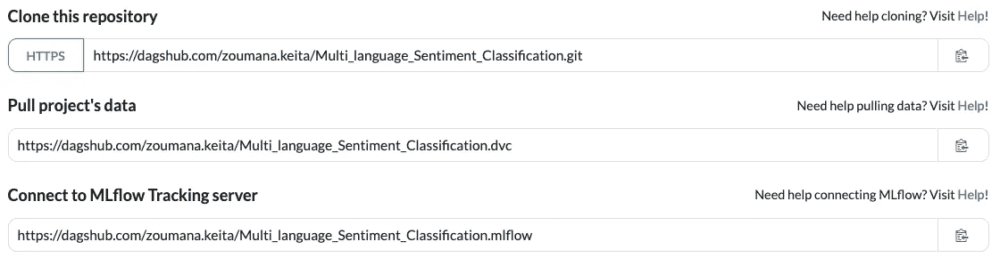*

*小节:克隆项目，用 DVC 提取项目数据，连接到 MLFlow 跟踪服务器(图片由作者提供)*

*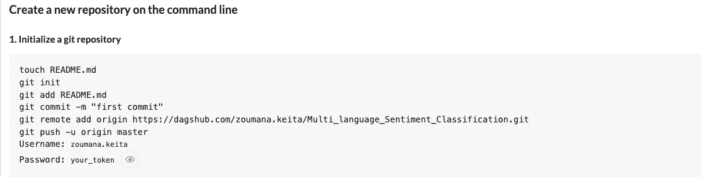*

*…..*

*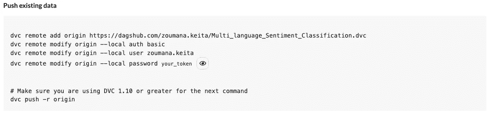*

*Sections truncated:在命令行上创建一个新的 repo 并推送一个现有的 repo(图片由作者提供)*

***数据收集***

*我在数据文件夹中创建了一个 zip 文件，其中包含五个不同的文件，格式为 a . **tsv** ，对应于**关于数据**部分中所述的五种语言。本节需要以下步骤:*

*   *下载中的数据。zip 格式。*
*   *创建两个文件夹数据文件夹: **data/raw** 将包含解压缩文件的结果，以及 **data/process** 将包含数据的处理格式(稍后讨论)。*

*可以运行以下脚本来同时执行所有这些任务*

*准备 _ 环境. sh*

*一旦这个阶段完成，您可以简单地从项目的根目录，从您的终端运行脚本，如下所示。别忘了**。/** 在开始运行脚本时。*

```
*# Grant execution right for the script
chmod +x prepare_environment.sh# Run the script 
**./**prepare_environment.sh*
```

*成功执行会产生以下结果。*

*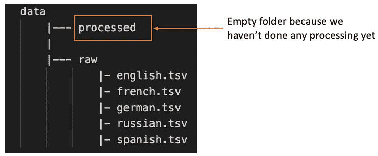*

*处理前数据文件夹的结构(图片由作者提供)*

***数据处理***

*需要注意的是，所有的 python 源代码都是在 ***src*** 文件夹中创建的，所以你需要从项目的根目录创建一个。*

*每个文件最初有两列，但是它们没有名字。我们的目标是:*

*   ***分别给两列**命名。第一个对应标签，每个值都会映射到它的字符串格式(负:0，正:1)。第二列对应于文本。*
*   ***增加一个新的语言栏**对应文字的语言。*
*   *将所有的结合起来。tsv 文件成单个。csv 文件，它将对应于最终处理的文件。*

*预处理程序. py*

***在第 2 行**中，我从我实现的包中导入了`data_preprocessor()`函数，以使代码可维护。该函数有 3 个参数，t *数据/原始文件的路径*，*数据/已处理文件的路径*，以及最终处理文件的名称*。**

***在第 5 行**，我加载了**。包含所有参数值的 yaml** 文件。以下是摘录。*

*params.yaml*

*在成功执行前面的 preprocess.py 文件后，我们会得到以下结果。*

**

*处理后的数据文件夹结构(图片由作者提供)*

*我们终于可以运行以下命令来开始跟踪**数据**文件夹了。*

***第 1 行**激活数据文件夹的跟踪。该指令创建一个 **data.dvc** 文件，其中包含关于原始数据存储位置的信息。然后，我们使用简单的`git commit` 命令添加文件并提交。完成所有这些后，原始数据文件夹被自动添加到**中。gitigore** 文件，因为它没有被推送到存储库。我们现在已经准备好使用以下命令来推送所有新的更改。*

*add_othefiles.py*

*确保真正考虑数据跟踪的是我们可以在数据文件夹上看到的 DVC 标志。*

*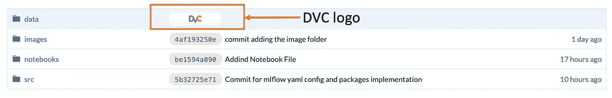*

*显示数据跟踪激活的 DVC 标志(图片由作者提供)*

***数据分析***

*这里的重点是可视化语言分布，显示每种语言的一些随机文本及其情感。*

*数据 _ 探索. py*

*   ****语言分布****

*下图显示了每种语言的情感数据数量。*

*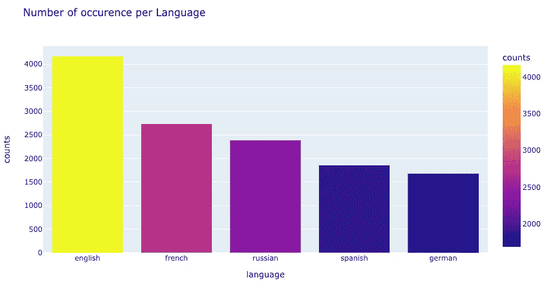*

*数据集中的语言表示(作者提供的图片)*

*从前面的图像中，我们观察到英语是最具代表性的语言，而德语是最不具代表性的语言。*

*   ****每种语言的情绪分布****

*对于每一种语言，我们显示了积极的，消极的极性的数量。从一种语言到另一种语言，生成图形的过程是相同的。例如，英语的说明如下。*

*英语 _ 情绪 _ 分布. py*

*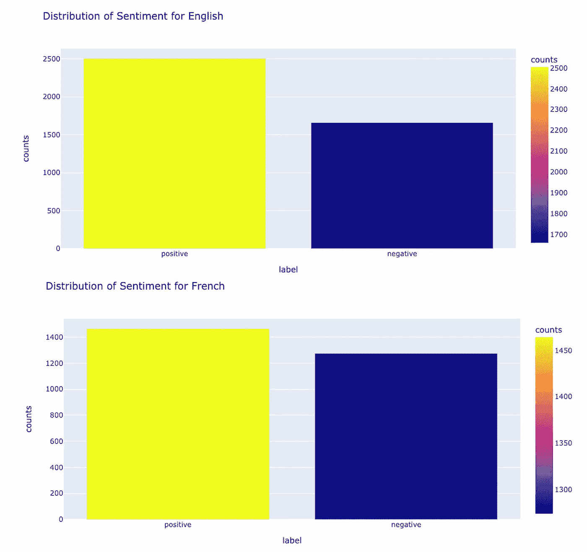*

*英语和法语的情感分布(图片由作者提供)*

**

*俄语和西班牙语的情感分布(图片由作者提供)*

*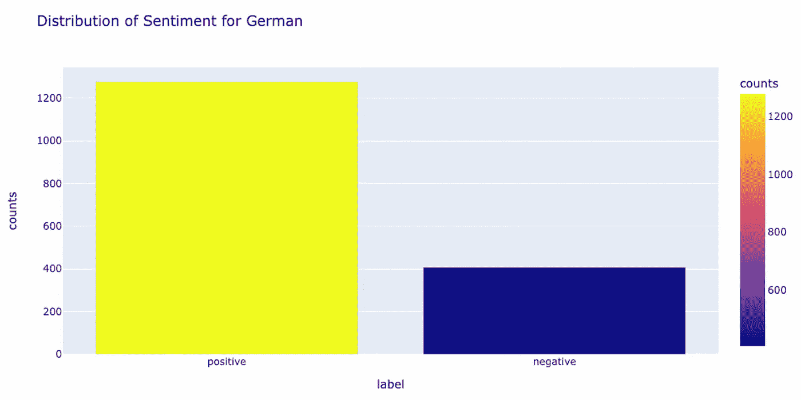*

*德国人的情感分布(图片由作者提供)*

*对于所有 5 种语言，情绪分布图显示积极情绪多于消极情绪。*

*   ****每种语言两个随机文本****

*该部分使用`show_random_text()`功能执行。采用的主要参数是特定语言的熊猫数据帧。*

```
*# Example of English data
show_random_text(en_df)*
```

***为英文***

```
***Textual data**: grandpa po &apos;s originals are crunchy nuggets made from organic popcorn and organic soybeans. the healthy snack offers the benefits of soy without genetically modified organisms , cholesterol , peanuts or preservatives. in addition , the snack is low in saturated fat and it tastes great.  Underlying **Underlying gSentiment**: positive*
```

***为法语***

```
***Textual data**: quand le voisin fox essaie de copier sur son voisin abc , voilà le piètre résultat que ça donne ... quintuplés n'est qu'une copie des sauvages , et une copie bâclée en plus ...**Underlying Sentiment**: negative*
```

***对于俄语***

```
***Textual data**: я не думаю , что в москве можно найти отель такого же уровня за эти деньги . если у вас бизнес поездка в столицу и ограничен бюджет , то этот отель для вас . очень удачное месторасположение , близкая транспортная развязка позволяет добраться в любой район города в кратчайшие сроки . номер был без излишеств , минимализм чувствуется во всем . отдельное спасибо персоналу отеля : доброжелательность сглаживает те незначительные недостатки , какие замечаешь за несколько дней пребывания в отеле **Underlying Sentiment**: positive*
```

***西班牙语***

```
***Textual data**: comida abundante , buena relacin calidad-precio si pides entrante + segundo se puede cenar por unos 12 euros**Underlying Sentiment**: positive*
```

***对于德语***

```
***Textual data:** ambiente eines billigen strandclubs in der türkei , der nachbar sitzt fast auf dem schoss weil es eng ist , die musik laut und unpassend ( fetenhits 80er ) , gedränge und warme getränke die man gewöhnlich kalt trinkt . der eingang wird von 2 arroganten kleinen mädchen bedient , die sich auf irgendetwas was einbilden , unklar auf was . dazu gehen im laden afrikanische prostituierte auf männerfang . achja das essen : zu teuer , aber gut . für 1/3 des preises in anderen lokalen anzurufen . fazit : viel lärm um nichts**Underlying Sentiment**: negative*
```

***模型评估和性能跟踪***

*现在，是时候检查预训练模型在预测这 5 种语言的正确情绪方面的表现了。我们将比较模型的预测和真实的情绪值。*

*首先要做的是如下配置 MLFlow 跟踪。*

*mlflow_config.py*

***第 2 行**获取包含我的 mlflow **URI** 、**用户名**和**密码的凭证文件。下面是如何获得这些证书的说明。***

*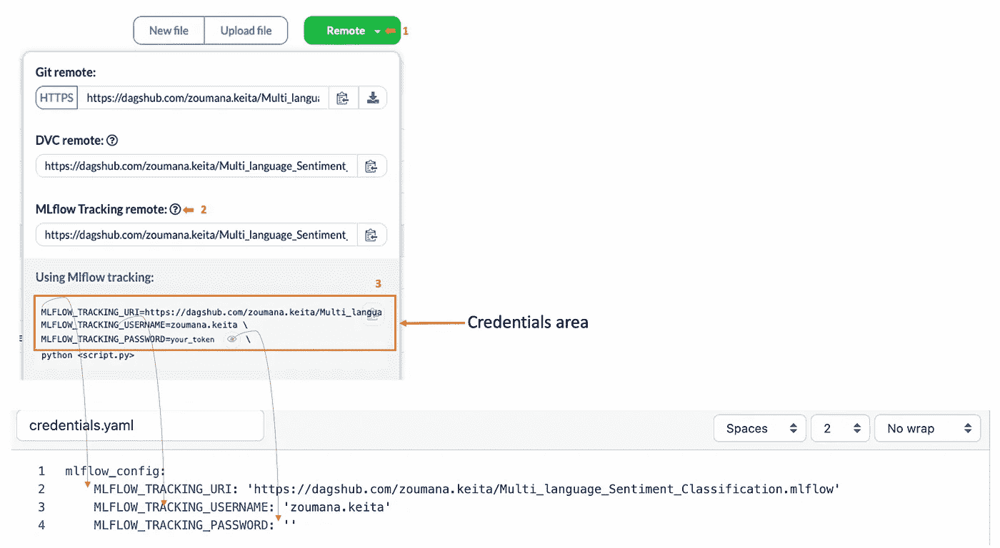*

*DagsHub 中凭据和信息的映射(图片由作者提供)*

*配置完 **mlflow** 之后，我们可以运行指标日志记录流程。我决定对每种语言的 100 个例子进行评估，这样这个过程就不会花太多时间。毕竟，主要目标是理解过程。*

*evaluate_tracking_section.py*

*我首先在**线 2** 定义我的预训练模型。然后在**第 7 行**中，我给我的实验命名，在这种情况下，它被称为**多语言分类**。*

*测井过程从第 9 行的**中的`mlflow.start_run()`开始。最后，我对每种语言运行一个循环，记录模型的准确性和 f1 分数。***

*成功运行评估后，您可以在**实验**选项卡上看到您已经执行的实验数量(包括失败和成功)，在我的例子中是 10。*

*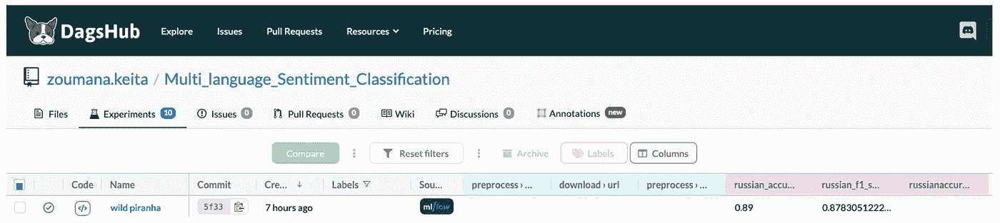*

*上一次 mlflow 模型追踪实验截图(图片由作者提供)*

*当您选择**名称**部分时，您可以找到如下所示的详细信息。我没有记录任何参数，这就是为什么左边的**参数表**是空的。然而，我们可以在右侧看到所有的准确度和 f1 分数值。*

*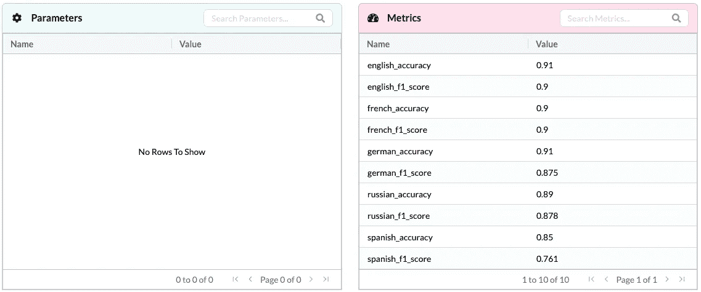*

*Mlflow 模型实验表格格式(图片由作者提供)*

*如果您想要不同的可视化效果，可以在图表模式下看到相同的结果，如下所示。*

*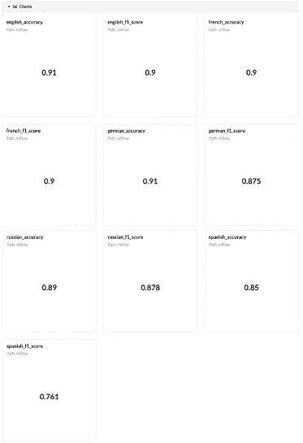*

*Mlflow 模型实验图表格式(图片由作者提供)*

# *结论*

*恭喜你！🎉 🍾您刚刚从`DagsHub` 学会了如何使用 DVC 和 MLFlow 成功运行您的机器学习项目！如果你仍然不愿意使用`DagsHub`，试一试，因为我相信它可以帮助你和你的队友节省时间，创造更多价值。*

*找到下面的附加资源来进一步学习。*

*如果你喜欢这篇文章，**关注我的文章更新***

*欢迎在 [LinkedIn](https://www.linkedin.com/in/zoumana-keita/) 和 [YouTube](https://www.youtube.com/channel/UC9xKdy8cz6ZuJU5FTNtM_pQ) 上加我，也可以在 [Twitter](https://twitter.com/zoumana_keita_) 上关注我。讨论人工智能，人工智能，数据科学，自然语言处理的东西总是令人愉快的！*

***源代码和 DagsHub***

*   *[该项目的源代码可以在我的 DagsHub 存储库中找到](https://dagshub.com/zoumana.keita/Multi_language_Sentiment_Classification)*
*   *[谷歌 Colab 源代码](https://colab.research.google.com/drive/1iKHMtG-UfdSB1OJXCO2ZTOaySIU58o2Y?usp=sharing)*
*   *[DagsHub 网站](https://dagshub.com/)*

***数据集鸣谢***

*   *[用于深度情感分析的跨语言传播](http://gerard.demelo.org/papers/sentiment-propagation.pdf)*
*   *[援手:用于深度情感分析的迁移学习](http://gerard.demelo.org/papers/sentiment-helping-hand.pdf)*

*再见🏃🏾*