# 具有增强、攻击和基于方面的情感分析的 NLP 项目

> 原文：<https://towardsdatascience.com/nlp-project-with-augmentation-attacks-aspect-based-sentiment-analysis-3342510c90e7>

## 你知道这三个高级 NLP 概念吗？

图片来自 [Unsplash](https://unsplash.com/) 的 Charlota Blunarova

你听说过自然语言处理(NLP)的这三个领域吗？

*   文本扩充
*   文本对抗性攻击
*   基于方面的情感分析

在本文中，我将展示这些高级主题的价值，以及它们如何改进您的下一个 NLP 项目。虽然这将是一个解释性的概述，你可以在我的 GitHub [这里](https://github.com/misha345a/E-commerce_Reviews_Classifier)找到注释代码。

## 资料组

我将使用来自 Kaggle 的[女装电子商务服装评论](https://www.kaggle.com/nicapotato/womens-ecommerce-clothing-reviews)数据集。

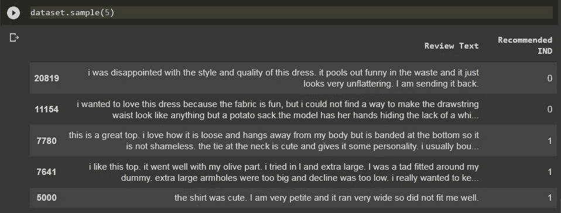

作者图片

我们需要的两个变量是:

*   **评论正文:**服装评论的字符串变量
*   **推荐的 IND:** 表示客户是否推荐产品的二进制变量(其中 0 表示不推荐，1 表示推荐)

## 文本扩充

使用这个数据集，我们的第一个目标是实现一个用于二进制分类的监督深度学习模型。

然而，有一个突出的问题:**数据集不平衡**。
绝大多数顾客提供了积极的反馈，并推荐他们购买的产品。

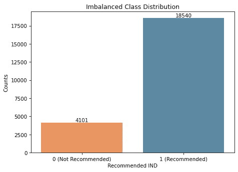

图片由作者提供。约 82%的总观察值被标记为推荐值。

这就产生了一个问题，因为我们的模型会**偏向于**大多数类别(推荐产品)。换句话说，由于在训练期间缺乏负面例子，该模型可能难以预测不推荐的评论。

我们可以看到这一弱点反映在我在不平衡数据集上训练的 LSTM 神经网络的模型指标中。

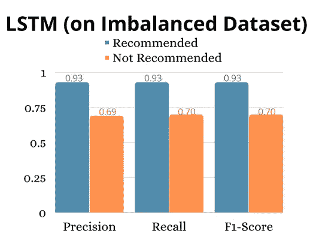

图片由作者提供。由于稍微不平衡的数据集，少数类预测的性能指标明显较低。

那么我们如何平衡数据集呢？

1.  一种常见的方法是简单地对负面评论进行补充。这意味着我们复制当前不推荐的观测值，并将它们添加到我们的数据集中。
2.  更高级的选项是**文本增强**。这里，使用预先训练的单词嵌入，单词被随机交换、删除、替换或插入同义词。我用[简易数据扩充](https://arxiv.org/abs/1901.11196)技术实现了这个。

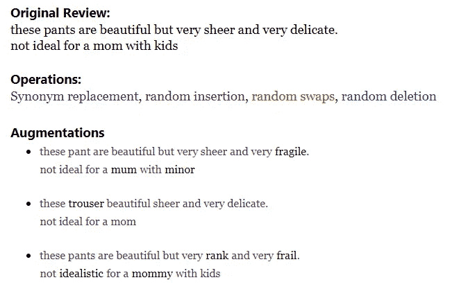

图片由作者提供。当“妈妈”和“孩子”这样的词被替换或删除时，评论的整体含义保持不变。

对于上采样和文本增强方法，我将数据集平衡为 16，104 条不推荐的评论(或原始大小的 4 倍)，并保留原始的 18，540 条推荐评论。我还继续使用 LSTM 模型对每个数据集进行训练和测试。

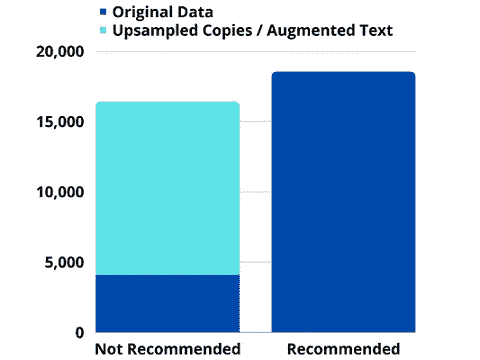

作者图片

上采样和文本扩充在提高模型对少数类观察的预测性能方面都是有效的。

图片由作者提供。两种方法产生了相似的结果。

那么使用文本增强有什么好处呢？

通过文本增强，我们还向我们的训练数据添加了更多的变化，这**增强了我们的模型**的健壮性及其对看不见的文本进行概括的能力。

继续阅读下一节，了解我们如何评估 NLP 模型的鲁棒性。

点击[这里](https://github.com/misha345a/E-commerce_Reviews_Classifier/blob/main/Create_Balanced_Dataset.ipynb)看代码。

## 对抗性文本攻击

如果我告诉你交换输入的单词或随机删除几个字母会严重改变我们的 NLP 模型的性能，会怎么样？

这些类型的编辑，在现实世界中可能是偶然的，也可能是恶意的，被称为扰动，并已被证明会显著降低即使是最好的最先进模型(如 BERT)的准确性。[链接](https://venturebeat.com/2020/02/07/mit-csails-textfooler-generates-adversarial-text-to-fool-ai-natural-language-models/)到文章。

我们通过对与原始模型语义相似但有轻微释义或同义词替换的输入进行测试，来对训练好的模型进行公式化攻击。

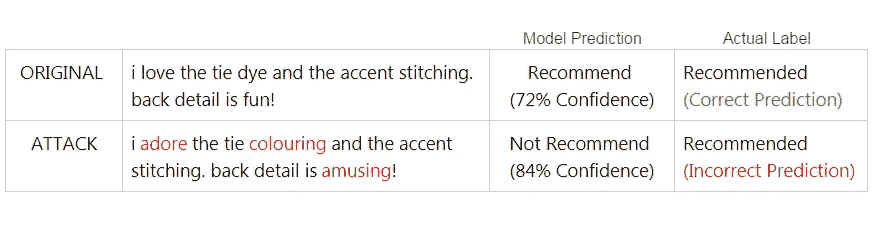

图片由作者提供。一次成功攻击的例子。对抗性的干扰愚弄了模型，使其预测出错误的标签。

使用 [TextAttack](https://textattack.readthedocs.io/en/latest/index.html) 库，我将对每个经过训练的 LSTM 模型进行对抗性攻击(*用上采样数据训练的模型和用扩充数据训练的模型*)。攻击将持续到 1000 次攻击成功愚弄每个模型。

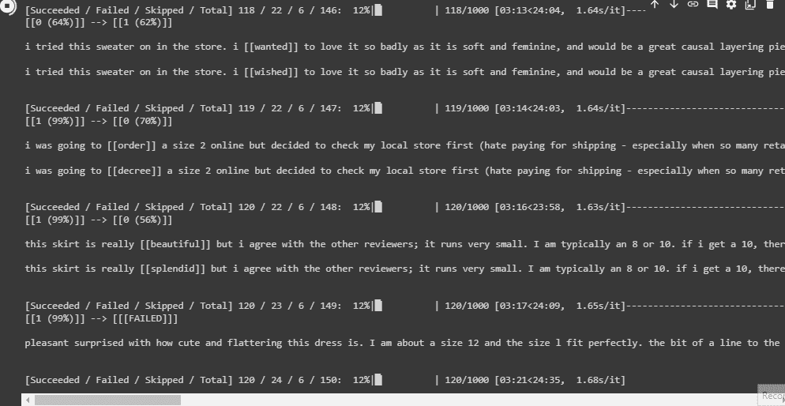

作者 GIF。正在进行的攻击。

以下是攻击结果。
在具有扩充数据的数据集上训练的 LSTM 表现全面。相比之下，它对扰动有更好的准确性，失败的攻击数量几乎是它的两倍。

作者图片

这些结果很有希望，并且与[现有的研究](https://medium.com/@init_27/eda-easy-data-augmentation-techniques-for-boosting-performance-on-text-classification-tasks-bfb15f7a8a94)相一致，这些研究已经展示了文本增强技术在改善小型和不平衡数据集的模型性能方面的有效性。

点击[这里](https://github.com/misha345a/E-commerce_Reviews_Classifier/blob/main/LSTM_Models_And_Attack.ipynb)看代码。

## 基于方面的情感分析(ASBA)

假设你在一家制造这些女装的公司担任数据科学家。你的老板让你深入调查负面评论，并**分析消费者对服装颜色的情绪**。

你会如何使用非结构化文本来做这件事呢？

我们很多人已经知道情感分类。但是看看下面的评论:

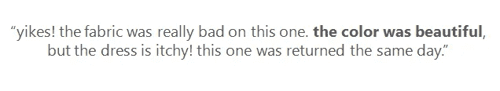

作者图片

通过简单地将总体评估分为*正面*或*负面*，我们错过了一些更小的信息。有了 ASBA，我们可以更细致地分析并提取与颜色相关的积极因素。

我喜欢把 ASBA 想象成一个 4 步的过程:

1.  **从数据集中识别与我们的方面相关的观察结果。**
    颜色是我们这里的方面。我们可以让事情变得简单，使用正则表达式在评论中使用提到单词“颜色”或“颜色”的评论子集。然而，情况不会总是这样。有时对于更抽象的方面，如*体验*、*服务*或*位置*，您可能需要利用主题建模来预测哪个方面与文本最相关。
2.  其次，我们需要将文本分割成更小的片段。在我的代码中，我利用了第三方 API 来执行这一步。但也可以像应用一些语言学常识一样直截了当。例如，我们可以根据标点符号按句子分割文本，也可以在有连词(“但是”、“然而”、“虽然”等)时分割短语。

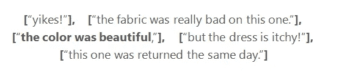

作者图片

3.现在，让我们确定与该相位相关的情绪或极性。这里最简单的方法是应用一个预先训练好的情感分类器模型。对于这个例子，我使用 TextBlob 库来确定极性，极性的范围在正负之间，范围为[-1，+1]。

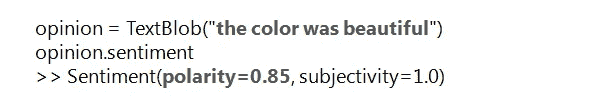

图片由作者提供。强正极性。

4.最后，我们可以提取与我们的方面相关的描述符。
到目前为止，我们发现这位顾客对这件衣服的颜色评价很好，但了解一下*为什么选择*也很有帮助。在这种情况下，是因为“*美*”我们可以使用 spaCy 的 token 分类功能来自动分析句子的语言结构，并提取哪些形容词/副词与我们的名词相关联。

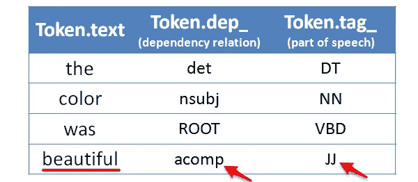

图片由作者提供。在这个短语中，spaCy's 确定了“beautiful”在 dependency 中是形容词性补语，在词性中是形容词。这显然是我们想要提取的描述符。

让我们看看这些步骤在更多意见上的作用:

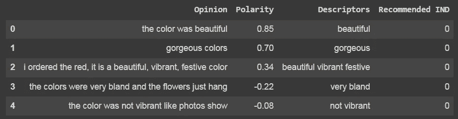

作者图片

在分析了 270 条不被推荐的着装评论中我们的观点——颜色——后，我们发现了以下结果。

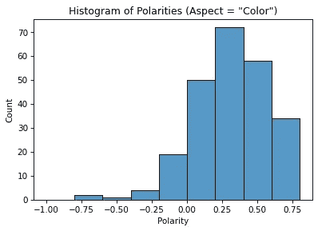

作者图片

我们可以报告说，顾客通常对服装颜色反应积极。
因此，颜色不是不推荐评论的主要因素。

通过分析描述符，我们发现客户喜欢色彩明亮、生动、有活力的产品。然而，当产品的颜色看起来比网上的图片暗，或者过于柔和或暗淡时，评论者往往会抱怨产品的颜色。

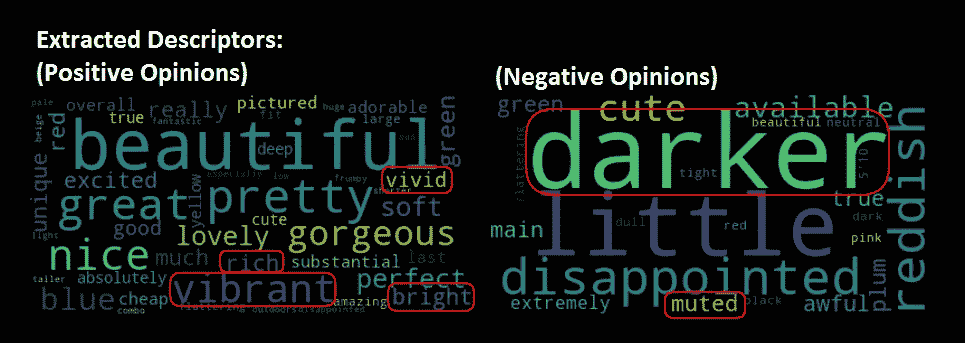

作者图片

我们可以建议该公司注重使用明亮、充满活力的色彩和材料。

为了进一步研究，你可以分析其他方面，如模式，面料和大小。

点击[此处](https://github.com/misha345a/E-commerce_Reviews_Classifier/blob/main/ASBA.ipynb)查看代码。

## 结论

无论是改善你的数据集，建立一个更健壮的模型，还是分析特定的方面，这些绝对是需要注意的概念。我希望这篇文章能让你思考下一个项目的各种可能性。

如果您仍然想要更多的 NLP 内容，请查看我最近的一篇文章，其中介绍了几个独特但非常有用的 NLP 库。

  

感谢阅读！