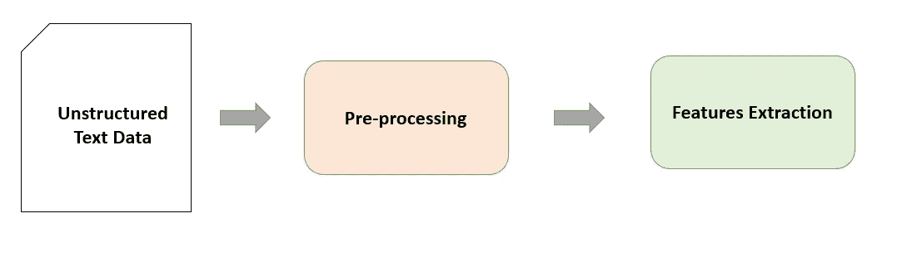
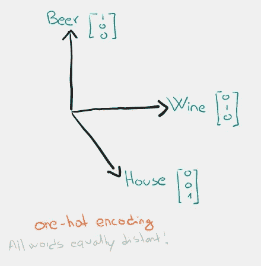
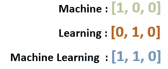
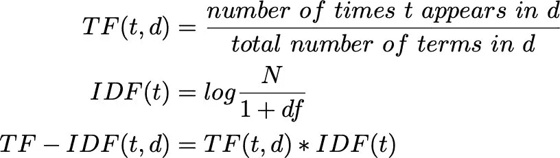
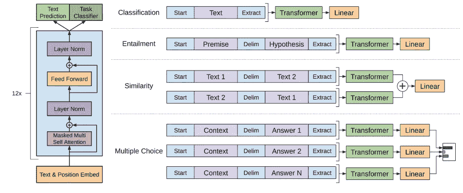

# 开始使用 NLP 需要知道的一切

> 原文：<https://towardsdatascience.com/nlp-survey-bde8a27e8ba>

本杰明·苏特在 [Unsplash](https://unsplash.com?utm_source=medium&utm_medium=referral) 上拍摄的照片

## 不要到处搜索，先看看这个！

在这最后的一段时间里，我一直在集中精力复习和研究 NLP 领域最重要的东西，以便尽可能平静地面对各种面试。因此，我做的第一件事就是复习这个科目的所有基础知识，这样我就能为我将要被问到的所有问题做好准备。然而，我很难在一篇文章中找到所有的基本概念，并且花了很多时间搜索，所以我决定自己写一篇！😜(本文基于我在最后引用的一些文献)。

# 索引

*   **简介**
*   **文本预处理**
*   **直言词表征**
*   **加权单词表示法**
*   **表征学习:非上下文单词表征**
*   **表征学习:上下文单词表征**
*   **基于变压器的预训练语言模型**
*   **下游学习**
*   **对抗灾难性遗忘**
*   **模型压缩**
*   **NLP 库**

**简介**

基于文本的数据正以惊人的速度增长，而这些数据大多是非结构化的，因此很难从文本中获取有用的信息。每天发布的大量低质量数据的一个例子是推文、社交媒体帖子或在线论坛。人们用不总是正确的语言写评论，经常使用方言或表情符号来表达他们的情绪。不同的自然语言处理方法的主要目标是实现类似人类的文本理解。NLP 帮助我们检查大量的非结构化文本并提取其主要特征。

一般来说，在 NLP 任务中，我们必须遵循一些标准步骤。主要问题是机器学习算法不知道如何计算单词，所以我们必须找到文本的适当数字表示。**为了生成这种表示，我们必须清除数据中的任何噪声，然后执行特征提取**，即将原始数据转换为机器可以理解的数字数据。

文本表示管道(图片由作者提供)

让我们来看看文本预处理最常见的步骤是什么。请注意，下面我将描述一系列预处理步骤，但是您不必执行所有这些步骤来解决您的任务。相反，经常使用变形金刚，你会试图保持文本不变，以保持句子的上下文。因此，作为一名 NLP 从业者，您需要弄清楚自己需要什么。

# 文本预处理

*   **标记化:**标记化是将文本变成原子单位的过程。例如，原子单位可以是单词、子单词，甚至是单个字符
*   **去除噪音、网址、标签和用户提及**。通常，当我们看到一个数据集时，它非常脏，例如，因为它是从互联网上刮下来的。在许多情况下，文本中的符号或无用的单词，如 HTML 标签，不会添加信息，只会产生噪音。
*   **标签分割:**在文本中，我们经常会发现前面有标签的单词(#它在社交媒体中被大量使用)。这些单词对于理解文章的主题可能非常重要，所以我们应该能够识别它们并删除符号#。
*   **更换表情符号和表情符号**:表情符号和表情符号可以错误显示，希望我不是唯一一个出现过编码问题的人。有时候删除表情符号是合适的，但是在情感分析任务中，它们会非常有用。所以这完全取决于你的判断力。
*   **替换拉长字符**:heeeeeeloooo→hello
*   **纠正拼写错误:**一篇[关于这个的大文章](/essential-text-correction-process-for-nlp-tasks-f731a025fcc3)。
*   **扩张收缩:**我会→我会。([下面是](https://www.geeksforgeeks.org/nlp-expand-contractions-in-text-processing/)怎么做)
*   删除标点符号
*   **删除数字**
*   **小写全字**
*   **去除停用词:**这些词会出现很多次，因此不会给测试增加太多信息，例如像“ *the，a，ok”这样的词。*
*   **词干化**:就是把后缀、词缀替换掉，得到词根、词基或词干的技术。例:*吃→吃。*
*   **词干化:**词干化的目的和词干化一样，都是把单词删减到它们的词根或词根。然而，在词汇化中，单词的词尾变化不仅仅是被切断，而是利用词汇知识将单词转换成它们的基本形式。Ex: *狼→狼。*
*   [**【词性】标注**](https://en.wikipedia.org/wiki/Part-of-speech_tagging#:~:text=In%20corpus%20linguistics%2C%20part%2Dof,its%20definition%20and%20its%20context.) **:** 是根据词的定义和上下文，将文本(语料库)中的词标记为对应于特定词性的过程。
*   **处理否定:**否定可以完全改变句子的意思。因此，显式地找到它们可以极大地帮助您的算法。

# 特征抽出

## 分类单词表示:

*   [**One hot encoding**](https://medium.com/hackernoon/what-is-one-hot-encoding-why-and-when-do-you-have-to-use-it-e3c6186d008f) :这是第一种方法，也是最容易应用于表示向量空间中的文本。每个单词都与一个长度等于字典基数的向量相关联。每个向量中的所有条目都是 0，除了我们发现 1 的一个位置。所以每个向量都是不同的，向量之间的距离都是相同的，所以没有比其他向量更相似的词。

一个热编码(作者图片)

*   ****(BoW):**这只是一个一键编码的扩展。它将句子中单词的一键表示相加。**

****

**弓(图片作者提供)**

## **加权单词表示法**

**然而，先前的表示没有考虑文本中单词的频率，而这对于理解单词的重要性来说是一个重要的数据元素。**

****词频(TF):** 它不是只用 0 和 1，而是计算一个词的频率。一个单词的 TF 是通过计算一个单词在文本中出现的次数除以单词总数来计算的(这样就不会以牺牲较长的文档为代价来惩罚较短的文档)。**

**[**词频-逆文档频率(TF-IDF)**](https://en.wikipedia.org/wiki/Tf%E2%80%93idf) :仔细想想，像“*”这样的词在一篇文档中出现了很多次，但信息量并不大。因此，如果一个单词在一个文档中出现多次，并且出现在数据集中的几个不同的文档中，那么它的权重就一定很高***

******

***TF-IDF(来源:[https://kinder-Chen . medium . com/introduction-to-natural-language-processing-TF-IDF-1507 e 907 c19](https://kinder-chen.medium.com/introduction-to-natural-language-processing-tf-idf-1507e907c19))***

***其中 *d* 为一个文档， *N* 为文档总数， *df* 为期限为 t 的文档数***

## ***表征学习:非语境词汇表征***

***刚刚看到的分类表示非常直观且易于使用，但存在几个问题。首先，它们不能捕捉单词的句法和语义含义，并且遭受所谓的维数灾难。表示单词的向量的长度等于一种语言的单词词汇量的大小。如果我们同时处理多种语言的文本，维度将会大幅增加！***

***出于这个原因，我们现在看到的模型使用固定和有限维度的向量来学习单词表示。这些向量或单词嵌入的最显著的好处是，它通过保持上下文的单词相似性和低维向量来提供更有效和更有表现力的表示。因此，这些向量往往具有词的邻居的属性，并且它们捕捉词之间的相似性。这种表征称为**连续词表征**。***

***[**word 2 vec**](https://medium.com/towards-data-science/skip-gram-neural-network-from-scratch-485f2e688238)**:**已经推出的伟大创新是单词嵌入是一个神经网络的权重！该模型使用两个隐藏层，这两个隐藏层在浅层神经网络中用于创建每个单词的向量。由连续词袋(CBOW)和 word2vec 的 Skip-gram 模型捕获的词向量被认为具有词的语义和句法信息***

*   ***连续单词包(CBOW)***
*   ***Skipgram***

***[**全局向量(GloVe)**](https://nlp.stanford.edu/pubs/glove.pdf) :用于单词表示或 GloVe 算法的全局向量与 Word2Vec 颇为相似。但是，方法有点不同。GloVe 仅在一对一的基础上考虑上下文信息。这意味着 GloVe 只创建了一个逐字的相对矩阵，该矩阵包括在单词 b 周围显示单词 k 的概率。
该技术的主要目的是找到两个向量的表示，以便生成它们的点积等于共现的对数似然。它们对于将上下文中的单词相互关联有很好的效果。***

***[**fast text**](https://arxiv.org/pdf/1607.04606.pdf)**:**fast text 将 n 元文法中的一个单词而不是完整的单词分解，输入到神经网络中，可以获取字符之间的关系，提取单词的语义。***

## ***表征学习:上下文单词表征***

***我们为什么要在乎语境？在我看来，简单地解释一下，举个例子更容易。一个词可以根据它所处的上下文有不同的意思。在句子中:"*我* ***左*** *我的手机在桌子的* ***左*** *侧。*、*离开了*这个词就有了两种不同的含义，因此也就有了两种不同的表述。根据上下文创建单词的嵌入可能会对您的 ML 模型有很大的帮助。但是，要小心可能会改变上下文的预处理步骤。***

***[**通用上下文单词表示(Context 2 vec)**](https://aclanthology.org/K16-1006/)**:**他的方法使用 LSTM 型神经网络从大型语料库中高效地学习通用上下文嵌入函数。这个模型的主要目标是学习一个通用的、独立于任务的嵌入函数，用于围绕
单词的不同长度的
句子上下文。***

*****上下文化单词表示向量(CoVe):** 使用深度 [LSTM](https://paperswithcode.com/method/lstm) 编码器，该编码器来自为机器翻译训练的注意力序列到序列模型，用于上下文化单词向量。因此，隐藏字嵌入是整个输入序列的函数。然后，通过将这些单词嵌入与手套嵌入连接起来，然后将它们作为特定于任务的模型的特征，可以在下游任务中使用这些单词嵌入。***

***[**从语言模型嵌入(ELMo)**](https://arxiv.org/abs/1802.05365v2) **:** 从双向语言模型中学习最终的单词向量。ELMo 使用从双向语言模型中学习的线性连接表示，而不仅仅是像其他上下文单词表示那样的最终层表示。在不同的句子中，ELMo 为同一个单词提供了不同的单词表示。***

***对于一个简单而好的教程:***

 ****** 

***[**【ULMFiT】**](https://arxiv.org/abs/1801.06146)**:**通用语言模型微调(ulm fit)它主要依赖于迁移学习的概念，特别是通过允许在一个语料库(一组文档)上进行语言模型训练，以及然后在不同的语料库上改进模型的能力，但是建立在先前步骤所学的基础上。这是一种可以应用于 NLP 任务的架构和迁移学习方法。它包括一个三层的 AWD-LSTM 体系结构。训练包括三个步骤:1)在基于维基百科的文本上的通用语言模型预训练，2)在目标任务上微调语言模型，以及 3)在目标任务上微调分类器。***

## ***基于转换器的预训练语言模型***

***在学习基于变压器的模型之前，有两个资源是您绝对必须阅读的:***

*   ***[注意力是你所需要的一切](https://arxiv.org/abs/1706.03762?context=cs)***
*   ***[图示变压器](https://jalammar.github.io/illustrated-transformer/)***

***[**生成式预训练-****GPT(open ai Transformer)**](https://s3-us-west-2.amazonaws.com/openai-assets/research-covers/language-unsupervised/language_understanding_paper.pdf)**:**是第一个基于 Transformer 的预训练 LM，可以根据上下文有效地操纵单词的语义。它基于变换器的解码器部分来模拟语言，因为它是自回归模型，其中模型根据其先前的上下文来预测下一个单词。通过在大规模自由文本语料库上学习，GPT 将无监督 LM 扩展到更大的规模。GPT 的一个缺点是它是单向的，即该模型仅被训练来预测未来的从左到右的上下文。***

******

***GPT(来源:[https://S3-us-west-2 . Amazon AWS . com/open ai-assets/research-covers/language-unsupervised/language _ understanding _ paper . pdf](https://s3-us-west-2.amazonaws.com/openai-assets/research-covers/language-unsupervised/language_understanding_paper.pdf))***

***[**《GPT 2》(open ai Transformer)**](https://d4mucfpksywv.cloudfront.net/better-language-models/language-models.pdf)**:**open ai 团队在 2019 年发布了 GPT 的放大版本。与之前相比，它在层标准化和残差关系的位置方面有一些细微的改进。总的来说，有四种不同的 GPT2 变体，最小的与 GPT 相同，中等的与 BERTLARGE 大小相似，xlarge 以 1.5B 参数发布，作为实际的 GPT2 标准。***

***[**GPT-3(open ai Transformer):**](https://arxiv.org/pdf/2005.14165.pdf)**它是 GPT-n 系列中的第三代语言预测模型(很神奇[试试吧](https://openai.com/api/)！).*****

*****[**BERT**](https://arxiv.org/abs/1810.04805)**:**该模型提出了屏蔽语言建模(MLM)目标，其中输入序列的一些标记被随机屏蔽，目标是以被破坏的序列作为输入来预测这些被屏蔽的位置。在预训练期间，BERT 应用了一个变换器编码器来处理双向上下文。此外，伯特使用了下一句话预测(NSP)目标。给定两个输入句子，NSP 预测第二个句子是否是第一个句子的下一个句子。*****

**********

*****伯特(来源:[https://arxiv.org/pdf/1810.04805.pdf](https://arxiv.org/pdf/1810.04805.pdf)*****

*****如果您想了解如何在实际任务中使用 BERT，请查看我的文章:*****

*   *****[用于文本分类的 BERT 特征提取](/feature-extraction-with-bert-for-text-classification-533dde44dc2f)*****
*   *****[用 BERT 自定义命名实体识别](/custom-named-entity-recognition-with-bert-cf1fd4510804)*****
*   *****[我用一个版本的 BERT](https://pdfs.semanticscholar.org/c248/cc7cfe59e27f4e14e53840a9dcd29febafaf.pdf) 赢得了 2020 年 EVALITA 的系统奖*****

*****[**蒸馏 BERT**](https://arxiv.org/abs/1910.01108) **:** 一个蒸馏(*压缩*)版本的 BERT，将 BERT 的大小减少了 40%，同时保留了 97%的语言理解能力，速度快了 60%。我在我的文章中使用了 distilbert[【1】](/feature-extraction-with-bert-for-text-classification-533dde44dc2f)[【2】](/custom-named-entity-recognition-with-bert-cf1fd4510804)。*****

*****[**RoBERTa**](https://arxiv.org/abs/1907.11692)**:**对发布的 BERT 模型做了一些改动，并实现了实质性的改进。这些变化包括:(1)用更大的批次和更多的数据将模型训练得更长(2)去除 NSP 目标(3)在更长的序列上训练(4)在预训练期间动态改变掩蔽位置。*****

*****[**阿尔伯特**](https://arxiv.org/abs/1909.11942) :提出了两种参数缩减技术，降低了内存消耗，提高了 BERT 的训练速度:*****

*   *****将嵌入矩阵分成两个更小的矩阵。*****
*   *****使用在组之间拆分的重复层。*****

*****[**XLNet**](https://arxiv.org/abs/1906.08237)**:**XLNet，一种广义自回归预训练方法，它(1)允许通过最大化因子分解顺序的所有排列的期望概率来学习双向上下文，以及(2)克服了 BERT 由于其自回归公式的限制。*****

*****[**ELECTRA**](https://arxiv.org/abs/2003.10555)**:**相比于 BERT，ELECTRA 是一种更有效的预训练方法。ELECTRA 没有用[MASK]破坏输入的某些位置，而是用从一个小型发电机网络中采样的看似合理的替代物来替换输入的某些表征。ELECTRA 训练一个鉴别器来预测被破坏的输入中的每个令牌是否被生成器替换。然后，预训练的鉴别器可用于下游任务。*****

*****[**海量**](https://arxiv.org/abs/1905.02450) **:** BERT 不能轻易用于自然语言生成。MASS 使用屏蔽序列来预训练序列到序列模型。更具体地说，MASS 采用了一种编码器-解码器框架，并扩展了 MLM 目标。编码器将连续标记被屏蔽的序列作为输入，解码器自回归预测这些被屏蔽的连续标记。*****

*****[**T5**](https://arxiv.org/abs/1910.10683v3) **:** 是一个非常大的新神经网络模型，它在未标记文本和来自流行的自然语言处理任务的标记数据的混合上进行训练，然后针对作者旨在解决的每个任务单独进行微调[【3】](https://medium.com/syncedreview/google-t5-explores-the-limits-of-transfer-learning-a87afbf2615b)。*****

*****[**BART**](https://arxiv.org/abs/1910.13461)**:**BART 是**一个去噪自动编码器，用于预处理序列到序列模型**。通过(1)用任意噪声函数破坏文本，以及(2)学习模型以重建原始文本来训练 BART。[【4】](/fine-tuning-the-bart-large-model-for-text-summarization-3c69e4c04582)*****

# *****下游学习*****

*****一旦文本的嵌入(向量)被贴附，它们可以被用来解决各种称为下游任务的 NLP 任务。与非语境嵌入相比，语境嵌入表现出令人印象深刻的性能。但现在的问题是“我们如何才能将上下文嵌入用于下游任务？”。*****

## *******基于特征的*******

*****通过这种方法，您可以冻结模型，因此当您需要解决任务时，模型不会被拖回您的自定义数据集。它将仅使用预训练模型来生成特征(嵌入)，例如，您将使用这些特征作为分类器的输入。要了解如何做到这一点，请看我的文章。*****

## *******微调*******

*****与前面的方法不同，预训练模型将在下游数据集上再训练几次，以适应特定情况。*****

## *******适配器*******

*****适配器是预训练模型层之间的小模块，用于
获得能够以多任务方式训练的模型。当适配器被训练时，预训练模型的参数被冻结。*****

## *****对抗灾难性遗忘*****

*****每当我们去训练预训练模型以适应特定的下游任务时，我们这样做是为了提高该模型在我们特定情况下的性能。但是改变预先训练的参数会导致模型完全忘记它已经学习过的东西。例如，如果我使用一个很好地理解意大利语的语言模型，并且我想将其微调到西西里方言，则该模型可能会完全忘记意大利语。关于灾难性遗忘的研究仍然很多，但让我们看看能够减轻这种影响的方法:*****

*   *******冻结层:**有可能冻结所有层，或者我们可以冻结除了最后 k 层以外的所有层。或者另一种方法是一次只解冻培养一层(链镇法)。*****
*   *******自适应学习率:**在 NLP 中，就像在计算机视觉中一样，底层被认为能够捕捉最重要的特征。因此前几层可以使用较低的学习速率。*****
*   *******正则化:**正则化(权重的惩罚)限制了模型的学习能力。*****

# *****模型压缩*****

*****迄今为止，深度学习模型已经变得庞大，包含数百万个参数。除了需要巨大的计算资源，这些模型对环境也是有害的。有人估计，训练一个模型可以排放相当于美国 5 辆汽车平均寿命的 CO2。幸运的是，人们正在探索缩小这些网络规模的方法，让我们来看看其中的一些:*****

*   *****[**修剪**](https://medium.com/towards-data-science/iterative-pruning-methods-for-artificial-neural-networks-in-julia-c605f547a485) **:** 我在写论文的时候已经解决了这个问题，你可以看看我写的关于 Julia 中修剪实现的[文章](https://medium.com/towards-data-science/iterative-pruning-methods-for-artificial-neural-networks-in-julia-c605f547a485)。修剪试图从网络中删除不太重要的权重，从而减小网络的规模，同时保持性能不变。*****
*   *******知识提炼:**这是将知识从大模型转移到小模型的过程。模型及其提炼版本的一个例子是 [Bert](https://arxiv.org/abs/1810.04805) 和 [DistilBert](https://huggingface.co/docs/transformers/model_doc/distilbert)*****
*   *******权重量化:**是降低权重、偏差和激活的精度的过程，这样它们消耗更少的内存*****

# *****你应该知道的图书馆*****

*   *****CoreNLP*****
*   *****NLTK*****
*   *****根西姆*****
*   *****宽大的*****
*   *****PyTorch*****
*   *****张量流*****

# *****最后的想法*****

*****我希望有了这个简短的指南，你不会像我一样浪费太多时间去搜索 NLP 中需要知道的基础知识，而是可以真正专注于学习这个奇妙的主题！*****

# *****结束了*****

******马赛洛·波利蒂******

*****[Linkedin](https://www.linkedin.com/in/marcello-politi/) ， [Twitter](https://twitter.com/_March08_) ， [CV](https://march-08.github.io/digital-cv/)*****

## *****文献学*****

*   *****[https://arxiv.org/abs/2010.15036](https://arxiv.org/abs/2010.15036)*****
*   *****[https://arxiv.org/abs/2003.07278](https://arxiv.org/abs/2003.07278)*****
*   *****[https://huggingface.co/docs](https://huggingface.co/docs)*****
*   *****[https://arxiv.org/abs/1704.08531](https://arxiv.org/abs/1704.08531)*****