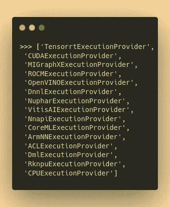
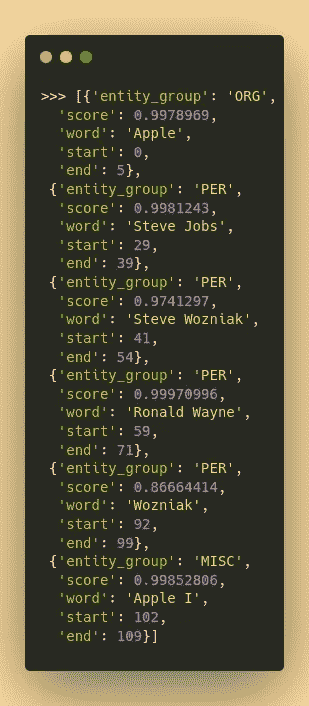
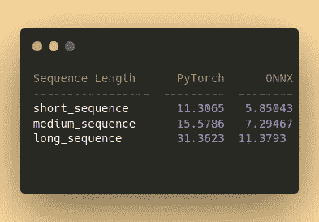
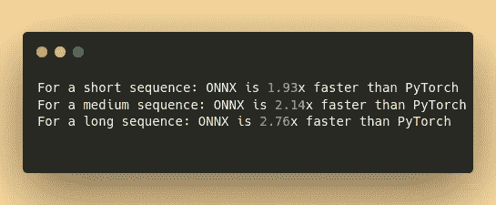

# 带 ONNX 的 NLP 变压器管道

> 原文：<https://towardsdatascience.com/nlp-transformers-pipelines-with-onnx-9b890d015723>

## 如何用 ONNX 构建真实世界的 NLP 应用，而不仅仅是对张量进行基准测试。


照片由 [T K](https://unsplash.com/@realaxer?utm_source=unsplash&utm_medium=referral&utm_content=creditCopyText) 在 [Unsplash](https://unsplash.com/s/photos/pipe?utm_source=unsplash&utm_medium=referral&utm_content=creditCopyText) 上拍摄

ONNX 是用于神经网络的机器学习格式。它是可移植的、开源的，在不牺牲准确性的情况下提高推理速度，真的很棒。

我找到了很多关于 ONNX 基准的文章，但是没有一篇文章提供了一种将它用于实际 NLP 任务的便捷方法。我也在抱抱脸的 [discord 服务器](http://hf.co/join/discord)上回答了很多关于 ONNX 的问题，以及如何最好的使用它进行 NLP。

这就是为什么我决定写这篇博文:我想帮助你用 ONNX 和令人敬畏的变形金刚管道得到最好的结果。

本教程将向您展示如何将 Hugging Face 的 NLP 变形金刚模型导出到 ONNX，以及如何将导出的模型与适当的变形金刚管道一起使用。我使用一个`Named Entity Recognition (NER)`模型作为例子，但是它并不局限于 NER。(在[这篇伟大的文章](https://umagunturi789.medium.com/everything-you-need-to-know-about-named-entity-recognition-2a136f38c08f)中有更多关于 NER 的内容)

所有代码片段都可以在相关的 [GitHub 库](https://github.com/ChainYo/transformers-pipeline-onnx)的专用笔记本中找到。所以不要担心复制它，只需在阅读这篇博文的同时克隆存储库并运行笔记本。

# 📦作业环境

首先，您需要安装所有必需的依赖项。建议使用隔离环境，以避免冲突。

该项目需要 Python 3.8 或更高版本。您可以使用任何您想要的包管理器。教程我推荐用 [*康达*](https://docs.conda.io/en/latest/miniconda.html) 。所有需要的依赖关系都列在`requirements.txt`文件中。要安装它们，请运行以下命令:

```
$ conda create -y -n hf-onnx python=3.8
$ conda activate hf-onnx $ git clone [https://github.com/ChainYo/transformers-pipeline-onnx.git](https://github.com/ChainYo/transformers-pipeline-onnx.git)
$ cd transformers-pipeline-onnx $ pip install -r requirements.txt
```

# 🍿将模型导出到 ONNX

对于这个例子，我们可以使用任何来自拥抱脸库的`TokenClassification`模型，因为我们试图解决的任务是`NER`。

我选择了`[dslim/bert-base-NER](https://huggingface.co/dslim/bert-base-NER)`模型，因为它是一个`base`模型，这意味着在 CPU 上的计算时间适中。另外，`BERT`建筑对于`NER`来说是个不错的选择。

Huggging Faces 的`Transformers`库提供了一种将模型导出为 ONNX 格式的便捷方式。更多细节可以参考[官方文档](https://huggingface.co/docs/transformers/serialization#exporting-transformers-models)。

我们使用上面提到的`bert-base-NER`模型和`token-classification`作为特征。`token-classification`是我们正在努力解决的任务。您可以通过执行以下代码来查看可用功能的列表:

检查特定模型类型的所有支持功能

通过调用转换脚本，您必须从本地目录或直接从拥抱脸的中枢指定模型名称。您还需要指定如上所示的特性。输出文件将保存在`output`目录中。

我们给`onnx/`作为输出目录。这是 ONNX 模型将被保存的地方。

我们将`opset`参数作为默认参数，它是在 ONNX 配置中为该模型定义的。

最后，我们还将`atol`参数设为默认值 1e-05。这是原始 PyTorch 模型和 ONNX 模型之间的数值精度容差。

下面是将模型导出为 ONNX 格式的命令:

```
$ python -m transformers.onnx \
    --model=dslim/bert-base-NER \
    --feature=token-classification \
    onnx/
```

# 💫将 ONNX 模型用于变压器管道

现在我们已经将模型导出为 ONNX 格式，我们可以将它用于 Transformers 管道。

过程很简单:

*   使用 ONNX 模型创建一个会话，允许您将模型加载到管道中并进行推理。
*   覆盖管道的`_forward`和`preprocess`方法以使用 ONNX 模型。
*   运行管道。

让我们首先导入所需的包:

所有需要的进口

## ⚙️用 ONNX 模型创建一个会话

使用 onnxruntime 创建会话

这里我们将只使用`CPUExecutionProvider`，它是 ONNX 模型的默认执行提供者。您可以为会话提供一个或多个执行提供程序。例如，您可以使用`CUDAExecutionProvider`在 GPU 上运行模型。默认情况下，会话将从列表中的第一个开始，使用计算机上可用的那个。

`Onnxruntime`提供了查看所有可用执行提供者的功能:

onnxruntime 中所有可能的执行提供程序



所有执行提供程序的列表

如您所见，对于每种用例及配置，都有许多可用的提供者。

## ⚒️用 ONNX 模型创建管道

现在我们已经有了一个可以使用 ONNX 模型的会话，我们可以对原始的`TokenClassificationPipeline`类进行重载来使用 ONNX 模型。

要完全理解正在发生的事情，你可以参考`[TokenClassificationPipeline](https://github.com/huggingface/transformers/blob/v4.17.0/src/transformers/pipelines/token_classification.py#L86)` python 类的源代码。

我们将只覆盖`_forward`和`preprocess`方法，因为其他方法不依赖于模型格式。

调整管道等级以适应 onnx 型号需求

## 🏃运行管道

我们现在已经设置好了一切，所以我们可以运行管道。

通常，管道需要一个标记器、一个模型和一个任务。我们将使用`ner`任务。

使用新的超额收费类别创建完整的管道

让我们看看是否可以运行管道并检查输出:

运行 ONNX 管道



ONNX 流水线输出

> **在这里，管道与 ONNX 模型运行良好！我们现在有一个与 ONNX 全面合作的 NER 管道。🎉**

查看可选的基准测试部分，了解它与原始 PyTorch 模型相比的性能，或者直接跳到结论部分，快速总结该过程。

# 🧪对整个管道进行基准测试(可选)

我们将通过使用 ONNX 模型和 PyTorch 模型测量管道的推理时间来进行基准测试。

我们首先需要加载 PyTorch 模型，并用它创建一个管道。

创建 PyTorch 管道

我们将使用相同的数据和 3 种不同的序列长度测试两条管道。

具有三种不同长度的基准序列

让我们比较 3 个不同序列长度的每个管道的推理时间。对于每个序列长度，我们将重复每次迭代 300 次，以获得更准确的基准，并将所有内容放在一个表中以比较结果

基准循环



基准测试结果

哇，看起来真棒！🎉

似乎对于每个序列长度，ONNX 模型都比原始 PyTorch 模型快得多。我们来计算一下 ONNX 模型和 PyTorch 模型的推理时间之比。



基准比率

**我们在长序列上几乎实现了 3 倍的加速！🎉**

我们甚至没有根据模型架构和模型运行的硬件进行任何优化，而 ONNX 可以做到这一点。

优化可能非常有用，但这是一个很深的话题，不能在这篇文章中讨论。但是很高兴知道您可以做到这一点，并且我们可以在未来的帖子中探索它。

另外，我们的测试是在 CPU 上进行的，但我见过的所有 GPU 上的基准测试甚至比 CPU 上的基准测试更令人印象深刻。查看[这篇伟大的文章](https://medium.com/microsoftazure/accelerate-your-nlp-pipelines-using-hugging-face-transformers-and-onnx-runtime-2443578f4333)了解更多关于不同架构和推理配置的基准测试。

# 📍结论

总而言之，我们已经用 ONNX 构建了一个完全可用的 NER 管道。我们已经将 PyTorch 模型转换为 ONNX，并对原始管道类进行了超额收费，以符合 ONNX 模型的要求。最后，我们用原始 PyTorch 模型对 ONNX 模型进行了基准测试，并对结果进行了比较。

值得注意的是，不幸的是 PyTorch 模型是和 ONNX 模型一起加载的。这是因为 Transformers 管道需要加载 PyTorch 模型，特别是为了模型的配置。

我正在寻找一种方法来避免 PyTorch 模型的加载，因为它可能会在某些系统上产生 RAM 问题。

我们用来使它工作的过程对于拥抱脸变形金刚库中可用的每个模型和任务都是相同的。

您唯一需要关心的是模型架构是否有针对 ONNX 实现的配置。你可以在文档中找到[的完整架构列表](https://huggingface.co/docs/transformers/serialization#onnx)。

如果您正在寻找的架构还没有实现，您仍然可以创建它并向 Transformers 库发出一个*拉请求*来添加它。这正是我几个月前为卡门贝干酪建筑所做的。你可以在变形金刚 GitHub 库上查看完整的 PR 。

我希望你觉得这篇文章有用而且有趣。如果您有任何问题或面临任何问题，请告诉我。我很乐意添加更多的例子和对其他 NLP 任务的支持，所以如果你有任何想法或要求，请告诉我！🤗

如有疑问或问题，请在 GitHub 或下面的评论中打开一个[问题。](https://github.com/ChainYo/transformers-pipeline-onnx/issues)

*P.S .我还计划添加另一个基准测试部分，以测试 ONNX 模型是否实现了与原始模型相同的结果(剧透:是的！).*