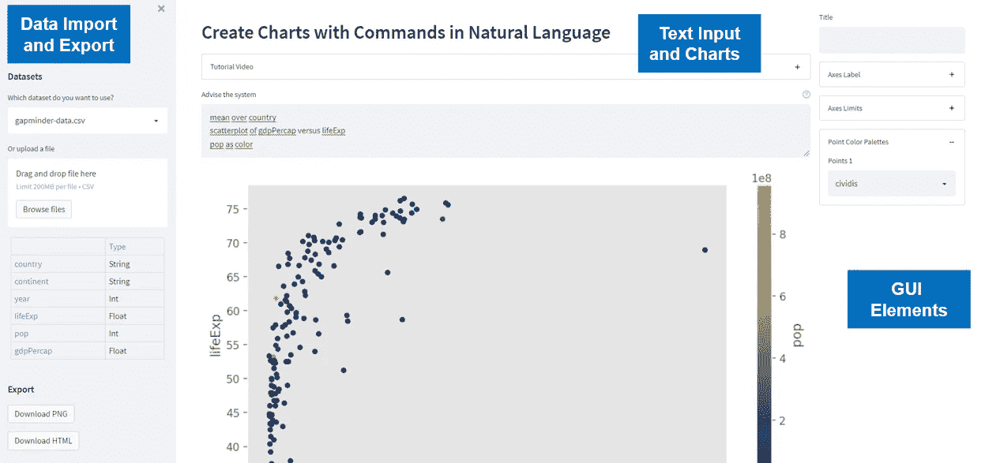
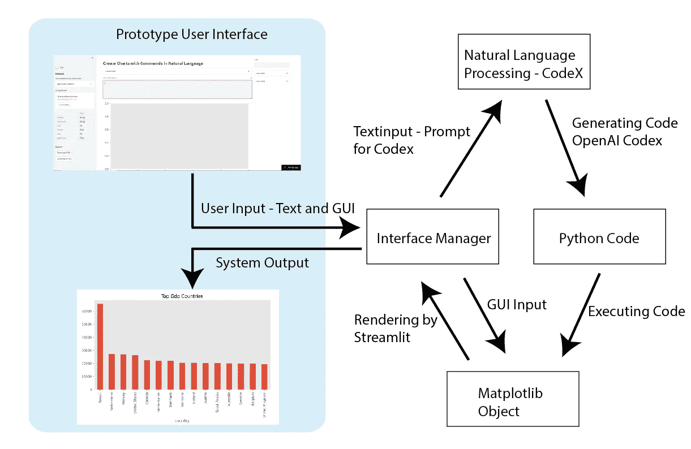
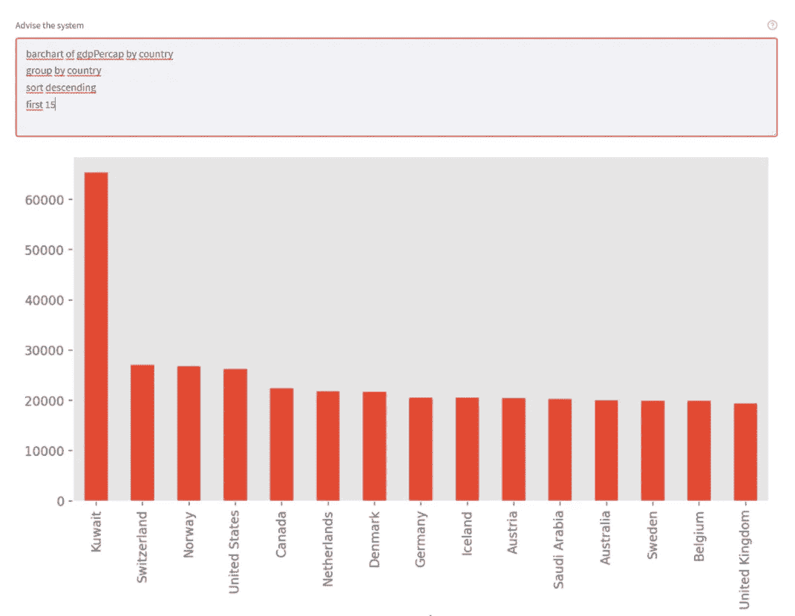

# NLP2Chart —自然语言中的信息可视化—第 2 部分

> 原文：<https://towardsdatascience.com/nlp2chart-information-visualization-in-natural-language-part-2-a325c5e636dc>

## 一个扩展的应用程序，使用 CodeX 用自然语言的命令创建图表

作者的界面/图片

在[之前的文章](/nlp2chart-9bc732719ba0)中，我展示了一个方法的原型，它允许使用自然语言的指令创建信息图和图表。在这篇文章中，我想给出一个扩展和修改的版本，并展示一些例子和用户一起研究的结果。

这项工作于 2022 年 7 月 19 日至 22 日在“奥地利维也纳技术大学”举行的第 26 届国际信息可视化会议(IV)上发表，论文发表在会议出版物上。

# 信息可视化软件中的自然语言接口

自然语言界面已经进入了可视化数据分析的软件产品。它们旨在帮助人们使用各种分析方法分析和可视化数据。商业软件“Tableau”的市场领导者和微软的“Power BI”在其当前版本中集成了相应的组件。

有了 Tableau 的“问数据”，你可以用常用语言输入一个问题，直接在 Tableau 里立刻收到答案。答案以自动数据可视化的形式出现，无需您手动拖放字段、调用菜单或理解错综复杂的数据结构。

微软的对应物叫做“Power BI 问答”。然而，获得正确的说明仍然是用户的一个主要障碍。更强大的语言模型可能会有所帮助。

近年来，通过对大型文本数据集进行预处理，基于 Transformer 架构的强大的新语言模型已经出现，主导了所有当前的 NLP 基准。这项工作的目的是探索数据可视化的 NLIs 是否以及以何种方式从这些模型中受益。为此，我基于 OpenAI Codex 模型创建了一个可视化软件原型。

 [## 开放法典

### 我们已经创建了一个 OpenAI Codex 的改进版本，我们的人工智能系统可以将自然语言翻译成代码，我们…

openai.com](https://openai.com/blog/openai-codex/) 

第二个原型实现了基于 NL 的数据可视化的基线管道。它使用开源的“[数据可视化自然语言”(NL4DV)](https://nl4dv.github.io/nl4dv/) 工具包来解释自然语言语句。该工具包将一个数据集和对应于该数据集的话语作为输入，返回一个 JSON 对象，该对象包含一个有序的 [Vega-Lite](https://vega.github.io/vega-lite/) 规范列表，可以作为输出呈现。

# 界面

为了测试在深度学习语言模型的帮助下生成图表的可能性，创建了一个 web 应用程序的原型，该原型允许使用文本输入创建数据可视化，然后使用上下文相关的调色板进行优化。文本命令用于定义可视化的基本结构，然后调色板可用于设置额外的规范，如线宽或颜色(见上图)。原型是一个混合主动性的可视化系统，允许通过图形用户界面(GUI)进行自然语言输入和直接操作交互。

对于数据处理，原型提供了上传 CSV 文件或通过选择框加载现有文件的可能性。在此之下，数据字段与其数据类型一起显示。作为导出选项，原型中提供了 PNG 图像和 HTML 导出。

除了可以观看简短的教程视频之外，屏幕的中央区域还提供了一个多行文本输入栏，在其中可以用自然语言输入指令。在这下面，显示生成的可视化。在一个原型变体中，这是一个 Matplotlib 图形，而在另一个原型变体中，这是一个 Vega-Lite 图表。

GUI 元素/作者提供的图片

除了文本命令之外，右栏还提供了一些 GUI 元素。可以指定标题、标注轴和设置限制。根据所创建的图表类型，会显示其他元素，如线宽、调色板或条形的颜色。

# 应用程序的架构

原型的两个版本都是用 Python 实现的 web 应用程序。在每种情况下都使用了框架“ [Streamlit](https://streamlit.io/) ”。数据可以 CSV 格式处理，并导出为 PNG 或 HTML 格式。这两种变体在 NLP 和可视化方面有所不同。下图显示了使用 CodeX 生成代码的版本的系统架构。

作者的系统架构/图像

不同部分的细节可以在文件中找到。

# 例子

为了说明和评估，我在基于证据的世界观上用来自 Gapminder.org[的数据测试了这个应用程序。测试人员必须完成以下练习:](https://www.gapminder.org/data/)

1.  为数字特征创建直方图
2.  使用条形图绘制每个洲的数字特征。
3.  借助条形图显示每个国家的 GDP。前 15 个国家应该以降序显示。
4.  创建一个饼图，显示世界各大洲的人口分布。
5.  创建一个图表，显示所有国家平均预期寿命的时间进程。使用一个折线图。
6.  借助散点图显示一个国家的人均 GDP 和预期寿命之间的关系。此外，使用反映人口数量的颜色代码。
7.  使用气泡图显示一个国家的人均 GDP 与预期寿命和人口数量之间的关系。

作者的图表输出/图像示例

实验过程的细节可以在论文中找到。

# 测试结果

参与者给深度学习语言模型的原型的平均 [SUS 分数](https://www.usability.gov/how-to-and-tools/methods/system-usability-scale.html)为 71.1，给 NL4DV 的版本的平均分数为 68.2。得分≥ 68 被认为是可用性良好的指标。

评估表明，深度学习模型具有表达性文本输入的潜力，但并不总是产生完全可预测的结果，因此可能会使用户困惑。

# 将来的

我使用的 Codex 语言模型是一个用于生成通用源代码的模型，并没有针对我们的任务进行优化。目前，可以通过 API 微调 GPT3 的自然语言变体，因此模型可以更好地适应任务。这对于法典模式来说还不可能。一旦这成为可能，我期望我的方法会有很大的进步，因为在这里将有可能专门用源代码来创建信息图，从而更有针对性的图表。

该论文将很快在 IEEE Xplore 数字图书馆[获得 https://IEEE Xplore . IEEE . org/xpl/con home/1000370/all-proceedings](https://ieeexplore.ieee.org/xpl/conhome/1000370/all-proceedings)

代码@github:

【https://github.com/astoeckl/NLP2Chart2 