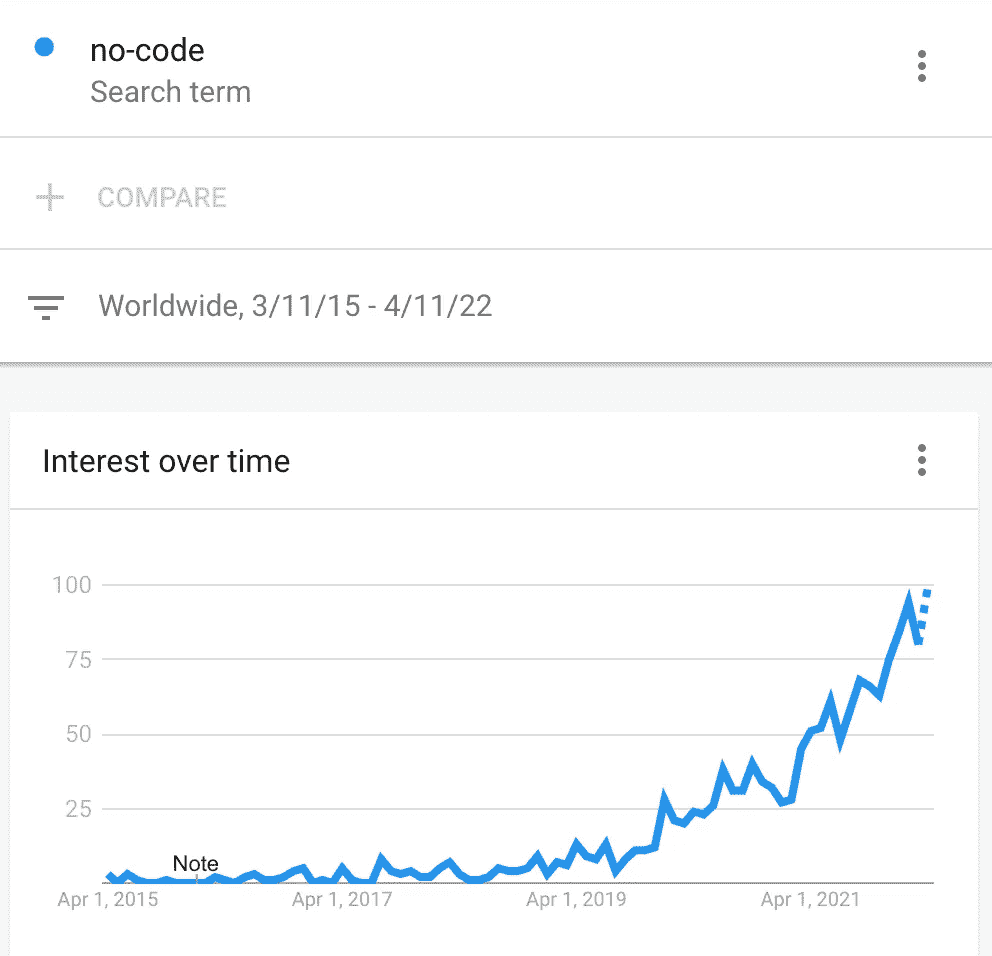

# 非营利组织中的无代码数据创新

> 原文：<https://towardsdatascience.com/no-code-data-innovations-in-non-profit-organizations-391ae604da5a>

## *机遇、障碍和前进的步伐*

天津滨海图书馆。图片由作者提供。

知识工作者利用*领域*或*内容*专业知识，通过解决问题和做出关键决策来创造价值。非营利组织的大多数员工都符合这个定义。正如 [Castle 在最近 Forbe 的文章](https://www.forbes.com/sites/sisense/2021/12/01/who-are-knowledge-workers-and-how-do-we-enable-them/?sh=51e8e52a6018)中所解释的，知识工作者依靠信息和技术工具来成功和高效地完成他们的工作。无代码运动正在帮助重塑知识工作行业，让知识工作能够开发低成本、安全、高质量的数据产品和信息系统，而无需编写一行代码。受创造力和创新的限制，知识工作者可以利用他们的内容专业知识和对业务流程的深入了解来创建定制的软件解决方案，以支持他们的信息需求和决策。通过最少的培训和对这些无代码平台的访问，知识工作者可以轻松地创建:

*   内容管理系统
*   客户/顾客管理系统
*   项目管理系统
*   数据仪表板和数据集成
*   自动化管理报告
*   电子商务网站
*   时间跟踪系统
*   库存系统
*   捐助者数据库
*   赠款管理系统

内容专业知识与技术解决方案的无缝集成是一项颠覆性创新，因为知识工人不再受传统且往往支离破碎的 IT 服务模式的束缚。例如，非营利组织面临相当多的行政报告要求。用于报告的传统技术工具和工作流通常效率非常低，尤其是在处理非集成数据流时。借助无代码工具，知识工作者可以创建集成的数据流、自动化流程和交互式数据仪表板。无代码工具不会取代知识工作者，但可以从他们的日常工作流程中消除重复和令人麻木的任务，让他们有更多时间将专业知识应用于计算机无法解决的问题。

无代码工具也为传统的 it 服务提供了退出策略。许多非营利组织与外部服务提供商签订合同，开发和维护面向公众的服务和资源网站。有了无代码工具，非营利组织现在可以独立开发和维护专业网站，而成本只是签约服务的一小部分。由于许多无代码网站是建立在一个简单的电子表格上的，更新一个无代码网站比向一个网站开发者提出请求更加有效和直接。

# 无代码是一种时尚吗？

在过去的几年里，无代码技术呈现出爆炸性的增长。除非你密切关注技术行业，否则你甚至可能不知道无代码运动。一个简单的互联网搜索“无代码”和密切相关的概念“低代码”将显示许多新闻，报告和软件选项的链接。

从谷歌趋势看无代码的增长。图片由作者提供。

几乎每个主要的技术公司现在都提供一些无代码软件服务。这些产品正在不断发展，变得越来越容易使用。

*   [谷歌应用表](https://cloud.google.com/appsheet)
*   [亚马逊网络服务代号](https://aws.amazon.com/codestar/?trk=b6fc9015-864f-4900-8dac-c8b864c8f671&sc_channel=ps&sc_campaign=acquisition&sc_medium=ACQ-P|PS-GO|Non-Brand|Desktop|SU|Developer%20Tools|Solution|US|EN|DSA&ef_id=CjwKCAjwo8-SBhAlEiwAopc9W2U0tFUnn8vNrqA29t5jN6R3BaUG4CoajfhIASqUTKDDWLEop6KTVxoCbKsQAvD_BwE:G:s&s_kwcid=AL!4422!3!579296419563!!!g!!)
*   [微软电力应用](https://azure.microsoft.com/en-us/solutions/low-code-application-development/#overview)

虽然这些公司正在推动变革，并坚定地确立这些工具的合法性，但它们并不是无代码运动的主导者。一个主要的无代码平台 Softr 的 Mariam Ispiryan 最近发表了一篇博客文章，提供了 41 种不同的无代码工具的分类[,用于创建网站、网络应用、移动应用、工作流自动化和电子表格/数据库。鉴于最近对无代码平台的大量投资和估值，将无代码视为时尚是短视的:](https://www.softr.io/learn/no-code/no-code-tools)

*   软件初创公司 Airtable 在最新一轮融资中估值达到 110 亿美元，Salesforce 和 Michael Dell 成为投资者
*   "[概念达到 100 亿美元估值](https://pitchbook.com/newsletter/notion-hits-10b-valuation#:~:text=Notion%20has%20raised%20%24275%20million,2020%2C%20according%20to%20PitchBook%20data)"
*   "[关于 nocode 市场，WebFlow 的 21 亿美元估值告诉了我们什么？](https://www.cmswire.com/information-management/what-does-webflows-21b-valuation-tell-us-about-the-nocode-market/)
*   " [Softr 筹集 1350 万美元，打造全球最大的无代码应用生态系统](https://www.softr.io/blog/worlds-largest-ecosystem-for-building-no-code-apps)"
*   “泡泡的 [$1 亿美元 A 轮:下一步是什么？](https://bubble.io/blog/bubble-series-a-100m/)

# 为什么非代码工具没有被非营利组织广泛采用？

尽管非营利组织有提高业务流程效率和允许内容专家更有效地使用数据的潜在机会，但许多组织在使用无代码技术进行创新时面临相当大的障碍。让我们考虑一下我在与寻求创新或拥有可以从创新中受益的业务流程的组织合作时遇到的常见障碍。

## 为什么要修理没坏的东西？

这个问题在拥有 IT 部门的组织中最常见，尤其是当 IT 专家对 IT 解决方案拥有独占控制权，而对日常业务流程缺乏深入了解时。从 IT 的角度来看，现有的技术正在发挥作用——也就是说，系统处于在线状态，数据是“安全的”并且所需的工作正在完成。因此，为什么要修理没坏的东西呢？

历史上衡量成功的 IT 标准适用于更早的时代。然而，这些系统通常不能满足当今的需求。负责本组织实际业务运作和任务的工作人员面临越来越大的压力，要展示他们工作的影响。然而，非营利组织的数据系统和工作流程从来就不是为衡量影响和结果而设计的。因此，知识工作者将宝贵的时间花费在高度重复和耗时的数据任务上，而不是运用他们的专业知识从数据中获得可操作的见解。

## 沉没成本谬论

[沉没成本谬误](https://en.wikipedia.org/wiki/Sunk_cost)是一种认知偏差，导致人们将资源投入到没有效果的事情中。当组织认为以前的投资(即沉没成本)证明未来的支出是合理的时，他们就会受到这种偏见的影响。例如，一个在传统网络技术上进行了大量投资的非营利组织可能不愿意探索新技术，即使新的解决方案可能更便宜、更容易管理。Atlassian，像吉拉和特雷罗这样的无代码工具的幕后公司，有一篇关于[理解和克服技术投资的沉没成本效应](https://www.atlassian.com/blog/platform/sunk-cost-fallacy)的优秀文章。

## "好吧，但是安全性、安全性和可持续性呢？"

许多为组织制定技术决策和政策的 IT 专家可能并不了解无代码技术。因此，关于无代码技术最常见的问题涉及安全性、安全性和可持续性问题，特别是因为无代码工具是基于云的软件服务提供商。简单地在互联网上搜索“无代码安全问题”会产生几篇文章，提出几个基本问题，包括(但不限于):

*   你怎么知道服务提供商会保护我们的数据和数字资产？
*   你怎么知道这些系统是安全可靠的？
*   我们如何控制组织内部的访问？
*   我们如何避免软件锁定？
*   如果提供商倒闭了会发生什么？

事实上，这些是基本问题，应该成为讨论的起点，而不是创新交易的破坏者。当系统地与无代码解决方案进行比较时，这样的对话揭示了现有遗留系统在安全性、安全性和可持续性方面的差距和问题。无代码解决方案导致的安全问题更有可能来自用户的错误配置，而不是工具或软件服务提供商，这突出了在无代码生态系统中建设组织能力以支持安全的重要性。

## 组织能力

许多组织无法创新他们的数据系统和工作流，因为他们缺乏变革的能力。在依赖遗留系统而没有接触新工具和技术的组织中，能力问题尤其明显。因此，许多知识工作者不知道新技术和工作流程如何帮助他们更聪明地工作，而不是更努力地工作。人们不知道他们不知道的事情。现有系统的低效率进一步增加了变革能力的复杂性，也就是说，知识工人几乎没有时间投资学习新工具和创建新工作流。因此，改变的想法是压倒性的，而不是令人兴奋的。组织能力无疑是非营利组织内部数据创新最重要的杠杆点之一。

# 向前迈进一步

使用传统技术工具和 it 服务模式的非营利组织无法再忽视快速变化的技术环境。谷歌产品营销经理 Jennifer Cadence 在一篇关于[用无代码解决方案赋权非营利组织](https://cloud.google.com/blog/products/no-code-development/expanding-immunization-access-with-no-code-and-google-cloud)的博文中解释道:

> 企业无法承受被过度官僚化的流程所束缚的解决方案，因为业务线员工无法影响真正的进展。但他们还需要在单个团队中开发的解决方案是可管理的和安全的，没有团队创建自己的应用程序和服务时经常出现的所有“影子 IT”风险。

最明显的第一步是建立对使用数据和信息技术的新方式的认识，最终关注对组织使命最有益的东西。领导团队需要促进一种鼓励创新和交流新思想的组织文化。在传统 IT 服务模式中保持安全的 IT 专业人员将需要重新定义他们的角色，更加关注知识工作者的能力建设，以帮助确保他们的工作流和数据系统安全可靠。知识工作者最终需要支持和资源来学习无代码工具，以及如何帮助他们更聪明而不是更努力地工作。

我是密歇根大学的社会工作教授，对帮助学生做好准备和帮助非营利组织利用数据和信息技术更聪明地工作感兴趣，而不是更努力。如果你有兴趣学习更多实用的创新策略，欢迎关注我。