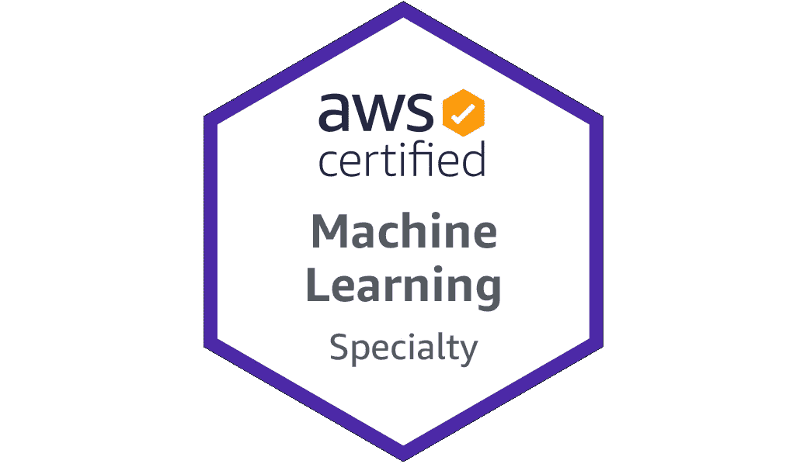
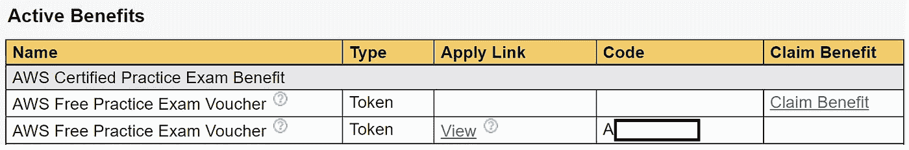
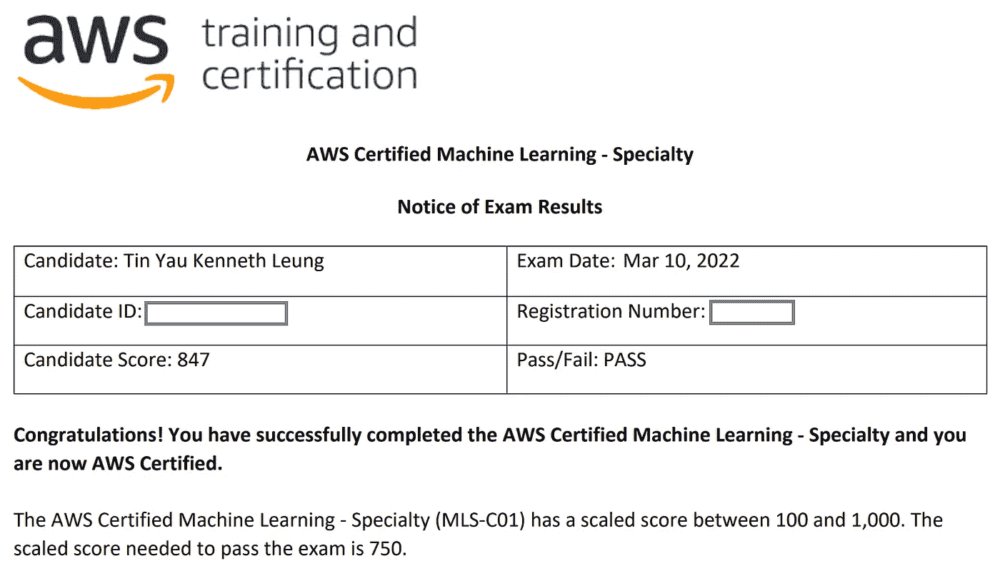

# 通过 AWS 认证机器学习专业考试的简明指南

> 原文：<https://towardsdatascience.com/no-frills-guide-to-passing-the-aws-certified-machine-learning-specialty-exam-55624579353f>

## 获得亚马逊网络服务(AWS)机器学习专业认证的高效方法

照片由 [Unsplash](https://unsplash.com?utm_source=medium&utm_medium=referral) 上的 [Dmitry Ratushny](https://unsplash.com/@ratushny?utm_source=medium&utm_medium=referral) 拍摄

我最近参加并通过了 [**AWS 认证机器学习专业**](https://aws.amazon.com/certification/certified-machine-learning-specialty/) (MLS-C01)考试，以验证我在机器学习方面的专业知识以及在云上实现它的能力。

虽然有许多在线学习途径，但大多数都过于冗长，并且充斥着过多的选项和资源。这与我想要的相反:用最少的努力和时间通过测试。

因此，我开发了一个学习路径，只包含成功应对考试的**基本资源**。这篇文章描述了我采用的简单方法，以及一个有用的免费和付费实践资源列表。

AWS 认证机器学习专业徽章|作者图片

# 内容

> ***【1】***[*本指南是否适合你*](#fdae)***【2】****[*循序渐进指南*](#5298)***(3)***[*考试提示*](#587f)*

# *(1)本指南是否适合你*

*在我们开始之前，让我们看看这个指南是否适合你。此学习路径专为以下人群设计:*

1.  ***扎实的数据科学和机器学习基础知识** 你应该对机器学习概念有很强的理解，并且最好已经在实际项目中应用了它们。这意味着您应该熟悉常见的数据科学概念(例如，回归、可视化、预处理、神经网络、正则化、损失函数、决策树、XGBoost 等)。).*
2.  ***具备 AWS 服务的基本经验或之前已获得 AWS 认证** 虽然您不需要丰富的 AWS 专业知识，但您最好具备 AWS 实践经验，因为该考试不适合初学者。如果你此时零 AWS 经验，可以从 [**AWS 认证云从业者**](https://aws.amazon.com/certification/certified-cloud-practitioner/) 考试开始:*

* * 

# *逐步指南*

*下面是我备考的**三个**主要步骤，用了不到**两周**的时间完成。*

## *步骤 1 — AWS 示例问题*

*— — — —
所需时间: **1 天** **|** 费用:免费
— — — — —*

*了解考试内容至关重要，这可以通过首先试用 [**免费 AWS 样题**](https://d1.awsstatic.com/training-and-certification/docs-ml/AWS-Certified-Machine-Learning-Specialty_Sample-Questions.pdf) 来实现。这一步让你对所提的问题有所了解，并设定对考试难度的预期。*

*这些样题灌输了一种谦卑感，因为它比我想象的要复杂，并且提醒我不要低估考试。*

*在本次准备结束时，我相信您下次再次访问这些示例问题时能够回答它们。*

## *步骤 2 — Udemy: AWS 认证机器学习专业 2022*

*— — —
所需时间:~ **7 天** **|** 费用:~ 18 美元
— — — — —*

**免责声明:本文非赞助。**

*下一步是报名参加结构化学习计划的在线课程。 [**AWS 认证机器学习专业 2022 —动手**](https://www.udemy.com/course/aws-machine-learning/) 课程是最受欢迎和最受欢迎的课程之一，所以这是我选择的课程。*

*记住只在 Udemy flash 销售期间购买课程，因为未打折的价格可能相当高。我以大约 18 美元的价格买下了它。*

*该课程组织良好，易于理解，内容全面，同时为考试主题提供了足够的深度。以下是你在学习过程中的一些有价值的提示:*

*   *在课程提供的 pdf 幻灯片中积极记笔记(如添加便笺)。*
*   *跳过**基本**机器学习概念的大块内容来节省时间，因为你应该已经熟悉它们了。把重点放在你更高级或者不太熟悉的机器学习内容上。*
*   *在第一轮浏览幻灯片时，重点是理解概念。在随后的几轮修订中，更多地强调记忆幻灯片中的关键细节，例如，每个高级 AWS 机器学习服务预期的输入数据类型。*
*   *如果你使用 Trello，复制这个[公告牌](https://trello.com/b/Sx6lJzy8)(由 [Kush Bhatnagar](https://medium.com/@kushbhatnagar86?source=post_page-----c05b97c4fd5-----------------------------------) 创建)，里面有抽认卡和自我修改的笔记。*

*一旦完成，你将获得 AWS 机器学习主题的优秀理论知识。*

## *第三步——大量练习*

*— — —
所需时间: **~5** 天 **|** 费用:**免费**(大部分)
— — — — — —*

*这最后一步是最重要的一步——回答尽可能多的练习题。*

*这些模拟测验有助于巩固你的理论知识，确定你可能薄弱的领域，并为实际考试建立你的精神耐力。*

*我参加了免费和付费的模拟测试，如下所示:*

## *自由实践*

*   *[***AWS 考试准备情况***](https://explore.skillbuilder.aws/learn/course/27/exam-readiness-aws-certified-machine-learning-specialty)
    AWS 技能构建器平台中有大量的问题用于评估您的考试准备情况，其中包括 ***模块 7/9:学习问题中的一组优秀问题。****
*   *[***AWS 认证机器学习专业(实践)***](https://www.aws.training/Certification)这个在 AWS 认证门户的 60 分钟的考试模拟了实际考试。如果您之前已经完成了 AWS 考试，那么它是免费的(通过免费的实践考试代金券)。您可以在 ***福利*** 页签中找到该凭证。我发现模拟考试比实际考试更难，所以如果你在这次练习中取得好成绩，你就成功了。*

**

*如果您以前参加过 AWS 认证，您可以兑换一张免费的实践考试优惠券|作者图片*

*   *[***考前培训***](https://www.testpreptraining.com/aws-certified-machine-learning-specialty-free-practice-test)
    十道免费样题*
*   *[***激活功能***](https://theactivationfunction.com/2020/06/03/aws-certification-quiz-4/)
    八道免费样题*
*   *[***whiz labs***](https://www.whizlabs.com/learn/course/aws-certified-machine-learning-specialty/281/quiz/15001/ft/)
    15 题自由练习测试(但需要先创建账号)*
*   *[***考试题目***](https://www.examtopics.com/exams/amazon/aws-certified-machine-learning-specialty/view/)
    本网站包含大量自由练习题。然而，许多问题的答案往往是不正确的。您应该查找 AWS 资源或查看对话主题，以确定社区讨论的正确答案。*
*   *[***AWS 样题***](https://d1.awsstatic.com/training-and-certification/docs-ml/AWS-Certified-Machine-Learning-Specialty_Sample-Questions.pdf)
    再来一遍第一步的样题，看看自己进步了多少！*

## *有偿实践*

*   *[***TutorialsDojo***](https://portal.tutorialsdojo.com/courses/aws-certified-machine-learning-specialty-practice-exams/)(~ USD $ 17)
    虽然在各种问题模式中可能会有一些重复，但还是有几组非常好的问题可供选择。*

*除了 TutorialDojo，我没有为其他练习题额外付费。我还惊喜地看到实际考试中出现了几道练习题。*

*以下是一些准备技巧:*

*   *保存你难以回答的问题(例如截图),以便你可以随时修改它们。*
*   *在练习问题时，请积极参考 **Udemy 课程幻灯片、** [**AWS 白皮书—AWS 服务概述**](https://d1.awsstatic.com/whitepapers/aws-overview.pdf) 和 [**AWS 文档**](https://docs.aws.amazon.com/) 。检查并正确回答问题比猜测你的答案要好。当然，当你继续做更多的练习题时，你应该减少查阅资料的频率。*
*   *探索 [**AWS 认证机器学习考试指南**](https://d1.awsstatic.com/training-and-certification/docs-ml/AWS-Certified-Machine-Learning-Specialty_Exam-Guide.pdf) 看看你是否理解考试内容。*
*   *使用 **TutorialsDojo** 期末考试和 **AWS 实践考试**作为考试条件下的模拟考试。*
*   *没有必要知道所有的答案才能通过考试，所以不要给自己增加不必要的压力！*

# *(3)考试提示*

*考试包括 65 道选择题，要求在 3 小时内完成。*

*以下是针对这种机器学习考试的一些重要信息:*

*   *考试有**四个领域**:数据工程(20%)、探索性数据分析(24%)、建模(36%)、机器学习实现与操作(20%)。*
*   *除非你有在 AWS 上实现 ML 解决方案的丰富经验，否则**工程和运营问题**将会更具挑战性。如果你因此花更多的精力去理解诸如 IAM 策略、生命周期配置、Kinesis 系列、批处理作业、AWS 数据同步、部署容器等主题，将会有所帮助。*
*   *这些问题可能很长，因为它们在提出实际问题之前描述了一个业务场景。确保你以适当的速度仔细阅读问题，理解上下文。没有必要匆忙，因为有足够的时间在 3 小时内完成测试。*
*   *对于那些难住你的问题，尽最大努力**排除最没有意义的选项****，然后从剩下的选项中做出你最大的猜测。***
*   ***与高级人工智能服务相关的问题很容易得分，但你需要知道它的复杂性。一个很好的例子是，**Amazon Connect 的隐形眼镜**可以执行情感分析，并自动对来电进行分类，因此**不需要**为这些任务引入 Amazon understand。***

# ***(4)结论***

***有了这个 3 步指南，我第一次尝试(在不到两周的准备时间内)就以 **847** 的高分通过了 AWS 机器学习专业考试。***

******

***作者图片***

***准备工作最有收获的方面是更好地掌握了在 AWS 上实现机器学习解决方案。我希望你也会有同样的感觉！***

# ***在你走之前***

***欢迎您来到**，与我一起踏上数据科学学习之旅**。跟随此[媒体](https://kennethleungty.medium.com/)页面并查看我的 [GitHub](https://github.com/kennethleungty) 以了解实用教育数据科学内容。同时，祝你考试顺利！***

***   ***