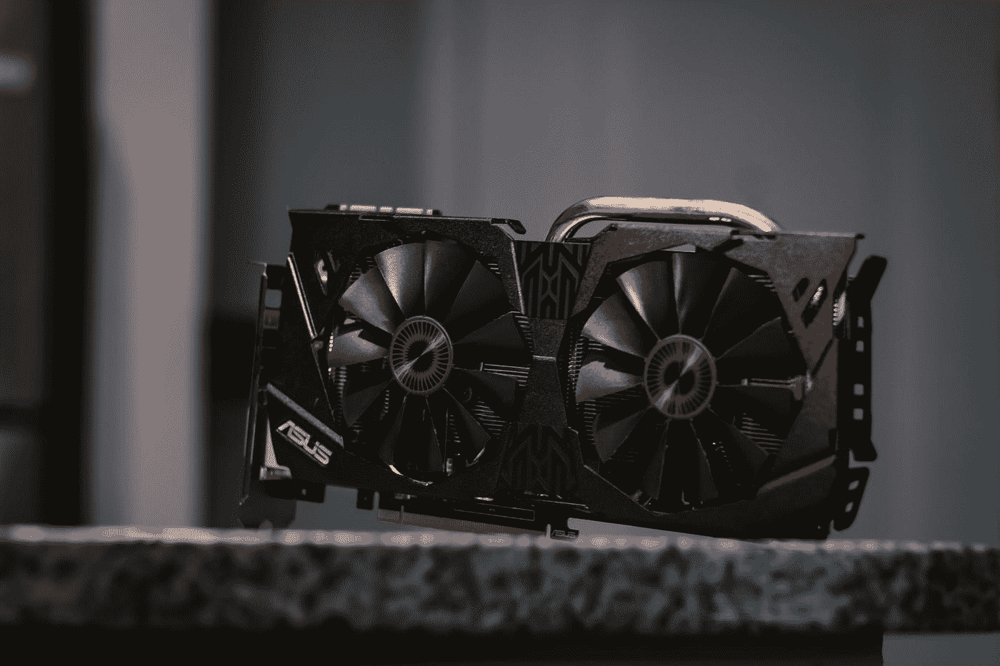
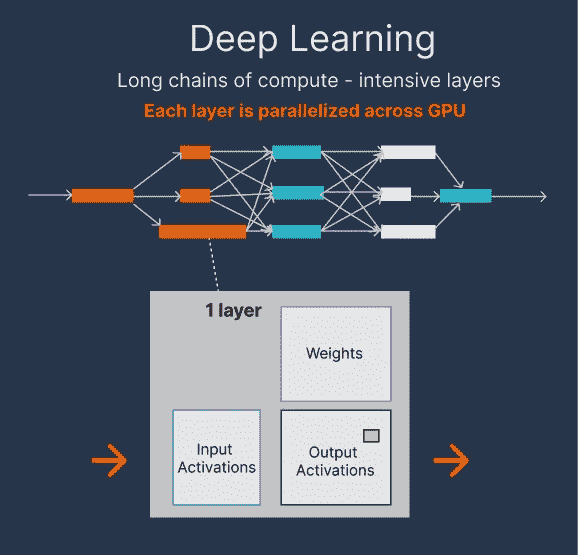
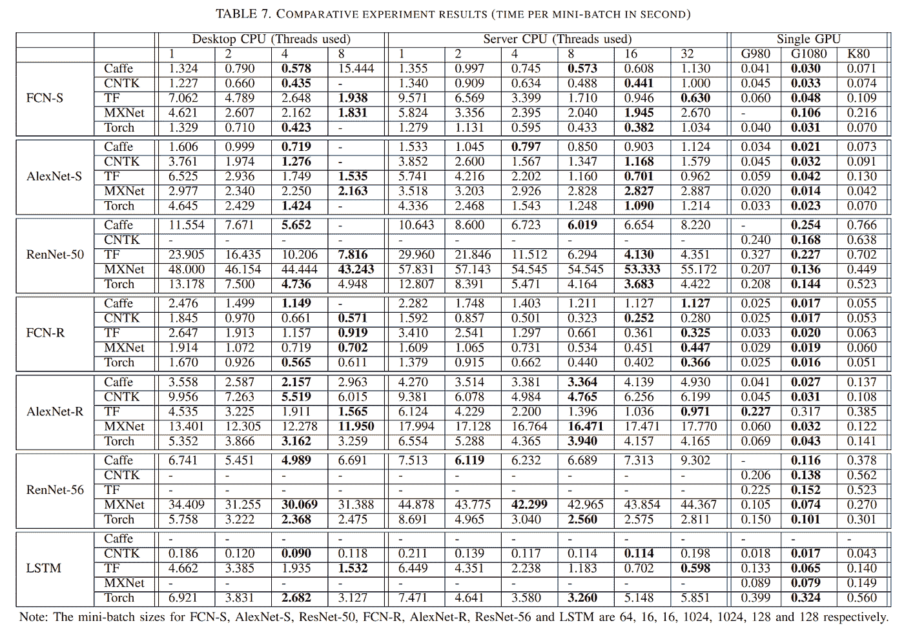

# 没有可用的 GPU，现在怎么办？

> 原文：<https://towardsdatascience.com/no-gpus-available-what-now-b9c01108ca58>

约瑟夫·格雷夫在 [Unsplash](https://unsplash.com?utm_source=medium&utm_medium=referral) 上的照片

## 如何解决 GPU 短缺的问题

图形处理单元(GPU)已经成为当今 MLOps 生态系统不可或缺的一部分，[随着越来越多的公司在生产中运行人工智能模型](https://info.kpmg.us/news-perspectives/technology-innovation/thriving-in-an-ai-world.html)，对 GPU 的需求也大幅上升。在毕马威 2021 年的研究中，[在人工智能世界中茁壮成长](https://info.kpmg.us/news-perspectives/technology-innovation/thriving-in-an-ai-world.html)，来自许多行业的商业领袖指出，人工智能在他们的组织中至少具有适度的功能，包括:工业制造(93%)、金融服务(84%)、科技(83%)、零售(81%)和生命科学(77%)。

然而，在过去的几年里，GPU 的供应已经跟不上需求的增长。物理 GPU 几乎经常售罄，大型云提供商似乎也无法满足需求，导致 GPU 等待时间过长。**但是为什么对 GPU 的需求那么高？如果你需要，你能做些什么呢？**

# 为什么 GPU 如此重要？

要理解为什么 GPU 对操作机器学习模型如此重要，最好看看 GPU 是为什么类型的应用而制造的。Owens *等人*在他的论文[“GPU 计算”](https://escholarship.org/content/qt0cv1p1nc/qt0cv1p1nc.pdf)中列出了 GPU 应用的以下特征:

*   **计算量大**
*   **高并行度**
*   吞吐量比延迟更重要

换句话说，GPU 非常擅长执行成千上万的并行线程，以快速解决具有大量内在并行性的大型问题。每个单独的计算可能比在 CPU 上慢一点，但因为一个 **GPU 可以并行处理这么多，所以整个问题解决得更快。**

由于大多数机器学习算法基本上是一堆线性代数运算的串联，所以它们非常适合并行化。典型的神经网络由互连层的长链组成(见下图)。虽然在一个完整的网络中有大量的计算，但它可以被分解成更小的、顺序相关的工作块层。正因为如此，神经网络可以真正利用 GPU 的能力来达到比 CPU 更高的速度。

图片由作者提供，灵感来源:Choquette 等人(2021)*[*《NVIDIA A100 张量核心 GPU:性能与创新》*](https://ieeexplore.ieee.org/document/9361255) *。此图概述了深度学习网络映射到 GPU。**

*[石*等人*](https://arxiv.org/abs/1608.07249) 实际上是在 CPU 和 GPU 之间进行了一次彻底的深度学习的基准测试。即使他们的论文来自 2017 年，他们的结论仍然成立。在深度学习方面，GPU 的表现优于 CPU。你可以在下图中看到他们的结果表。每个类别中最快的时间用粗体标出。*

**

**图片由石等人提供。al (2017)* [*【标杆最先进的深度学习软件工具】*](https://arxiv.org/abs/1608.07249) *。以粗体显示，您可以在每个类别(台式机 CPU、服务器 CPU、单个 GPU)中找到最快的时间。GPU 胜过 CPU。**

# *当你需要一个 GPU 时，获得它的困难*

*随着 GPU 对于 ML 工作负载如此完美，以及越来越多的公司使用 AI，需求大幅上升。这种需求的增长使得现在很难获得 GPU。当您想要在 GPU 上运行工作负载时，大致有两种选择:*

1.  *买个**物理 GPU***
2.  *使用**云 GPU** (例如在 AWS 或谷歌，或通过特定的机器学习(ML)平台，如 [UbiOps)](https://ubiops.com/docs/ubiops_tutorials/ready-deployments/gpu-tutorial/gpu-model/)*

*物理图形处理器非常昂贵，而且也经常售罄。这是由所谓的 [*黄牛*造成的，他们一旦在网站上提供，就会用机器人买下所有可用的 GPU](https://medium.com/we-are-the-gamerhash/gpu-shortage-and-how-to-deal-with-it-gamerhash-we-have-a-problem-18e4b2b9a2de)。正因为如此，你只能从这些黄牛手里买 GPU，除非你比机器人还快。黄牛以比原价高出 200% 的[价格转售产品，价格高得离谱。](https://computerinfobits.com/what-is-gpu-scalping/)*

*随着物理 GPU 的天文价格，云 GPU 成为一个更有趣的选择。你通常只需为使用 GPU 的时间付费，所以如果你的工作负载不运行太长时间，这通常比你自己购买 GPU 便宜得多。云 GPU 是高度可扩展的，它们最小化成本，并且它们还清理本地资源。当你的模型在一个云数据中心的 GPU 上运行时，你可以继续使用你的笔记本电脑。*

*然而，云一直难以跟上 GPU 需求的增长。随着需求的增加，但供应的增加太少，用户最终需要等待 GPU 变得可用。Gigaom 的人工智能分析师 Anand Joshi 研究了这个问题，并注意到许多用户正在经历比几年前更长的等待时间。如果您在生产中有一个需要在几秒钟内做出响应的机器学习(ML)模型，如果您甚至不能在一分钟内获得可用的 GPU，这可能会成为一个大问题。在这种情况下，您可能需要从云中购买 24/7 可用的专用 GPU，但也因此贵了很多。*

# *如何解决 GPU 短缺的问题？*

*假设您的模型需要一个 GPU，但您无法获得物理 GPU，并且您在云中的排队等待时间太长，您有什么选择？*

*正如我之前提到的，您可以从任何云提供商那里购买专用 GPU(您可以按月获得 GPU，而不是按小时)，但这对您的组织来说可能太贵了。**您还可以尝试在不同的云中轮询可用的 GPU，并选择提供 GPU 最快的一个。**但是，您必须处理多种云，并使您的基础架构与云无关。这太麻烦了。*

***另一种选择是采用专注于 GPU 的云环境，如** [**埃舍尔云**](https://www.eschercloud.com/) **(由 NVIDIA 支持的欧洲云)，或**[**Paperspace Core**](https://www.paperspace.com/core)。但是，这对您的组织来说可能是多余的，尤其是如果您还需要常规的 CPU 或其他与 MLOps 相关的特性。然而，如果你专注于图像或视频处理，它可能是一个很好的选择！*

*我想强调的最后一个选项是使用支持 GPU 的机器学习操作(MLOps)平台，如 [UbiOps](https://ubiops.com/product/) 。它们为 MLOps 提供了额外的功能，并且通过服务级别协议(SLA ),您可以对 GPU 的可用速度有一定的发言权。UbiOps 是一个运行在云中的 MLOps 平台。它将大部分后台 It 基础设施抽象化，因此您无需担心。UbiOps 还提供可扩展的 GPU 支持，它可以在任何云上运行。他们还与 Escher Cloud 和其他欧洲云建立了合作伙伴关系，如果你是一家处理敏感数据的欧盟公司，这将非常方便。当然，我在 UbiOps 工作，所以我有一点偏见，所以请随意测试一下，亲自看看！*

# *结论*

*鉴于目前的需求和公司计划将越来越多的人工智能融入他们的业务，我认为可以肯定地说，GPU 在一段时间内仍将稀缺。尽管如此，还是有办法得到 GPU 的。*

*无论您是购买自己的产品，使用云产品，还是通过 MLOps 平台使用，都有多种选择！哪种选择最适合取决于您的用例以及您愿意等待 GPU 可用多长时间。*