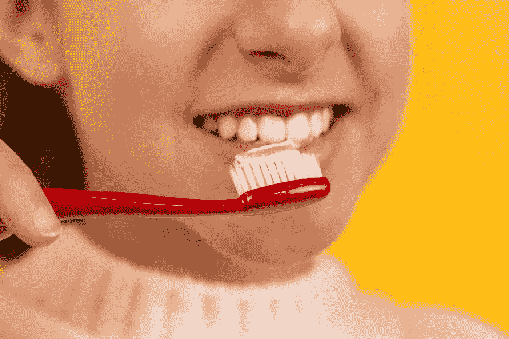
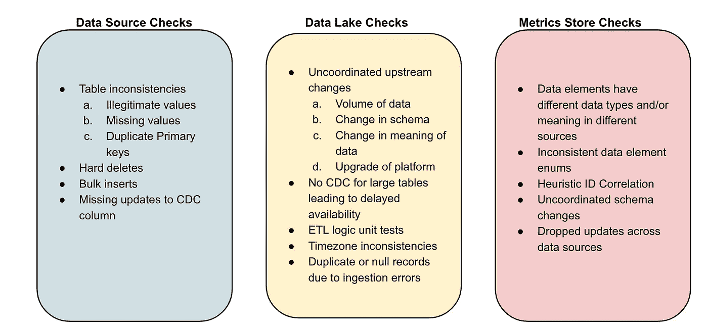

# 数据质量不能仅靠工具来解决，要解决数据卫生问题

> 原文：<https://towardsdatascience.com/no-magical-toothpaste-for-data-quality-cavities-76d21ff9278f>

## 大规模数据卫生的 10 个必备流程！

确保良好的数据质量类似于牙齿卫生。没有牙膏或牙刷能神奇地确保没有蛀牙。相反，定期刷牙和使用牙线的*过程是确保没有蛀牙的关键。数据质量也是如此——没有定义良好的流程，即使是最好的工具也是无用的！*

**

*图片来源: [Unsplash](https://unsplash.com/photos/iYQgnaWD8uw)*

> *在过去几年领先的数据和人工智能产品中，这个博客分享了我的经验，这些经验可以帮助你开始在你的平台中建立数据卫生。*

# *10 个数据卫生流程*

*这些过程分为三类:*

****卫生流程@数据源****

**1。在应用层*中验证数据的过程:在将值添加到数据库之前验证它们。例如，信用卡号被添加到名称字段中。*

**2。DDL 变更管理流程*:任何 DDL 变更都应生成自动警报，并发送给数据工程/数据运营团队。此类变更在吉拉中被跟踪(类似于代码)，并需要基于下游数据沿袭分析的批准。如果没有这样的流程，上游的更改通常会破坏下游的分析，从而影响数据质量。*

**3。监控数据库和*[*CDC*](https://en.wikipedia.org/wiki/Change_data_capture)*复制框架*健康状况的过程:数据源可能会遇到事务超时、网络分区等问题。通常会导致源表中的数据丢失。可以主动使用这些异常来避免将低质量的源数据合并到数据湖中。*

****卫生流程@数据湖****

**4。跟踪数据摄取及时性的流程*:确保数据在湖中及时摄取。如果违反了 SLA，DataOps 团队会收到警报，以便可以适当地调度下游流程，并通知仪表板/模型所有者。该流程还扩展到跟踪第三方来源的数据可用性*

**5。计数奇偶校验验证过程*:捕捉摄取问题的一个有效而简单的过程是使用源数据和摄取数据之间的计数奇偶校验。例如，如果 10K 新行被添加到表中，并且只有 1K 被吸收到湖中，那么主动警报可以节省数小时的下游调试时间(当仪表板显示不正确的订户计数或销售数字时)。除了计算奇偶性，主动跟踪其他元数据属性中的异常。*

**6。跨业务单元筒仓记录数据契约的过程*:在数据网状世界中，每个团队需要负责测试和验证他们的数据。与微服务的 API 类似，数据模式和属性需要记录下来，并作为可度量的契约来执行。*

****卫生流程@指标****

**7。版本控制业务逻辑的过程*:在大多数组织中，同一个指标有多个定义。随着业务的发展，这些定义会发生变化。与代码类似，对通过 ELT/ETL 转换实现的业务定义进行版本控制和支持是非常重要的。*

*8.*验证 ELT/ETL 变更的沙盒流程*:组织的开发环境与其生产设置相比，通常只有很少或没有代表性的数据。确保所有的 ELT/ETL 逻辑变更在一个有代表性的沙盒环境中得到验证是避免质量问题的一个关键因素。*

*9.*基于谱系的根本原因分析过程*:为了解决生产中发现的问题，通常会应用快速创可贴来解决问题。制定一个根本原因分析流程，从源头开始追溯谱系，确保观察到的质量问题得到永久解决。*

*10.*连续数据验证过程*:在三个阶段的每一个阶段实施一系列数据验证检查。下面是一些数据验证用例的例子。*

**

*作者图片*

*总而言之，如果您在我们的仪表板和 ML 模型中遇到数据质量问题，那么是时候重新审视您的整体数据卫生流程了。根据我的经验，这样的投资回报显著，而且没有捷径可走！*

**查看* [*解开数据*](https://www.unraveldata.com/) *，了解基于人工智能的可观察性如何帮助您构建正确的数据操作流程！**