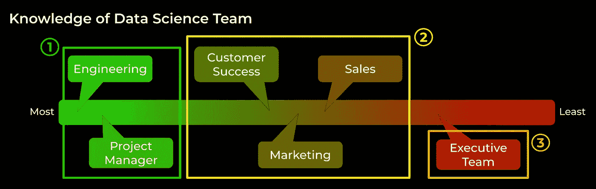
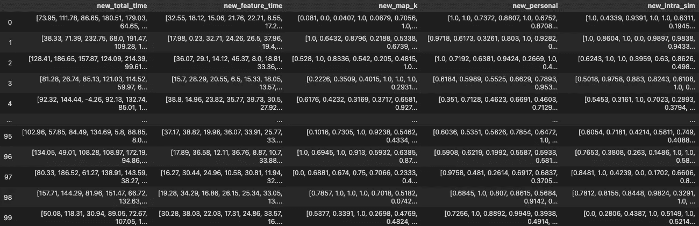
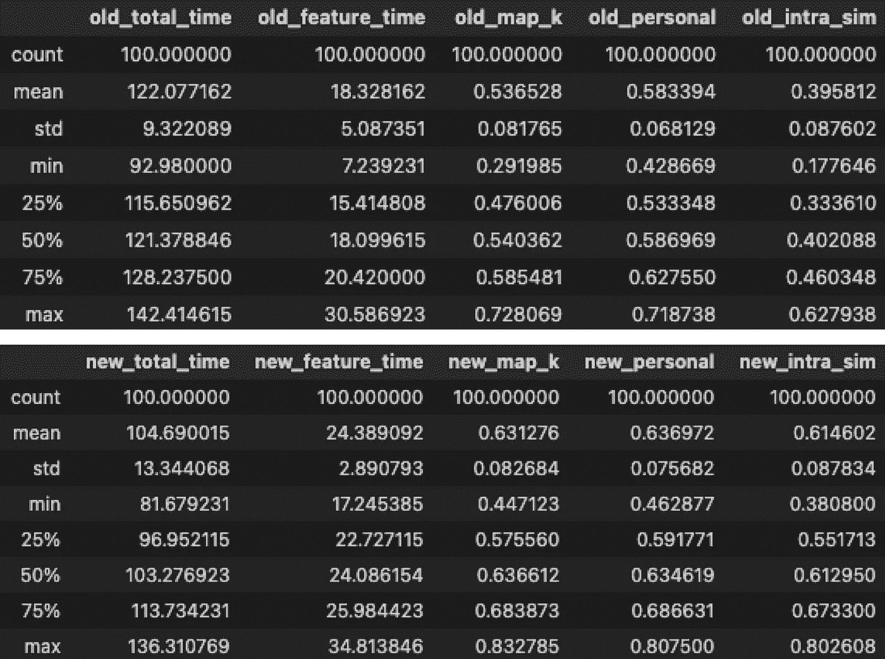
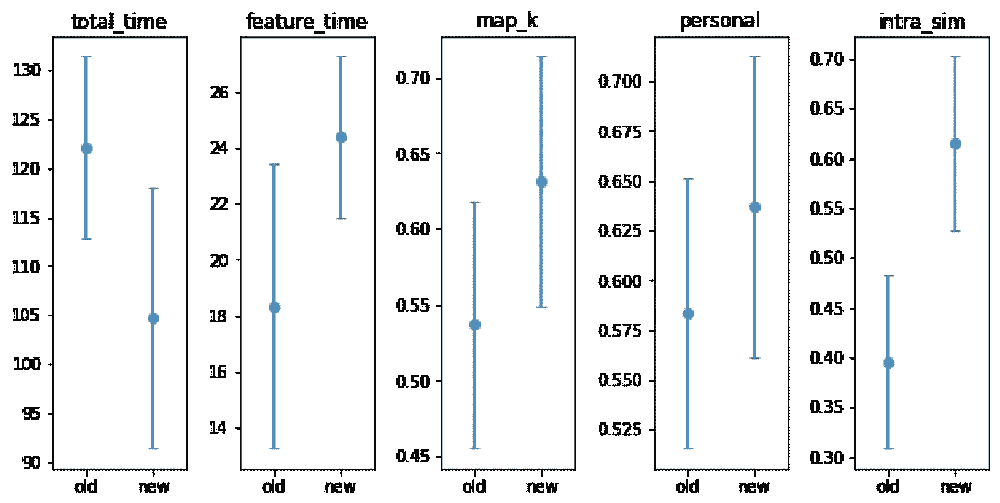
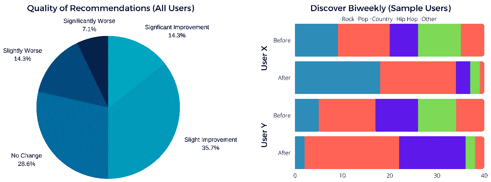
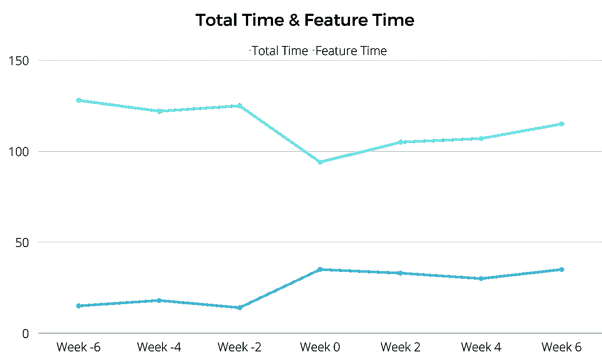

# 向非技术团队传达数据科学见解

> 原文：<https://towardsdatascience.com/no-one-cares-about-your-f1-score-45c17413e29f>

## 通过理解和迎合你的听众，让他们听到你的声音

图片由 [Freepik](http://www.freepik.com) 上的 [pch.vector](https://www.freepik.com/vectors/business-graph)

F1 和 AUC 对商务人士的意义，就像“客户获取”或“收入增长”之类的术语对你的意义*(提示:毫无意义)*。简单来说，

> 如果你的度量标准被认为没有影响到他们，那么非技术利益相关者不会在意。

你知道结果。你知道这会影响他们。你认为他们应该关心。但是他们没有。我们如何迫使他们关心？

> “专注于发现有意义的业务见解的分析团队可能会忽略将这些见解有效传达给跨职能合作伙伴的需求，这些合作伙伴可以利用这些建议来改善业务。”[1]

这里的关键词是**有效地**沟通。以原始形式分发度量和图表是不够的。

> “数据科学家接受培训以优化的数量，他们用来衡量其数据科学模型进展的指标，如果没有大量的翻译工作，对业务利益相关者来说根本毫无用处，而且与业务利益相关者脱节。”[2]

为了有效地交流数据科学见解，您需要**学会说他们的语言**。为此，首先，我们需要学习每个利益相关者使用的独特语言。

本文旨在了解利益相关者在组织中的角色，并从数据科学的角度理解他们独特的观点。我们将深入探讨如何向非技术利益相关方传达数据科学流程的关键方面。

# 利益相关者

> “利益相关者是指与公司有利益关系的一方，可以影响企业，也可以受企业影响。”[3]

在下图中，我们可以看到数据科学项目中的各种利益相关者，根据他们对数据科学团队负责的工作类型的了解程度。

跨利益相关方的数据科学团队的知识范围(图片由作者提供)

注意，这些都是根据我过去的经验归纳出来的。这种结构可能因组织而异，也可能因每个团队中的人员而异。

一般来说，我们可以从上图中看到三种不同的分组:

1.  **产品聚焦**:工程(&产品)，项目经理
2.  **面向用户**:客户成功、营销、销售
3.  **聚焦业务**:高管团队

我们现在想了解这些利益相关群体的不同方面。我们将借鉴 UX 设计的概念:用户角色。

> "用户角色是典型的用户，他们的目标和特征代表了更大的用户群体的需求."[4]

在我们的案例中，我们将使用类似的方法来尝试理解我们的主要利益相关者群体。我们将使用这个框架从每个小组的数据中理解**目标&优先级**和**需求。**

## 1.以产品为中心

专注于产品的团队被包括在内是为了完整性，但与和**非技术**利益相关者沟通的讨论无关。

## 2.面向用户

这些团队是用户看到的产品和组织的面孔。

目标&优先事项:这似乎很明显(例如“销售:销售产品”)，但这是一个天真的观点。工程可以概括为“制造产品”，但这不会让外人真正了解工程是做什么的，以及它如何与他们相关。因此，我们将为团队的日常活动提供更明确的目标:

*   客户成功:*“与客户合作，帮助他们更好地利用产品或服务。反过来，它们通常有助于通过增加用户采用率和净推荐值来减少客户流失，并有助于进行追加销售，甚至是扩大账户”[5]。这个团队通常最了解客户。*
*   营销:这个团队的主要目标包括:提高品牌知名度，产生潜在客户，增加客户价值，提高搜索引擎优化，增加媒体曝光率，提高转化率[6]。
*   销售:设定并实现 [SMART](https://www.atlassian.com/blog/productivity/how-to-write-smart-goals#:~:text=What%20are%20SMART%20goals%3F,within%20a%20certain%20time%20frame.) 目标，例如增加:年销售额和利润、客户数量、追加销售和交叉销售、转换率、客户保持率、销售代表生产力以及拓展合格的潜在客户。

总之，面向用户的团队吸引潜在客户(营销)，将潜在客户转化为客户(销售)，并提高客户利用率和产品的有用性(客户成功)。他们必须能够让用户相信你的产品性能良好，能够满足他们的需求。用户*“…可能会优先考虑产品的性能，因为如果产品有一些缺陷，他们会有点怀疑”[7]* 。用户也倾向于不喜欢他们认为是对产品“不必要的改变”,尤其是如果这让他们的感知体验变得更糟。

**来自数据的需求**:这个群体关心用户，关心数据科学能提供什么，让他们理解用户，更好地与用户沟通。诸如改善用户体验、减少客户流失、识别高价值客户和个性化用户体验等主题对他们来说具有重要价值。

## 3.以商业为中心

**目标&优先事项**:高管团队是*“…负责为公司创造战略方针和运营方法，并支持员工，使他们能够在自己的岗位上取得成功”[8]* 。优先事项包括*“制定和执行长期和短期目标，做出财务决策和维护组织的预算，并合作确保所有部门专注于公司范围的目标”[8]* 。*“[他们]对数据科学项目的主要兴趣始终是增加公司的价值(直接或间接)。如果他们是会议的一部分(计划、更新等。)，他们会寻找项目会带来的投资回报”[7]* 。

**来自数据的需求**:这个群体关心整体业务以及如何使用数据来帮助回答源于他们的优先事项的问题。然而，太多的信息也是一种负担，

> “信息系统给我的第一个印象是人们获取了太多的信息。信息爆炸让大量数据在管理层的办公桌上来回穿梭。其中大部分只是被部分消化了，而且大部分是不相关的……”[9]

因此，这个群体的要求是准确、简洁、可操作的见解，这是回答他们的业务问题和增加公司价值的关键。

# 沟通

图片由[Freepik](https://www.freepik.com/vectors/people-speaking)[上的](http://www.freepik.com)故事集提供

既然我们已经理解了利益相关者群体的目标、优先事项和需求，我们如何利用这种理解来恰当地交流信息呢？

沟通时要始终牢记的问题:

*   他们为什么要关心？我是否传达了他们应该关心的信息？
*   我传达的信息对他们有什么影响？

## 探索双周刊

让我们从一个例子开始，这个例子将用来展示我们如何与每一个利益相关者沟通。假设你是一家流行音乐流媒体服务公司的数据科学家。这项服务的一个重要组成部分是音乐推荐，这个功能我们最初完全称之为“发现双周”。这项服务根据用户的收听习惯，每两周向他们推荐一个新的音乐播放列表。用户喜欢它，因为它允许他们发现新的音乐，否则他们不会听到。企业喜欢它，因为它让用户继续使用这项服务，听更多的音乐，这反过来让他们赚更多的钱。

假设我们的总体业务目标和该特性的目标包括:

*   最大化用户使用服务的时间，
*   最大化用户使用该特定特征的时间，
*   最大化提供给用户的推荐的相关性。

现在假设我们将这组业务目标转化为一组量化的目标(我们将使用它们来评估我们的模型)。新模型必须考虑对以下方面的影响:

*   用户在指定时间段内使用服务的时间，
*   用户使用推荐功能所花费的时间(每两周收听一次他们的发现)，
*   MAP@K，用作推荐的总体相关性的代理，
*   不同之处在于为特定用户确定播放列表的个性化，
*   列表内相似性，以确定推荐是否足够多样化。

对于数据科学家来说，包含从用户子集收集的时间序列数据的经过清理和处理的数据帧可能如下所示:

包含指标时间序列数据的数据框架(图片由作者提供)

您还可以从旧模型和新模型收集的指标中生成一些统计数据来比较性能:

为简单起见，从收集的指标生成的统计数据在一段时间内进行平均(图片由作者提供)

或许可以生成一些图来帮助你更好地理解统计数据:

时间平均数据的平均值和标准偏差图(图片由作者提供)

从这些图像中，你可以对你的新模型下结论。问题是这些指标和图表对于非技术涉众来说是没有用的。如果你能说服营销因为你把 MAP@K 平均提高了 10%而兴奋——请告诉我你的秘诀。

在以后的章节中，阅读时请记住前面提到的问题:

> 他们为什么要关心？我是否传达了他们应该关心的信息？我传达的信息对他们有什么影响？

## 面向用户

度量应该以“这对用户有什么影响”的方式进行分析和呈现这些团队向用户传达你的工作方式和原因。

使用上面的例子，MAP@K 的改进和列表内相似性的增加对面向用户的团队本身没有任何意义。相反，我们可以将这种分析分解成，例如，用户体验如何变化的可视化:

用户体验变化的可视化(图片由作者提供)

左图显示了我们可以从 MAP@K 中获得的用户体验的总体变化类型。右图显示了两个样本用户以及他们的播放列表如何变化，这可以从列表内的相似性中获得。

我们可以清楚地看到，对于面向用户的团队来说，以这种方式呈现的信息比以前的度量标准更有价值。它直接让他们了解实际用户是如何受到影响的，并帮助他们理解新模式的利弊。“他们为什么应该关心”的答案在图表中清晰地呈现出来:**它会影响用户，下面是如何影响的**。它允许他们准确地评估变更，确定变更是否对用户有益，并为他们提供一种向用户传达变更的方式。这只是一个简单的例子，但它很好地说明了这个概念。

## 以商业为中心

类似于面向用户的团队，我们需要以一种迎合以业务为中心的团队的方式来分解和呈现度量。指标应该简洁、可行，并与公司将受到的影响直接相关。

**我们应该着重说明这些变化是如何与整体业务目标联系起来的。**如下所示的可视化可能是合适的:

一段时间内使用情况的可视化，新模型在第 0 周部署(图片由作者提供)

在上图中，我们展示了新模型的实现将如何影响总时间和功能时间这两个关键业务指标的可视化。这将允许业务团队快速判断这些变化是否符合整体业务目标。如果度量标准没有恰当地呈现，某些特征可能会被忽略或者它们的重要性被夸大。您的数据可视化应该尽可能地讲述最真实、最准确的故事。在这种情况下，你的工作不是做决定，而是给决策者提供可操作的见解。

考虑一下，如果我们只给出时间平均平均值和标准差。业务团队将会看到总时间的下降，立即认为您的新模型更差，并拒绝您的更改。事实上，上面的可视化可能意味着用户只是在适应变化，因为我们看到总用户数呈上升趋势，反弹到以前的水平。总而言之，

> “当高管不理解建议或其业务影响时，许多不强调沟通的分析团队会让洞察力从缝隙中溜走。”[1]

## 通常

除了根据沟通对象考虑如何沟通之外，在进行数据科学沟通时，还有一些通用的最佳实践[1]:

*   [吻](https://en.wikipedia.org/wiki/KISS_principle):保持你的数据可视化简单。密集的可视化令人困惑，会分散对关键洞察力的注意力。
*   [TL；在每次分析的开始，在深入解释之前，突出关键的见解和可行的项目。总结关键见解及其重要性。](https://www.merriam-webster.com/dictionary/TL%3BDR)
*   避免琐事:*“任何不可操作的洞察都是琐事。了解琐事很有趣，但很容易分散注意力，混淆应该传达的总体信息和建议。”[1]*

# 结论

TL；博士:

> 你的观众很重要。了解他们的目标、优先事项和要求。如果你想让他们在乎，你需要迎合他们。

我希望这篇文章对你和我写它一样有用。

如果你喜欢这篇文章，请关注！我感谢❤️的支持

领英|【brandenlisk.com】T2

<https://medium.com/@brandenlisk> [## Branden Lisk -中等

medium.com](https://medium.com/@brandenlisk) 

## 来源

[1][https://door dash . engineering/2021/02/11/how-to-drive-effective-data-science-communication/](https://doordash.engineering/2021/02/11/how-to-drive-effective-data-science-communication/)

[https://hdsr.mitpress.mit.edu/pub/bfeyfx22/release/2](https://hdsr.mitpress.mit.edu/pub/bfeyfx22/release/2)

[https://www.investopedia.com/terms/s/stakeholder.asp](https://www.investopedia.com/terms/s/stakeholder.asp)

[4][https://xd . adobe . com/ideas/process/user-research/put-personas-to-work-in-UX-design/](https://xd.adobe.com/ideas/process/user-research/putting-personas-to-work-in-ux-design/)

[5][https://hypercontext . com/blog/work-goals/customer-success-goals](https://hypercontext.com/blog/work-goals/customer-success-goals)

[6][https://www . indeed . com/career-advice/career-development/goals-marketing](https://www.indeed.com/career-advice/career-development/goals-marketing)

[7][https://justabasicdatascientist . com/dealing-with-business-stakeholders/](https://justabasicdatascientist.com/dealing-with-business-stakeholders/)

https://www . indeed . com/career-advice/career-development/leadership-team-purpose

[9][https://HBR . org/1979/03/chief-executives-define-own-data-needs](https://hbr.org/1979/03/chief-executives-define-their-own-data-needs)

[https://www.pipedrive.com/en/blog/sales-objectives-examples](https://www.pipedrive.com/en/blog/sales-objectives-examples)

[11][https://towards data science . com/evaluation-metrics-for-recommender-systems-df56c 6611093](/evaluation-metrics-for-recommender-systems-df56c6611093)